# Abstract company sector classification

Source: [`company-sector-classification.skos.ttl`](sources/company-sector.ttl)

## Scheme

- **description (de):** Branchen- und Sektor-Taxonomie zur Klassifikation von Organisationen in CRM und LLM-Extraktion.
- **description (en):** Industry and sector taxonomy for classifying organizations in CRM and LLM extraction.
- **prefLabel (de):** Abstrakte Unternehmens-Branchen-Klassifikation
- **prefLabel (en):** Abstract company sector classification
- **title (en):** Abstract company sector classification

## Hierarchy

```mermaid
classDiagram
direction TB
class n_SEC_BAU["SEC-BAU: Construction and built environment"]
class n_SEC_BAU_CLI["SEC-BAU-CLI: Client side"]
class n_SEC_BAU_CLI_DEV["SEC-BAU-CLI-DEV: Project developer"]
class n_SEC_BAU_CLI_GC["SEC-BAU-CLI-GC: Design-build / total contractor"]
class n_SEC_BAU_CLI_OWN["SEC-BAU-CLI-OWN: Building owner"]
class n_SEC_BAU_CNT["SEC-BAU-CNT: Construction contracting"]
class n_SEC_BAU_FM["SEC-BAU-FM: Facility and property management"]
class n_SEC_BAU_PLN["SEC-BAU-PLN: Planning and design"]
class n_SEC_BAU_PLN_ARC["SEC-BAU-PLN-ARC: Architecture"]
class n_SEC_BAU_PLN_EXP["SEC-BAU-PLN-EXP: Expert assessor"]
class n_SEC_BAU_PLN_MEP["SEC-BAU-PLN-MEP: Building services (MEP)"]
class n_SEC_FOD["SEC-FOD: Food and nutrition"]
class n_SEC_FOD_CHF["SEC-FOD-CHF: Chef and culinary"]
class n_SEC_FOD_MNS["SEC-FOD-MNS: Micronutrients"]
class n_SEC_FOD_NEM["SEC-FOD-NEM: Dietary supplements (NEM)"]
class n_SEC_HEA["SEC-HEA: Medicine and health"]
class n_SEC_HEA_HOS["SEC-HEA-HOS: Hospital"]
class n_SEC_HEA_PHA["SEC-HEA-PHA: Pharmacy"]
class n_SEC_HEA_PHY["SEC-HEA-PHY: Physician practice"]
class n_SEC_HEA_PTH["SEC-HEA-PTH: Physiotherapy"]
class n_SEC_HEA_REH["SEC-HEA-REH: Rehabilitation"]
class n_SEC_HEA_SPA["SEC-HEA-SPA: Spa and cure"]
class n_SEC_INV["SEC-INV: Investor and capital"]
class n_SEC_INV_ADV["SEC-INV-ADV: Investment advisor"]
class n_SEC_INV_FDN["SEC-INV-FDN: Foundation"]
class n_SEC_INV_FDN_CHR["SEC-INV-FDN-CHR: Charitable foundation"]
class n_SEC_INV_FO["SEC-INV-FO: Family office"]
class n_SEC_INV_FO_MFO["SEC-INV-FO-MFO: Multi family office"]
class n_SEC_INV_FO_SFO["SEC-INV-FO-SFO: Single family office"]
class n_SEC_INV_INS["SEC-INV-INS: Institutional investor"]
class n_SEC_INV_INS_HNW["SEC-INV-INS-HNW: High net worth individual (HNWI)"]
class n_SEC_INV_INS_UHN["SEC-INV-INS-UHN: Ultra high net worth individual (UHNWI)"]
class n_SEC_INV_MLT["SEC-INV-MLT: Multiplier"]
class n_SEC_INV_PRI["SEC-INV-PRI: Private investor"]
class n_SEC_LAW["SEC-LAW: Legal services"]
class n_SEC_LAW_JUR["SEC-LAW-JUR: Legal professional"]
class n_SEC_LAW_LAW["SEC-LAW-LAW: Law firm"]
class n_SEC_LAW_LAW_CMR["SEC-LAW-LAW-CMR: Capital markets law"]
class n_SEC_LAW_LAW_COR["SEC-LAW-LAW-COR: Corporate law"]
class n_SEC_MED["SEC-MED: Media"]
class n_SEC_MED_CIN["SEC-MED-CIN: Cinema"]
class n_SEC_MED_FLM["SEC-MED-FLM: Film"]
class n_SEC_MED_PRT["SEC-MED-PRT: Print media"]
class n_SEC_MED_STR["SEC-MED-STR: Streaming"]
class n_SEC_MED_TV["SEC-MED-TV: Television"]
class n_SEC_MIL["SEC-MIL: Military and defence"]
class n_SEC_MIL_ACA["SEC-MIL-ACA: Military academy"]
class n_SEC_MIL_AF["SEC-MIL-AF: Armed forces"]
class n_SEC_MIL_SPC["SEC-MIL-SPC: Space and aerospace"]
n_SEC_BAU <|-- n_SEC_BAU_CLI
n_SEC_BAU <|-- n_SEC_BAU_CNT
n_SEC_BAU <|-- n_SEC_BAU_FM
n_SEC_BAU <|-- n_SEC_BAU_PLN
n_SEC_BAU_CLI <|-- n_SEC_BAU_CLI_DEV
n_SEC_BAU_CLI <|-- n_SEC_BAU_CLI_GC
n_SEC_BAU_CLI <|-- n_SEC_BAU_CLI_OWN
n_SEC_BAU_PLN <|-- n_SEC_BAU_PLN_ARC
n_SEC_BAU_PLN <|-- n_SEC_BAU_PLN_EXP
n_SEC_BAU_PLN <|-- n_SEC_BAU_PLN_MEP
n_SEC_FOD <|-- n_SEC_FOD_CHF
n_SEC_FOD <|-- n_SEC_FOD_MNS
n_SEC_FOD <|-- n_SEC_FOD_NEM
n_SEC_HEA <|-- n_SEC_HEA_HOS
n_SEC_HEA <|-- n_SEC_HEA_PHA
n_SEC_HEA <|-- n_SEC_HEA_PHY
n_SEC_HEA <|-- n_SEC_HEA_PTH
n_SEC_HEA <|-- n_SEC_HEA_REH
n_SEC_HEA <|-- n_SEC_HEA_SPA
n_SEC_INV <|-- n_SEC_INV_ADV
n_SEC_INV <|-- n_SEC_INV_FDN
n_SEC_INV <|-- n_SEC_INV_FO
n_SEC_INV <|-- n_SEC_INV_INS
n_SEC_INV <|-- n_SEC_INV_MLT
n_SEC_INV <|-- n_SEC_INV_PRI
n_SEC_INV_FDN <|-- n_SEC_INV_FDN_CHR
n_SEC_INV_FO <|-- n_SEC_INV_FO_MFO
n_SEC_INV_FO <|-- n_SEC_INV_FO_SFO
n_SEC_INV_INS <|-- n_SEC_INV_INS_HNW
n_SEC_INV_INS <|-- n_SEC_INV_INS_UHN
n_SEC_LAW <|-- n_SEC_LAW_JUR
n_SEC_LAW <|-- n_SEC_LAW_LAW
n_SEC_LAW_LAW <|-- n_SEC_LAW_LAW_CMR
n_SEC_LAW_LAW <|-- n_SEC_LAW_LAW_COR
n_SEC_MED <|-- n_SEC_MED_CIN
n_SEC_MED <|-- n_SEC_MED_FLM
n_SEC_MED <|-- n_SEC_MED_PRT
n_SEC_MED <|-- n_SEC_MED_STR
n_SEC_MED <|-- n_SEC_MED_TV
n_SEC_MIL <|-- n_SEC_MIL_ACA
n_SEC_MIL <|-- n_SEC_MIL_AF
n_SEC_MIL <|-- n_SEC_MIL_SPC
```

## Concepts

<button type="button" class="pbs-lang-btn" data-lang="de">DE</button>
<button type="button" class="pbs-lang-btn" data-lang="en">EN</button>

<table>
<thead>
<tr>
<th>Notation</th>
<th>Broader</th>
<th class="pbs-lang-col" data-lang="de" data-field="label">Label</th>
<th class="pbs-lang-col" data-lang="de" data-field="definition">Definition</th>
<th class="pbs-lang-col" data-lang="de" data-field="scope_note">Scope note</th>
<th class="pbs-lang-col" data-lang="en" data-field="label">Label</th>
<th class="pbs-lang-col" data-lang="en" data-field="definition">Definition</th>
<th class="pbs-lang-col" data-lang="en" data-field="scope_note">Scope note</th>
</tr>
</thead>
<tbody>
<tr>
<td>SEC-ASS</td>
<td></td>
<td class="pbs-lang-col" data-lang="de" data-field="label">Verein</td>
<td class="pbs-lang-col" data-lang="de" data-field="definition"></td>
<td class="pbs-lang-col" data-lang="de" data-field="scope_note"></td>
<td class="pbs-lang-col" data-lang="en" data-field="label">Association and non-profit</td>
<td class="pbs-lang-col" data-lang="en" data-field="definition"></td>
<td class="pbs-lang-col" data-lang="en" data-field="scope_note"></td>
</tr>
<tr>
<td>SEC-BAU</td>
<td></td>
<td class="pbs-lang-col" data-lang="de" data-field="label">Bauwesen</td>
<td class="pbs-lang-col" data-lang="de" data-field="definition"></td>
<td class="pbs-lang-col" data-lang="de" data-field="scope_note"></td>
<td class="pbs-lang-col" data-lang="en" data-field="label">Construction and built environment</td>
<td class="pbs-lang-col" data-lang="en" data-field="definition"></td>
<td class="pbs-lang-col" data-lang="en" data-field="scope_note"></td>
</tr>
<tr>
<td>SEC-BAU-CLI</td>
<td>SEC-BAU</td>
<td class="pbs-lang-col" data-lang="de" data-field="label">Besteller</td>
<td class="pbs-lang-col" data-lang="de" data-field="definition"></td>
<td class="pbs-lang-col" data-lang="de" data-field="scope_note"></td>
<td class="pbs-lang-col" data-lang="en" data-field="label">Client side</td>
<td class="pbs-lang-col" data-lang="en" data-field="definition"></td>
<td class="pbs-lang-col" data-lang="en" data-field="scope_note"></td>
</tr>
<tr>
<td>SEC-BAU-CLI-DEV</td>
<td>SEC-BAU-CLI</td>
<td class="pbs-lang-col" data-lang="de" data-field="label">Projektentwickler</td>
<td class="pbs-lang-col" data-lang="de" data-field="definition"></td>
<td class="pbs-lang-col" data-lang="de" data-field="scope_note"></td>
<td class="pbs-lang-col" data-lang="en" data-field="label">Project developer</td>
<td class="pbs-lang-col" data-lang="en" data-field="definition"></td>
<td class="pbs-lang-col" data-lang="en" data-field="scope_note"></td>
</tr>
<tr>
<td>SEC-BAU-CLI-GC</td>
<td>SEC-BAU-CLI</td>
<td class="pbs-lang-col" data-lang="de" data-field="label">Totalunternehmer</td>
<td class="pbs-lang-col" data-lang="de" data-field="definition"></td>
<td class="pbs-lang-col" data-lang="de" data-field="scope_note"></td>
<td class="pbs-lang-col" data-lang="en" data-field="label">Design-build / total contractor</td>
<td class="pbs-lang-col" data-lang="en" data-field="definition"></td>
<td class="pbs-lang-col" data-lang="en" data-field="scope_note"></td>
</tr>
<tr>
<td>SEC-BAU-CLI-OWN</td>
<td>SEC-BAU-CLI</td>
<td class="pbs-lang-col" data-lang="de" data-field="label">Bauherr</td>
<td class="pbs-lang-col" data-lang="de" data-field="definition"></td>
<td class="pbs-lang-col" data-lang="de" data-field="scope_note"></td>
<td class="pbs-lang-col" data-lang="en" data-field="label">Building owner</td>
<td class="pbs-lang-col" data-lang="en" data-field="definition"></td>
<td class="pbs-lang-col" data-lang="en" data-field="scope_note"></td>
</tr>
<tr>
<td>SEC-BAU-CNT</td>
<td>SEC-BAU</td>
<td class="pbs-lang-col" data-lang="de" data-field="label">Bauunternehmung</td>
<td class="pbs-lang-col" data-lang="de" data-field="definition"></td>
<td class="pbs-lang-col" data-lang="de" data-field="scope_note"></td>
<td class="pbs-lang-col" data-lang="en" data-field="label">Construction contracting</td>
<td class="pbs-lang-col" data-lang="en" data-field="definition"></td>
<td class="pbs-lang-col" data-lang="en" data-field="scope_note"></td>
</tr>
<tr>
<td>SEC-BAU-FM</td>
<td>SEC-BAU</td>
<td class="pbs-lang-col" data-lang="de" data-field="label">Bewirtschafter</td>
<td class="pbs-lang-col" data-lang="de" data-field="definition"></td>
<td class="pbs-lang-col" data-lang="de" data-field="scope_note"></td>
<td class="pbs-lang-col" data-lang="en" data-field="label">Facility and property management</td>
<td class="pbs-lang-col" data-lang="en" data-field="definition"></td>
<td class="pbs-lang-col" data-lang="en" data-field="scope_note"></td>
</tr>
<tr>
<td>SEC-BAU-PLN</td>
<td>SEC-BAU</td>
<td class="pbs-lang-col" data-lang="de" data-field="label">Planung</td>
<td class="pbs-lang-col" data-lang="de" data-field="definition"></td>
<td class="pbs-lang-col" data-lang="de" data-field="scope_note"></td>
<td class="pbs-lang-col" data-lang="en" data-field="label">Planning and design</td>
<td class="pbs-lang-col" data-lang="en" data-field="definition"></td>
<td class="pbs-lang-col" data-lang="en" data-field="scope_note"></td>
</tr>
<tr>
<td>SEC-BAU-PLN-ARC</td>
<td>SEC-BAU-PLN</td>
<td class="pbs-lang-col" data-lang="de" data-field="label">Architektur</td>
<td class="pbs-lang-col" data-lang="de" data-field="definition"></td>
<td class="pbs-lang-col" data-lang="de" data-field="scope_note"></td>
<td class="pbs-lang-col" data-lang="en" data-field="label">Architecture</td>
<td class="pbs-lang-col" data-lang="en" data-field="definition"></td>
<td class="pbs-lang-col" data-lang="en" data-field="scope_note"></td>
</tr>
<tr>
<td>SEC-BAU-PLN-EXP</td>
<td>SEC-BAU-PLN</td>
<td class="pbs-lang-col" data-lang="de" data-field="label">Gutachter</td>
<td class="pbs-lang-col" data-lang="de" data-field="definition"></td>
<td class="pbs-lang-col" data-lang="de" data-field="scope_note"></td>
<td class="pbs-lang-col" data-lang="en" data-field="label">Expert assessor</td>
<td class="pbs-lang-col" data-lang="en" data-field="definition"></td>
<td class="pbs-lang-col" data-lang="en" data-field="scope_note"></td>
</tr>
<tr>
<td>SEC-BAU-PLN-MEP</td>
<td>SEC-BAU-PLN</td>
<td class="pbs-lang-col" data-lang="de" data-field="label">TGA / HLKSE</td>
<td class="pbs-lang-col" data-lang="de" data-field="definition"></td>
<td class="pbs-lang-col" data-lang="de" data-field="scope_note"></td>
<td class="pbs-lang-col" data-lang="en" data-field="label">Building services (MEP)</td>
<td class="pbs-lang-col" data-lang="en" data-field="definition"></td>
<td class="pbs-lang-col" data-lang="en" data-field="scope_note"></td>
</tr>
<tr>
<td>SEC-ECO</td>
<td></td>
<td class="pbs-lang-col" data-lang="de" data-field="label">Wirtschaft und Berufe</td>
<td class="pbs-lang-col" data-lang="de" data-field="definition"></td>
<td class="pbs-lang-col" data-lang="de" data-field="scope_note">Allgemeine Wirtschaft und Berufe, die keinem spezifischeren Sektor zugeordnet sind.</td>
<td class="pbs-lang-col" data-lang="en" data-field="label">Economy and professions</td>
<td class="pbs-lang-col" data-lang="en" data-field="definition"></td>
<td class="pbs-lang-col" data-lang="en" data-field="scope_note">General business and professional services not covered by a more specific sector.</td>
</tr>
<tr>
<td>SEC-ESG</td>
<td></td>
<td class="pbs-lang-col" data-lang="de" data-field="label">ESG / SDG</td>
<td class="pbs-lang-col" data-lang="de" data-field="definition"></td>
<td class="pbs-lang-col" data-lang="de" data-field="scope_note"></td>
<td class="pbs-lang-col" data-lang="en" data-field="label">ESG and SDG</td>
<td class="pbs-lang-col" data-lang="en" data-field="definition"></td>
<td class="pbs-lang-col" data-lang="en" data-field="scope_note"></td>
</tr>
<tr>
<td>SEC-FND</td>
<td></td>
<td class="pbs-lang-col" data-lang="de" data-field="label">Förderung</td>
<td class="pbs-lang-col" data-lang="de" data-field="definition"></td>
<td class="pbs-lang-col" data-lang="de" data-field="scope_note">Öffentliche oder private Förderstellen, Förderprogramme und Förderorganisationen.</td>
<td class="pbs-lang-col" data-lang="en" data-field="label">Funding and promotion</td>
<td class="pbs-lang-col" data-lang="en" data-field="definition"></td>
<td class="pbs-lang-col" data-lang="en" data-field="scope_note">Public or private funding bodies, grant programs, and promotional organizations.</td>
</tr>
<tr>
<td>SEC-FOD</td>
<td></td>
<td class="pbs-lang-col" data-lang="de" data-field="label">Lebensmittel</td>
<td class="pbs-lang-col" data-lang="de" data-field="definition"></td>
<td class="pbs-lang-col" data-lang="de" data-field="scope_note"></td>
<td class="pbs-lang-col" data-lang="en" data-field="label">Food and nutrition</td>
<td class="pbs-lang-col" data-lang="en" data-field="definition"></td>
<td class="pbs-lang-col" data-lang="en" data-field="scope_note"></td>
</tr>
<tr>
<td>SEC-FOD-CHF</td>
<td>SEC-FOD</td>
<td class="pbs-lang-col" data-lang="de" data-field="label">Koch</td>
<td class="pbs-lang-col" data-lang="de" data-field="definition"></td>
<td class="pbs-lang-col" data-lang="de" data-field="scope_note"></td>
<td class="pbs-lang-col" data-lang="en" data-field="label">Chef and culinary</td>
<td class="pbs-lang-col" data-lang="en" data-field="definition"></td>
<td class="pbs-lang-col" data-lang="en" data-field="scope_note"></td>
</tr>
<tr>
<td>SEC-FOD-MNS</td>
<td>SEC-FOD</td>
<td class="pbs-lang-col" data-lang="de" data-field="label">Mikronährstoffe</td>
<td class="pbs-lang-col" data-lang="de" data-field="definition"></td>
<td class="pbs-lang-col" data-lang="de" data-field="scope_note"></td>
<td class="pbs-lang-col" data-lang="en" data-field="label">Micronutrients</td>
<td class="pbs-lang-col" data-lang="en" data-field="definition"></td>
<td class="pbs-lang-col" data-lang="en" data-field="scope_note"></td>
</tr>
<tr>
<td>SEC-FOD-NEM</td>
<td>SEC-FOD</td>
<td class="pbs-lang-col" data-lang="de" data-field="label">NEM</td>
<td class="pbs-lang-col" data-lang="de" data-field="definition"></td>
<td class="pbs-lang-col" data-lang="de" data-field="scope_note"></td>
<td class="pbs-lang-col" data-lang="en" data-field="label">Dietary supplements (NEM)</td>
<td class="pbs-lang-col" data-lang="en" data-field="definition"></td>
<td class="pbs-lang-col" data-lang="en" data-field="scope_note"></td>
</tr>
<tr>
<td>SEC-HEA</td>
<td></td>
<td class="pbs-lang-col" data-lang="de" data-field="label">Medizin und Gesundheit</td>
<td class="pbs-lang-col" data-lang="de" data-field="definition"></td>
<td class="pbs-lang-col" data-lang="de" data-field="scope_note"></td>
<td class="pbs-lang-col" data-lang="en" data-field="label">Medicine and health</td>
<td class="pbs-lang-col" data-lang="en" data-field="definition"></td>
<td class="pbs-lang-col" data-lang="en" data-field="scope_note"></td>
</tr>
<tr>
<td>SEC-HEA-HOS</td>
<td>SEC-HEA</td>
<td class="pbs-lang-col" data-lang="de" data-field="label">Krankenhaus</td>
<td class="pbs-lang-col" data-lang="de" data-field="definition"></td>
<td class="pbs-lang-col" data-lang="de" data-field="scope_note"></td>
<td class="pbs-lang-col" data-lang="en" data-field="label">Hospital</td>
<td class="pbs-lang-col" data-lang="en" data-field="definition"></td>
<td class="pbs-lang-col" data-lang="en" data-field="scope_note"></td>
</tr>
<tr>
<td>SEC-HEA-PHA</td>
<td>SEC-HEA</td>
<td class="pbs-lang-col" data-lang="de" data-field="label">Apotheke</td>
<td class="pbs-lang-col" data-lang="de" data-field="definition"></td>
<td class="pbs-lang-col" data-lang="de" data-field="scope_note"></td>
<td class="pbs-lang-col" data-lang="en" data-field="label">Pharmacy</td>
<td class="pbs-lang-col" data-lang="en" data-field="definition"></td>
<td class="pbs-lang-col" data-lang="en" data-field="scope_note"></td>
</tr>
<tr>
<td>SEC-HEA-PHY</td>
<td>SEC-HEA</td>
<td class="pbs-lang-col" data-lang="de" data-field="label">Arzt / Ärztin</td>
<td class="pbs-lang-col" data-lang="de" data-field="definition"></td>
<td class="pbs-lang-col" data-lang="de" data-field="scope_note"></td>
<td class="pbs-lang-col" data-lang="en" data-field="label">Physician practice</td>
<td class="pbs-lang-col" data-lang="en" data-field="definition"></td>
<td class="pbs-lang-col" data-lang="en" data-field="scope_note"></td>
</tr>
<tr>
<td>SEC-HEA-PTH</td>
<td>SEC-HEA</td>
<td class="pbs-lang-col" data-lang="de" data-field="label">Physiotherapeut</td>
<td class="pbs-lang-col" data-lang="de" data-field="definition"></td>
<td class="pbs-lang-col" data-lang="de" data-field="scope_note"></td>
<td class="pbs-lang-col" data-lang="en" data-field="label">Physiotherapy</td>
<td class="pbs-lang-col" data-lang="en" data-field="definition"></td>
<td class="pbs-lang-col" data-lang="en" data-field="scope_note"></td>
</tr>
<tr>
<td>SEC-HEA-REH</td>
<td>SEC-HEA</td>
<td class="pbs-lang-col" data-lang="de" data-field="label">Reha</td>
<td class="pbs-lang-col" data-lang="de" data-field="definition"></td>
<td class="pbs-lang-col" data-lang="de" data-field="scope_note"></td>
<td class="pbs-lang-col" data-lang="en" data-field="label">Rehabilitation</td>
<td class="pbs-lang-col" data-lang="en" data-field="definition"></td>
<td class="pbs-lang-col" data-lang="en" data-field="scope_note"></td>
</tr>
<tr>
<td>SEC-HEA-SPA</td>
<td>SEC-HEA</td>
<td class="pbs-lang-col" data-lang="de" data-field="label">Kur</td>
<td class="pbs-lang-col" data-lang="de" data-field="definition"></td>
<td class="pbs-lang-col" data-lang="de" data-field="scope_note"></td>
<td class="pbs-lang-col" data-lang="en" data-field="label">Spa and cure</td>
<td class="pbs-lang-col" data-lang="en" data-field="definition"></td>
<td class="pbs-lang-col" data-lang="en" data-field="scope_note"></td>
</tr>
<tr>
<td>SEC-INV</td>
<td></td>
<td class="pbs-lang-col" data-lang="de" data-field="label">Investor</td>
<td class="pbs-lang-col" data-lang="de" data-field="definition"></td>
<td class="pbs-lang-col" data-lang="de" data-field="scope_note"></td>
<td class="pbs-lang-col" data-lang="en" data-field="label">Investor and capital</td>
<td class="pbs-lang-col" data-lang="en" data-field="definition"></td>
<td class="pbs-lang-col" data-lang="en" data-field="scope_note"></td>
</tr>
<tr>
<td>SEC-INV-ADV</td>
<td>SEC-INV</td>
<td class="pbs-lang-col" data-lang="de" data-field="label">Advisor</td>
<td class="pbs-lang-col" data-lang="de" data-field="definition"></td>
<td class="pbs-lang-col" data-lang="de" data-field="scope_note"></td>
<td class="pbs-lang-col" data-lang="en" data-field="label">Investment advisor</td>
<td class="pbs-lang-col" data-lang="en" data-field="definition"></td>
<td class="pbs-lang-col" data-lang="en" data-field="scope_note"></td>
</tr>
<tr>
<td>SEC-INV-FDN</td>
<td>SEC-INV</td>
<td class="pbs-lang-col" data-lang="de" data-field="label">Stiftung</td>
<td class="pbs-lang-col" data-lang="de" data-field="definition"></td>
<td class="pbs-lang-col" data-lang="de" data-field="scope_note"></td>
<td class="pbs-lang-col" data-lang="en" data-field="label">Foundation</td>
<td class="pbs-lang-col" data-lang="en" data-field="definition"></td>
<td class="pbs-lang-col" data-lang="en" data-field="scope_note"></td>
</tr>
<tr>
<td>SEC-INV-FDN-CHR</td>
<td>SEC-INV-FDN</td>
<td class="pbs-lang-col" data-lang="de" data-field="label">Gemeinnützige Stiftung</td>
<td class="pbs-lang-col" data-lang="de" data-field="definition"></td>
<td class="pbs-lang-col" data-lang="de" data-field="scope_note"></td>
<td class="pbs-lang-col" data-lang="en" data-field="label">Charitable foundation</td>
<td class="pbs-lang-col" data-lang="en" data-field="definition"></td>
<td class="pbs-lang-col" data-lang="en" data-field="scope_note"></td>
</tr>
<tr>
<td>SEC-INV-FO</td>
<td>SEC-INV</td>
<td class="pbs-lang-col" data-lang="de" data-field="label">Family Office</td>
<td class="pbs-lang-col" data-lang="de" data-field="definition"></td>
<td class="pbs-lang-col" data-lang="de" data-field="scope_note"></td>
<td class="pbs-lang-col" data-lang="en" data-field="label">Family office</td>
<td class="pbs-lang-col" data-lang="en" data-field="definition"></td>
<td class="pbs-lang-col" data-lang="en" data-field="scope_note"></td>
</tr>
<tr>
<td>SEC-INV-FO-MFO</td>
<td>SEC-INV-FO</td>
<td class="pbs-lang-col" data-lang="de" data-field="label">Multi Family Office</td>
<td class="pbs-lang-col" data-lang="de" data-field="definition"></td>
<td class="pbs-lang-col" data-lang="de" data-field="scope_note"></td>
<td class="pbs-lang-col" data-lang="en" data-field="label">Multi family office</td>
<td class="pbs-lang-col" data-lang="en" data-field="definition"></td>
<td class="pbs-lang-col" data-lang="en" data-field="scope_note"></td>
</tr>
<tr>
<td>SEC-INV-FO-SFO</td>
<td>SEC-INV-FO</td>
<td class="pbs-lang-col" data-lang="de" data-field="label">Single Family Office</td>
<td class="pbs-lang-col" data-lang="de" data-field="definition"></td>
<td class="pbs-lang-col" data-lang="de" data-field="scope_note"></td>
<td class="pbs-lang-col" data-lang="en" data-field="label">Single family office</td>
<td class="pbs-lang-col" data-lang="en" data-field="definition"></td>
<td class="pbs-lang-col" data-lang="en" data-field="scope_note"></td>
</tr>
<tr>
<td>SEC-INV-INS</td>
<td>SEC-INV</td>
<td class="pbs-lang-col" data-lang="de" data-field="label">Institutioneller Investor</td>
<td class="pbs-lang-col" data-lang="de" data-field="definition"></td>
<td class="pbs-lang-col" data-lang="de" data-field="scope_note"></td>
<td class="pbs-lang-col" data-lang="en" data-field="label">Institutional investor</td>
<td class="pbs-lang-col" data-lang="en" data-field="definition"></td>
<td class="pbs-lang-col" data-lang="en" data-field="scope_note"></td>
</tr>
<tr>
<td>SEC-INV-INS-HNW</td>
<td>SEC-INV-INS</td>
<td class="pbs-lang-col" data-lang="de" data-field="label">HNWI</td>
<td class="pbs-lang-col" data-lang="de" data-field="definition"></td>
<td class="pbs-lang-col" data-lang="de" data-field="scope_note"></td>
<td class="pbs-lang-col" data-lang="en" data-field="label">High net worth individual (HNWI)</td>
<td class="pbs-lang-col" data-lang="en" data-field="definition"></td>
<td class="pbs-lang-col" data-lang="en" data-field="scope_note"></td>
</tr>
<tr>
<td>SEC-INV-INS-UHN</td>
<td>SEC-INV-INS</td>
<td class="pbs-lang-col" data-lang="de" data-field="label">UHNWI</td>
<td class="pbs-lang-col" data-lang="de" data-field="definition"></td>
<td class="pbs-lang-col" data-lang="de" data-field="scope_note"></td>
<td class="pbs-lang-col" data-lang="en" data-field="label">Ultra high net worth individual (UHNWI)</td>
<td class="pbs-lang-col" data-lang="en" data-field="definition"></td>
<td class="pbs-lang-col" data-lang="en" data-field="scope_note"></td>
</tr>
<tr>
<td>SEC-INV-MLT</td>
<td>SEC-INV</td>
<td class="pbs-lang-col" data-lang="de" data-field="label">Multiplikator</td>
<td class="pbs-lang-col" data-lang="de" data-field="definition"></td>
<td class="pbs-lang-col" data-lang="de" data-field="scope_note">Netzwerk-Knoten oder Multiplikator zwischen Investoren und Projekten.</td>
<td class="pbs-lang-col" data-lang="en" data-field="label">Multiplier</td>
<td class="pbs-lang-col" data-lang="en" data-field="definition"></td>
<td class="pbs-lang-col" data-lang="en" data-field="scope_note">Network hub or influencer connecting investors and opportunities.</td>
</tr>
<tr>
<td>SEC-INV-PRI</td>
<td>SEC-INV</td>
<td class="pbs-lang-col" data-lang="de" data-field="label">Privatinvestor</td>
<td class="pbs-lang-col" data-lang="de" data-field="definition"></td>
<td class="pbs-lang-col" data-lang="de" data-field="scope_note"></td>
<td class="pbs-lang-col" data-lang="en" data-field="label">Private investor</td>
<td class="pbs-lang-col" data-lang="en" data-field="definition"></td>
<td class="pbs-lang-col" data-lang="en" data-field="scope_note"></td>
</tr>
<tr>
<td>SEC-LAW</td>
<td></td>
<td class="pbs-lang-col" data-lang="de" data-field="label">Recht</td>
<td class="pbs-lang-col" data-lang="de" data-field="definition"></td>
<td class="pbs-lang-col" data-lang="de" data-field="scope_note"></td>
<td class="pbs-lang-col" data-lang="en" data-field="label">Legal services</td>
<td class="pbs-lang-col" data-lang="en" data-field="definition"></td>
<td class="pbs-lang-col" data-lang="en" data-field="scope_note"></td>
</tr>
<tr>
<td>SEC-LAW-JUR</td>
<td>SEC-LAW</td>
<td class="pbs-lang-col" data-lang="de" data-field="label">Jurist</td>
<td class="pbs-lang-col" data-lang="de" data-field="definition"></td>
<td class="pbs-lang-col" data-lang="de" data-field="scope_note">Breitere juristische Rolle ausserhalb der Anwaltskanzlei (Inhouse, Notariat, Rechtsberatung).</td>
<td class="pbs-lang-col" data-lang="en" data-field="label">Legal professional</td>
<td class="pbs-lang-col" data-lang="en" data-field="definition"></td>
<td class="pbs-lang-col" data-lang="en" data-field="scope_note">Broader legal sector role beyond attorney practice (in-house, notary, legal counsel).</td>
</tr>
<tr>
<td>SEC-LAW-LAW</td>
<td>SEC-LAW</td>
<td class="pbs-lang-col" data-lang="de" data-field="label">Rechtsanwalt</td>
<td class="pbs-lang-col" data-lang="de" data-field="definition"></td>
<td class="pbs-lang-col" data-lang="de" data-field="scope_note">Anwaltskanzlei oder Rechtsanwaltspraxis; engere Konzepte für Schwerpunkte verwenden.</td>
<td class="pbs-lang-col" data-lang="en" data-field="label">Law firm</td>
<td class="pbs-lang-col" data-lang="en" data-field="definition"></td>
<td class="pbs-lang-col" data-lang="en" data-field="scope_note">Law firm or attorney practice; use narrower concepts for practice areas.</td>
</tr>
<tr>
<td>SEC-LAW-LAW-CMR</td>
<td>SEC-LAW-LAW</td>
<td class="pbs-lang-col" data-lang="de" data-field="label">Kapitalmarktrecht</td>
<td class="pbs-lang-col" data-lang="de" data-field="definition"></td>
<td class="pbs-lang-col" data-lang="de" data-field="scope_note"></td>
<td class="pbs-lang-col" data-lang="en" data-field="label">Capital markets law</td>
<td class="pbs-lang-col" data-lang="en" data-field="definition"></td>
<td class="pbs-lang-col" data-lang="en" data-field="scope_note"></td>
</tr>
<tr>
<td>SEC-LAW-LAW-COR</td>
<td>SEC-LAW-LAW</td>
<td class="pbs-lang-col" data-lang="de" data-field="label">Gesellschaftsrecht</td>
<td class="pbs-lang-col" data-lang="de" data-field="definition"></td>
<td class="pbs-lang-col" data-lang="de" data-field="scope_note"></td>
<td class="pbs-lang-col" data-lang="en" data-field="label">Corporate law</td>
<td class="pbs-lang-col" data-lang="en" data-field="definition"></td>
<td class="pbs-lang-col" data-lang="en" data-field="scope_note"></td>
</tr>
<tr>
<td>SEC-MED</td>
<td></td>
<td class="pbs-lang-col" data-lang="de" data-field="label">Medien</td>
<td class="pbs-lang-col" data-lang="de" data-field="definition"></td>
<td class="pbs-lang-col" data-lang="de" data-field="scope_note"></td>
<td class="pbs-lang-col" data-lang="en" data-field="label">Media</td>
<td class="pbs-lang-col" data-lang="en" data-field="definition"></td>
<td class="pbs-lang-col" data-lang="en" data-field="scope_note"></td>
</tr>
<tr>
<td>SEC-MED-CIN</td>
<td>SEC-MED</td>
<td class="pbs-lang-col" data-lang="de" data-field="label">Kino</td>
<td class="pbs-lang-col" data-lang="de" data-field="definition"></td>
<td class="pbs-lang-col" data-lang="de" data-field="scope_note"></td>
<td class="pbs-lang-col" data-lang="en" data-field="label">Cinema</td>
<td class="pbs-lang-col" data-lang="en" data-field="definition"></td>
<td class="pbs-lang-col" data-lang="en" data-field="scope_note"></td>
</tr>
<tr>
<td>SEC-MED-FLM</td>
<td>SEC-MED</td>
<td class="pbs-lang-col" data-lang="de" data-field="label">Film</td>
<td class="pbs-lang-col" data-lang="de" data-field="definition"></td>
<td class="pbs-lang-col" data-lang="de" data-field="scope_note"></td>
<td class="pbs-lang-col" data-lang="en" data-field="label">Film</td>
<td class="pbs-lang-col" data-lang="en" data-field="definition"></td>
<td class="pbs-lang-col" data-lang="en" data-field="scope_note"></td>
</tr>
<tr>
<td>SEC-MED-PRT</td>
<td>SEC-MED</td>
<td class="pbs-lang-col" data-lang="de" data-field="label">Print</td>
<td class="pbs-lang-col" data-lang="de" data-field="definition"></td>
<td class="pbs-lang-col" data-lang="de" data-field="scope_note"></td>
<td class="pbs-lang-col" data-lang="en" data-field="label">Print media</td>
<td class="pbs-lang-col" data-lang="en" data-field="definition"></td>
<td class="pbs-lang-col" data-lang="en" data-field="scope_note"></td>
</tr>
<tr>
<td>SEC-MED-STR</td>
<td>SEC-MED</td>
<td class="pbs-lang-col" data-lang="de" data-field="label">Streaming</td>
<td class="pbs-lang-col" data-lang="de" data-field="definition"></td>
<td class="pbs-lang-col" data-lang="de" data-field="scope_note"></td>
<td class="pbs-lang-col" data-lang="en" data-field="label">Streaming</td>
<td class="pbs-lang-col" data-lang="en" data-field="definition"></td>
<td class="pbs-lang-col" data-lang="en" data-field="scope_note"></td>
</tr>
<tr>
<td>SEC-MED-TV</td>
<td>SEC-MED</td>
<td class="pbs-lang-col" data-lang="de" data-field="label">TV</td>
<td class="pbs-lang-col" data-lang="de" data-field="definition"></td>
<td class="pbs-lang-col" data-lang="de" data-field="scope_note"></td>
<td class="pbs-lang-col" data-lang="en" data-field="label">Television</td>
<td class="pbs-lang-col" data-lang="en" data-field="definition"></td>
<td class="pbs-lang-col" data-lang="en" data-field="scope_note"></td>
</tr>
<tr>
<td>SEC-MIL</td>
<td></td>
<td class="pbs-lang-col" data-lang="de" data-field="label">Militär</td>
<td class="pbs-lang-col" data-lang="de" data-field="definition"></td>
<td class="pbs-lang-col" data-lang="de" data-field="scope_note"></td>
<td class="pbs-lang-col" data-lang="en" data-field="label">Military and defence</td>
<td class="pbs-lang-col" data-lang="en" data-field="definition"></td>
<td class="pbs-lang-col" data-lang="en" data-field="scope_note"></td>
</tr>
<tr>
<td>SEC-MIL-ACA</td>
<td>SEC-MIL</td>
<td class="pbs-lang-col" data-lang="de" data-field="label">Militärakademie</td>
<td class="pbs-lang-col" data-lang="de" data-field="definition"></td>
<td class="pbs-lang-col" data-lang="de" data-field="scope_note"></td>
<td class="pbs-lang-col" data-lang="en" data-field="label">Military academy</td>
<td class="pbs-lang-col" data-lang="en" data-field="definition"></td>
<td class="pbs-lang-col" data-lang="en" data-field="scope_note"></td>
</tr>
<tr>
<td>SEC-MIL-AF</td>
<td>SEC-MIL</td>
<td class="pbs-lang-col" data-lang="de" data-field="label">Bundesheer</td>
<td class="pbs-lang-col" data-lang="de" data-field="definition"></td>
<td class="pbs-lang-col" data-lang="de" data-field="scope_note"></td>
<td class="pbs-lang-col" data-lang="en" data-field="label">Armed forces</td>
<td class="pbs-lang-col" data-lang="en" data-field="definition"></td>
<td class="pbs-lang-col" data-lang="en" data-field="scope_note"></td>
</tr>
<tr>
<td>SEC-MIL-SPC</td>
<td>SEC-MIL</td>
<td class="pbs-lang-col" data-lang="de" data-field="label">Weltraum</td>
<td class="pbs-lang-col" data-lang="de" data-field="definition"></td>
<td class="pbs-lang-col" data-lang="de" data-field="scope_note">Organisationen im militärischen und zivilen Weltraumsektor.</td>
<td class="pbs-lang-col" data-lang="en" data-field="label">Space and aerospace</td>
<td class="pbs-lang-col" data-lang="en" data-field="definition"></td>
<td class="pbs-lang-col" data-lang="en" data-field="scope_note">Defence and civil space sector organizations.</td>
</tr>
<tr>
<td>SEC-REA</td>
<td></td>
<td class="pbs-lang-col" data-lang="de" data-field="label">Immobilien</td>
<td class="pbs-lang-col" data-lang="de" data-field="definition"></td>
<td class="pbs-lang-col" data-lang="de" data-field="scope_note"></td>
<td class="pbs-lang-col" data-lang="en" data-field="label">Real estate</td>
<td class="pbs-lang-col" data-lang="en" data-field="definition"></td>
<td class="pbs-lang-col" data-lang="en" data-field="scope_note"></td>
</tr>
</tbody>
</table>

