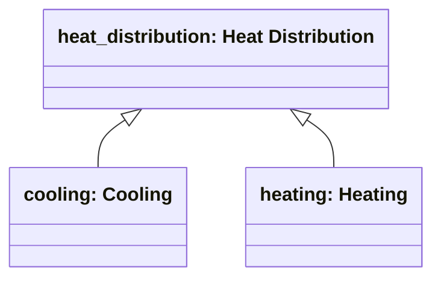

# Connection functional type classification

Source: [`connection-functional-type-en.skos.ttl`](sources/connection-functional-type.ttl)

## Scheme

- **definition (de):** Funktionale Klassifikation physischer Verbindungen zwischen Raeumen nach transportiertem Medium oder Durchgangrolle. Eine Verbindung kann mehrere funktionale Typen tragen (z. B. Erschliessung plus Sicht bei einer verglasten Tuer).
- **definition (en):** Functional classification of physical connections between spaces by transported medium or passage role. A connection may carry multiple functional types (for example access plus visual on a glazed door).
- **prefLabel (de):** Funktioneller Verbindungstyp
- **prefLabel (en):** Connection Functional Type
- **title (en):** Connection Functional Type

## Hierarchy

## Concepts

<button type="button" class="pbs-lang-btn" data-lang="de">DE</button>
<button type="button" class="pbs-lang-btn" data-lang="en">EN</button>

<table>
<thead>
<tr>
<th>Notation</th>
<th>Broader</th>
<th class="pbs-lang-col" data-lang="de" data-field="label">Label</th>
<th class="pbs-lang-col" data-lang="de" data-field="definition">Definition</th>
<th class="pbs-lang-col" data-lang="de" data-field="scope_note">Scope note</th>
<th class="pbs-lang-col" data-lang="en" data-field="label">Label</th>
<th class="pbs-lang-col" data-lang="en" data-field="definition">Definition</th>
<th class="pbs-lang-col" data-lang="en" data-field="scope_note">Scope note</th>
</tr>
</thead>
<tbody>
<tr>
<td>access</td>
<td></td>
<td class="pbs-lang-col" data-lang="de" data-field="label">Erschliessung</td>
<td class="pbs-lang-col" data-lang="de" data-field="definition">Physischer Durchgang von Personen oder Guetern zwischen Raeumen.</td>
<td class="pbs-lang-col" data-lang="de" data-field="scope_note"></td>
<td class="pbs-lang-col" data-lang="en" data-field="label">Access / Circulation</td>
<td class="pbs-lang-col" data-lang="en" data-field="definition">Physical passage of people or goods between spaces.</td>
<td class="pbs-lang-col" data-lang="en" data-field="scope_note"></td>
</tr>
<tr>
<td>cooling</td>
<td>heat_distribution</td>
<td class="pbs-lang-col" data-lang="de" data-field="label">Kuehlung</td>
<td class="pbs-lang-col" data-lang="de" data-field="definition">Verbindung fuer Kuehlmedium-Zulauf oder -ruecklauf.</td>
<td class="pbs-lang-col" data-lang="de" data-field="scope_note"></td>
<td class="pbs-lang-col" data-lang="en" data-field="label">Cooling</td>
<td class="pbs-lang-col" data-lang="en" data-field="definition">Cooling-medium supply or return connection.</td>
<td class="pbs-lang-col" data-lang="en" data-field="scope_note"></td>
</tr>
<tr>
<td>data</td>
<td></td>
<td class="pbs-lang-col" data-lang="de" data-field="label">Daten / ICT</td>
<td class="pbs-lang-col" data-lang="de" data-field="definition">Verbindung fuer Daten, Telekommunikation oder Gebaeudeautomation.</td>
<td class="pbs-lang-col" data-lang="de" data-field="scope_note"></td>
<td class="pbs-lang-col" data-lang="en" data-field="label">Data / ICT</td>
<td class="pbs-lang-col" data-lang="en" data-field="definition">Data, telecom, or building-automation connection.</td>
<td class="pbs-lang-col" data-lang="en" data-field="scope_note"></td>
</tr>
<tr>
<td>electrical</td>
<td></td>
<td class="pbs-lang-col" data-lang="de" data-field="label">Elektro</td>
<td class="pbs-lang-col" data-lang="de" data-field="definition">Verbindung fuer Stromverteilung.</td>
<td class="pbs-lang-col" data-lang="de" data-field="scope_note"></td>
<td class="pbs-lang-col" data-lang="en" data-field="label">Electrical</td>
<td class="pbs-lang-col" data-lang="en" data-field="definition">Power distribution connection.</td>
<td class="pbs-lang-col" data-lang="en" data-field="scope_note"></td>
</tr>
<tr>
<td>fresh_water</td>
<td></td>
<td class="pbs-lang-col" data-lang="de" data-field="label">Frischwasser</td>
<td class="pbs-lang-col" data-lang="de" data-field="definition">Verbindung fuer Trink- oder Nutzwasserversorgung.</td>
<td class="pbs-lang-col" data-lang="de" data-field="scope_note"></td>
<td class="pbs-lang-col" data-lang="en" data-field="label">Fresh Water</td>
<td class="pbs-lang-col" data-lang="en" data-field="definition">Potable or domestic water supply connection.</td>
<td class="pbs-lang-col" data-lang="en" data-field="scope_note"></td>
</tr>
<tr>
<td>heat_distribution</td>
<td></td>
<td class="pbs-lang-col" data-lang="de" data-field="label">Waermeverteilung</td>
<td class="pbs-lang-col" data-lang="de" data-field="definition">Gruppierungskonzept fuer Heiz- und Kuehlverteilungsverbindungen.</td>
<td class="pbs-lang-col" data-lang="de" data-field="scope_note">Nur Gruppierungskonzept fuer grobere Diagrammansichten. Niemals direkt auf ConnectionPhysical zuweisen; stattdessen heating und/oder cooling zuweisen.</td>
<td class="pbs-lang-col" data-lang="en" data-field="label">Heat Distribution</td>
<td class="pbs-lang-col" data-lang="en" data-field="definition">Grouping concept for heating and cooling distribution connections.</td>
<td class="pbs-lang-col" data-lang="en" data-field="scope_note">Grouping-only concept for coarser diagram views. Never assign directly on ConnectionPhysical; assign heating and/or cooling instead.</td>
</tr>
<tr>
<td>heating</td>
<td>heat_distribution</td>
<td class="pbs-lang-col" data-lang="de" data-field="label">Heizung</td>
<td class="pbs-lang-col" data-lang="de" data-field="definition">Verbindung fuer Heizmedium-Zulauf oder -ruecklauf.</td>
<td class="pbs-lang-col" data-lang="de" data-field="scope_note"></td>
<td class="pbs-lang-col" data-lang="en" data-field="label">Heating</td>
<td class="pbs-lang-col" data-lang="en" data-field="definition">Heating-medium supply or return connection.</td>
<td class="pbs-lang-col" data-lang="en" data-field="scope_note"></td>
</tr>
<tr>
<td>special_media</td>
<td></td>
<td class="pbs-lang-col" data-lang="de" data-field="label">Sondermedien</td>
<td class="pbs-lang-col" data-lang="de" data-field="definition">Verbindung fuer Gas, Druckluft, Feuerloeschung, Vakuum oder andere Prozessmedien; Sammelbegriff bis Projektdaten eine Aufteilung rechtfertigen.</td>
<td class="pbs-lang-col" data-lang="de" data-field="scope_note"></td>
<td class="pbs-lang-col" data-lang="en" data-field="label">Special Media</td>
<td class="pbs-lang-col" data-lang="en" data-field="definition">Gas, compressed air, fire suppression, vacuum, or other process-media connection; catch-all until project data justifies splitting.</td>
<td class="pbs-lang-col" data-lang="en" data-field="scope_note"></td>
</tr>
<tr>
<td>ventilation</td>
<td></td>
<td class="pbs-lang-col" data-lang="de" data-field="label">Lueftung</td>
<td class="pbs-lang-col" data-lang="de" data-field="definition">Verbindung fuer Luftfoerderung, -absaugung oder -uebergabe.</td>
<td class="pbs-lang-col" data-lang="de" data-field="scope_note"></td>
<td class="pbs-lang-col" data-lang="en" data-field="label">Ventilation</td>
<td class="pbs-lang-col" data-lang="en" data-field="definition">Air supply, extract, or transfer connection.</td>
<td class="pbs-lang-col" data-lang="en" data-field="scope_note"></td>
</tr>
<tr>
<td>visual</td>
<td></td>
<td class="pbs-lang-col" data-lang="de" data-field="label">Sicht / Tageslicht</td>
<td class="pbs-lang-col" data-lang="de" data-field="definition">Sicht- oder Tageslichtverbindung ohne physischen Durchgang.</td>
<td class="pbs-lang-col" data-lang="de" data-field="scope_note"></td>
<td class="pbs-lang-col" data-lang="en" data-field="label">Visual / Daylight</td>
<td class="pbs-lang-col" data-lang="en" data-field="definition">Sightline or daylight connection without physical passage.</td>
<td class="pbs-lang-col" data-lang="en" data-field="scope_note"></td>
</tr>
<tr>
<td>waste_water</td>
<td></td>
<td class="pbs-lang-col" data-lang="de" data-field="label">Abwasser</td>
<td class="pbs-lang-col" data-lang="de" data-field="definition">Verbindung fuer Entwaesserung, Abwasser oder Regenwasser.</td>
<td class="pbs-lang-col" data-lang="de" data-field="scope_note"></td>
<td class="pbs-lang-col" data-lang="en" data-field="label">Waste Water</td>
<td class="pbs-lang-col" data-lang="en" data-field="definition">Drainage, sewage, or rainwater connection.</td>
<td class="pbs-lang-col" data-lang="en" data-field="scope_note"></td>
</tr>
</tbody>
</table>

