# Document function classification

Source: [`document-function.skos.ttl`](sources/document-function.ttl)

## Scheme

- **definition (de):** Funktionale Klassifikation fuer Geschaefts-, Unternehmens- und Rechtsdokumente.
- **definition (en):** Functional classification for business, corporate, and legal documents.
- **definition (fr):** Classification fonctionnelle pour les documents d'entreprise, administratifs et juridiques.
- **definition (it):** Classificazione funzionale per documenti aziendali, amministrativi e legali.
- **prefLabel (de):** Klassifikation der Dokumentfunktion
- **prefLabel (en):** Document Function Classification
- **prefLabel (fr):** Classification de la fonction du document
- **prefLabel (it):** Classificazione della funzione del documento
- **title (en):** Document Function Classification

## Hierarchy

```mermaid
classDiagram
direction TB
class n_ADM["ADM: Administrative"]
class n_ADM_MEM["ADM-MEM: Memos"]
class n_ADM_MIN["ADM-MIN: Meeting minutes"]
class n_ADM_POL["ADM-POL: Internal policies"]
class n_ADM_REC["ADM-REC: Recaps"]
class n_FIN["FIN: Financial"]
class n_FIN_BAL["FIN-BAL: Balance sheets"]
class n_FIN_INV["FIN-INV: Invoices"]
class n_FIN_PAY["FIN-PAY: Payroll records"]
class n_FIN_RCP["FIN-RCP: Receipts"]
class n_LEG["LEG: Legal and contractual"]
class n_LEG_CON["LEG-CON: Contracts"]
class n_LEG_NDA["LEG-NDA: NDAs"]
class n_LEG_PAT["LEG-PAT: Patents"]
class n_LEG_SET["LEG-SET: Settlement agreements"]
class n_MKS["MKS: Marketing and Sales"]
class n_MKS_BRO["MKS-BRO: Brochures"]
class n_MKS_CAS["MKS-CAS: Case studies"]
class n_MKS_LDL["MKS-LDL: Lead lists"]
class n_MKS_WHP["MKS-WHP: White papers"]
class n_REG["REG: Regulatory and normative"]
class n_REG_CMP["REG-CMP: Compliance reports"]
class n_REG_CMP_AUD["REG-CMP-AUD: Compliance audits"]
class n_REG_CMP_DCL["REG-CMP-DCL: Conformity declarations"]
class n_REG_CMP_FIL["REG-CMP-FIL: Regulatory filings"]
class n_REG_LAW["REG-LAW: Laws"]
class n_REG_NOR["REG-NOR: Norms"]
class n_REG_STD["REG-STD: Standards"]
class n_REQ["REQ: Requirements and briefs"]
class n_REQ_BRF["REQ-BRF: Project briefs"]
class n_REQ_FSP["REQ-FSP: Functional specifications"]
class n_REQ_TND["REQ-TND: Tender documents"]
class n_REQ_UST["REQ-UST: User stories"]
class n_TEC["TEC: Technical"]
class n_TEC_DOC["TEC-DOC: Documents"]
class n_TEC_MAN["TEC-MAN: Manuals"]
class n_TEC_PLN["TEC-PLN: Plans"]
class n_TEC_SCH["TEC-SCH: Schematics"]
n_ADM <|-- n_ADM_MEM
n_ADM <|-- n_ADM_MIN
n_ADM <|-- n_ADM_POL
n_ADM <|-- n_ADM_REC
n_FIN <|-- n_FIN_BAL
n_FIN <|-- n_FIN_INV
n_FIN <|-- n_FIN_PAY
n_FIN <|-- n_FIN_RCP
n_LEG <|-- n_LEG_CON
n_LEG <|-- n_LEG_NDA
n_LEG <|-- n_LEG_PAT
n_LEG <|-- n_LEG_SET
n_MKS <|-- n_MKS_BRO
n_MKS <|-- n_MKS_CAS
n_MKS <|-- n_MKS_LDL
n_MKS <|-- n_MKS_WHP
n_REG <|-- n_REG_CMP
n_REG <|-- n_REG_LAW
n_REG <|-- n_REG_NOR
n_REG <|-- n_REG_STD
n_REG_CMP <|-- n_REG_CMP_AUD
n_REG_CMP <|-- n_REG_CMP_DCL
n_REG_CMP <|-- n_REG_CMP_FIL
n_REQ <|-- n_REQ_BRF
n_REQ <|-- n_REQ_FSP
n_REQ <|-- n_REQ_TND
n_REQ <|-- n_REQ_UST
n_TEC <|-- n_TEC_DOC
n_TEC <|-- n_TEC_MAN
n_TEC <|-- n_TEC_PLN
n_TEC <|-- n_TEC_SCH
```

## Concepts

<button type="button" class="pbs-lang-btn" data-lang="de">DE</button>
<button type="button" class="pbs-lang-btn" data-lang="en">EN</button>
<button type="button" class="pbs-lang-btn" data-lang="fr">FR</button>
<button type="button" class="pbs-lang-btn" data-lang="it">IT</button>

<table>
<thead>
<tr>
<th>Notation</th>
<th>Broader</th>
<th class="pbs-lang-col" data-lang="de" data-field="label">Label</th>
<th class="pbs-lang-col" data-lang="de" data-field="definition">Definition</th>
<th class="pbs-lang-col" data-lang="de" data-field="scope_note">Scope note</th>
<th class="pbs-lang-col" data-lang="en" data-field="label">Label</th>
<th class="pbs-lang-col" data-lang="en" data-field="definition">Definition</th>
<th class="pbs-lang-col" data-lang="en" data-field="scope_note">Scope note</th>
<th class="pbs-lang-col" data-lang="fr" data-field="label">Label</th>
<th class="pbs-lang-col" data-lang="fr" data-field="definition">Definition</th>
<th class="pbs-lang-col" data-lang="fr" data-field="scope_note">Scope note</th>
<th class="pbs-lang-col" data-lang="it" data-field="label">Label</th>
<th class="pbs-lang-col" data-lang="it" data-field="definition">Definition</th>
<th class="pbs-lang-col" data-lang="it" data-field="scope_note">Scope note</th>
</tr>
</thead>
<tbody>
<tr>
<td>ADM</td>
<td></td>
<td class="pbs-lang-col" data-lang="de" data-field="label">Administrativ</td>
<td class="pbs-lang-col" data-lang="de" data-field="definition">Dokumente zur internen Administration, Koordination und organisatorischen Steuerung.</td>
<td class="pbs-lang-col" data-lang="de" data-field="scope_note"></td>
<td class="pbs-lang-col" data-lang="en" data-field="label">Administrative</td>
<td class="pbs-lang-col" data-lang="en" data-field="definition">Documents supporting internal administration, coordination, and organizational governance.</td>
<td class="pbs-lang-col" data-lang="en" data-field="scope_note"></td>
<td class="pbs-lang-col" data-lang="fr" data-field="label">Administratif</td>
<td class="pbs-lang-col" data-lang="fr" data-field="definition">Documents soutenant l&#x27;administration interne, la coordination et la gouvernance organisationnelle.</td>
<td class="pbs-lang-col" data-lang="fr" data-field="scope_note"></td>
<td class="pbs-lang-col" data-lang="it" data-field="label">Amministrativo</td>
<td class="pbs-lang-col" data-lang="it" data-field="definition">Documenti di supporto all&#x27;amministrazione interna, al coordinamento e alla governance organizzativa.</td>
<td class="pbs-lang-col" data-lang="it" data-field="scope_note"></td>
</tr>
<tr>
<td>ADM-MEM</td>
<td>ADM</td>
<td class="pbs-lang-col" data-lang="de" data-field="label">Memos</td>
<td class="pbs-lang-col" data-lang="de" data-field="definition">Kurze interne Mitteilungen zur Koordination oder Information.</td>
<td class="pbs-lang-col" data-lang="de" data-field="scope_note"></td>
<td class="pbs-lang-col" data-lang="en" data-field="label">Memos</td>
<td class="pbs-lang-col" data-lang="en" data-field="definition">Short internal messages for coordination or information.</td>
<td class="pbs-lang-col" data-lang="en" data-field="scope_note"></td>
<td class="pbs-lang-col" data-lang="fr" data-field="label">Notes internes</td>
<td class="pbs-lang-col" data-lang="fr" data-field="definition">Courts messages internes pour coordination ou information.</td>
<td class="pbs-lang-col" data-lang="fr" data-field="scope_note"></td>
<td class="pbs-lang-col" data-lang="it" data-field="label">Promemoria</td>
<td class="pbs-lang-col" data-lang="it" data-field="definition">Brevi messaggi interni per coordinamento o informazione.</td>
<td class="pbs-lang-col" data-lang="it" data-field="scope_note"></td>
</tr>
<tr>
<td>ADM-MIN</td>
<td>ADM</td>
<td class="pbs-lang-col" data-lang="de" data-field="label">Sitzungsprotokolle</td>
<td class="pbs-lang-col" data-lang="de" data-field="definition">Aufzeichnungen von Diskussionen, Entscheidungen und Massnahmen aus Sitzungen.</td>
<td class="pbs-lang-col" data-lang="de" data-field="scope_note"></td>
<td class="pbs-lang-col" data-lang="en" data-field="label">Meeting minutes</td>
<td class="pbs-lang-col" data-lang="en" data-field="definition">Records of discussions, decisions, and actions from meetings.</td>
<td class="pbs-lang-col" data-lang="en" data-field="scope_note"></td>
<td class="pbs-lang-col" data-lang="fr" data-field="label">Proces-verbaux</td>
<td class="pbs-lang-col" data-lang="fr" data-field="definition">Comptes rendus de discussions, decisions et actions prises en reunion.</td>
<td class="pbs-lang-col" data-lang="fr" data-field="scope_note"></td>
<td class="pbs-lang-col" data-lang="it" data-field="label">Verbali di riunione</td>
<td class="pbs-lang-col" data-lang="it" data-field="definition">Resoconti di discussioni, decisioni e azioni emerse dalle riunioni.</td>
<td class="pbs-lang-col" data-lang="it" data-field="scope_note"></td>
</tr>
<tr>
<td>ADM-POL</td>
<td>ADM</td>
<td class="pbs-lang-col" data-lang="de" data-field="label">Interne Richtlinien</td>
<td class="pbs-lang-col" data-lang="de" data-field="definition">Organisatorische Regeln und Leitlinien fuer interne Ablaeufe.</td>
<td class="pbs-lang-col" data-lang="de" data-field="scope_note"></td>
<td class="pbs-lang-col" data-lang="en" data-field="label">Internal policies</td>
<td class="pbs-lang-col" data-lang="en" data-field="definition">Organizational rules and guidance for internal operations.</td>
<td class="pbs-lang-col" data-lang="en" data-field="scope_note"></td>
<td class="pbs-lang-col" data-lang="fr" data-field="label">Politiques internes</td>
<td class="pbs-lang-col" data-lang="fr" data-field="definition">Regles et directives organisationnelles pour les operations internes.</td>
<td class="pbs-lang-col" data-lang="fr" data-field="scope_note"></td>
<td class="pbs-lang-col" data-lang="it" data-field="label">Politiche interne</td>
<td class="pbs-lang-col" data-lang="it" data-field="definition">Regole e linee guida organizzative per le operazioni interne.</td>
<td class="pbs-lang-col" data-lang="it" data-field="scope_note"></td>
</tr>
<tr>
<td>ADM-REC</td>
<td>ADM</td>
<td class="pbs-lang-col" data-lang="de" data-field="label">Zusammenfassungen</td>
<td class="pbs-lang-col" data-lang="de" data-field="definition">Zusammenfassungen von Ereignissen, Diskussionen oder Status fuer interne Verbreitung.</td>
<td class="pbs-lang-col" data-lang="de" data-field="scope_note"></td>
<td class="pbs-lang-col" data-lang="en" data-field="label">Recaps</td>
<td class="pbs-lang-col" data-lang="en" data-field="definition">Summaries of events, discussions, or status for internal circulation.</td>
<td class="pbs-lang-col" data-lang="en" data-field="scope_note"></td>
<td class="pbs-lang-col" data-lang="fr" data-field="label">Comptes rendus</td>
<td class="pbs-lang-col" data-lang="fr" data-field="definition">Syntheses d&#x27;evenements, de discussions ou de statuts pour diffusion interne.</td>
<td class="pbs-lang-col" data-lang="fr" data-field="scope_note"></td>
<td class="pbs-lang-col" data-lang="it" data-field="label">Riepiloghi</td>
<td class="pbs-lang-col" data-lang="it" data-field="definition">Sintesi di eventi, discussioni o stati per circolazione interna.</td>
<td class="pbs-lang-col" data-lang="it" data-field="scope_note"></td>
</tr>
<tr>
<td>FIN</td>
<td></td>
<td class="pbs-lang-col" data-lang="de" data-field="label">Finanzen</td>
<td class="pbs-lang-col" data-lang="de" data-field="definition">Dokumente fuer Buchhaltung, Berichterstattung, Zahlungen und finanzielle Steuerung.</td>
<td class="pbs-lang-col" data-lang="de" data-field="scope_note"></td>
<td class="pbs-lang-col" data-lang="en" data-field="label">Financial</td>
<td class="pbs-lang-col" data-lang="en" data-field="definition">Documents used for accounting, reporting, payments, and financial control.</td>
<td class="pbs-lang-col" data-lang="en" data-field="scope_note"></td>
<td class="pbs-lang-col" data-lang="fr" data-field="label">Financier</td>
<td class="pbs-lang-col" data-lang="fr" data-field="definition">Documents utilises pour la comptabilite, le reporting, les paiements et le controle financier.</td>
<td class="pbs-lang-col" data-lang="fr" data-field="scope_note"></td>
<td class="pbs-lang-col" data-lang="it" data-field="label">Finanziario</td>
<td class="pbs-lang-col" data-lang="it" data-field="definition">Documenti usati per contabilita, reporting, pagamenti e controllo finanziario.</td>
<td class="pbs-lang-col" data-lang="it" data-field="scope_note"></td>
</tr>
<tr>
<td>FIN-BAL</td>
<td>FIN</td>
<td class="pbs-lang-col" data-lang="de" data-field="label">Bilanzen</td>
<td class="pbs-lang-col" data-lang="de" data-field="definition">Aufstellungen von Aktiva, Passiva und Eigenkapital zu einem Stichtag.</td>
<td class="pbs-lang-col" data-lang="de" data-field="scope_note"></td>
<td class="pbs-lang-col" data-lang="en" data-field="label">Balance sheets</td>
<td class="pbs-lang-col" data-lang="en" data-field="definition">Statements of assets, liabilities, and equity at a reporting date.</td>
<td class="pbs-lang-col" data-lang="en" data-field="scope_note"></td>
<td class="pbs-lang-col" data-lang="fr" data-field="label">Bilans</td>
<td class="pbs-lang-col" data-lang="fr" data-field="definition">Etats des actifs, passifs et capitaux propres a une date de reporting.</td>
<td class="pbs-lang-col" data-lang="fr" data-field="scope_note"></td>
<td class="pbs-lang-col" data-lang="it" data-field="label">Bilanci</td>
<td class="pbs-lang-col" data-lang="it" data-field="definition">Prospetti di attivita, passivita e patrimonio netto a una data di riferimento.</td>
<td class="pbs-lang-col" data-lang="it" data-field="scope_note"></td>
</tr>
<tr>
<td>FIN-INV</td>
<td>FIN</td>
<td class="pbs-lang-col" data-lang="de" data-field="label">Rechnungen</td>
<td class="pbs-lang-col" data-lang="de" data-field="definition">Dokumente zur Anforderung oder Erfassung von Zahlungen fuer Waren oder Dienstleistungen.</td>
<td class="pbs-lang-col" data-lang="de" data-field="scope_note"></td>
<td class="pbs-lang-col" data-lang="en" data-field="label">Invoices</td>
<td class="pbs-lang-col" data-lang="en" data-field="definition">Documents requesting or recording payment for goods or services.</td>
<td class="pbs-lang-col" data-lang="en" data-field="scope_note"></td>
<td class="pbs-lang-col" data-lang="fr" data-field="label">Factures</td>
<td class="pbs-lang-col" data-lang="fr" data-field="definition">Documents demandant ou enregistrant le paiement de biens ou services.</td>
<td class="pbs-lang-col" data-lang="fr" data-field="scope_note"></td>
<td class="pbs-lang-col" data-lang="it" data-field="label">Fatture</td>
<td class="pbs-lang-col" data-lang="it" data-field="definition">Documenti che richiedono o registrano pagamenti per beni o servizi.</td>
<td class="pbs-lang-col" data-lang="it" data-field="scope_note"></td>
</tr>
<tr>
<td>FIN-PAY</td>
<td>FIN</td>
<td class="pbs-lang-col" data-lang="de" data-field="label">Lohndokumente</td>
<td class="pbs-lang-col" data-lang="de" data-field="definition">Dokumente zu Mitarbeiterverguetung und Lohnabrechnung.</td>
<td class="pbs-lang-col" data-lang="de" data-field="scope_note"></td>
<td class="pbs-lang-col" data-lang="en" data-field="label">Payroll records</td>
<td class="pbs-lang-col" data-lang="en" data-field="definition">Documents relating to employee compensation and payroll processing.</td>
<td class="pbs-lang-col" data-lang="en" data-field="scope_note"></td>
<td class="pbs-lang-col" data-lang="fr" data-field="label">Documents de paie</td>
<td class="pbs-lang-col" data-lang="fr" data-field="definition">Documents relatifs a la remuneration des employes et au traitement de la paie.</td>
<td class="pbs-lang-col" data-lang="fr" data-field="scope_note"></td>
<td class="pbs-lang-col" data-lang="it" data-field="label">Documenti salariali</td>
<td class="pbs-lang-col" data-lang="it" data-field="definition">Documenti relativi alla retribuzione dei dipendenti e all&#x27;elaborazione paghe.</td>
<td class="pbs-lang-col" data-lang="it" data-field="scope_note"></td>
</tr>
<tr>
<td>FIN-RCP</td>
<td>FIN</td>
<td class="pbs-lang-col" data-lang="de" data-field="label">Quittungen</td>
<td class="pbs-lang-col" data-lang="de" data-field="definition">Dokumente, die den Erhalt oder die Leistung einer Zahlung bestaetigen.</td>
<td class="pbs-lang-col" data-lang="de" data-field="scope_note"></td>
<td class="pbs-lang-col" data-lang="en" data-field="label">Receipts</td>
<td class="pbs-lang-col" data-lang="en" data-field="definition">Documents confirming that payment was received or made.</td>
<td class="pbs-lang-col" data-lang="en" data-field="scope_note"></td>
<td class="pbs-lang-col" data-lang="fr" data-field="label">Recus</td>
<td class="pbs-lang-col" data-lang="fr" data-field="definition">Documents confirmant qu&#x27;un paiement a ete recu ou effectue.</td>
<td class="pbs-lang-col" data-lang="fr" data-field="scope_note"></td>
<td class="pbs-lang-col" data-lang="it" data-field="label">Ricevute</td>
<td class="pbs-lang-col" data-lang="it" data-field="definition">Documenti che confermano la ricezione o l&#x27;effettuazione di un pagamento.</td>
<td class="pbs-lang-col" data-lang="it" data-field="scope_note"></td>
</tr>
<tr>
<td>LEG</td>
<td></td>
<td class="pbs-lang-col" data-lang="de" data-field="label">Rechtlich und vertraglich</td>
<td class="pbs-lang-col" data-lang="de" data-field="definition">Dokumente fuer rechtliche Verpflichtungen, geistiges Eigentum und formelle Vereinbarungen zwischen Parteien.</td>
<td class="pbs-lang-col" data-lang="de" data-field="scope_note"></td>
<td class="pbs-lang-col" data-lang="en" data-field="label">Legal and contractual</td>
<td class="pbs-lang-col" data-lang="en" data-field="definition">Documents used for legal obligations, intellectual property, and formal agreements between parties.</td>
<td class="pbs-lang-col" data-lang="en" data-field="scope_note"></td>
<td class="pbs-lang-col" data-lang="fr" data-field="label">Juridique et contractuel</td>
<td class="pbs-lang-col" data-lang="fr" data-field="definition">Documents utilises pour les obligations juridiques, la propriete intellectuelle et les accords formels entre parties.</td>
<td class="pbs-lang-col" data-lang="fr" data-field="scope_note"></td>
<td class="pbs-lang-col" data-lang="it" data-field="label">Legale e contrattuale</td>
<td class="pbs-lang-col" data-lang="it" data-field="definition">Documenti usati per obblighi legali, proprieta intellettuale e accordi formali tra le parti.</td>
<td class="pbs-lang-col" data-lang="it" data-field="scope_note"></td>
</tr>
<tr>
<td>LEG-CON</td>
<td>LEG</td>
<td class="pbs-lang-col" data-lang="de" data-field="label">Vertraege</td>
<td class="pbs-lang-col" data-lang="de" data-field="definition">Formelle Vereinbarungen, die Rechte und Pflichten zwischen Parteien definieren.</td>
<td class="pbs-lang-col" data-lang="de" data-field="scope_note"></td>
<td class="pbs-lang-col" data-lang="en" data-field="label">Contracts</td>
<td class="pbs-lang-col" data-lang="en" data-field="definition">Formal agreements defining rights and obligations between parties.</td>
<td class="pbs-lang-col" data-lang="en" data-field="scope_note"></td>
<td class="pbs-lang-col" data-lang="fr" data-field="label">Contrats</td>
<td class="pbs-lang-col" data-lang="fr" data-field="definition">Accords formels definissant droits et obligations entre parties.</td>
<td class="pbs-lang-col" data-lang="fr" data-field="scope_note"></td>
<td class="pbs-lang-col" data-lang="it" data-field="label">Contratti</td>
<td class="pbs-lang-col" data-lang="it" data-field="definition">Accordi formali che definiscono diritti e obblighi tra le parti.</td>
<td class="pbs-lang-col" data-lang="it" data-field="scope_note"></td>
</tr>
<tr>
<td>LEG-NDA</td>
<td>LEG</td>
<td class="pbs-lang-col" data-lang="de" data-field="label">Geheimhaltungsvereinbarungen</td>
<td class="pbs-lang-col" data-lang="de" data-field="definition">Vereinbarungen zur Beschraenkung der Offenlegung vertraulicher Informationen.</td>
<td class="pbs-lang-col" data-lang="de" data-field="scope_note"></td>
<td class="pbs-lang-col" data-lang="en" data-field="label">NDAs</td>
<td class="pbs-lang-col" data-lang="en" data-field="definition">Agreements restricting disclosure of confidential information.</td>
<td class="pbs-lang-col" data-lang="en" data-field="scope_note"></td>
<td class="pbs-lang-col" data-lang="fr" data-field="label">Accords de confidentialite</td>
<td class="pbs-lang-col" data-lang="fr" data-field="definition">Accords limitant la divulgation d&#x27;informations confidentielles.</td>
<td class="pbs-lang-col" data-lang="fr" data-field="scope_note"></td>
<td class="pbs-lang-col" data-lang="it" data-field="label">Accordi di riservatezza</td>
<td class="pbs-lang-col" data-lang="it" data-field="definition">Accordi che limitano la divulgazione di informazioni riservate.</td>
<td class="pbs-lang-col" data-lang="it" data-field="scope_note"></td>
</tr>
<tr>
<td>LEG-PAT</td>
<td>LEG</td>
<td class="pbs-lang-col" data-lang="de" data-field="label">Patente</td>
<td class="pbs-lang-col" data-lang="de" data-field="definition">Dokumente zur Begruendung oder Beschreibung von Rechten an geistigem Eigentum.</td>
<td class="pbs-lang-col" data-lang="de" data-field="scope_note"></td>
<td class="pbs-lang-col" data-lang="en" data-field="label">Patents</td>
<td class="pbs-lang-col" data-lang="en" data-field="definition">Documents establishing or describing intellectual property rights.</td>
<td class="pbs-lang-col" data-lang="en" data-field="scope_note"></td>
<td class="pbs-lang-col" data-lang="fr" data-field="label">Brevets</td>
<td class="pbs-lang-col" data-lang="fr" data-field="definition">Documents etablissant ou decrivant des droits de propriete intellectuelle.</td>
<td class="pbs-lang-col" data-lang="fr" data-field="scope_note"></td>
<td class="pbs-lang-col" data-lang="it" data-field="label">Brevetti</td>
<td class="pbs-lang-col" data-lang="it" data-field="definition">Documenti che stabiliscono o descrivono diritti di proprieta intellettuale.</td>
<td class="pbs-lang-col" data-lang="it" data-field="scope_note"></td>
</tr>
<tr>
<td>LEG-SET</td>
<td>LEG</td>
<td class="pbs-lang-col" data-lang="de" data-field="label">Vergleichsvereinbarungen</td>
<td class="pbs-lang-col" data-lang="de" data-field="definition">Vereinbarungen zur Beilegung von Streitigkeiten oder Anspruechen ohne vollstaendiges Verfahren.</td>
<td class="pbs-lang-col" data-lang="de" data-field="scope_note"></td>
<td class="pbs-lang-col" data-lang="en" data-field="label">Settlement agreements</td>
<td class="pbs-lang-col" data-lang="en" data-field="definition">Agreements resolving disputes or claims without full litigation.</td>
<td class="pbs-lang-col" data-lang="en" data-field="scope_note"></td>
<td class="pbs-lang-col" data-lang="fr" data-field="label">Accords transactionnels</td>
<td class="pbs-lang-col" data-lang="fr" data-field="definition">Accords resolvant des litiges ou reclamations sans procedure complete.</td>
<td class="pbs-lang-col" data-lang="fr" data-field="scope_note"></td>
<td class="pbs-lang-col" data-lang="it" data-field="label">Accordi transattivi</td>
<td class="pbs-lang-col" data-lang="it" data-field="definition">Accordi che risolvono controversie o reclami senza procedimento completo.</td>
<td class="pbs-lang-col" data-lang="it" data-field="scope_note"></td>
</tr>
<tr>
<td>MKS</td>
<td></td>
<td class="pbs-lang-col" data-lang="de" data-field="label">Marketing und Vertrieb</td>
<td class="pbs-lang-col" data-lang="de" data-field="definition">Dokumente fuer Marktkommunikation, Promotion, Kundengewinnung und Vertriebsunterstuetzung.</td>
<td class="pbs-lang-col" data-lang="de" data-field="scope_note"></td>
<td class="pbs-lang-col" data-lang="en" data-field="label">Marketing and Sales</td>
<td class="pbs-lang-col" data-lang="en" data-field="definition">Documents used for market communication, promotion, customer acquisition, and sales support.</td>
<td class="pbs-lang-col" data-lang="en" data-field="scope_note"></td>
<td class="pbs-lang-col" data-lang="fr" data-field="label">Marketing et ventes</td>
<td class="pbs-lang-col" data-lang="fr" data-field="definition">Documents utilises pour la communication de marche, la promotion, l&#x27;acquisition de clients et le support commercial.</td>
<td class="pbs-lang-col" data-lang="fr" data-field="scope_note"></td>
<td class="pbs-lang-col" data-lang="it" data-field="label">Marketing e vendite</td>
<td class="pbs-lang-col" data-lang="it" data-field="definition">Documenti usati per comunicazione di mercato, promozione, acquisizione clienti e supporto alle vendite.</td>
<td class="pbs-lang-col" data-lang="it" data-field="scope_note"></td>
</tr>
<tr>
<td>MKS-BRO</td>
<td>MKS</td>
<td class="pbs-lang-col" data-lang="de" data-field="label">Broschueren</td>
<td class="pbs-lang-col" data-lang="de" data-field="definition">Werbematerialien zur Praesentation von Produkten, Dienstleistungen oder Angeboten.</td>
<td class="pbs-lang-col" data-lang="de" data-field="scope_note"></td>
<td class="pbs-lang-col" data-lang="en" data-field="label">Brochures</td>
<td class="pbs-lang-col" data-lang="en" data-field="definition">Promotional documents presenting products, services, or offerings.</td>
<td class="pbs-lang-col" data-lang="en" data-field="scope_note"></td>
<td class="pbs-lang-col" data-lang="fr" data-field="label">Brochures</td>
<td class="pbs-lang-col" data-lang="fr" data-field="definition">Documents promotionnels presentant produits, services ou offres.</td>
<td class="pbs-lang-col" data-lang="fr" data-field="scope_note"></td>
<td class="pbs-lang-col" data-lang="it" data-field="label">Brochure</td>
<td class="pbs-lang-col" data-lang="it" data-field="definition">Documenti promozionali che presentano prodotti, servizi o offerte.</td>
<td class="pbs-lang-col" data-lang="it" data-field="scope_note"></td>
</tr>
<tr>
<td>MKS-CAS</td>
<td>MKS</td>
<td class="pbs-lang-col" data-lang="de" data-field="label">Fallstudien</td>
<td class="pbs-lang-col" data-lang="de" data-field="definition">Dokumente, die abgeschlossene Projekte oder Kundenerfolgsgeschichten beschreiben.</td>
<td class="pbs-lang-col" data-lang="de" data-field="scope_note"></td>
<td class="pbs-lang-col" data-lang="en" data-field="label">Case studies</td>
<td class="pbs-lang-col" data-lang="en" data-field="definition">Documents describing completed projects or customer success stories.</td>
<td class="pbs-lang-col" data-lang="en" data-field="scope_note"></td>
<td class="pbs-lang-col" data-lang="fr" data-field="label">Etudes de cas</td>
<td class="pbs-lang-col" data-lang="fr" data-field="definition">Documents decrivant des projets realises ou des reussites clients.</td>
<td class="pbs-lang-col" data-lang="fr" data-field="scope_note"></td>
<td class="pbs-lang-col" data-lang="it" data-field="label">Casi studio</td>
<td class="pbs-lang-col" data-lang="it" data-field="definition">Documenti che descrivono progetti completati o storie di successo dei clienti.</td>
<td class="pbs-lang-col" data-lang="it" data-field="scope_note"></td>
</tr>
<tr>
<td>MKS-LDL</td>
<td>MKS</td>
<td class="pbs-lang-col" data-lang="de" data-field="label">Lead-Listen</td>
<td class="pbs-lang-col" data-lang="de" data-field="definition">Listen potenzieller Kunden oder Vertriebschancen.</td>
<td class="pbs-lang-col" data-lang="de" data-field="scope_note"></td>
<td class="pbs-lang-col" data-lang="en" data-field="label">Lead lists</td>
<td class="pbs-lang-col" data-lang="en" data-field="definition">Lists of potential customers or sales opportunities.</td>
<td class="pbs-lang-col" data-lang="en" data-field="scope_note"></td>
<td class="pbs-lang-col" data-lang="fr" data-field="label">Listes de prospects</td>
<td class="pbs-lang-col" data-lang="fr" data-field="definition">Listes de clients potentiels ou d&#x27;opportunites commerciales.</td>
<td class="pbs-lang-col" data-lang="fr" data-field="scope_note"></td>
<td class="pbs-lang-col" data-lang="it" data-field="label">Liste di lead</td>
<td class="pbs-lang-col" data-lang="it" data-field="definition">Elenchi di clienti potenziali o opportunita commerciali.</td>
<td class="pbs-lang-col" data-lang="it" data-field="scope_note"></td>
</tr>
<tr>
<td>MKS-WHP</td>
<td>MKS</td>
<td class="pbs-lang-col" data-lang="de" data-field="label">White Papers</td>
<td class="pbs-lang-col" data-lang="de" data-field="definition">Autoritative Dokumente zur Erklaerung von Loesungen, Methoden oder Marktperspektiven.</td>
<td class="pbs-lang-col" data-lang="de" data-field="scope_note"></td>
<td class="pbs-lang-col" data-lang="en" data-field="label">White papers</td>
<td class="pbs-lang-col" data-lang="en" data-field="definition">Authoritative documents explaining solutions, methods, or market perspectives.</td>
<td class="pbs-lang-col" data-lang="en" data-field="scope_note"></td>
<td class="pbs-lang-col" data-lang="fr" data-field="label">Livres blancs</td>
<td class="pbs-lang-col" data-lang="fr" data-field="definition">Documents faisant autorite expliquant solutions, methodes ou perspectives de marche.</td>
<td class="pbs-lang-col" data-lang="fr" data-field="scope_note"></td>
<td class="pbs-lang-col" data-lang="it" data-field="label">White paper</td>
<td class="pbs-lang-col" data-lang="it" data-field="definition">Documenti autorevoli che spiegano soluzioni, metodi o prospettive di mercato.</td>
<td class="pbs-lang-col" data-lang="it" data-field="scope_note"></td>
</tr>
<tr>
<td>REG</td>
<td></td>
<td class="pbs-lang-col" data-lang="de" data-field="label">Regulatorisch und normativ</td>
<td class="pbs-lang-col" data-lang="de" data-field="definition">Dokumente, die externe Regeln, offizielle Normen und Compliance-Verpflichtungen abbilden.</td>
<td class="pbs-lang-col" data-lang="de" data-field="scope_note"></td>
<td class="pbs-lang-col" data-lang="en" data-field="label">Regulatory and normative</td>
<td class="pbs-lang-col" data-lang="en" data-field="definition">Documents representing external rules, official standards, and compliance obligations.</td>
<td class="pbs-lang-col" data-lang="en" data-field="scope_note"></td>
<td class="pbs-lang-col" data-lang="fr" data-field="label">Reglementaire et normatif</td>
<td class="pbs-lang-col" data-lang="fr" data-field="definition">Documents representant des regles externes, des normes officielles et des obligations de conformite.</td>
<td class="pbs-lang-col" data-lang="fr" data-field="scope_note"></td>
<td class="pbs-lang-col" data-lang="it" data-field="label">Regolamentare e normativo</td>
<td class="pbs-lang-col" data-lang="it" data-field="definition">Documenti che rappresentano regole esterne, norme ufficiali e obblighi di conformita.</td>
<td class="pbs-lang-col" data-lang="it" data-field="scope_note"></td>
</tr>
<tr>
<td>REG-CMP</td>
<td>REG</td>
<td class="pbs-lang-col" data-lang="de" data-field="label">Compliance-Berichte</td>
<td class="pbs-lang-col" data-lang="de" data-field="definition">Dokumente, die die Einhaltung externer Regeln und Verpflichtungen nachweisen oder berichten.</td>
<td class="pbs-lang-col" data-lang="de" data-field="scope_note"></td>
<td class="pbs-lang-col" data-lang="en" data-field="label">Compliance reports</td>
<td class="pbs-lang-col" data-lang="en" data-field="definition">Documents demonstrating or reporting conformity with external rules and obligations.</td>
<td class="pbs-lang-col" data-lang="en" data-field="scope_note"></td>
<td class="pbs-lang-col" data-lang="fr" data-field="label">Rapports de conformite</td>
<td class="pbs-lang-col" data-lang="fr" data-field="definition">Documents demonstrant ou rapportant la conformite aux regles et obligations externes.</td>
<td class="pbs-lang-col" data-lang="fr" data-field="scope_note"></td>
<td class="pbs-lang-col" data-lang="it" data-field="label">Rapporti di conformita</td>
<td class="pbs-lang-col" data-lang="it" data-field="definition">Documenti che dimostrano o riportano la conformita a regole e obblighi esterni.</td>
<td class="pbs-lang-col" data-lang="it" data-field="scope_note"></td>
</tr>
<tr>
<td>REG-CMP-AUD</td>
<td>REG-CMP</td>
<td class="pbs-lang-col" data-lang="de" data-field="label">Compliance-Audits</td>
<td class="pbs-lang-col" data-lang="de" data-field="definition">Berichte aus Audits zur Bewertung der Einhaltung von Regeln und Verpflichtungen.</td>
<td class="pbs-lang-col" data-lang="de" data-field="scope_note"></td>
<td class="pbs-lang-col" data-lang="en" data-field="label">Compliance audits</td>
<td class="pbs-lang-col" data-lang="en" data-field="definition">Reports from audits assessing conformity with rules and obligations.</td>
<td class="pbs-lang-col" data-lang="en" data-field="scope_note"></td>
<td class="pbs-lang-col" data-lang="fr" data-field="label">Audits de conformite</td>
<td class="pbs-lang-col" data-lang="fr" data-field="definition">Rapports d&#x27;audits evaluant la conformite aux regles et obligations.</td>
<td class="pbs-lang-col" data-lang="fr" data-field="scope_note"></td>
<td class="pbs-lang-col" data-lang="it" data-field="label">Audit di conformita</td>
<td class="pbs-lang-col" data-lang="it" data-field="definition">Rapporti di audit che valutano la conformita a regole e obblighi.</td>
<td class="pbs-lang-col" data-lang="it" data-field="scope_note"></td>
</tr>
<tr>
<td>REG-CMP-DCL</td>
<td>REG-CMP</td>
<td class="pbs-lang-col" data-lang="de" data-field="label">Konformitaetserklaerungen</td>
<td class="pbs-lang-col" data-lang="de" data-field="definition">Formelle Erklaerungen zur Bestaetigung der Einhaltung festgelegter Anforderungen.</td>
<td class="pbs-lang-col" data-lang="de" data-field="scope_note"></td>
<td class="pbs-lang-col" data-lang="en" data-field="label">Conformity declarations</td>
<td class="pbs-lang-col" data-lang="en" data-field="definition">Formal statements attesting conformity to specified requirements.</td>
<td class="pbs-lang-col" data-lang="en" data-field="scope_note"></td>
<td class="pbs-lang-col" data-lang="fr" data-field="label">Declarations de conformite</td>
<td class="pbs-lang-col" data-lang="fr" data-field="definition">Declarations formelles attestant la conformite a des exigences specifiees.</td>
<td class="pbs-lang-col" data-lang="fr" data-field="scope_note"></td>
<td class="pbs-lang-col" data-lang="it" data-field="label">Dichiarazioni di conformita</td>
<td class="pbs-lang-col" data-lang="it" data-field="definition">Dichiarazioni formali che attestano la conformita a requisiti specificati.</td>
<td class="pbs-lang-col" data-lang="it" data-field="scope_note"></td>
</tr>
<tr>
<td>REG-CMP-FIL</td>
<td>REG-CMP</td>
<td class="pbs-lang-col" data-lang="de" data-field="label">Behoerdliche Einreichungen</td>
<td class="pbs-lang-col" data-lang="de" data-field="definition">Dokumente, die Behoerden zur Erfuellung regulatorischer Pflichten eingereicht werden.</td>
<td class="pbs-lang-col" data-lang="de" data-field="scope_note"></td>
<td class="pbs-lang-col" data-lang="en" data-field="label">Regulatory filings</td>
<td class="pbs-lang-col" data-lang="en" data-field="definition">Documents submitted to authorities to meet regulatory obligations.</td>
<td class="pbs-lang-col" data-lang="en" data-field="scope_note"></td>
<td class="pbs-lang-col" data-lang="fr" data-field="label">Depots reglementaires</td>
<td class="pbs-lang-col" data-lang="fr" data-field="definition">Documents soumis aux autorites pour satisfaire des obligations reglementaires.</td>
<td class="pbs-lang-col" data-lang="fr" data-field="scope_note"></td>
<td class="pbs-lang-col" data-lang="it" data-field="label">Depositi regolamentari</td>
<td class="pbs-lang-col" data-lang="it" data-field="definition">Documenti presentati alle autorita per adempiere obblighi regolamentari.</td>
<td class="pbs-lang-col" data-lang="it" data-field="scope_note"></td>
</tr>
<tr>
<td>REG-LAW</td>
<td>REG</td>
<td class="pbs-lang-col" data-lang="de" data-field="label">Gesetze</td>
<td class="pbs-lang-col" data-lang="de" data-field="definition">Gesetzliche und regulatorische Instrumente, die von legislativen oder staatlichen Behoerden erlassen werden.</td>
<td class="pbs-lang-col" data-lang="de" data-field="scope_note"></td>
<td class="pbs-lang-col" data-lang="en" data-field="label">Laws</td>
<td class="pbs-lang-col" data-lang="en" data-field="definition">Statutory and regulatory instruments issued by legislative or government authority.</td>
<td class="pbs-lang-col" data-lang="en" data-field="scope_note"></td>
<td class="pbs-lang-col" data-lang="fr" data-field="label">Lois</td>
<td class="pbs-lang-col" data-lang="fr" data-field="definition">Instruments legislatifs et reglementaires emis par une autorite legislative ou gouvernementale.</td>
<td class="pbs-lang-col" data-lang="fr" data-field="scope_note"></td>
<td class="pbs-lang-col" data-lang="it" data-field="label">Leggi</td>
<td class="pbs-lang-col" data-lang="it" data-field="definition">Strumenti legislativi e regolamentari emanati da autorita legislative o governative.</td>
<td class="pbs-lang-col" data-lang="it" data-field="scope_note"></td>
</tr>
<tr>
<td>REG-NOR</td>
<td>REG</td>
<td class="pbs-lang-col" data-lang="de" data-field="label">Normen</td>
<td class="pbs-lang-col" data-lang="de" data-field="definition">Offizielle normative Dokumente, die Anforderungen oder anerkannte Praxis kodifizieren.</td>
<td class="pbs-lang-col" data-lang="de" data-field="scope_note"></td>
<td class="pbs-lang-col" data-lang="en" data-field="label">Norms</td>
<td class="pbs-lang-col" data-lang="en" data-field="definition">Official normative documents codifying requirements or accepted practice.</td>
<td class="pbs-lang-col" data-lang="en" data-field="scope_note"></td>
<td class="pbs-lang-col" data-lang="fr" data-field="label">Normes</td>
<td class="pbs-lang-col" data-lang="fr" data-field="definition">Documents normatifs officiels codifiant des exigences ou des pratiques reconnues.</td>
<td class="pbs-lang-col" data-lang="fr" data-field="scope_note"></td>
<td class="pbs-lang-col" data-lang="it" data-field="label">Norme</td>
<td class="pbs-lang-col" data-lang="it" data-field="definition">Documenti normativi ufficiali che codificano requisiti o prassi riconosciute.</td>
<td class="pbs-lang-col" data-lang="it" data-field="scope_note"></td>
</tr>
<tr>
<td>REG-STD</td>
<td>REG</td>
<td class="pbs-lang-col" data-lang="de" data-field="label">Standards</td>
<td class="pbs-lang-col" data-lang="de" data-field="definition">Veroeffentlichte Konsensstandards anerkannter Normungsorganisationen.</td>
<td class="pbs-lang-col" data-lang="de" data-field="scope_note"></td>
<td class="pbs-lang-col" data-lang="en" data-field="label">Standards</td>
<td class="pbs-lang-col" data-lang="en" data-field="definition">Published consensus standards from recognized standards bodies.</td>
<td class="pbs-lang-col" data-lang="en" data-field="scope_note"></td>
<td class="pbs-lang-col" data-lang="fr" data-field="label">Standards</td>
<td class="pbs-lang-col" data-lang="fr" data-field="definition">Standards consensuels publies par des organismes de normalisation reconnus.</td>
<td class="pbs-lang-col" data-lang="fr" data-field="scope_note"></td>
<td class="pbs-lang-col" data-lang="it" data-field="label">Standard</td>
<td class="pbs-lang-col" data-lang="it" data-field="definition">Standard di consenso pubblicati da organismi di normazione riconosciuti.</td>
<td class="pbs-lang-col" data-lang="it" data-field="scope_note"></td>
</tr>
<tr>
<td>REQ</td>
<td></td>
<td class="pbs-lang-col" data-lang="de" data-field="label">Anforderungen und Briefings</td>
<td class="pbs-lang-col" data-lang="de" data-field="definition">Dokumente, die Beduerfnisse, Umfang, Randbedingungen und Abnahmekriterien fuer Projekte, Produkte oder Dienstleistungen festlegen.</td>
<td class="pbs-lang-col" data-lang="de" data-field="scope_note"></td>
<td class="pbs-lang-col" data-lang="en" data-field="label">Requirements and briefs</td>
<td class="pbs-lang-col" data-lang="en" data-field="definition">Documents that specify needs, scope, constraints, and acceptance criteria for projects, products, or services.</td>
<td class="pbs-lang-col" data-lang="en" data-field="scope_note"></td>
<td class="pbs-lang-col" data-lang="fr" data-field="label">Exigences et cahiers des charges</td>
<td class="pbs-lang-col" data-lang="fr" data-field="definition">Documents qui definissent les besoins, le perimetre, les contraintes et les criteres d&#x27;acceptation pour des projets, produits ou services.</td>
<td class="pbs-lang-col" data-lang="fr" data-field="scope_note"></td>
<td class="pbs-lang-col" data-lang="it" data-field="label">Requisiti e brief</td>
<td class="pbs-lang-col" data-lang="it" data-field="definition">Documenti che specificano esigenze, ambito, vincoli e criteri di accettazione per progetti, prodotti o servizi.</td>
<td class="pbs-lang-col" data-lang="it" data-field="scope_note"></td>
</tr>
<tr>
<td>REQ-BRF</td>
<td>REQ</td>
<td class="pbs-lang-col" data-lang="de" data-field="label">Projektbriefings</td>
<td class="pbs-lang-col" data-lang="de" data-field="definition">Dokumente, die Projektziele, Umfang und Randbedingungen zu Beginn definieren.</td>
<td class="pbs-lang-col" data-lang="de" data-field="scope_note"></td>
<td class="pbs-lang-col" data-lang="en" data-field="label">Project briefs</td>
<td class="pbs-lang-col" data-lang="en" data-field="definition">Documents defining project goals, scope, and constraints at the outset.</td>
<td class="pbs-lang-col" data-lang="en" data-field="scope_note"></td>
<td class="pbs-lang-col" data-lang="fr" data-field="label">Briefs de projet</td>
<td class="pbs-lang-col" data-lang="fr" data-field="definition">Documents definissant objectifs, perimetre et contraintes d&#x27;un projet au depart.</td>
<td class="pbs-lang-col" data-lang="fr" data-field="scope_note"></td>
<td class="pbs-lang-col" data-lang="it" data-field="label">Brief di progetto</td>
<td class="pbs-lang-col" data-lang="it" data-field="definition">Documenti che definiscono obiettivi, ambito e vincoli di un progetto all&#x27;avvio.</td>
<td class="pbs-lang-col" data-lang="it" data-field="scope_note"></td>
</tr>
<tr>
<td>REQ-FSP</td>
<td>REQ</td>
<td class="pbs-lang-col" data-lang="de" data-field="label">Fachliche Spezifikationen</td>
<td class="pbs-lang-col" data-lang="de" data-field="definition">Detaillierte Spezifikationen des erwarteten System- oder Produktverhaltens.</td>
<td class="pbs-lang-col" data-lang="de" data-field="scope_note"></td>
<td class="pbs-lang-col" data-lang="en" data-field="label">Functional specifications</td>
<td class="pbs-lang-col" data-lang="en" data-field="definition">Detailed specifications of expected system or product behavior.</td>
<td class="pbs-lang-col" data-lang="en" data-field="scope_note"></td>
<td class="pbs-lang-col" data-lang="fr" data-field="label">Specifications fonctionnelles</td>
<td class="pbs-lang-col" data-lang="fr" data-field="definition">Specifications detaillees du comportement attendu d&#x27;un systeme ou produit.</td>
<td class="pbs-lang-col" data-lang="fr" data-field="scope_note"></td>
<td class="pbs-lang-col" data-lang="it" data-field="label">Specifiche funzionali</td>
<td class="pbs-lang-col" data-lang="it" data-field="definition">Specifiche dettagliate del comportamento atteso di un sistema o prodotto.</td>
<td class="pbs-lang-col" data-lang="it" data-field="scope_note"></td>
</tr>
<tr>
<td>REQ-TND</td>
<td>REQ</td>
<td class="pbs-lang-col" data-lang="de" data-field="label">Ausschreibungsunterlagen</td>
<td class="pbs-lang-col" data-lang="de" data-field="definition">Unterlagen zur Einladung, Anleitung und Bewertung von Wettbewerbsangeboten fuer Projekte, Leistungen oder Dienstleistungen.</td>
<td class="pbs-lang-col" data-lang="de" data-field="scope_note"></td>
<td class="pbs-lang-col" data-lang="en" data-field="label">Tender documents</td>
<td class="pbs-lang-col" data-lang="en" data-field="definition">Documents issued to invite, instruct, and evaluate competitive bids for projects, works, or services.</td>
<td class="pbs-lang-col" data-lang="en" data-field="scope_note"></td>
<td class="pbs-lang-col" data-lang="fr" data-field="label">Documents d&#x27;appel d&#x27;offres</td>
<td class="pbs-lang-col" data-lang="fr" data-field="definition">Documents emis pour inviter, instruire et evaluer des offres concurrentielles pour des projets, travaux ou services.</td>
<td class="pbs-lang-col" data-lang="fr" data-field="scope_note"></td>
<td class="pbs-lang-col" data-lang="it" data-field="label">Documenti di gara</td>
<td class="pbs-lang-col" data-lang="it" data-field="definition">Documenti emessi per invitare, istruire e valutare offerte competitive per progetti, lavori o servizi.</td>
<td class="pbs-lang-col" data-lang="it" data-field="scope_note"></td>
</tr>
<tr>
<td>REQ-UST</td>
<td>REQ</td>
<td class="pbs-lang-col" data-lang="de" data-field="label">User Stories</td>
<td class="pbs-lang-col" data-lang="de" data-field="definition">Kurze Formulierungen von Nutzerbeduerfnissen zur Erfassung von Produktanforderungen.</td>
<td class="pbs-lang-col" data-lang="de" data-field="scope_note"></td>
<td class="pbs-lang-col" data-lang="en" data-field="label">User stories</td>
<td class="pbs-lang-col" data-lang="en" data-field="definition">Short statements of user needs used to capture product requirements.</td>
<td class="pbs-lang-col" data-lang="en" data-field="scope_note"></td>
<td class="pbs-lang-col" data-lang="fr" data-field="label">User stories</td>
<td class="pbs-lang-col" data-lang="fr" data-field="definition">Enonces courts de besoins utilisateurs pour capturer des exigences produit.</td>
<td class="pbs-lang-col" data-lang="fr" data-field="scope_note"></td>
<td class="pbs-lang-col" data-lang="it" data-field="label">User story</td>
<td class="pbs-lang-col" data-lang="it" data-field="definition">Breve descrizioni dei bisogni utente per catturare requisiti di prodotto.</td>
<td class="pbs-lang-col" data-lang="it" data-field="scope_note"></td>
</tr>
<tr>
<td>TEC</td>
<td></td>
<td class="pbs-lang-col" data-lang="de" data-field="label">Technisch</td>
<td class="pbs-lang-col" data-lang="de" data-field="definition">Dokumente fuer technische Anleitung, Umsetzung, Betrieb und ingenieurbezogene Kommunikation.</td>
<td class="pbs-lang-col" data-lang="de" data-field="scope_note"></td>
<td class="pbs-lang-col" data-lang="en" data-field="label">Technical</td>
<td class="pbs-lang-col" data-lang="en" data-field="definition">Documents used for technical instruction, implementation, operation, and engineering communication.</td>
<td class="pbs-lang-col" data-lang="en" data-field="scope_note"></td>
<td class="pbs-lang-col" data-lang="fr" data-field="label">Technique</td>
<td class="pbs-lang-col" data-lang="fr" data-field="definition">Documents utilises pour l&#x27;instruction technique, la mise en oeuvre, l&#x27;exploitation et la communication d&#x27;ingenierie.</td>
<td class="pbs-lang-col" data-lang="fr" data-field="scope_note"></td>
<td class="pbs-lang-col" data-lang="it" data-field="label">Tecnico</td>
<td class="pbs-lang-col" data-lang="it" data-field="definition">Documenti usati per istruzioni tecniche, implementazione, esercizio e comunicazione ingegneristica.</td>
<td class="pbs-lang-col" data-lang="it" data-field="scope_note"></td>
</tr>
<tr>
<td>TEC-DOC</td>
<td>TEC</td>
<td class="pbs-lang-col" data-lang="de" data-field="label">Dokumente</td>
<td class="pbs-lang-col" data-lang="de" data-field="definition">Technische Dokumentation wie Berichte, Spezifikationen und Referenzmaterial.</td>
<td class="pbs-lang-col" data-lang="de" data-field="scope_note"></td>
<td class="pbs-lang-col" data-lang="en" data-field="label">Documents</td>
<td class="pbs-lang-col" data-lang="en" data-field="definition">Technical documentation such as reports, specifications, and reference material.</td>
<td class="pbs-lang-col" data-lang="en" data-field="scope_note"></td>
<td class="pbs-lang-col" data-lang="fr" data-field="label">Documents</td>
<td class="pbs-lang-col" data-lang="fr" data-field="definition">Documentation technique telle que rapports, specifications et materiel de reference.</td>
<td class="pbs-lang-col" data-lang="fr" data-field="scope_note"></td>
<td class="pbs-lang-col" data-lang="it" data-field="label">Documenti</td>
<td class="pbs-lang-col" data-lang="it" data-field="definition">Documentazione tecnica come report, specifiche e materiale di riferimento.</td>
<td class="pbs-lang-col" data-lang="it" data-field="scope_note"></td>
</tr>
<tr>
<td>TEC-MAN</td>
<td>TEC</td>
<td class="pbs-lang-col" data-lang="de" data-field="label">Handbuecher</td>
<td class="pbs-lang-col" data-lang="de" data-field="definition">Anleitungsdokumente fuer Installation, Betrieb, Wartung, Stoerungsbehebung und Nutzung waehrend des Bauwerkslebenszyklus.</td>
<td class="pbs-lang-col" data-lang="de" data-field="scope_note"></td>
<td class="pbs-lang-col" data-lang="en" data-field="label">Manuals</td>
<td class="pbs-lang-col" data-lang="en" data-field="definition">Instructional documents for installation, operation, maintenance, troubleshooting, and facility use during the building lifecycle.</td>
<td class="pbs-lang-col" data-lang="en" data-field="scope_note"></td>
<td class="pbs-lang-col" data-lang="fr" data-field="label">Manuels</td>
<td class="pbs-lang-col" data-lang="fr" data-field="definition">Documents d&#x27;instruction pour l&#x27;installation, l&#x27;exploitation, la maintenance, le depannage et l&#x27;utilisation du batiment tout au long de son cycle de vie.</td>
<td class="pbs-lang-col" data-lang="fr" data-field="scope_note"></td>
<td class="pbs-lang-col" data-lang="it" data-field="label">Manuali</td>
<td class="pbs-lang-col" data-lang="it" data-field="definition">Documenti di istruzione per installazione, esercizio, manutenzione, risoluzione guasti e utilizzo dell&#x27;edificio durante il ciclo di vita.</td>
<td class="pbs-lang-col" data-lang="it" data-field="scope_note"></td>
</tr>
<tr>
<td>TEC-PLN</td>
<td>TEC</td>
<td class="pbs-lang-col" data-lang="de" data-field="label">Plaene</td>
<td class="pbs-lang-col" data-lang="de" data-field="definition">Zeichnungen oder Dokumente zur Definition von raeumlicher Anordnung, Massen oder Bauabsicht.</td>
<td class="pbs-lang-col" data-lang="de" data-field="scope_note"></td>
<td class="pbs-lang-col" data-lang="en" data-field="label">Plans</td>
<td class="pbs-lang-col" data-lang="en" data-field="definition">Drawings or documents defining spatial layout, dimensions, or construction intent.</td>
<td class="pbs-lang-col" data-lang="en" data-field="scope_note"></td>
<td class="pbs-lang-col" data-lang="fr" data-field="label">Plans</td>
<td class="pbs-lang-col" data-lang="fr" data-field="definition">Dessins ou documents definissant disposition spatiale, dimensions ou intention de construction.</td>
<td class="pbs-lang-col" data-lang="fr" data-field="scope_note"></td>
<td class="pbs-lang-col" data-lang="it" data-field="label">Piani</td>
<td class="pbs-lang-col" data-lang="it" data-field="definition">Disegni o documenti che definiscono disposizione spaziale, dimensioni o intento costruttivo.</td>
<td class="pbs-lang-col" data-lang="it" data-field="scope_note"></td>
</tr>
<tr>
<td>TEC-SCH</td>
<td>TEC</td>
<td class="pbs-lang-col" data-lang="de" data-field="label">Schemata</td>
<td class="pbs-lang-col" data-lang="de" data-field="definition">Diagramme zur Darstellung von Struktur, Verbindungen oder technischer Anordnung.</td>
<td class="pbs-lang-col" data-lang="de" data-field="scope_note"></td>
<td class="pbs-lang-col" data-lang="en" data-field="label">Schematics</td>
<td class="pbs-lang-col" data-lang="en" data-field="definition">Diagrams showing structure, connections, or technical layout.</td>
<td class="pbs-lang-col" data-lang="en" data-field="scope_note"></td>
<td class="pbs-lang-col" data-lang="fr" data-field="label">Schemas</td>
<td class="pbs-lang-col" data-lang="fr" data-field="definition">Diagrammes montrant structure, connexions ou disposition technique.</td>
<td class="pbs-lang-col" data-lang="fr" data-field="scope_note"></td>
<td class="pbs-lang-col" data-lang="it" data-field="label">Schemi</td>
<td class="pbs-lang-col" data-lang="it" data-field="definition">Diagrammi che mostrano struttura, connessioni o disposizione tecnica.</td>
<td class="pbs-lang-col" data-lang="it" data-field="scope_note"></td>
</tr>
</tbody>
</table>

