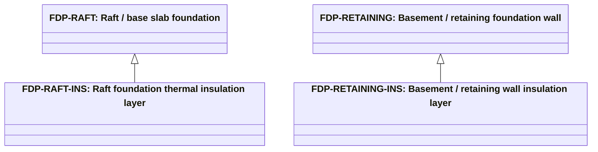

# Abstract foundation products

Source: [`foundation-products.skos.ttl`](sources/foundation-product.ttl)

## Scheme

- **definition (de):** Produkttyp-Klassifikation fuer Unterbau- und Fundamentsysteme unter oder auf der Gebaeudegrundflaeche. Fuer Katalog-, Spezifikations- und Kostenworkflows; mit Trenndeckenrolle L-BAS fuer Bodenplatten, Trenndeckenprodukten fuer tragenden Aufbau und abstrakter Materialklassifikation fuer dominante Substanz kombinieren.
- **definition (en):** Product-type classification for substructure and foundation systems below or at the building footprint. For catalog, specification, and cost workflows; pair with separator slab role L-BAS for raft and base slabs, slab separator products for structural build-up, and abstract material classification for dominant substance.
- **prefLabel (de):** Abstrakte Fundamentprodukte
- **prefLabel (en):** Abstract foundation products
- **title (en):** Abstract foundation products

## Hierarchy

## Concepts

<button type="button" class="pbs-lang-btn" data-lang="de">DE</button>
<button type="button" class="pbs-lang-btn" data-lang="en">EN</button>

<table>
<thead>
<tr>
<th>Notation</th>
<th>Broader</th>
<th class="pbs-lang-col" data-lang="de" data-field="label">Label</th>
<th class="pbs-lang-col" data-lang="de" data-field="definition">Definition</th>
<th class="pbs-lang-col" data-lang="de" data-field="scope_note">Scope note</th>
<th class="pbs-lang-col" data-lang="en" data-field="label">Label</th>
<th class="pbs-lang-col" data-lang="en" data-field="definition">Definition</th>
<th class="pbs-lang-col" data-lang="en" data-field="scope_note">Scope note</th>
</tr>
</thead>
<tbody>
<tr>
<td>FDP-DRAINAGE</td>
<td></td>
<td class="pbs-lang-col" data-lang="de" data-field="label">Fundamententwaesserung und -schutz</td>
<td class="pbs-lang-col" data-lang="de" data-field="definition">Perimeterentwaesserung, Schutzschicht, Filterschicht oder Geocomposite um Fundamente und Kellerhuellen.</td>
<td class="pbs-lang-col" data-lang="de" data-field="scope_note"></td>
<td class="pbs-lang-col" data-lang="en" data-field="label">Foundation drainage and protection</td>
<td class="pbs-lang-col" data-lang="en" data-field="definition">Perimeter drainage, protection board, filter layer, or geocomposite around foundations and basement envelopes.</td>
<td class="pbs-lang-col" data-lang="en" data-field="scope_note"></td>
</tr>
<tr>
<td>FDP-MICRO-PILE</td>
<td></td>
<td class="pbs-lang-col" data-lang="de" data-field="label">Mikropfahl / Bodenverbesserung</td>
<td class="pbs-lang-col" data-lang="de" data-field="definition">Kleindurchmesser-Mikropfahl-, Injektions- oder Bodenverbesserungssystem fuer beengte Lagen oder Unterfangungen.</td>
<td class="pbs-lang-col" data-lang="de" data-field="scope_note"></td>
<td class="pbs-lang-col" data-lang="en" data-field="label">Micropile / ground improvement</td>
<td class="pbs-lang-col" data-lang="en" data-field="definition">Small-diameter micropile, injection, or ground-improvement foundation system for constrained sites or underpinning.</td>
<td class="pbs-lang-col" data-lang="en" data-field="scope_note"></td>
</tr>
<tr>
<td>FDP-OTH</td>
<td></td>
<td class="pbs-lang-col" data-lang="de" data-field="label">Sonstiges / unbekanntes Fundament</td>
<td class="pbs-lang-col" data-lang="de" data-field="definition">Fundamentprodukt nicht klassifiziert oder noch unbekannt.</td>
<td class="pbs-lang-col" data-lang="de" data-field="scope_note">Fallback fuer fruehe Entwurfsstufen oder fehlende Daten.</td>
<td class="pbs-lang-col" data-lang="en" data-field="label">Other / unknown foundation</td>
<td class="pbs-lang-col" data-lang="en" data-field="definition">Foundation product not classified or not yet known.</td>
<td class="pbs-lang-col" data-lang="en" data-field="scope_note">Fallback for early design stages or missing data.</td>
</tr>
<tr>
<td>FDP-PAD</td>
<td></td>
<td class="pbs-lang-col" data-lang="de" data-field="label">Einzelfundament / Fundamentplatte</td>
<td class="pbs-lang-col" data-lang="de" data-field="definition">Isoliertes Einzel-, Streifen- oder Stuetzenfundament fuer eine Einzelstuetze oder konzentrierte Last.</td>
<td class="pbs-lang-col" data-lang="de" data-field="scope_note"></td>
<td class="pbs-lang-col" data-lang="en" data-field="label">Pad / isolated footing</td>
<td class="pbs-lang-col" data-lang="en" data-field="definition">Isolated pad, spread, or column footing supporting a single column or concentrated load point.</td>
<td class="pbs-lang-col" data-lang="en" data-field="scope_note"></td>
</tr>
<tr>
<td>FDP-PILE</td>
<td></td>
<td class="pbs-lang-col" data-lang="de" data-field="label">Pfahlgruendung</td>
<td class="pbs-lang-col" data-lang="de" data-field="definition">Tiefgruendung mit rammbaren, gebohrten oder ortbetonierten Pfaehlen und Pfahlkopf- oder Gründungsbalkenanschluss.</td>
<td class="pbs-lang-col" data-lang="de" data-field="scope_note"></td>
<td class="pbs-lang-col" data-lang="en" data-field="label">Driven / bored pile foundation</td>
<td class="pbs-lang-col" data-lang="en" data-field="definition">Deep foundation system using driven, drilled, or cast-in-place piles with pile cap or ground beam connection.</td>
<td class="pbs-lang-col" data-lang="en" data-field="scope_note"></td>
</tr>
<tr>
<td>FDP-RAFT</td>
<td></td>
<td class="pbs-lang-col" data-lang="de" data-field="label">Platten- / Bodenplattenfundament</td>
<td class="pbs-lang-col" data-lang="de" data-field="definition">Durchgehende Platten- oder Bodenplattengruendung zur Lastabtragung ins Erdreich, einschliesslich Kellerbodenplatten als Fundamentplatte.</td>
<td class="pbs-lang-col" data-lang="de" data-field="scope_note">Mit SeparatorSlab-Rolle L-BAS und Trenndeckenprodukt (SSP-*) fuer Tragsystem kombinieren; dieses Konzept kennzeichnet die Fundamentproduktrolle.</td>
<td class="pbs-lang-col" data-lang="en" data-field="label">Raft / base slab foundation</td>
<td class="pbs-lang-col" data-lang="en" data-field="definition">Continuous raft or base slab foundation transferring building loads to the ground, including basement floor slabs acting as foundation plates.</td>
<td class="pbs-lang-col" data-lang="en" data-field="scope_note">Pair with SeparatorSlab role L-BAS and slab separator product (SSP-*) for structural system; this concept tags the foundation product role.</td>
</tr>
<tr>
<td>FDP-RAFT-INS</td>
<td>FDP-RAFT</td>
<td class="pbs-lang-col" data-lang="de" data-field="label">Plattenfundament Waermedaemmschicht</td>
<td class="pbs-lang-col" data-lang="de" data-field="definition">Unterplatten- oder Plattenfundament-Waermedaemmplatten-Schicht.</td>
<td class="pbs-lang-col" data-lang="de" data-field="scope_note">LCA-Schichtkomponente von FDP-RAFT. Fuer Oekobilanz-Zerlegung und CO2-Berechnung; keine eigenstaendige Fundamentprodukt-Klassifikation.</td>
<td class="pbs-lang-col" data-lang="en" data-field="label">Raft foundation thermal insulation layer</td>
<td class="pbs-lang-col" data-lang="en" data-field="definition">Under-slab or raft thermal insulation board layer of a raft or base slab foundation system.</td>
<td class="pbs-lang-col" data-lang="en" data-field="scope_note">LCA layer component of FDP-RAFT. Used for ecobilans decomposition and carbon calculation; not a standalone foundation product classification.</td>
</tr>
<tr>
<td>FDP-RETAINING</td>
<td></td>
<td class="pbs-lang-col" data-lang="de" data-field="label">Keller- / Stuetzwandfundament</td>
<td class="pbs-lang-col" data-lang="de" data-field="definition">Fundamentwand, Kellerschacht oder Stuetzkonstruktion als Teil des Unterbaus, einschliesslich eingebetteter Kellerumfassungswaende.</td>
<td class="pbs-lang-col" data-lang="de" data-field="scope_note">Oft mit Trennwandrolle W-BLG und Wandtrennelementprodukt (SWP-*) kombiniert; dieses Konzept kennzeichnet den Fundamentsystem-Produkttyp.</td>
<td class="pbs-lang-col" data-lang="en" data-field="label">Basement / retaining foundation wall</td>
<td class="pbs-lang-col" data-lang="en" data-field="definition">Foundation wall, basement box, or retaining structure integrated with the substructure, including embedded perimeter walls below grade.</td>
<td class="pbs-lang-col" data-lang="en" data-field="scope_note">Often paired with wall separator role W-BLG and wall separator product (SWP-*); this concept tags the foundation-system product type.</td>
</tr>
<tr>
<td>FDP-RETAINING-INS</td>
<td>FDP-RETAINING</td>
<td class="pbs-lang-col" data-lang="de" data-field="label">Keller- / Stuetzwand Daemmschicht</td>
<td class="pbs-lang-col" data-lang="de" data-field="definition">Perimeter- oder Kellerwand-Waermedaemmschicht eines Keller- / Stuetzwandfundaments.</td>
<td class="pbs-lang-col" data-lang="de" data-field="scope_note">LCA-Schichtkomponente von FDP-RETAINING. Fuer Oekobilanz-Zerlegung und CO2-Berechnung; keine eigenstaendige Fundamentprodukt-Klassifikation.</td>
<td class="pbs-lang-col" data-lang="en" data-field="label">Basement / retaining wall insulation layer</td>
<td class="pbs-lang-col" data-lang="en" data-field="definition">Perimeter or basement wall thermal insulation layer of a retaining foundation system.</td>
<td class="pbs-lang-col" data-lang="en" data-field="scope_note">LCA layer component of FDP-RETAINING. Used for ecobilans decomposition and carbon calculation; not a standalone foundation product classification.</td>
</tr>
<tr>
<td>FDP-STRIP</td>
<td></td>
<td class="pbs-lang-col" data-lang="de" data-field="label">Streifenfundament</td>
<td class="pbs-lang-col" data-lang="de" data-field="definition">Durchgehendes Streifen- oder Wandfundament unter tragenden Waenden oder strukturellen Linien.</td>
<td class="pbs-lang-col" data-lang="de" data-field="scope_note"></td>
<td class="pbs-lang-col" data-lang="en" data-field="label">Strip footing foundation</td>
<td class="pbs-lang-col" data-lang="en" data-field="definition">Continuous strip or wall footing beneath load-bearing walls or structural lines.</td>
<td class="pbs-lang-col" data-lang="en" data-field="scope_note"></td>
</tr>
<tr>
<td>FDP-WATERPROOF</td>
<td></td>
<td class="pbs-lang-col" data-lang="de" data-field="label">Fundament- / Kellerabdichtung</td>
<td class="pbs-lang-col" data-lang="de" data-field="definition">Unterirdische Abdichtung, Weisswanne oder Tankingsystem auf Fundamentplatten und Kellerwaenden.</td>
<td class="pbs-lang-col" data-lang="de" data-field="scope_note"></td>
<td class="pbs-lang-col" data-lang="en" data-field="label">Foundation waterproofing / tanking</td>
<td class="pbs-lang-col" data-lang="en" data-field="definition">Below-grade waterproofing, tanking, or white-tank system on foundation slabs and basement walls.</td>
<td class="pbs-lang-col" data-lang="en" data-field="scope_note"></td>
</tr>
</tbody>
</table>

