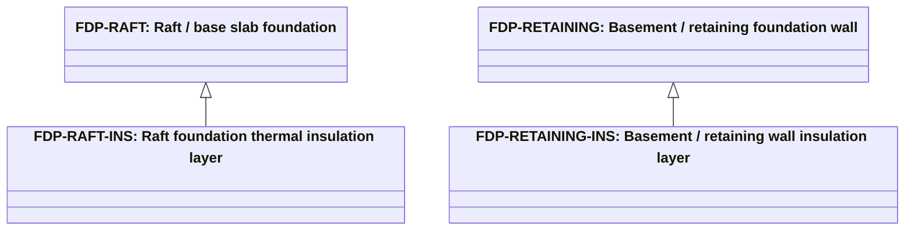

# Abstract foundation products

Source: [`foundation-products.skos.ttl`](sources/foundation-product.ttl)

## Scheme

- **definition (de):** Produkttyp-Klassifikation fuer Unterbau- und Fundamentsysteme unter oder auf der Gebaeudegrundflaeche. Fuer Katalog-, Spezifikations- und Kostenworkflows; mit Trenndeckenrolle L-BAS fuer Bodenplatten, Trenndeckenprodukten fuer tragenden Aufbau und abstrakter Materialklassifikation fuer dominante Substanz kombinieren.
- **definition (en):** Product-type classification for substructure and foundation systems below or at the building footprint. For catalog, specification, and cost workflows; pair with separator slab role L-BAS for raft and base slabs, slab separator products for structural build-up, and abstract material classification for dominant substance.
- **prefLabel (de):** Abstrakte Fundamentprodukte
- **prefLabel (en):** Abstract foundation products
- **title (en):** Abstract foundation products

## Hierarchy

```mermaid
classDiagram
direction TB
class n_FDP_RAFT["FDP-RAFT: Raft / base slab foundation"]
class n_FDP_RAFT_INS["FDP-RAFT-INS: Raft foundation thermal insulation layer"]
class n_FDP_RETAINING["FDP-RETAINING: Basement / retaining foundation wall"]
class n_FDP_RETAINING_INS["FDP-RETAINING-INS: Basement / retaining wall insulation layer"]
n_FDP_RAFT <|-- n_FDP_RAFT_INS
n_FDP_RETAINING <|-- n_FDP_RETAINING_INS
```

## Concepts

<button type="button" class="pbs-lang-btn" data-lang="de">DE</button>
<button type="button" class="pbs-lang-btn" data-lang="en">EN</button>

<table>
<thead>
<tr>
<th>Notation</th>
<th>Broader</th>
<th class="pbs-lang-col" data-lang="de" data-field="label">Label</th>
<th class="pbs-lang-col" data-lang="de" data-field="definition">Definition</th>
<th class="pbs-lang-col" data-lang="de" data-field="description">Description</th>
<th class="pbs-lang-col" data-lang="de" data-field="scope_note">Scope note</th>
<th class="pbs-lang-col" data-lang="en" data-field="label">Label</th>
<th class="pbs-lang-col" data-lang="en" data-field="definition">Definition</th>
<th class="pbs-lang-col" data-lang="en" data-field="description">Description</th>
<th class="pbs-lang-col" data-lang="en" data-field="scope_note">Scope note</th>
</tr>
</thead>
<tbody>
<tr>
<td>FDP-DRAINAGE</td>
<td></td>
<td class="pbs-lang-col" data-lang="de" data-field="label">Fundamententwaesserung und -schutz</td>
<td class="pbs-lang-col" data-lang="de" data-field="definition">Perimeterentwaesserung, Schutzschicht, Filterschicht oder Geocomposite um Fundamente und Kellerhuellen.</td>
<td class="pbs-lang-col" data-lang="de" data-field="description">System, das Wasser aus dem Boden rund um das Fundament sammelt und ableitet und die Abdichtung vor mechanischer Beschädigung schützt. Besteht aus Sickerleitungen in filterstabiler Kiesbettung, Schutz- und Filterschichten oder Dränmatten an der Wand sowie Kontroll- und Ableitungsstellen. Geeignet für Baugründe mit zurückgehaltenem Sickerwasser, bei denen Druck auf die Abdichtung vermieden werden soll.</td>
<td class="pbs-lang-col" data-lang="de" data-field="scope_note"></td>
<td class="pbs-lang-col" data-lang="en" data-field="label">Foundation drainage and protection</td>
<td class="pbs-lang-col" data-lang="en" data-field="definition">Perimeter drainage, protection board, filter layer, or geocomposite around foundations and basement envelopes.</td>
<td class="pbs-lang-col" data-lang="en" data-field="description">System that collects and leads away water from the ground around the foundation and protects the sealing from mechanical damage. Comprises perforated drain pipes in a filter-stable gravel bed, protection and filter layers or drainage composites on the wall, and inspection and discharge points. Suitable for sites with retained seeping water where pressure on the sealing is to be avoided.</td>
<td class="pbs-lang-col" data-lang="en" data-field="scope_note"></td>
</tr>
<tr>
<td>FDP-MICRO-PILE</td>
<td></td>
<td class="pbs-lang-col" data-lang="de" data-field="label">Mikropfahl / Bodenverbesserung</td>
<td class="pbs-lang-col" data-lang="de" data-field="definition">Kleindurchmesser-Mikropfahl-, Injektions- oder Bodenverbesserungssystem fuer beengte Lagen oder Unterfangungen.</td>
<td class="pbs-lang-col" data-lang="de" data-field="description">Kleindurchmesser-Pfahl oder Bodenbehandlung, die die Tragfähigkeit des Baugrunds erhöht oder Lasten auf beengten Baustellen abträgt. Mit kleinen Bohrgeräten über verpresste Stahltragglieder, Injektionen oder Bodenaustausch eingebracht, bei Bedarf auch aus bestehenden Gebäuden heraus. Geeignet für Unterfangungen, nachträgliche Verstärkungen und enge innerstädtische Lagen, in denen konventionelle Pfahlgeräte nicht einsetzbar sind.</td>
<td class="pbs-lang-col" data-lang="de" data-field="scope_note"></td>
<td class="pbs-lang-col" data-lang="en" data-field="label">Micropile / ground improvement</td>
<td class="pbs-lang-col" data-lang="en" data-field="definition">Small-diameter micropile, injection, or ground-improvement foundation system for constrained sites or underpinning.</td>
<td class="pbs-lang-col" data-lang="en" data-field="description">Small-diameter pile or soil treatment that raises the bearing capacity of the ground or transfers loads on sites with restricted access. Installed with small drilling rigs using grouted steel tendons, injections, or soil replacement, where necessary working from inside existing buildings. Suitable for underpinning, retrofit strengthening, and tight urban sites where conventional piling equipment cannot operate.</td>
<td class="pbs-lang-col" data-lang="en" data-field="scope_note"></td>
</tr>
<tr>
<td>FDP-OTH</td>
<td></td>
<td class="pbs-lang-col" data-lang="de" data-field="label">Sonstiges / unbekanntes Fundament</td>
<td class="pbs-lang-col" data-lang="de" data-field="definition">Fundamentprodukt nicht klassifiziert oder noch unbekannt.</td>
<td class="pbs-lang-col" data-lang="de" data-field="description">Platzhalter für Fundamentprodukte, deren System zum Zeitpunkt der Ausschreibung noch nicht festgelegt oder nicht klassifiziert ist. Funktionale Anforderungen wie Tragfähigkeit, Setzungsbegrenzung, Grundwasserverhältnisse und Abdichtung sind gesondert zu beschreiben. Nur in frühen Planungsphasen oder bei unvollständiger Datenlage verwenden.</td>
<td class="pbs-lang-col" data-lang="de" data-field="scope_note">Fallback fuer fruehe Entwurfsstufen oder fehlende Daten.</td>
<td class="pbs-lang-col" data-lang="en" data-field="label">Other / unknown foundation</td>
<td class="pbs-lang-col" data-lang="en" data-field="definition">Foundation product not classified or not yet known.</td>
<td class="pbs-lang-col" data-lang="en" data-field="description">Placeholder for foundation products whose system is not yet fixed or not classified at tender stage. Functional requirements such as bearing capacity, settlement limits, groundwater conditions, and sealing must be stated separately. Use only in early design stages or where data is incomplete.</td>
<td class="pbs-lang-col" data-lang="en" data-field="scope_note">Fallback for early design stages or missing data.</td>
</tr>
<tr>
<td>FDP-PAD</td>
<td></td>
<td class="pbs-lang-col" data-lang="de" data-field="label">Einzelfundament / Fundamentplatte</td>
<td class="pbs-lang-col" data-lang="de" data-field="definition">Isoliertes Einzel-, Streifen- oder Stuetzenfundament fuer eine Einzelstuetze oder konzentrierte Last.</td>
<td class="pbs-lang-col" data-lang="de" data-field="description">Einzelfundament unter einer Stütze oder einem konzentrierten Lastpunkt, das die Punktlast auf eine ausreichende Aufstandsfläche verteilt. Als Stahlbetonblock geschalt und vor Ort betoniert, oft abgestuft oder abgeschrägt, mit Ankern oder Anschlussbewehrung für den Stützenanschluss. Geeignet für Skelett- und Hallenbauten auf tragfähigem Baugrund mit punktueller Lasteinleitung.</td>
<td class="pbs-lang-col" data-lang="de" data-field="scope_note"></td>
<td class="pbs-lang-col" data-lang="en" data-field="label">Pad / isolated footing</td>
<td class="pbs-lang-col" data-lang="en" data-field="definition">Isolated pad, spread, or column footing supporting a single column or concentrated load point.</td>
<td class="pbs-lang-col" data-lang="en" data-field="description">Isolated footing beneath a single column or concentrated load point that spreads the point load onto a sufficient bearing area. Formed and cast in place as a reinforced concrete block, often stepped or tapered, with anchors or starter bars for the column connection. Suitable for skeleton and hall structures on load-bearing ground where loads arrive at discrete points.</td>
<td class="pbs-lang-col" data-lang="en" data-field="scope_note"></td>
</tr>
<tr>
<td>FDP-PILE</td>
<td></td>
<td class="pbs-lang-col" data-lang="de" data-field="label">Pfahlgruendung</td>
<td class="pbs-lang-col" data-lang="de" data-field="definition">Tiefgruendung mit rammbaren, gebohrten oder ortbetonierten Pfaehlen und Pfahlkopf- oder Gründungsbalkenanschluss.</td>
<td class="pbs-lang-col" data-lang="de" data-field="description">Tiefgründung, die Gebäudelasten durch gering tragfähige obere Bodenschichten über Mantelreibung und Spitzendruck in tragfähige Schichten abträgt. Die Pfähle werden als Fertigteile gerammt oder gebohrt und vor Ort betoniert, anschliessend über Pfahlkopfplatten oder Fundamentbalken zum Anschluss an das Tragwerk verbunden. Geeignet für weiche, aufgefüllte oder grundwasserreiche Baugründe, bei denen Flachgründungen die geforderte Tragfähigkeit oder Setzungsbegrenzung nicht erreichen.</td>
<td class="pbs-lang-col" data-lang="de" data-field="scope_note"></td>
<td class="pbs-lang-col" data-lang="en" data-field="label">Driven / bored pile foundation</td>
<td class="pbs-lang-col" data-lang="en" data-field="definition">Deep foundation system using driven, drilled, or cast-in-place piles with pile cap or ground beam connection.</td>
<td class="pbs-lang-col" data-lang="en" data-field="description">Deep foundation that carries building loads through weak upper soil layers into load-bearing strata by skin friction and end bearing. Piles are driven as precast units or bored and concreted in place, then tied together by pile caps or ground beams that receive the structure above. Suitable for soft, filled, or high-groundwater sites where shallow foundations cannot achieve the required bearing capacity or settlement limits.</td>
<td class="pbs-lang-col" data-lang="en" data-field="scope_note"></td>
</tr>
<tr>
<td>FDP-RAFT</td>
<td></td>
<td class="pbs-lang-col" data-lang="de" data-field="label">Platten- / Bodenplattenfundament</td>
<td class="pbs-lang-col" data-lang="de" data-field="definition">Durchgehende Platten- oder Bodenplattengruendung zur Lastabtragung ins Erdreich, einschliesslich Kellerbodenplatten als Fundamentplatte.</td>
<td class="pbs-lang-col" data-lang="de" data-field="description">Durchgehende tragende Platte unter der Gebäudegrundfläche, die Stützen-, Wand- und Deckenlasten gleichmässig in den Baugrund verteilt. Vor Ort auf einer Sauberkeitsschicht mit darunterliegender Dämmung und Abdichtung betoniert, vollflächig bewehrt und unter konzentrierten Lasten örtlich verstärkt. Geeignet für gering tragfähigen oder ungleichmässigen Baugrund und für Untergeschosse, in denen die Platte zugleich die unterste Geschossfläche bildet.</td>
<td class="pbs-lang-col" data-lang="de" data-field="scope_note">Mit SeparatorSlab-Rolle L-BAS und Trenndeckenprodukt (SSP-*) fuer Tragsystem kombinieren; dieses Konzept kennzeichnet die Fundamentproduktrolle.</td>
<td class="pbs-lang-col" data-lang="en" data-field="label">Raft / base slab foundation</td>
<td class="pbs-lang-col" data-lang="en" data-field="definition">Continuous raft or base slab foundation transferring building loads to the ground, including basement floor slabs acting as foundation plates.</td>
<td class="pbs-lang-col" data-lang="en" data-field="description">Continuous load-bearing plate under the building footprint that spreads column, wall, and slab loads evenly into the subsoil. Cast in place on a levelling layer with insulation and sealing beneath, reinforced across the full area and locally thickened under concentrated loads. Suitable for weak or uneven ground and for basements where the plate also forms the lowest floor surface.</td>
<td class="pbs-lang-col" data-lang="en" data-field="scope_note">Pair with SeparatorSlab role L-BAS and slab separator product (SSP-*) for structural system; this concept tags the foundation product role.</td>
</tr>
<tr>
<td>FDP-RAFT-INS</td>
<td>FDP-RAFT</td>
<td class="pbs-lang-col" data-lang="de" data-field="label">Plattenfundament Waermedaemmschicht</td>
<td class="pbs-lang-col" data-lang="de" data-field="definition">Unterplatten- oder Plattenfundament-Waermedaemmplatten-Schicht.</td>
<td class="pbs-lang-col" data-lang="de" data-field="description">Wärmedämmschicht unter oder auf der Bodenplatte, die den Wärmeabfluss ins Erdreich begrenzt und die Oberflächentemperatur der Platte behaglich hält. Als druckfeste Platten dicht gestossen und versetzt auf den vorbereiteten Untergrund verlegt, bevor Bewehrung und Beton folgen. Wird separat ausgewiesen, wenn die Dämmung des Plattenfundaments eigenständig ermittelt oder bewertet wird.</td>
<td class="pbs-lang-col" data-lang="de" data-field="scope_note">LCA-Schichtkomponente von FDP-RAFT. Fuer Oekobilanz-Zerlegung und CO2-Berechnung; keine eigenstaendige Fundamentprodukt-Klassifikation.</td>
<td class="pbs-lang-col" data-lang="en" data-field="label">Raft foundation thermal insulation layer</td>
<td class="pbs-lang-col" data-lang="en" data-field="definition">Under-slab or raft thermal insulation board layer of a raft or base slab foundation system.</td>
<td class="pbs-lang-col" data-lang="en" data-field="description">Thermal insulation layer beneath or above the foundation plate that limits heat flow into the ground and keeps the slab surface at a comfortable temperature. Laid as pressure-resistant boards with tight, staggered joints on the prepared subbase before reinforcement and concrete follow. Accounted separately where the insulation of the foundation plate is quantified or assessed on its own.</td>
<td class="pbs-lang-col" data-lang="en" data-field="scope_note">LCA layer component of FDP-RAFT. Used for ecobilans decomposition and carbon calculation; not a standalone foundation product classification.</td>
</tr>
<tr>
<td>FDP-RETAINING</td>
<td></td>
<td class="pbs-lang-col" data-lang="de" data-field="label">Keller- / Stuetzwandfundament</td>
<td class="pbs-lang-col" data-lang="de" data-field="definition">Fundamentwand, Kellerschacht oder Stuetzkonstruktion als Teil des Unterbaus, einschliesslich eingebetteter Kellerumfassungswaende.</td>
<td class="pbs-lang-col" data-lang="de" data-field="description">Erdberührte Wand, die vertikale Gebäudelasten abträgt und gleichzeitig Erd- und Wasserdruck aus dem umgebenden Baugrund aufnimmt. Als Ortbetonwand, Fertigteilwand oder verbleibende Baugrubenwand erstellt und erdseitig mit Abdichtung, Dämmung und Entwässerung ergänzt. Geeignet für Kellerumfassungen, Stützbauwerke bei Geländesprüngen und erdberührte Teile der Gebäudehülle.</td>
<td class="pbs-lang-col" data-lang="de" data-field="scope_note">Oft mit Trennwandrolle W-BLG und Wandtrennelementprodukt (SWP-*) kombiniert; dieses Konzept kennzeichnet den Fundamentsystem-Produkttyp.</td>
<td class="pbs-lang-col" data-lang="en" data-field="label">Basement / retaining foundation wall</td>
<td class="pbs-lang-col" data-lang="en" data-field="definition">Foundation wall, basement box, or retaining structure integrated with the substructure, including embedded perimeter walls below grade.</td>
<td class="pbs-lang-col" data-lang="en" data-field="description">Below-grade wall that carries vertical building loads and at the same time resists earth and water pressure from the surrounding ground. Built as in-situ reinforced concrete, prefabricated elements, or an excavation-support wall left in place, completed on the earth side with sealing, insulation, and drainage. Suitable for basement enclosures, retaining structures at level changes, and buried parts of the building envelope.</td>
<td class="pbs-lang-col" data-lang="en" data-field="scope_note">Often paired with wall separator role W-BLG and wall separator product (SWP-*); this concept tags the foundation-system product type.</td>
</tr>
<tr>
<td>FDP-RETAINING-INS</td>
<td>FDP-RETAINING</td>
<td class="pbs-lang-col" data-lang="de" data-field="label">Keller- / Stuetzwand Daemmschicht</td>
<td class="pbs-lang-col" data-lang="de" data-field="definition">Perimeter- oder Kellerwand-Waermedaemmschicht eines Keller- / Stuetzwandfundaments.</td>
<td class="pbs-lang-col" data-lang="de" data-field="description">Wärmedämmschicht auf der Erdseite einer Keller- oder Stützwand, die den Wärmeverlust begrenzt und die darunterliegende Abdichtung schützt. Als feuchtebeständige, druckfeste Platten dicht gestossen auf die abgedichtete Wand aufgebracht und durch die Hinterfüllung gehalten. Wird separat ausgewiesen, wenn die Perimeterdämmung eigenständig ermittelt oder bewertet wird.</td>
<td class="pbs-lang-col" data-lang="de" data-field="scope_note">LCA-Schichtkomponente von FDP-RETAINING. Fuer Oekobilanz-Zerlegung und CO2-Berechnung; keine eigenstaendige Fundamentprodukt-Klassifikation.</td>
<td class="pbs-lang-col" data-lang="en" data-field="label">Basement / retaining wall insulation layer</td>
<td class="pbs-lang-col" data-lang="en" data-field="definition">Perimeter or basement wall thermal insulation layer of a retaining foundation system.</td>
<td class="pbs-lang-col" data-lang="en" data-field="description">Thermal insulation layer on the earth side of a basement or retaining wall that limits heat loss and protects the sealing beneath it. Fixed as moisture-resistant, pressure-resistant boards with tight joints onto the sealed wall and held in place by the backfill. Accounted separately where the perimeter insulation is quantified or assessed on its own.</td>
<td class="pbs-lang-col" data-lang="en" data-field="scope_note">LCA layer component of FDP-RETAINING. Used for ecobilans decomposition and carbon calculation; not a standalone foundation product classification.</td>
</tr>
<tr>
<td>FDP-STRIP</td>
<td></td>
<td class="pbs-lang-col" data-lang="de" data-field="label">Streifenfundament</td>
<td class="pbs-lang-col" data-lang="de" data-field="definition">Durchgehendes Streifen- oder Wandfundament unter tragenden Waenden oder strukturellen Linien.</td>
<td class="pbs-lang-col" data-lang="de" data-field="description">Durchgehendes Fundament unter tragenden Wänden oder Stützenreihen, das Linienlasten auf eine breitere Aufstandsfläche im Boden verteilt. Als Graben bis in frostfreie Tiefe ausgehoben und in Ortbeton bewehrt oder unbewehrt erstellt, mit Anschlussbewehrung für die aufgehende Wand. Geeignet für tragfähigen Baugrund und wandorientierte Tragwerke, bei denen keine durchgehende Bodenplatte erforderlich ist.</td>
<td class="pbs-lang-col" data-lang="de" data-field="scope_note"></td>
<td class="pbs-lang-col" data-lang="en" data-field="label">Strip footing foundation</td>
<td class="pbs-lang-col" data-lang="en" data-field="definition">Continuous strip or wall footing beneath load-bearing walls or structural lines.</td>
<td class="pbs-lang-col" data-lang="en" data-field="description">Continuous footing running below load-bearing walls or lines of columns, spreading linear loads onto a wider bearing area in the soil. Excavated as a trench down to frost-free depth and cast in place in reinforced or plain concrete, with starter bars for the wall above. Suitable for firm ground and wall-dominated structures where a full raft is not required.</td>
<td class="pbs-lang-col" data-lang="en" data-field="scope_note"></td>
</tr>
<tr>
<td>FDP-WATERPROOF</td>
<td></td>
<td class="pbs-lang-col" data-lang="de" data-field="label">Fundament- / Kellerabdichtung</td>
<td class="pbs-lang-col" data-lang="de" data-field="definition">Unterirdische Abdichtung, Weisswanne oder Tankingsystem auf Fundamentplatten und Kellerwaenden.</td>
<td class="pbs-lang-col" data-lang="de" data-field="description">Abdichtungssystem, das Bodenfeuchte, Sickerwasser und drückendes Wasser von den erdberührten Gebäudeteilen fernhält. Entweder als verklebte oder lose verlegte Abdichtungsbahn auf Platten- und Wandflächen oder als wasserundurchlässige Betonkonstruktion mit abgedichteten Fugen und Durchdringungen ausgeführt. Geeignet für Untergeschosse, Tiefgaragen und alle erdberührten Umschliessungen mit Anforderung an trockene Innenräume.</td>
<td class="pbs-lang-col" data-lang="de" data-field="scope_note"></td>
<td class="pbs-lang-col" data-lang="en" data-field="label">Foundation waterproofing / tanking</td>
<td class="pbs-lang-col" data-lang="en" data-field="definition">Below-grade waterproofing, tanking, or white-tank system on foundation slabs and basement walls.</td>
<td class="pbs-lang-col" data-lang="en" data-field="description">Sealing system that keeps ground moisture, seeping water, and pressing water away from the buried parts of the building. Executed either as a bonded or loose-laid membrane on slab and wall surfaces or as watertight concrete construction with sealed joints and penetrations. Suitable for basements, underground garages, and all buried enclosures where a dry interior is required.</td>
<td class="pbs-lang-col" data-lang="en" data-field="scope_note"></td>
</tr>
</tbody>
</table>

