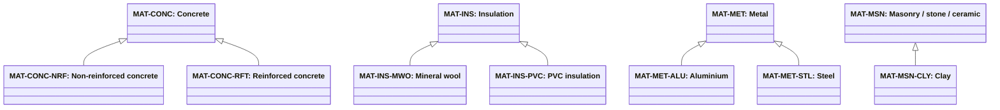

# Abstract material classification

Source: [`material-classification.skos.ttl`](sources/material.ttl)

## Scheme

- **definition (de):** Substanzorientierte Klassifikation des dominanten Materials fuer grobe Nachhaltigkeits- und Graue-Energie-Berechnungen.
- **definition (en):** Substance-centric dominant-material classification for rough sustainability and embodied-carbon workflows.
- **prefLabel (de):** Abstrakte Materialklassifikation
- **prefLabel (en):** Abstract Material Classification
- **title (en):** Abstract Material Classification

## Hierarchy

## Concepts

<button type="button" class="pbs-lang-btn" data-lang="de">DE</button>
<button type="button" class="pbs-lang-btn" data-lang="en">EN</button>

<table>
<thead>
<tr>
<th>Notation</th>
<th>Broader</th>
<th class="pbs-lang-col" data-lang="de" data-field="label">Label</th>
<th class="pbs-lang-col" data-lang="de" data-field="definition">Definition</th>
<th class="pbs-lang-col" data-lang="de" data-field="scope_note">Scope note</th>
<th class="pbs-lang-col" data-lang="en" data-field="label">Label</th>
<th class="pbs-lang-col" data-lang="en" data-field="definition">Definition</th>
<th class="pbs-lang-col" data-lang="en" data-field="scope_note">Scope note</th>
</tr>
</thead>
<tbody>
<tr>
<td>MAT-ASP</td>
<td></td>
<td class="pbs-lang-col" data-lang="de" data-field="label">Asphalt</td>
<td class="pbs-lang-col" data-lang="de" data-field="definition">Dominantes Material ist Asphalt oder bitumenhaltiger Bindemittelgemisch.</td>
<td class="pbs-lang-col" data-lang="de" data-field="scope_note">Einschliesslich Strassenbelaege, Dichtungsbahnen und Abdichtungen, wenn Asphalt dominiert.</td>
<td class="pbs-lang-col" data-lang="en" data-field="label">Asphalt</td>
<td class="pbs-lang-col" data-lang="en" data-field="definition">Dominant material is asphalt or bituminous binder mix.</td>
<td class="pbs-lang-col" data-lang="en" data-field="scope_note">Including road surfacing, roofing membranes, and waterproofing where asphalt dominates.</td>
</tr>
<tr>
<td>MAT-CMP</td>
<td></td>
<td class="pbs-lang-col" data-lang="de" data-field="label">Verbund / Mehrstoff</td>
<td class="pbs-lang-col" data-lang="de" data-field="definition">Dominantes Material ist ein Verbund oder eine Kombination, bei der keine einzelne Substanz klar dominiert.</td>
<td class="pbs-lang-col" data-lang="de" data-field="scope_note">Verwenden, wenn geschichtete oder hybride Baugruppen nicht auf eine Materialfamilie reduziert werden koennen.</td>
<td class="pbs-lang-col" data-lang="en" data-field="label">Composite / multi-material</td>
<td class="pbs-lang-col" data-lang="en" data-field="definition">Dominant material is a composite or combination where no single substance clearly dominates.</td>
<td class="pbs-lang-col" data-lang="en" data-field="scope_note">Use when layered or hybrid assemblies cannot be reduced to one material family.</td>
</tr>
<tr>
<td>MAT-CONC</td>
<td></td>
<td class="pbs-lang-col" data-lang="de" data-field="label">Beton</td>
<td class="pbs-lang-col" data-lang="de" data-field="definition">Dominantes Material ist Beton oder zementgebundene gegossene oder vorgefertigte mineralische Masse.</td>
<td class="pbs-lang-col" data-lang="de" data-field="scope_note">Kennzeichnet die dominante Substanz eines Elements oder einer Schicht, nicht den Elementtyp. Fuer Fenster oder Baugruppen separate Komponentenklassifikation verwenden.</td>
<td class="pbs-lang-col" data-lang="en" data-field="label">Concrete</td>
<td class="pbs-lang-col" data-lang="en" data-field="definition">Dominant material is concrete or cement-based cast or precast mineral mass.</td>
<td class="pbs-lang-col" data-lang="en" data-field="scope_note">Tags dominant substance of an element or layer, not element type. For windows or assemblies, use a separate component classification.</td>
</tr>
<tr>
<td>MAT-CONC-NRF</td>
<td>MAT-CONC</td>
<td class="pbs-lang-col" data-lang="de" data-field="label">Unbewehrter Beton</td>
<td class="pbs-lang-col" data-lang="de" data-field="definition">Dominantes Material ist unbewehrter Beton ohne strukturelle Stahlbewehrung.</td>
<td class="pbs-lang-col" data-lang="de" data-field="scope_note"></td>
<td class="pbs-lang-col" data-lang="en" data-field="label">Non-reinforced concrete</td>
<td class="pbs-lang-col" data-lang="en" data-field="definition">Dominant material is plain concrete without structural steel reinforcement.</td>
<td class="pbs-lang-col" data-lang="en" data-field="scope_note"></td>
</tr>
<tr>
<td>MAT-CONC-RFT</td>
<td>MAT-CONC</td>
<td class="pbs-lang-col" data-lang="de" data-field="label">Stahlbeton</td>
<td class="pbs-lang-col" data-lang="de" data-field="definition">Dominantes Material ist Beton mit eingebetteter Stahlbewehrung.</td>
<td class="pbs-lang-col" data-lang="de" data-field="scope_note"></td>
<td class="pbs-lang-col" data-lang="en" data-field="label">Reinforced concrete</td>
<td class="pbs-lang-col" data-lang="en" data-field="definition">Dominant material is concrete with embedded steel reinforcement.</td>
<td class="pbs-lang-col" data-lang="en" data-field="scope_note"></td>
</tr>
<tr>
<td>MAT-GLS</td>
<td></td>
<td class="pbs-lang-col" data-lang="de" data-field="label">Glas</td>
<td class="pbs-lang-col" data-lang="de" data-field="definition">Dominantes Material ist Glas, einschliesslich Verglasung und Glasfaserprodukte.</td>
<td class="pbs-lang-col" data-lang="de" data-field="scope_note">Fuer Fensterelemente mit Komponentenklassifikation kombinieren; dieser Tag beschreibt nur das Material.</td>
<td class="pbs-lang-col" data-lang="en" data-field="label">Glass</td>
<td class="pbs-lang-col" data-lang="en" data-field="definition">Dominant material is glass, including glazing and glass fibre products.</td>
<td class="pbs-lang-col" data-lang="en" data-field="scope_note">For window elements, combine with a component classification; this tag is the material only.</td>
</tr>
<tr>
<td>MAT-GYP</td>
<td></td>
<td class="pbs-lang-col" data-lang="de" data-field="label">Gipsbasiert</td>
<td class="pbs-lang-col" data-lang="de" data-field="definition">Dominantes Material ist Gipszement, Gipskarton oder aehnliche gipsbasierte Substanz.</td>
<td class="pbs-lang-col" data-lang="de" data-field="scope_note">Erfasst Trockenbauwand als Substanz (Gipskarton), nicht als Trennwandsystemtyp.</td>
<td class="pbs-lang-col" data-lang="en" data-field="label">Gypsum-based</td>
<td class="pbs-lang-col" data-lang="en" data-field="definition">Dominant material is gypsum cement, gypsum board, or similar gypsum-based substance.</td>
<td class="pbs-lang-col" data-lang="en" data-field="scope_note">Covers drywall by substance (gypsum board), not as a partition system type.</td>
</tr>
<tr>
<td>MAT-INS</td>
<td></td>
<td class="pbs-lang-col" data-lang="de" data-field="label">Daemmung</td>
<td class="pbs-lang-col" data-lang="de" data-field="definition">Dominantes Material ist Waerme- oder Schalldaemmung wie Mineralwolle, Glaswolle oder Daemmplatten.</td>
<td class="pbs-lang-col" data-lang="de" data-field="scope_note">Kennzeichnet die dominante Substanz eines Elements oder einer Schicht, nicht den Elementtyp. Kein Hüllen-Produkttyp; kein Ersatz fuer FaCP-*, RCP-* oder FDP-* als primaere classification_code. Verwenden wenn Material neben Subsystem-Eltern bekannt ist, oder als Fruehplanungs-Fallback wenn nur Substanz bekannt ist.</td>
<td class="pbs-lang-col" data-lang="en" data-field="label">Insulation</td>
<td class="pbs-lang-col" data-lang="en" data-field="definition">Dominant material is thermal or acoustic insulation such as mineral wool, glass wool, or foam boards.</td>
<td class="pbs-lang-col" data-lang="en" data-field="scope_note">Tags dominant substance of an element or layer, not element type. Not an envelope product type; not a substitute for FaCP-*, RCP-*, or FDP-* as primary classification_code. Use when material is known alongside a subsystem parent, or as early-design fallback when only substance is known.</td>
</tr>
<tr>
<td>MAT-INS-MWO</td>
<td>MAT-INS</td>
<td class="pbs-lang-col" data-lang="de" data-field="label">Mineralwolle</td>
<td class="pbs-lang-col" data-lang="de" data-field="definition">Dominantes Material ist Mineralwolldaemmung wie Steinwolle oder Glaswolle.</td>
<td class="pbs-lang-col" data-lang="de" data-field="scope_note"></td>
<td class="pbs-lang-col" data-lang="en" data-field="label">Mineral wool</td>
<td class="pbs-lang-col" data-lang="en" data-field="definition">Dominant material is mineral wool insulation such as rock wool or glass wool.</td>
<td class="pbs-lang-col" data-lang="en" data-field="scope_note"></td>
</tr>
<tr>
<td>MAT-INS-PVC</td>
<td>MAT-INS</td>
<td class="pbs-lang-col" data-lang="de" data-field="label">PVC-Daemmung</td>
<td class="pbs-lang-col" data-lang="de" data-field="definition">Dominantes Material ist PVC-basierte Waerme- oder Schalldaemmung.</td>
<td class="pbs-lang-col" data-lang="de" data-field="scope_note"></td>
<td class="pbs-lang-col" data-lang="en" data-field="label">PVC insulation</td>
<td class="pbs-lang-col" data-lang="en" data-field="definition">Dominant material is PVC-based thermal or acoustic insulation.</td>
<td class="pbs-lang-col" data-lang="en" data-field="scope_note"></td>
</tr>
<tr>
<td>MAT-MET</td>
<td></td>
<td class="pbs-lang-col" data-lang="de" data-field="label">Metall</td>
<td class="pbs-lang-col" data-lang="de" data-field="definition">Dominantes Material ist Stahl, Aluminium, Kupfer oder anderes Metall.</td>
<td class="pbs-lang-col" data-lang="de" data-field="scope_note">Kennzeichnet die dominante Substanz eines Elements oder einer Schicht, nicht den Elementtyp.</td>
<td class="pbs-lang-col" data-lang="en" data-field="label">Metal</td>
<td class="pbs-lang-col" data-lang="en" data-field="definition">Dominant material is steel, aluminium, copper, or other metal.</td>
<td class="pbs-lang-col" data-lang="en" data-field="scope_note">Tags dominant substance of an element or layer, not element type.</td>
</tr>
<tr>
<td>MAT-MET-ALU</td>
<td>MAT-MET</td>
<td class="pbs-lang-col" data-lang="de" data-field="label">Aluminium</td>
<td class="pbs-lang-col" data-lang="de" data-field="definition">Dominantes Material ist Aluminium oder Aluminiumlegierung.</td>
<td class="pbs-lang-col" data-lang="de" data-field="scope_note"></td>
<td class="pbs-lang-col" data-lang="en" data-field="label">Aluminium</td>
<td class="pbs-lang-col" data-lang="en" data-field="definition">Dominant material is aluminium or aluminium alloy.</td>
<td class="pbs-lang-col" data-lang="en" data-field="scope_note"></td>
</tr>
<tr>
<td>MAT-MET-STL</td>
<td>MAT-MET</td>
<td class="pbs-lang-col" data-lang="de" data-field="label">Stahl</td>
<td class="pbs-lang-col" data-lang="de" data-field="definition">Dominantes Material ist Stahl oder Stahllegierung.</td>
<td class="pbs-lang-col" data-lang="de" data-field="scope_note"></td>
<td class="pbs-lang-col" data-lang="en" data-field="label">Steel</td>
<td class="pbs-lang-col" data-lang="en" data-field="definition">Dominant material is steel or steel alloy.</td>
<td class="pbs-lang-col" data-lang="en" data-field="scope_note"></td>
</tr>
<tr>
<td>MAT-MSN</td>
<td></td>
<td class="pbs-lang-col" data-lang="de" data-field="label">Mauerwerk / Stein / Keramik</td>
<td class="pbs-lang-col" data-lang="de" data-field="definition">Dominantes Material sind Naturstein, Ziegel, Block, Platte oder keramische Baueinheiten.</td>
<td class="pbs-lang-col" data-lang="de" data-field="scope_note">Kennzeichnet die dominante Substanz eines Elements oder einer Schicht, nicht den Elementtyp.</td>
<td class="pbs-lang-col" data-lang="en" data-field="label">Masonry / stone / ceramic</td>
<td class="pbs-lang-col" data-lang="en" data-field="definition">Dominant material is natural stone, brick, block, tile, or ceramic units.</td>
<td class="pbs-lang-col" data-lang="en" data-field="scope_note">Tags dominant substance of an element or layer, not element type.</td>
</tr>
<tr>
<td>MAT-MSN-CLY</td>
<td>MAT-MSN</td>
<td class="pbs-lang-col" data-lang="de" data-field="label">Ton</td>
<td class="pbs-lang-col" data-lang="de" data-field="definition">Dominantes Material ist Ton, einschliesslich gebrannter Tonprodukte wie Ziegel und Fliesen.</td>
<td class="pbs-lang-col" data-lang="de" data-field="scope_note"></td>
<td class="pbs-lang-col" data-lang="en" data-field="label">Clay</td>
<td class="pbs-lang-col" data-lang="en" data-field="definition">Dominant material is clay, including fired clay products such as brick and tile.</td>
<td class="pbs-lang-col" data-lang="en" data-field="scope_note"></td>
</tr>
<tr>
<td>MAT-OTH</td>
<td></td>
<td class="pbs-lang-col" data-lang="de" data-field="label">Sonstiges / unbekannt</td>
<td class="pbs-lang-col" data-lang="de" data-field="definition">Dominantes Material ist nicht klassifiziert oder noch unbekannt.</td>
<td class="pbs-lang-col" data-lang="de" data-field="scope_note">Fallback fuer fruehe Entwurfsstufen oder fehlende Daten.</td>
<td class="pbs-lang-col" data-lang="en" data-field="label">Other / unknown</td>
<td class="pbs-lang-col" data-lang="en" data-field="definition">Dominant material is not classified or not yet known.</td>
<td class="pbs-lang-col" data-lang="en" data-field="scope_note">Fallback for early design stages or missing data.</td>
</tr>
<tr>
<td>MAT-PLA</td>
<td></td>
<td class="pbs-lang-col" data-lang="de" data-field="label">Kunststoff / Polymer</td>
<td class="pbs-lang-col" data-lang="de" data-field="definition">Dominantes Material ist Kunststoff oder Polymer wie EPS, XPS, PU oder PVC.</td>
<td class="pbs-lang-col" data-lang="de" data-field="scope_note">Kennzeichnet die dominante Substanz eines Elements oder einer Schicht, nicht den Elementtyp.</td>
<td class="pbs-lang-col" data-lang="en" data-field="label">Plastic / polymer</td>
<td class="pbs-lang-col" data-lang="en" data-field="definition">Dominant material is plastic or polymer such as EPS, XPS, PU, or PVC.</td>
<td class="pbs-lang-col" data-lang="en" data-field="scope_note">Tags dominant substance of an element or layer, not element type.</td>
</tr>
<tr>
<td>MAT-WOD</td>
<td></td>
<td class="pbs-lang-col" data-lang="de" data-field="label">Holz</td>
<td class="pbs-lang-col" data-lang="de" data-field="definition">Dominantes Material ist Holz oder Holzwerkstoffe.</td>
<td class="pbs-lang-col" data-lang="de" data-field="scope_note">Kennzeichnet die dominante Substanz eines Elements oder einer Schicht, nicht den Elementtyp.</td>
<td class="pbs-lang-col" data-lang="en" data-field="label">Wood</td>
<td class="pbs-lang-col" data-lang="en" data-field="definition">Dominant material is timber or wood-based products.</td>
<td class="pbs-lang-col" data-lang="en" data-field="scope_note">Tags dominant substance of an element or layer, not element type.</td>
</tr>
</tbody>
</table>

