# Abstract outdoor floor surfaces

Source: [`outdoor-floor-surfaces.skos.ttl`](sources/outdoor-floor-surface.ttl)

## Scheme

- **definition (de):** Hierarchische Klassifikation horizontaler Aussenflächen nach Durchlässigkeit und Oberflächencharakter für Landschafts-, Starkregen- und Aussenraum-Workflows. Unterscheidet sich von Innen-Bodenbelagsprodukten (FCP).
- **definition (en):** Hierarchical classification of outdoor horizontal surfaces by permeability and surface character, for landscape, stormwater, and exterior-space workflows. Distinct from indoor floor covering products (FCP).
- **prefLabel (de):** Abstrakte Aussenbodenflächen
- **prefLabel (en):** Abstract outdoor floor surfaces
- **title (en):** Abstract outdoor floor surfaces

## Hierarchy

```mermaid
classDiagram
direction TB
class n_AOF_01["AOF-01: Sealed"]
class n_AOF_01_01["AOF-01-01: Asphalt"]
class n_AOF_01_02["AOF-01-02: Concrete"]
class n_AOF_02["AOF-02: Partially permeable"]
class n_AOF_02_01["AOF-02-01: Paving with joints"]
class n_AOF_02_02["AOF-02-02: Grass pavers"]
class n_AOF_02_03["AOF-02-03: Water-bound surface"]
class n_AOF_03["AOF-03: Permeable / vegetation"]
class n_AOF_03_01["AOF-03-01: Lawn"]
class n_AOF_03_02["AOF-03-02: Meadow"]
class n_AOF_03_03["AOF-03-03: Gravel"]
class n_AOF_03_04["AOF-03-04: Planting bed"]
class n_AOF_04["AOF-04: Water surface"]
class n_AOF_04_01["AOF-04-01: Open retention basin"]
class n_AOF_04_02["AOF-04-02: Pond"]
n_AOF_01 <|-- n_AOF_01_01
n_AOF_01 <|-- n_AOF_01_02
n_AOF_02 <|-- n_AOF_02_01
n_AOF_02 <|-- n_AOF_02_02
n_AOF_02 <|-- n_AOF_02_03
n_AOF_03 <|-- n_AOF_03_01
n_AOF_03 <|-- n_AOF_03_02
n_AOF_03 <|-- n_AOF_03_03
n_AOF_03 <|-- n_AOF_03_04
n_AOF_04 <|-- n_AOF_04_01
n_AOF_04 <|-- n_AOF_04_02
```

## Concepts

<button type="button" class="pbs-lang-btn" data-lang="de">DE</button>
<button type="button" class="pbs-lang-btn" data-lang="en">EN</button>

<table>
<thead>
<tr>
<th>Notation</th>
<th>Broader</th>
<th class="pbs-lang-col" data-lang="de" data-field="label">Label</th>
<th class="pbs-lang-col" data-lang="de" data-field="definition">Definition</th>
<th class="pbs-lang-col" data-lang="de" data-field="scope_note">Scope note</th>
<th class="pbs-lang-col" data-lang="en" data-field="label">Label</th>
<th class="pbs-lang-col" data-lang="en" data-field="definition">Definition</th>
<th class="pbs-lang-col" data-lang="en" data-field="scope_note">Scope note</th>
</tr>
</thead>
<tbody>
<tr>
<td>AOF-01</td>
<td></td>
<td class="pbs-lang-col" data-lang="de" data-field="label">Versiegelt</td>
<td class="pbs-lang-col" data-lang="de" data-field="definition">Undurchlässige Aussenfläche, die Niederschlag weitgehend als Oberflächenabfluss ableitet.</td>
<td class="pbs-lang-col" data-lang="de" data-field="scope_note"></td>
<td class="pbs-lang-col" data-lang="en" data-field="label">Sealed</td>
<td class="pbs-lang-col" data-lang="en" data-field="definition">Impervious outdoor surface that sheds almost all precipitation as surface runoff.</td>
<td class="pbs-lang-col" data-lang="en" data-field="scope_note"></td>
</tr>
<tr>
<td>AOF-01-01</td>
<td>AOF-01</td>
<td class="pbs-lang-col" data-lang="de" data-field="label">Asphalt</td>
<td class="pbs-lang-col" data-lang="de" data-field="definition">Versiegelte Aussenfläche aus Asphaltbelag.</td>
<td class="pbs-lang-col" data-lang="de" data-field="scope_note"></td>
<td class="pbs-lang-col" data-lang="en" data-field="label">Asphalt</td>
<td class="pbs-lang-col" data-lang="en" data-field="definition">Sealed outdoor surface of asphalt pavement.</td>
<td class="pbs-lang-col" data-lang="en" data-field="scope_note"></td>
</tr>
<tr>
<td>AOF-01-02</td>
<td>AOF-01</td>
<td class="pbs-lang-col" data-lang="de" data-field="label">Beton</td>
<td class="pbs-lang-col" data-lang="de" data-field="definition">Versiegelte Aussenfläche aus Betonbelag oder -platte.</td>
<td class="pbs-lang-col" data-lang="de" data-field="scope_note"></td>
<td class="pbs-lang-col" data-lang="en" data-field="label">Concrete</td>
<td class="pbs-lang-col" data-lang="en" data-field="definition">Sealed outdoor surface of concrete pavement or slab.</td>
<td class="pbs-lang-col" data-lang="en" data-field="scope_note"></td>
</tr>
<tr>
<td>AOF-02</td>
<td></td>
<td class="pbs-lang-col" data-lang="de" data-field="label">Teildurchlässig</td>
<td class="pbs-lang-col" data-lang="de" data-field="definition">Aussenfläche mit teilweiser Versickerung über Fugen, Hohlräume oder eine gebundene, aber durchlässige Nutzschicht.</td>
<td class="pbs-lang-col" data-lang="de" data-field="scope_note"></td>
<td class="pbs-lang-col" data-lang="en" data-field="label">Partially permeable</td>
<td class="pbs-lang-col" data-lang="en" data-field="definition">Outdoor surface that allows partial infiltration through joints, voids, or a bound but permeable wearing course.</td>
<td class="pbs-lang-col" data-lang="en" data-field="scope_note"></td>
</tr>
<tr>
<td>AOF-02-01</td>
<td>AOF-02</td>
<td class="pbs-lang-col" data-lang="de" data-field="label">Pflaster mit Fugen</td>
<td class="pbs-lang-col" data-lang="de" data-field="definition">Teildurchlässiges Pflaster mit offenen oder durchlässigen Fugen.</td>
<td class="pbs-lang-col" data-lang="de" data-field="scope_note"></td>
<td class="pbs-lang-col" data-lang="en" data-field="label">Paving with joints</td>
<td class="pbs-lang-col" data-lang="en" data-field="definition">Partially permeable paving units with open or permeable joints.</td>
<td class="pbs-lang-col" data-lang="en" data-field="scope_note"></td>
</tr>
<tr>
<td>AOF-02-02</td>
<td>AOF-02</td>
<td class="pbs-lang-col" data-lang="de" data-field="label">Rasengittersteine</td>
<td class="pbs-lang-col" data-lang="de" data-field="definition">Teildurchlässige Gittersteine für Rasen- oder Kiesfüllung.</td>
<td class="pbs-lang-col" data-lang="de" data-field="scope_note"></td>
<td class="pbs-lang-col" data-lang="en" data-field="label">Grass pavers</td>
<td class="pbs-lang-col" data-lang="en" data-field="definition">Partially permeable grid pavers intended for grass or gravel fill.</td>
<td class="pbs-lang-col" data-lang="en" data-field="scope_note"></td>
</tr>
<tr>
<td>AOF-02-03</td>
<td>AOF-02</td>
<td class="pbs-lang-col" data-lang="de" data-field="label">wassergebundene Decke</td>
<td class="pbs-lang-col" data-lang="de" data-field="definition">Teildurchlässige wassergebundene mineralische Nutzschicht.</td>
<td class="pbs-lang-col" data-lang="de" data-field="scope_note"></td>
<td class="pbs-lang-col" data-lang="en" data-field="label">Water-bound surface</td>
<td class="pbs-lang-col" data-lang="en" data-field="definition">Partially permeable water-bound mineral wearing course.</td>
<td class="pbs-lang-col" data-lang="en" data-field="scope_note"></td>
</tr>
<tr>
<td>AOF-03</td>
<td></td>
<td class="pbs-lang-col" data-lang="de" data-field="label">Durchlässig / Vegetation</td>
<td class="pbs-lang-col" data-lang="de" data-field="definition">Durchlässige Aussenfläche mit Dominanz von Vegetation oder ungebundenem mineralischem Belag.</td>
<td class="pbs-lang-col" data-lang="de" data-field="scope_note"></td>
<td class="pbs-lang-col" data-lang="en" data-field="label">Permeable / vegetation</td>
<td class="pbs-lang-col" data-lang="en" data-field="definition">Permeable outdoor surface dominated by vegetation or unbound mineral cover.</td>
<td class="pbs-lang-col" data-lang="en" data-field="scope_note"></td>
</tr>
<tr>
<td>AOF-03-01</td>
<td>AOF-03</td>
<td class="pbs-lang-col" data-lang="de" data-field="label">Rasen</td>
<td class="pbs-lang-col" data-lang="de" data-field="definition">Durchlässige begrünte Rasenfläche.</td>
<td class="pbs-lang-col" data-lang="de" data-field="scope_note"></td>
<td class="pbs-lang-col" data-lang="en" data-field="label">Lawn</td>
<td class="pbs-lang-col" data-lang="en" data-field="definition">Permeable vegetated lawn surface.</td>
<td class="pbs-lang-col" data-lang="en" data-field="scope_note"></td>
</tr>
<tr>
<td>AOF-03-02</td>
<td>AOF-03</td>
<td class="pbs-lang-col" data-lang="de" data-field="label">Wiese</td>
<td class="pbs-lang-col" data-lang="de" data-field="definition">Durchlässige begrünte Wiesenfläche.</td>
<td class="pbs-lang-col" data-lang="de" data-field="scope_note"></td>
<td class="pbs-lang-col" data-lang="en" data-field="label">Meadow</td>
<td class="pbs-lang-col" data-lang="en" data-field="definition">Permeable vegetated meadow surface.</td>
<td class="pbs-lang-col" data-lang="en" data-field="scope_note"></td>
</tr>
<tr>
<td>AOF-03-03</td>
<td>AOF-03</td>
<td class="pbs-lang-col" data-lang="de" data-field="label">Kies</td>
<td class="pbs-lang-col" data-lang="de" data-field="definition">Durchlässige ungebundene Kiesfläche.</td>
<td class="pbs-lang-col" data-lang="de" data-field="scope_note"></td>
<td class="pbs-lang-col" data-lang="en" data-field="label">Gravel</td>
<td class="pbs-lang-col" data-lang="en" data-field="definition">Permeable unbound gravel surface.</td>
<td class="pbs-lang-col" data-lang="en" data-field="scope_note"></td>
</tr>
<tr>
<td>AOF-03-04</td>
<td>AOF-03</td>
<td class="pbs-lang-col" data-lang="de" data-field="label">Pflanzbeet</td>
<td class="pbs-lang-col" data-lang="de" data-field="definition">Durchlässiges Pflanzbeet oder Pflanzfläche.</td>
<td class="pbs-lang-col" data-lang="de" data-field="scope_note"></td>
<td class="pbs-lang-col" data-lang="en" data-field="label">Planting bed</td>
<td class="pbs-lang-col" data-lang="en" data-field="definition">Permeable planted bed or planting area.</td>
<td class="pbs-lang-col" data-lang="en" data-field="scope_note"></td>
</tr>
<tr>
<td>AOF-04</td>
<td></td>
<td class="pbs-lang-col" data-lang="de" data-field="label">Wasserfläche</td>
<td class="pbs-lang-col" data-lang="de" data-field="definition">Offene Wasserfläche oder geplantes Retentionsgewässer als Aussenfläche.</td>
<td class="pbs-lang-col" data-lang="de" data-field="scope_note"></td>
<td class="pbs-lang-col" data-lang="en" data-field="label">Water surface</td>
<td class="pbs-lang-col" data-lang="en" data-field="definition">Open water or designed retention waterbody as outdoor surface.</td>
<td class="pbs-lang-col" data-lang="en" data-field="scope_note"></td>
</tr>
<tr>
<td>AOF-04-01</td>
<td>AOF-04</td>
<td class="pbs-lang-col" data-lang="de" data-field="label">Offenes Retentionsbecken</td>
<td class="pbs-lang-col" data-lang="de" data-field="definition">Offenes Becken für temporäre Wasserrückhaltung bei Starkregen.</td>
<td class="pbs-lang-col" data-lang="de" data-field="scope_note"></td>
<td class="pbs-lang-col" data-lang="en" data-field="label">Open retention basin</td>
<td class="pbs-lang-col" data-lang="en" data-field="definition">Open basin designed for temporary stormwater retention.</td>
<td class="pbs-lang-col" data-lang="en" data-field="scope_note"></td>
</tr>
<tr>
<td>AOF-04-02</td>
<td>AOF-04</td>
<td class="pbs-lang-col" data-lang="de" data-field="label">Teich</td>
<td class="pbs-lang-col" data-lang="de" data-field="definition">Dauerhafte oder halbpermanente Teichfläche im Aussenraum.</td>
<td class="pbs-lang-col" data-lang="de" data-field="scope_note"></td>
<td class="pbs-lang-col" data-lang="en" data-field="label">Pond</td>
<td class="pbs-lang-col" data-lang="en" data-field="definition">Permanent or semi-permanent outdoor pond surface.</td>
<td class="pbs-lang-col" data-lang="en" data-field="scope_note"></td>
</tr>
</tbody>
</table>

