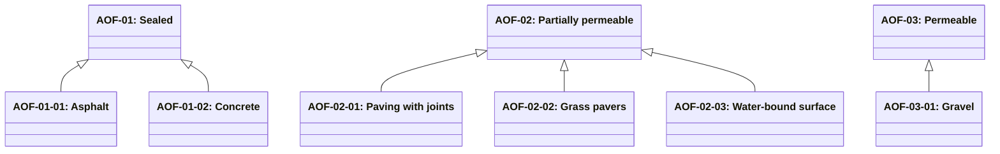

# Abstract outdoor floor surfaces

Source: [`outdoor-floor-surfaces.skos.ttl`](sources/outdoor-floor-surface.ttl)

## Scheme

- **definition (de):** Hierarchische Klassifikation horizontaler Aussen-Nutzschichten nach Durchlässigkeit. Kennzeichnet den Oberflächenbelag, nicht die Raumnutzung. Raum- oder Landschaftsfunktion (Garten, Retention, Teich) wird separat über den Gebäuderaumnamen (RN-*) klassifiziert. Unterscheidet sich von Innen-Bodenbelagsprodukten (FCP).
- **definition (en):** Hierarchical classification of outdoor horizontal wearing courses by permeability. Tags the surface finish material, not the space use. Space or landscape function (garden, retention, pond) is classified separately via building space name (RN-*). Distinct from indoor floor covering products (FCP).
- **prefLabel (de):** Abstrakte Aussenbodenbeläge
- **prefLabel (en):** Abstract outdoor floor surfaces
- **title (en):** Abstract outdoor floor surfaces

## Hierarchy

## Concepts

<button type="button" class="pbs-lang-btn" data-lang="de">DE</button>
<button type="button" class="pbs-lang-btn" data-lang="en">EN</button>

<table>
<thead>
<tr>
<th>Notation</th>
<th>Broader</th>
<th class="pbs-lang-col" data-lang="de" data-field="label">Label</th>
<th class="pbs-lang-col" data-lang="de" data-field="definition">Definition</th>
<th class="pbs-lang-col" data-lang="de" data-field="scope_note">Scope note</th>
<th class="pbs-lang-col" data-lang="en" data-field="label">Label</th>
<th class="pbs-lang-col" data-lang="en" data-field="definition">Definition</th>
<th class="pbs-lang-col" data-lang="en" data-field="scope_note">Scope note</th>
</tr>
</thead>
<tbody>
<tr>
<td>AOF-01</td>
<td></td>
<td class="pbs-lang-col" data-lang="de" data-field="label">Versiegelt</td>
<td class="pbs-lang-col" data-lang="de" data-field="definition">Undurchlässige Aussen-Nutzschicht, die Niederschlag weitgehend als Oberflächenabfluss ableitet.</td>
<td class="pbs-lang-col" data-lang="de" data-field="scope_note"></td>
<td class="pbs-lang-col" data-lang="en" data-field="label">Sealed</td>
<td class="pbs-lang-col" data-lang="en" data-field="definition">Impervious outdoor wearing course that sheds almost all precipitation as surface runoff.</td>
<td class="pbs-lang-col" data-lang="en" data-field="scope_note"></td>
</tr>
<tr>
<td>AOF-01-01</td>
<td>AOF-01</td>
<td class="pbs-lang-col" data-lang="de" data-field="label">Asphalt</td>
<td class="pbs-lang-col" data-lang="de" data-field="definition">Versiegelte Aussen-Nutzschicht aus Asphaltbelag.</td>
<td class="pbs-lang-col" data-lang="de" data-field="scope_note"></td>
<td class="pbs-lang-col" data-lang="en" data-field="label">Asphalt</td>
<td class="pbs-lang-col" data-lang="en" data-field="definition">Sealed outdoor wearing course of asphalt pavement.</td>
<td class="pbs-lang-col" data-lang="en" data-field="scope_note"></td>
</tr>
<tr>
<td>AOF-01-02</td>
<td>AOF-01</td>
<td class="pbs-lang-col" data-lang="de" data-field="label">Beton</td>
<td class="pbs-lang-col" data-lang="de" data-field="definition">Versiegelte Aussen-Nutzschicht aus Betonbelag oder -platte.</td>
<td class="pbs-lang-col" data-lang="de" data-field="scope_note"></td>
<td class="pbs-lang-col" data-lang="en" data-field="label">Concrete</td>
<td class="pbs-lang-col" data-lang="en" data-field="definition">Sealed outdoor wearing course of concrete pavement or slab.</td>
<td class="pbs-lang-col" data-lang="en" data-field="scope_note"></td>
</tr>
<tr>
<td>AOF-02</td>
<td></td>
<td class="pbs-lang-col" data-lang="de" data-field="label">Teildurchlässig</td>
<td class="pbs-lang-col" data-lang="de" data-field="definition">Aussen-Nutzschicht mit teilweiser Versickerung über Fugen, Hohlräume oder eine gebundene, aber durchlässige Deckschicht.</td>
<td class="pbs-lang-col" data-lang="de" data-field="scope_note"></td>
<td class="pbs-lang-col" data-lang="en" data-field="label">Partially permeable</td>
<td class="pbs-lang-col" data-lang="en" data-field="definition">Outdoor wearing course that allows partial infiltration through joints, voids, or a bound but permeable surface layer.</td>
<td class="pbs-lang-col" data-lang="en" data-field="scope_note"></td>
</tr>
<tr>
<td>AOF-02-01</td>
<td>AOF-02</td>
<td class="pbs-lang-col" data-lang="de" data-field="label">Pflaster mit Fugen</td>
<td class="pbs-lang-col" data-lang="de" data-field="definition">Teildurchlässiges Pflaster mit offenen oder durchlässigen Fugen.</td>
<td class="pbs-lang-col" data-lang="de" data-field="scope_note"></td>
<td class="pbs-lang-col" data-lang="en" data-field="label">Paving with joints</td>
<td class="pbs-lang-col" data-lang="en" data-field="definition">Partially permeable paving units with open or permeable joints.</td>
<td class="pbs-lang-col" data-lang="en" data-field="scope_note"></td>
</tr>
<tr>
<td>AOF-02-02</td>
<td>AOF-02</td>
<td class="pbs-lang-col" data-lang="de" data-field="label">Rasengittersteine</td>
<td class="pbs-lang-col" data-lang="de" data-field="definition">Teildurchlässige Gittersteine für Rasen- oder Kiesfüllung.</td>
<td class="pbs-lang-col" data-lang="de" data-field="scope_note"></td>
<td class="pbs-lang-col" data-lang="en" data-field="label">Grass pavers</td>
<td class="pbs-lang-col" data-lang="en" data-field="definition">Partially permeable grid pavers intended for grass or gravel fill.</td>
<td class="pbs-lang-col" data-lang="en" data-field="scope_note"></td>
</tr>
<tr>
<td>AOF-02-03</td>
<td>AOF-02</td>
<td class="pbs-lang-col" data-lang="de" data-field="label">wassergebundene Decke</td>
<td class="pbs-lang-col" data-lang="de" data-field="definition">Teildurchlässige wassergebundene mineralische Nutzschicht.</td>
<td class="pbs-lang-col" data-lang="de" data-field="scope_note"></td>
<td class="pbs-lang-col" data-lang="en" data-field="label">Water-bound surface</td>
<td class="pbs-lang-col" data-lang="en" data-field="definition">Partially permeable water-bound mineral wearing course.</td>
<td class="pbs-lang-col" data-lang="en" data-field="scope_note"></td>
</tr>
<tr>
<td>AOF-03</td>
<td></td>
<td class="pbs-lang-col" data-lang="de" data-field="label">Durchlässig</td>
<td class="pbs-lang-col" data-lang="de" data-field="definition">Durchlässige Aussen-Nutzschicht aus ungebundenem mineralischem Belag mit Versickerung des Niederschlags.</td>
<td class="pbs-lang-col" data-lang="de" data-field="scope_note">Begrünte Flächen und offene Wasserflächen sind Raumtypen (RN-*), keine Aussenbodenbeläge.</td>
<td class="pbs-lang-col" data-lang="en" data-field="label">Permeable</td>
<td class="pbs-lang-col" data-lang="en" data-field="definition">Permeable outdoor wearing course of unbound mineral cover that infiltrates precipitation.</td>
<td class="pbs-lang-col" data-lang="en" data-field="scope_note">Vegetated areas and open water are space types (RN-*), not outdoor floor surface materials.</td>
</tr>
<tr>
<td>AOF-03-01</td>
<td>AOF-03</td>
<td class="pbs-lang-col" data-lang="de" data-field="label">Kies</td>
<td class="pbs-lang-col" data-lang="de" data-field="definition">Durchlässige ungebundene Kies-Nutzschicht.</td>
<td class="pbs-lang-col" data-lang="de" data-field="scope_note"></td>
<td class="pbs-lang-col" data-lang="en" data-field="label">Gravel</td>
<td class="pbs-lang-col" data-lang="en" data-field="definition">Permeable unbound gravel wearing course.</td>
<td class="pbs-lang-col" data-lang="en" data-field="scope_note"></td>
</tr>
</tbody>
</table>

