# Abstract person relationship types

Source: [`person-relationship-type.skos.ttl`](sources/person-relationship-type.ttl)

## Scheme

- **description (de):** CRM-orientierte Personenbeziehungstypen für soziale, berufliche, organisatorische, kommerzielle und Interessen-Verknüpfungen.
- **description (en):** CRM-oriented person relationship predicates for social, professional, organizational, commercial, and interest links.
- **prefLabel (de):** Abstrakte Personenbeziehungstypen
- **prefLabel (en):** Abstract person relationship types
- **title (en):** Abstract person relationship types

## Hierarchy

```mermaid
classDiagram
direction TB
class n_CLT["CLT: Client of"]
class n_COL["COL: Was colleague of"]
class n_CST["CST: Consulted for"]
class n_EXP["EXP: Has expertise in"]
class n_FRI["FRI: Friend of"]
class n_GRP_COM["GRP-COM: Commercial relationships"]
class n_GRP_INT["GRP-INT: Interest and expertise"]
class n_GRP_ORG["GRP-ORG: Organization relationships"]
class n_GRP_PRO["GRP-PRO: Professional relationships (person)"]
class n_GRP_SOC["GRP-SOC: Social relationships"]
class n_HKM["HKM: Has key account manager"]
class n_INT["INT: Has interest"]
class n_ITR["ITR: Introduced by"]
class n_KAM["KAM: Is key account manager for"]
class n_KNW["KNW: Knows"]
class n_LRN["LRN: Learning about"]
class n_MTR["MTR: Mentored by"]
class n_REF["REF: Referred by"]
class n_RPT["RPT: Reports to"]
class n_VND["VND: Vendor of"]
class n_WAT["WAT: Works at"]
class n_WRK["WRK: Worked at"]
n_GRP_COM <|-- n_HKM
n_GRP_COM <|-- n_KAM
n_GRP_INT <|-- n_EXP
n_GRP_INT <|-- n_INT
n_GRP_INT <|-- n_LRN
n_GRP_ORG <|-- n_CLT
n_GRP_ORG <|-- n_CST
n_GRP_ORG <|-- n_VND
n_GRP_ORG <|-- n_WAT
n_GRP_ORG <|-- n_WRK
n_GRP_PRO <|-- n_COL
n_GRP_PRO <|-- n_MTR
n_GRP_PRO <|-- n_REF
n_GRP_PRO <|-- n_RPT
n_GRP_SOC <|-- n_FRI
n_GRP_SOC <|-- n_ITR
n_GRP_SOC <|-- n_KNW
```

## Concepts

<button type="button" class="pbs-lang-btn" data-lang="de">DE</button>
<button type="button" class="pbs-lang-btn" data-lang="en">EN</button>

<table>
<thead>
<tr>
<th>Notation</th>
<th>Broader</th>
<th class="pbs-lang-col" data-lang="de" data-field="label">Label</th>
<th class="pbs-lang-col" data-lang="de" data-field="definition">Definition</th>
<th class="pbs-lang-col" data-lang="de" data-field="scope_note">Scope note</th>
<th class="pbs-lang-col" data-lang="en" data-field="label">Label</th>
<th class="pbs-lang-col" data-lang="en" data-field="definition">Definition</th>
<th class="pbs-lang-col" data-lang="en" data-field="scope_note">Scope note</th>
</tr>
</thead>
<tbody>
<tr>
<td>CLT</td>
<td>GRP-ORG</td>
<td class="pbs-lang-col" data-lang="de" data-field="label">Kunde von</td>
<td class="pbs-lang-col" data-lang="de" data-field="definition">Person oder deren Organisation ist Kunde der Zielorganisation.</td>
<td class="pbs-lang-col" data-lang="de" data-field="scope_note">Ziel-Slot: related_company.</td>
<td class="pbs-lang-col" data-lang="en" data-field="label">Client of</td>
<td class="pbs-lang-col" data-lang="en" data-field="definition">Person or their organization is a client of the target organization.</td>
<td class="pbs-lang-col" data-lang="en" data-field="scope_note">Target slot: related_company.</td>
</tr>
<tr>
<td>COL</td>
<td>GRP-PRO</td>
<td class="pbs-lang-col" data-lang="de" data-field="label">War Kollege/Kollegin von</td>
<td class="pbs-lang-col" data-lang="de" data-field="definition">Person hat mit einer anderen Person in derselben Organisation oder auf demselben Projekt zusammengearbeitet.</td>
<td class="pbs-lang-col" data-lang="de" data-field="scope_note">Ziel-Slot: related_person.</td>
<td class="pbs-lang-col" data-lang="en" data-field="label">Was colleague of</td>
<td class="pbs-lang-col" data-lang="en" data-field="definition">Person worked alongside another person in the same organization or project.</td>
<td class="pbs-lang-col" data-lang="en" data-field="scope_note">Target slot: related_person.</td>
</tr>
<tr>
<td>CST</td>
<td>GRP-ORG</td>
<td class="pbs-lang-col" data-lang="de" data-field="label">Berater/Beraterin für</td>
<td class="pbs-lang-col" data-lang="de" data-field="definition">Person erbrachte Beratungsleistungen für eine Organisation ohne Anstellung.</td>
<td class="pbs-lang-col" data-lang="de" data-field="scope_note">Ziel-Slot: related_company.</td>
<td class="pbs-lang-col" data-lang="en" data-field="label">Consulted for</td>
<td class="pbs-lang-col" data-lang="en" data-field="definition">Person provided consulting services to an organization without being an employee.</td>
<td class="pbs-lang-col" data-lang="en" data-field="scope_note">Target slot: related_company.</td>
</tr>
<tr>
<td>EXP</td>
<td>GRP-INT</td>
<td class="pbs-lang-col" data-lang="de" data-field="label">Hat Expertise in</td>
<td class="pbs-lang-col" data-lang="de" data-field="definition">Person verfügt über nachgewiesene fachliche Tiefe in einem Themenbereich.</td>
<td class="pbs-lang-col" data-lang="de" data-field="scope_note">Ziel-Slot: related_topic.</td>
<td class="pbs-lang-col" data-lang="en" data-field="label">Has expertise in</td>
<td class="pbs-lang-col" data-lang="en" data-field="definition">Person has demonstrated professional depth in a topic area.</td>
<td class="pbs-lang-col" data-lang="en" data-field="scope_note">Target slot: related_topic.</td>
</tr>
<tr>
<td>FRI</td>
<td>GRP-SOC</td>
<td class="pbs-lang-col" data-lang="de" data-field="label">Freund/Freundin von</td>
<td class="pbs-lang-col" data-lang="de" data-field="definition">Person betrachtet eine andere Person als Freundin oder Freund.</td>
<td class="pbs-lang-col" data-lang="de" data-field="scope_note">Ziel-Slot: related_person.</td>
<td class="pbs-lang-col" data-lang="en" data-field="label">Friend of</td>
<td class="pbs-lang-col" data-lang="en" data-field="definition">Person considers another person a friend.</td>
<td class="pbs-lang-col" data-lang="en" data-field="scope_note">Target slot: related_person.</td>
</tr>
<tr>
<td>GRP-COM</td>
<td></td>
<td class="pbs-lang-col" data-lang="de" data-field="label">Kommerzielle Beziehungen</td>
<td class="pbs-lang-col" data-lang="de" data-field="definition"></td>
<td class="pbs-lang-col" data-lang="de" data-field="scope_note"></td>
<td class="pbs-lang-col" data-lang="en" data-field="label">Commercial relationships</td>
<td class="pbs-lang-col" data-lang="en" data-field="definition"></td>
<td class="pbs-lang-col" data-lang="en" data-field="scope_note"></td>
</tr>
<tr>
<td>GRP-INT</td>
<td></td>
<td class="pbs-lang-col" data-lang="de" data-field="label">Interessen und Expertise</td>
<td class="pbs-lang-col" data-lang="de" data-field="definition"></td>
<td class="pbs-lang-col" data-lang="de" data-field="scope_note"></td>
<td class="pbs-lang-col" data-lang="en" data-field="label">Interest and expertise</td>
<td class="pbs-lang-col" data-lang="en" data-field="definition"></td>
<td class="pbs-lang-col" data-lang="en" data-field="scope_note"></td>
</tr>
<tr>
<td>GRP-ORG</td>
<td></td>
<td class="pbs-lang-col" data-lang="de" data-field="label">Organisationsbeziehungen</td>
<td class="pbs-lang-col" data-lang="de" data-field="definition"></td>
<td class="pbs-lang-col" data-lang="de" data-field="scope_note"></td>
<td class="pbs-lang-col" data-lang="en" data-field="label">Organization relationships</td>
<td class="pbs-lang-col" data-lang="en" data-field="definition"></td>
<td class="pbs-lang-col" data-lang="en" data-field="scope_note"></td>
</tr>
<tr>
<td>GRP-PRO</td>
<td></td>
<td class="pbs-lang-col" data-lang="de" data-field="label">Berufliche Beziehungen (Person)</td>
<td class="pbs-lang-col" data-lang="de" data-field="definition"></td>
<td class="pbs-lang-col" data-lang="de" data-field="scope_note"></td>
<td class="pbs-lang-col" data-lang="en" data-field="label">Professional relationships (person)</td>
<td class="pbs-lang-col" data-lang="en" data-field="definition"></td>
<td class="pbs-lang-col" data-lang="en" data-field="scope_note"></td>
</tr>
<tr>
<td>GRP-SOC</td>
<td></td>
<td class="pbs-lang-col" data-lang="de" data-field="label">Soziale Beziehungen</td>
<td class="pbs-lang-col" data-lang="de" data-field="definition"></td>
<td class="pbs-lang-col" data-lang="de" data-field="scope_note"></td>
<td class="pbs-lang-col" data-lang="en" data-field="label">Social relationships</td>
<td class="pbs-lang-col" data-lang="en" data-field="definition"></td>
<td class="pbs-lang-col" data-lang="en" data-field="scope_note"></td>
</tr>
<tr>
<td>HKM</td>
<td>GRP-COM</td>
<td class="pbs-lang-col" data-lang="de" data-field="label">Hat Key-Account-Manager</td>
<td class="pbs-lang-col" data-lang="de" data-field="definition">Die kommerzielle Beziehung der Person wird von einem Key-Account-Manager betreut.</td>
<td class="pbs-lang-col" data-lang="de" data-field="scope_note">Ziel-Slot: related_person (der Key-Account-Manager).</td>
<td class="pbs-lang-col" data-lang="en" data-field="label">Has key account manager</td>
<td class="pbs-lang-col" data-lang="en" data-field="definition">Person&#x27;s commercial relationship is managed by a key account manager.</td>
<td class="pbs-lang-col" data-lang="en" data-field="scope_note">Target slot: related_person (the KAM).</td>
</tr>
<tr>
<td>INT</td>
<td>GRP-INT</td>
<td class="pbs-lang-col" data-lang="de" data-field="label">Hat Interesse</td>
<td class="pbs-lang-col" data-lang="de" data-field="definition">Person hat persönliches oder berufliches Interesse an einem Themenkonzept.</td>
<td class="pbs-lang-col" data-lang="de" data-field="scope_note">Ziel-Slot: related_topic.</td>
<td class="pbs-lang-col" data-lang="en" data-field="label">Has interest</td>
<td class="pbs-lang-col" data-lang="en" data-field="definition">Person has personal or professional interest in a topic concept.</td>
<td class="pbs-lang-col" data-lang="en" data-field="scope_note">Target slot: related_topic.</td>
</tr>
<tr>
<td>ITR</td>
<td>GRP-SOC</td>
<td class="pbs-lang-col" data-lang="de" data-field="label">Vorgestellt von</td>
<td class="pbs-lang-col" data-lang="de" data-field="definition">Person wurde einer anderen Person oder einem Kontext durch jemanden vorgestellt.</td>
<td class="pbs-lang-col" data-lang="de" data-field="scope_note">Ziel-Slot: related_person (die vorstellende Person).</td>
<td class="pbs-lang-col" data-lang="en" data-field="label">Introduced by</td>
<td class="pbs-lang-col" data-lang="en" data-field="definition">Person was introduced to another person or context by someone.</td>
<td class="pbs-lang-col" data-lang="en" data-field="scope_note">Target slot: related_person (the introducer).</td>
</tr>
<tr>
<td>KAM</td>
<td>GRP-COM</td>
<td class="pbs-lang-col" data-lang="de" data-field="label">Ist Key-Account-Manager für</td>
<td class="pbs-lang-col" data-lang="de" data-field="definition">Person ist Key-Account-Manager für eine Kundenorganisation oder einen Ansprechpartner.</td>
<td class="pbs-lang-col" data-lang="de" data-field="scope_note">Ziel-Slot: related_company (Kundenorganisation) oder related_person (Hauptansprechpartner).</td>
<td class="pbs-lang-col" data-lang="en" data-field="label">Is key account manager for</td>
<td class="pbs-lang-col" data-lang="en" data-field="definition">Person acts as key account manager for a client organization or contact.</td>
<td class="pbs-lang-col" data-lang="en" data-field="scope_note">Target slot: related_company (account org) or related_person (primary contact).</td>
</tr>
<tr>
<td>KNW</td>
<td>GRP-SOC</td>
<td class="pbs-lang-col" data-lang="de" data-field="label">Kennt</td>
<td class="pbs-lang-col" data-lang="de" data-field="definition">Person kennt eine andere Person durch soziale oder berufliche Bekanntschaft.</td>
<td class="pbs-lang-col" data-lang="de" data-field="scope_note">Ziel-Slot: related_person.</td>
<td class="pbs-lang-col" data-lang="en" data-field="label">Knows</td>
<td class="pbs-lang-col" data-lang="en" data-field="definition">Person knows another person through social or professional acquaintance.</td>
<td class="pbs-lang-col" data-lang="en" data-field="scope_note">Target slot: related_person.</td>
</tr>
<tr>
<td>LRN</td>
<td>GRP-INT</td>
<td class="pbs-lang-col" data-lang="de" data-field="label">Lernt über</td>
<td class="pbs-lang-col" data-lang="de" data-field="definition">Person entwickelt oder erkundet Interesse an einem Themenbereich.</td>
<td class="pbs-lang-col" data-lang="de" data-field="scope_note">Ziel-Slot: related_topic.</td>
<td class="pbs-lang-col" data-lang="en" data-field="label">Learning about</td>
<td class="pbs-lang-col" data-lang="en" data-field="definition">Person is developing or exploring interest in a topic area.</td>
<td class="pbs-lang-col" data-lang="en" data-field="scope_note">Target slot: related_topic.</td>
</tr>
<tr>
<td>MTR</td>
<td>GRP-PRO</td>
<td class="pbs-lang-col" data-lang="de" data-field="label">Mentoring durch</td>
<td class="pbs-lang-col" data-lang="de" data-field="definition">Person erhielt berufliche Orientierung oder Mentoring durch eine andere Person.</td>
<td class="pbs-lang-col" data-lang="de" data-field="scope_note">Ziel-Slot: related_person (die Mentorin oder der Mentor).</td>
<td class="pbs-lang-col" data-lang="en" data-field="label">Mentored by</td>
<td class="pbs-lang-col" data-lang="en" data-field="definition">Person received career or professional guidance from another person.</td>
<td class="pbs-lang-col" data-lang="en" data-field="scope_note">Target slot: related_person (the mentor).</td>
</tr>
<tr>
<td>REF</td>
<td>GRP-PRO</td>
<td class="pbs-lang-col" data-lang="de" data-field="label">Empfohlen von</td>
<td class="pbs-lang-col" data-lang="de" data-field="definition">Person wurde geschäftlich durch eine andere Person empfohlen oder vermittelt.</td>
<td class="pbs-lang-col" data-lang="de" data-field="scope_note">Ziel-Slot: related_person.</td>
<td class="pbs-lang-col" data-lang="en" data-field="label">Referred by</td>
<td class="pbs-lang-col" data-lang="en" data-field="definition">Person was referred or introduced for business by another person.</td>
<td class="pbs-lang-col" data-lang="en" data-field="scope_note">Target slot: related_person.</td>
</tr>
<tr>
<td>RPT</td>
<td>GRP-PRO</td>
<td class="pbs-lang-col" data-lang="de" data-field="label">Berichtet an</td>
<td class="pbs-lang-col" data-lang="de" data-field="definition">Person berichtet an oder wird von einer anderen Person geführt.</td>
<td class="pbs-lang-col" data-lang="de" data-field="scope_note">Ziel-Slot: related_person.</td>
<td class="pbs-lang-col" data-lang="en" data-field="label">Reports to</td>
<td class="pbs-lang-col" data-lang="en" data-field="definition">Person reports to or is supervised by another person.</td>
<td class="pbs-lang-col" data-lang="en" data-field="scope_note">Target slot: related_person.</td>
</tr>
<tr>
<td>VND</td>
<td>GRP-ORG</td>
<td class="pbs-lang-col" data-lang="de" data-field="label">Lieferant für</td>
<td class="pbs-lang-col" data-lang="de" data-field="definition">Person oder deren Organisation liefert Waren oder Dienstleistungen an die Zielorganisation.</td>
<td class="pbs-lang-col" data-lang="de" data-field="scope_note">Ziel-Slot: related_company.</td>
<td class="pbs-lang-col" data-lang="en" data-field="label">Vendor of</td>
<td class="pbs-lang-col" data-lang="en" data-field="definition">Person or their organization supplies goods or services to the target organization.</td>
<td class="pbs-lang-col" data-lang="en" data-field="scope_note">Target slot: related_company.</td>
</tr>
<tr>
<td>WAT</td>
<td>GRP-ORG</td>
<td class="pbs-lang-col" data-lang="de" data-field="label">Arbeitet bei</td>
<td class="pbs-lang-col" data-lang="de" data-field="definition">Person ist derzeit bei einer Organisation angestellt oder zugeordnet.</td>
<td class="pbs-lang-col" data-lang="de" data-field="scope_note">Ziel-Slot: related_company. works_at ohne valid_to kann Person.belongs_to_company entsprechen.</td>
<td class="pbs-lang-col" data-lang="en" data-field="label">Works at</td>
<td class="pbs-lang-col" data-lang="en" data-field="definition">Person is currently employed by or affiliated with an organization.</td>
<td class="pbs-lang-col" data-lang="en" data-field="scope_note">Target slot: related_company. Open-ended works_at without valid_to may mirror Person.belongs_to_company.</td>
</tr>
<tr>
<td>WRK</td>
<td>GRP-ORG</td>
<td class="pbs-lang-col" data-lang="de" data-field="label">War tätig bei</td>
<td class="pbs-lang-col" data-lang="de" data-field="definition">Person war früher bei einer Organisation angestellt oder zugeordnet.</td>
<td class="pbs-lang-col" data-lang="de" data-field="scope_note">Ziel-Slot: related_company. valid_from und valid_to für Anstellungszeiträume verwenden.</td>
<td class="pbs-lang-col" data-lang="en" data-field="label">Worked at</td>
<td class="pbs-lang-col" data-lang="en" data-field="definition">Person was formerly employed by or affiliated with an organization.</td>
<td class="pbs-lang-col" data-lang="en" data-field="scope_note">Target slot: related_company. Use valid_from and valid_to for employment periods.</td>
</tr>
</tbody>
</table>

