# Abstract workflow participant roles

Source: [`roles.skos.ttl`](sources/roles.ttl)

## Scheme

- **definition (de):** Workflow-Teilnehmerrollen für Organisationsvorlagen; stabile IDs für BPMN oder Prozessvariablen.
- **definition (en):** Workflow participant roles for org templates; stable ids for BPMN or process variables.
- **prefLabel (de):** Abstrakte Workflow-Teilnehmerrollen
- **prefLabel (en):** Abstract workflow participant roles
- **title (en):** Abstract workflow participant roles

## Hierarchy

```mermaid
classDiagram
direction TB
class n_aec_architect["aec.architect: Architect"]
class n_aec_bim_coordinator["aec.bim_coordinator: BIM coordinator"]
class n_aec_bim_manager["aec.bim_manager: BIM manager"]
class n_aec_client["aec.client: Client"]
class n_aec_contractor["aec.contractor: Contractor"]
class n_aec_developer["aec.developer: Developer"]
class n_aec_electrical_engineer["aec.electrical_engineer: Electrical engineer"]
class n_aec_facility_manager["aec.facility_manager: Facility manager"]
class n_aec_group_contractor["aec.group.contractor: Contractor side"]
class n_aec_group_owner["aec.group.owner: Owner side"]
class n_aec_group_planner["aec.group.planner: Planner"]
class n_aec_heating_engineer["aec.heating_engineer: Heating engineer"]
class n_aec_owner["aec.owner: Owner"]
class n_aec_plumbing_engineer["aec.plumbing_engineer: Plumbing engineer"]
class n_aec_project_lead["aec.project_lead: Project lead"]
class n_aec_project_manager["aec.project_manager: Project manager"]
class n_aec_site_manager["aec.site_manager: Site manager"]
class n_aec_structural_engineer["aec.structural_engineer: Structural engineer"]
class n_aec_supplier["aec.supplier: Supplier"]
class n_aec_sustainability_consultant["aec.sustainability_consultant: Sustainability consultant"]
class n_aec_ventilation_engineer["aec.ventilation_engineer: Ventilation engineer"]
n_aec_group_contractor <|-- n_aec_contractor
n_aec_group_contractor <|-- n_aec_supplier
n_aec_group_owner <|-- n_aec_client
n_aec_group_owner <|-- n_aec_developer
n_aec_group_owner <|-- n_aec_facility_manager
n_aec_group_owner <|-- n_aec_owner
n_aec_group_planner <|-- n_aec_architect
n_aec_group_planner <|-- n_aec_bim_coordinator
n_aec_group_planner <|-- n_aec_bim_manager
n_aec_group_planner <|-- n_aec_electrical_engineer
n_aec_group_planner <|-- n_aec_heating_engineer
n_aec_group_planner <|-- n_aec_plumbing_engineer
n_aec_group_planner <|-- n_aec_project_lead
n_aec_group_planner <|-- n_aec_project_manager
n_aec_group_planner <|-- n_aec_site_manager
n_aec_group_planner <|-- n_aec_structural_engineer
n_aec_group_planner <|-- n_aec_sustainability_consultant
n_aec_group_planner <|-- n_aec_ventilation_engineer
```

## Concepts

<button type="button" class="pbs-lang-btn" data-lang="de">DE</button>
<button type="button" class="pbs-lang-btn" data-lang="en">EN</button>

<table>
<thead>
<tr>
<th>Notation</th>
<th>Broader</th>
<th class="pbs-lang-col" data-lang="de" data-field="label">Label</th>
<th class="pbs-lang-col" data-lang="de" data-field="definition">Definition</th>
<th class="pbs-lang-col" data-lang="de" data-field="scope_note">Scope note</th>
<th class="pbs-lang-col" data-lang="en" data-field="label">Label</th>
<th class="pbs-lang-col" data-lang="en" data-field="definition">Definition</th>
<th class="pbs-lang-col" data-lang="en" data-field="scope_note">Scope note</th>
</tr>
</thead>
<tbody>
<tr>
<td>aec.group.contractor</td>
<td></td>
<td class="pbs-lang-col" data-lang="de" data-field="label">Ausführung / Unternehmerseite</td>
<td class="pbs-lang-col" data-lang="de" data-field="definition">Ausführung und Lieferkette auf Unternehmerseite.</td>
<td class="pbs-lang-col" data-lang="de" data-field="scope_note"></td>
<td class="pbs-lang-col" data-lang="en" data-field="label">Contractor side</td>
<td class="pbs-lang-col" data-lang="en" data-field="definition">Construction execution and supply-chain roles.</td>
<td class="pbs-lang-col" data-lang="en" data-field="scope_note"></td>
</tr>
<tr>
<td>aec.contractor</td>
<td>aec.group.contractor</td>
<td class="pbs-lang-col" data-lang="de" data-field="label">Bauunternehmer</td>
<td class="pbs-lang-col" data-lang="de" data-field="definition">Der Bauunternehmer ist verantwortlich für die Bauarbeiten des Projekts.</td>
<td class="pbs-lang-col" data-lang="de" data-field="scope_note"></td>
<td class="pbs-lang-col" data-lang="en" data-field="label">Contractor</td>
<td class="pbs-lang-col" data-lang="en" data-field="definition">The contractor is responsible for the construction of the project.</td>
<td class="pbs-lang-col" data-lang="en" data-field="scope_note"></td>
</tr>
<tr>
<td>aec.supplier</td>
<td>aec.group.contractor</td>
<td class="pbs-lang-col" data-lang="de" data-field="label">Lieferant</td>
<td class="pbs-lang-col" data-lang="de" data-field="definition"></td>
<td class="pbs-lang-col" data-lang="de" data-field="scope_note"></td>
<td class="pbs-lang-col" data-lang="en" data-field="label">Supplier</td>
<td class="pbs-lang-col" data-lang="en" data-field="definition"></td>
<td class="pbs-lang-col" data-lang="en" data-field="scope_note"></td>
</tr>
<tr>
<td>aec.group.owner</td>
<td></td>
<td class="pbs-lang-col" data-lang="de" data-field="label">Bauherr / Eigentümerseite</td>
<td class="pbs-lang-col" data-lang="de" data-field="definition">Auftraggeber, Eigentümer, Projektentwickler und betreibende Rollen auf Eigentümerseite.</td>
<td class="pbs-lang-col" data-lang="de" data-field="scope_note"></td>
<td class="pbs-lang-col" data-lang="en" data-field="label">Owner side</td>
<td class="pbs-lang-col" data-lang="en" data-field="definition">Client, asset owner, developer, and owner-side operations roles.</td>
<td class="pbs-lang-col" data-lang="en" data-field="scope_note"></td>
</tr>
<tr>
<td>aec.client</td>
<td>aec.group.owner</td>
<td class="pbs-lang-col" data-lang="de" data-field="label">Kunde</td>
<td class="pbs-lang-col" data-lang="de" data-field="definition"></td>
<td class="pbs-lang-col" data-lang="de" data-field="scope_note"></td>
<td class="pbs-lang-col" data-lang="en" data-field="label">Client</td>
<td class="pbs-lang-col" data-lang="en" data-field="definition"></td>
<td class="pbs-lang-col" data-lang="en" data-field="scope_note"></td>
</tr>
<tr>
<td>aec.developer</td>
<td>aec.group.owner</td>
<td class="pbs-lang-col" data-lang="de" data-field="label">Entwickler</td>
<td class="pbs-lang-col" data-lang="de" data-field="definition"></td>
<td class="pbs-lang-col" data-lang="de" data-field="scope_note"></td>
<td class="pbs-lang-col" data-lang="en" data-field="label">Developer</td>
<td class="pbs-lang-col" data-lang="en" data-field="definition"></td>
<td class="pbs-lang-col" data-lang="en" data-field="scope_note"></td>
</tr>
<tr>
<td>aec.facility_manager</td>
<td>aec.group.owner</td>
<td class="pbs-lang-col" data-lang="de" data-field="label">Facility Management</td>
<td class="pbs-lang-col" data-lang="de" data-field="definition"></td>
<td class="pbs-lang-col" data-lang="de" data-field="scope_note"></td>
<td class="pbs-lang-col" data-lang="en" data-field="label">Facility manager</td>
<td class="pbs-lang-col" data-lang="en" data-field="definition"></td>
<td class="pbs-lang-col" data-lang="en" data-field="scope_note"></td>
</tr>
<tr>
<td>aec.owner</td>
<td>aec.group.owner</td>
<td class="pbs-lang-col" data-lang="de" data-field="label">Eigentuemer</td>
<td class="pbs-lang-col" data-lang="de" data-field="definition"></td>
<td class="pbs-lang-col" data-lang="de" data-field="scope_note"></td>
<td class="pbs-lang-col" data-lang="en" data-field="label">Owner</td>
<td class="pbs-lang-col" data-lang="en" data-field="definition"></td>
<td class="pbs-lang-col" data-lang="en" data-field="scope_note"></td>
</tr>
<tr>
<td>aec.group.planner</td>
<td></td>
<td class="pbs-lang-col" data-lang="de" data-field="label">Planer</td>
<td class="pbs-lang-col" data-lang="de" data-field="definition">Planungs-, Ingenieur-, Koordinations-, Projektleitungs- und Bauüberwachungsrollen.</td>
<td class="pbs-lang-col" data-lang="de" data-field="scope_note"></td>
<td class="pbs-lang-col" data-lang="en" data-field="label">Planner</td>
<td class="pbs-lang-col" data-lang="en" data-field="definition">Design, engineering, coordination, project-management, and site supervision roles on the planning side.</td>
<td class="pbs-lang-col" data-lang="en" data-field="scope_note"></td>
</tr>
<tr>
<td>aec.architect</td>
<td>aec.group.planner</td>
<td class="pbs-lang-col" data-lang="de" data-field="label">Architekt</td>
<td class="pbs-lang-col" data-lang="de" data-field="definition">Der Architekt ist verantwortlich für die Architektur des Projekts.</td>
<td class="pbs-lang-col" data-lang="de" data-field="scope_note"></td>
<td class="pbs-lang-col" data-lang="en" data-field="label">Architect</td>
<td class="pbs-lang-col" data-lang="en" data-field="definition">The architect is responsible for the architecture of the project.</td>
<td class="pbs-lang-col" data-lang="en" data-field="scope_note"></td>
</tr>
<tr>
<td>aec.bim_coordinator</td>
<td>aec.group.planner</td>
<td class="pbs-lang-col" data-lang="de" data-field="label">BIM-Koordination</td>
<td class="pbs-lang-col" data-lang="de" data-field="definition">Der BIM-Koordinator ist verantwortlich für das BIM-Modell.</td>
<td class="pbs-lang-col" data-lang="de" data-field="scope_note"></td>
<td class="pbs-lang-col" data-lang="en" data-field="label">BIM coordinator</td>
<td class="pbs-lang-col" data-lang="en" data-field="definition">The BIM coordinator is responsible for the BIM model.</td>
<td class="pbs-lang-col" data-lang="en" data-field="scope_note"></td>
</tr>
<tr>
<td>aec.bim_manager</td>
<td>aec.group.planner</td>
<td class="pbs-lang-col" data-lang="de" data-field="label">BIM-Manager</td>
<td class="pbs-lang-col" data-lang="de" data-field="definition">Der BIM-Manager ist verantwortlich für das BIM-Modell.</td>
<td class="pbs-lang-col" data-lang="de" data-field="scope_note"></td>
<td class="pbs-lang-col" data-lang="en" data-field="label">BIM manager</td>
<td class="pbs-lang-col" data-lang="en" data-field="definition">The BIM manager to support the .</td>
<td class="pbs-lang-col" data-lang="en" data-field="scope_note"></td>
</tr>
<tr>
<td>aec.electrical_engineer</td>
<td>aec.group.planner</td>
<td class="pbs-lang-col" data-lang="de" data-field="label">Elektroingenieur</td>
<td class="pbs-lang-col" data-lang="de" data-field="definition">Der Elektroingenieur ist verantwortlich für die Elektroplanung des Projekts.</td>
<td class="pbs-lang-col" data-lang="de" data-field="scope_note"></td>
<td class="pbs-lang-col" data-lang="en" data-field="label">Electrical engineer</td>
<td class="pbs-lang-col" data-lang="en" data-field="definition">The electrical engineer is responsible for the electrical design of the project.</td>
<td class="pbs-lang-col" data-lang="en" data-field="scope_note"></td>
</tr>
<tr>
<td>aec.heating_engineer</td>
<td>aec.group.planner</td>
<td class="pbs-lang-col" data-lang="de" data-field="label">Heizungplaner</td>
<td class="pbs-lang-col" data-lang="de" data-field="definition">Der Heizungplaner ist verantwortlich für die Heizungplanung des Projekts.</td>
<td class="pbs-lang-col" data-lang="de" data-field="scope_note"></td>
<td class="pbs-lang-col" data-lang="en" data-field="label">Heating engineer</td>
<td class="pbs-lang-col" data-lang="en" data-field="definition">The heating engineer is responsible for the heating design of the project.</td>
<td class="pbs-lang-col" data-lang="en" data-field="scope_note"></td>
</tr>
<tr>
<td>aec.plumbing_engineer</td>
<td>aec.group.planner</td>
<td class="pbs-lang-col" data-lang="de" data-field="label">Sanitärplaner</td>
<td class="pbs-lang-col" data-lang="de" data-field="definition">Der Sanitärplaner ist verantwortlich für die Sanitärplanung des Projekts.</td>
<td class="pbs-lang-col" data-lang="de" data-field="scope_note"></td>
<td class="pbs-lang-col" data-lang="en" data-field="label">Plumbing engineer</td>
<td class="pbs-lang-col" data-lang="en" data-field="definition">The plumbing engineer is responsible for the plumbing design of the project.</td>
<td class="pbs-lang-col" data-lang="en" data-field="scope_note"></td>
</tr>
<tr>
<td>aec.project_lead</td>
<td>aec.group.planner</td>
<td class="pbs-lang-col" data-lang="de" data-field="label">Projektleitung</td>
<td class="pbs-lang-col" data-lang="de" data-field="definition">Der Projektleitung ist verantwortlich für das Projekt innerhalb der Organisation.</td>
<td class="pbs-lang-col" data-lang="de" data-field="scope_note"></td>
<td class="pbs-lang-col" data-lang="en" data-field="label">Project lead</td>
<td class="pbs-lang-col" data-lang="en" data-field="definition">The project lead is responsible for the project within the organization.</td>
<td class="pbs-lang-col" data-lang="en" data-field="scope_note"></td>
</tr>
<tr>
<td>aec.project_manager</td>
<td>aec.group.planner</td>
<td class="pbs-lang-col" data-lang="de" data-field="label">Gesamtprojektleitung</td>
<td class="pbs-lang-col" data-lang="de" data-field="definition">Die Gesamtprojektleitung ist verantwortlich für das Gesamtprojekt.</td>
<td class="pbs-lang-col" data-lang="de" data-field="scope_note"></td>
<td class="pbs-lang-col" data-lang="en" data-field="label">Project manager</td>
<td class="pbs-lang-col" data-lang="en" data-field="definition">The project manager is responsible for the overall project.</td>
<td class="pbs-lang-col" data-lang="en" data-field="scope_note"></td>
</tr>
<tr>
<td>aec.site_manager</td>
<td>aec.group.planner</td>
<td class="pbs-lang-col" data-lang="de" data-field="label">Bauleiter</td>
<td class="pbs-lang-col" data-lang="de" data-field="definition"></td>
<td class="pbs-lang-col" data-lang="de" data-field="scope_note"></td>
<td class="pbs-lang-col" data-lang="en" data-field="label">Site manager</td>
<td class="pbs-lang-col" data-lang="en" data-field="definition"></td>
<td class="pbs-lang-col" data-lang="en" data-field="scope_note"></td>
</tr>
<tr>
<td>aec.structural_engineer</td>
<td>aec.group.planner</td>
<td class="pbs-lang-col" data-lang="de" data-field="label">Tragwerksplaner</td>
<td class="pbs-lang-col" data-lang="de" data-field="definition">Der Tragwerksplaner ist verantwortlich für die Tragwerksplanung des Projekts.</td>
<td class="pbs-lang-col" data-lang="de" data-field="scope_note"></td>
<td class="pbs-lang-col" data-lang="en" data-field="label">Structural engineer</td>
<td class="pbs-lang-col" data-lang="en" data-field="definition">The structural engineer is responsible for the structural design of the project.</td>
<td class="pbs-lang-col" data-lang="en" data-field="scope_note"></td>
</tr>
<tr>
<td>aec.sustainability_consultant</td>
<td>aec.group.planner</td>
<td class="pbs-lang-col" data-lang="de" data-field="label">Nachhaltigkeitsberater</td>
<td class="pbs-lang-col" data-lang="de" data-field="definition"></td>
<td class="pbs-lang-col" data-lang="de" data-field="scope_note"></td>
<td class="pbs-lang-col" data-lang="en" data-field="label">Sustainability consultant</td>
<td class="pbs-lang-col" data-lang="en" data-field="definition"></td>
<td class="pbs-lang-col" data-lang="en" data-field="scope_note"></td>
</tr>
<tr>
<td>aec.ventilation_engineer</td>
<td>aec.group.planner</td>
<td class="pbs-lang-col" data-lang="de" data-field="label">Lüftungsplaner</td>
<td class="pbs-lang-col" data-lang="de" data-field="definition">Der Lüftungsplaner ist verantwortlich für die Lüftungplanung des Projekts.</td>
<td class="pbs-lang-col" data-lang="de" data-field="scope_note"></td>
<td class="pbs-lang-col" data-lang="en" data-field="label">Ventilation engineer</td>
<td class="pbs-lang-col" data-lang="en" data-field="definition">The ventilation engineer is responsible for the ventilation design of the project.</td>
<td class="pbs-lang-col" data-lang="en" data-field="scope_note"></td>
</tr>
<tr>
<td>aec.group.tenant</td>
<td></td>
<td class="pbs-lang-col" data-lang="de" data-field="label">Mieter / Nutzerseite</td>
<td class="pbs-lang-col" data-lang="de" data-field="definition">Mieter- und Nutzerrollen (Blattkonzepte bei Bedarf ergänzen).</td>
<td class="pbs-lang-col" data-lang="de" data-field="scope_note"></td>
<td class="pbs-lang-col" data-lang="en" data-field="label">Tenant side</td>
<td class="pbs-lang-col" data-lang="en" data-field="definition">Occupier and tenant-side roles (extend with leaf concepts when needed).</td>
<td class="pbs-lang-col" data-lang="en" data-field="scope_note"></td>
</tr>
</tbody>
</table>

