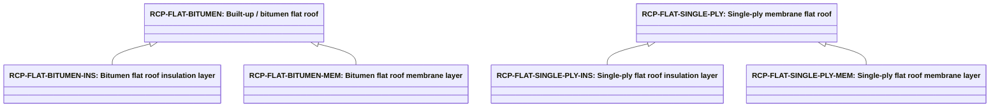

# Abstract roof covering products

Source: [`roof-covering-products.skos.ttl`](sources/roof-covering-product.ttl)

## Scheme

- **definition (de):** Produkttyp-Klassifikation fuer Dachabdichtungen, -bekleidungen und Aufbauten oberhalb der tragenden Dachdecke. Fuer Katalog-, Spezifikations- und Kostenworkflows; mit Trenndeckenrolle L-ROF fuer tragenden Kontext, Trenndeckenprodukten fuer die Tragplatte und abstrakter Materialklassifikation fuer dominante Substanz kombinieren.
- **definition (en):** Product-type classification for roof weatherproofing, cladding, and build-up systems above the structural roof slab. For catalog, specification, and cost workflows; pair with separator slab role L-ROF for structural context, slab separator products for the load-bearing deck, and abstract material classification for dominant substance.
- **prefLabel (de):** Abstrakte Dachbekleidungsprodukte
- **prefLabel (en):** Abstract roof covering products
- **title (en):** Abstract roof covering products

## Hierarchy

## Concepts

<button type="button" class="pbs-lang-btn" data-lang="de">DE</button>
<button type="button" class="pbs-lang-btn" data-lang="en">EN</button>

<table>
<thead>
<tr>
<th>Notation</th>
<th>Broader</th>
<th class="pbs-lang-col" data-lang="de" data-field="label">Label</th>
<th class="pbs-lang-col" data-lang="de" data-field="definition">Definition</th>
<th class="pbs-lang-col" data-lang="de" data-field="scope_note">Scope note</th>
<th class="pbs-lang-col" data-lang="en" data-field="label">Label</th>
<th class="pbs-lang-col" data-lang="en" data-field="definition">Definition</th>
<th class="pbs-lang-col" data-lang="en" data-field="scope_note">Scope note</th>
</tr>
</thead>
<tbody>
<tr>
<td>RCP-FLAT-BITUMEN</td>
<td></td>
<td class="pbs-lang-col" data-lang="de" data-field="label">Mehrlagen- / Bitumen-Flachdach</td>
<td class="pbs-lang-col" data-lang="de" data-field="definition">Mehrlagen- oder Polymerbitumen-Flachdachabdichtung mit Daemm- und Schutzschichten.</td>
<td class="pbs-lang-col" data-lang="de" data-field="scope_note"></td>
<td class="pbs-lang-col" data-lang="en" data-field="label">Built-up / bitumen flat roof</td>
<td class="pbs-lang-col" data-lang="en" data-field="definition">Multi-layer built-up or modified bitumen flat roof waterproofing system with insulation and protection layers.</td>
<td class="pbs-lang-col" data-lang="en" data-field="scope_note"></td>
</tr>
<tr>
<td>RCP-FLAT-BITUMEN-INS</td>
<td>RCP-FLAT-BITUMEN</td>
<td class="pbs-lang-col" data-lang="de" data-field="label">Bitumen-Flachdach Daemmschicht</td>
<td class="pbs-lang-col" data-lang="de" data-field="definition">Daemmplatten- oder -schicht eines mehrlagigen Bitumen-Flachdachs.</td>
<td class="pbs-lang-col" data-lang="de" data-field="scope_note">LCA-Schichtkomponente von RCP-FLAT-BITUMEN. Fuer Oekobilanz-Zerlegung und CO2-Berechnung; keine eigenstaendige Dachprodukt-Klassifikation.</td>
<td class="pbs-lang-col" data-lang="en" data-field="label">Bitumen flat roof insulation layer</td>
<td class="pbs-lang-col" data-lang="en" data-field="definition">Insulation board or layer of a built-up bitumen flat roof system.</td>
<td class="pbs-lang-col" data-lang="en" data-field="scope_note">LCA layer component of RCP-FLAT-BITUMEN. Used for ecobilans decomposition and carbon calculation; not a standalone roof product classification.</td>
</tr>
<tr>
<td>RCP-FLAT-BITUMEN-MEM</td>
<td>RCP-FLAT-BITUMEN</td>
<td class="pbs-lang-col" data-lang="de" data-field="label">Bitumen-Flachdach Abdichtungsschicht</td>
<td class="pbs-lang-col" data-lang="de" data-field="definition">Primaere Abdichtungsschicht eines mehrlagigen Bitumen-Flachdachs.</td>
<td class="pbs-lang-col" data-lang="de" data-field="scope_note">LCA-Schichtkomponente von RCP-FLAT-BITUMEN. Fuer Oekobilanz-Zerlegung und CO2-Berechnung; keine eigenstaendige Dachprodukt-Klassifikation.</td>
<td class="pbs-lang-col" data-lang="en" data-field="label">Bitumen flat roof membrane layer</td>
<td class="pbs-lang-col" data-lang="en" data-field="definition">Primary waterproofing membrane layer of a built-up bitumen flat roof system.</td>
<td class="pbs-lang-col" data-lang="en" data-field="scope_note">LCA layer component of RCP-FLAT-BITUMEN. Used for ecobilans decomposition and carbon calculation; not a standalone roof product classification.</td>
</tr>
<tr>
<td>RCP-FLAT-LIQUID</td>
<td></td>
<td class="pbs-lang-col" data-lang="de" data-field="label">Fluessigkunststoff-Flachdach</td>
<td class="pbs-lang-col" data-lang="de" data-field="definition">Fluessig- oder kaltverarbeitete fugenlose Flachdachabdichtung.</td>
<td class="pbs-lang-col" data-lang="de" data-field="scope_note"></td>
<td class="pbs-lang-col" data-lang="en" data-field="label">Liquid-applied flat roof</td>
<td class="pbs-lang-col" data-lang="en" data-field="definition">Liquid-applied or cold-fluid-applied seamless flat roof waterproofing membrane.</td>
<td class="pbs-lang-col" data-lang="en" data-field="scope_note"></td>
</tr>
<tr>
<td>RCP-FLAT-SINGLE-PLY</td>
<td></td>
<td class="pbs-lang-col" data-lang="de" data-field="label">Einfachlagen-Flachdach (EPDM / TPO / PVC)</td>
<td class="pbs-lang-col" data-lang="de" data-field="definition">Einfachlagen-Kunststoffdach (EPDM, TPO oder PVC) mit Daemmung und Ballast oder Klebefixierung.</td>
<td class="pbs-lang-col" data-lang="de" data-field="scope_note"></td>
<td class="pbs-lang-col" data-lang="en" data-field="label">Single-ply membrane flat roof</td>
<td class="pbs-lang-col" data-lang="en" data-field="definition">Single-ply synthetic membrane flat roof system such as EPDM, TPO, or PVC with insulation and ballast or adhesive fixing.</td>
<td class="pbs-lang-col" data-lang="en" data-field="scope_note"></td>
</tr>
<tr>
<td>RCP-FLAT-SINGLE-PLY-INS</td>
<td>RCP-FLAT-SINGLE-PLY</td>
<td class="pbs-lang-col" data-lang="de" data-field="label">Einfachlagen-Flachdach Daemmschicht</td>
<td class="pbs-lang-col" data-lang="de" data-field="definition">Daemmplatten- oder -schicht eines Einfachlagen-Flachdachs.</td>
<td class="pbs-lang-col" data-lang="de" data-field="scope_note">LCA-Schichtkomponente von RCP-FLAT-SINGLE-PLY. Fuer Oekobilanz-Zerlegung und CO2-Berechnung; keine eigenstaendige Dachprodukt-Klassifikation.</td>
<td class="pbs-lang-col" data-lang="en" data-field="label">Single-ply flat roof insulation layer</td>
<td class="pbs-lang-col" data-lang="en" data-field="definition">Insulation board or layer of a single-ply membrane flat roof system.</td>
<td class="pbs-lang-col" data-lang="en" data-field="scope_note">LCA layer component of RCP-FLAT-SINGLE-PLY. Used for ecobilans decomposition and carbon calculation; not a standalone roof product classification.</td>
</tr>
<tr>
<td>RCP-FLAT-SINGLE-PLY-MEM</td>
<td>RCP-FLAT-SINGLE-PLY</td>
<td class="pbs-lang-col" data-lang="de" data-field="label">Einfachlagen-Flachdach Folien-Schicht</td>
<td class="pbs-lang-col" data-lang="de" data-field="definition">Primaere Einfachlagen-Abdichtungsfolie eines Flachdachs.</td>
<td class="pbs-lang-col" data-lang="de" data-field="scope_note">LCA-Schichtkomponente von RCP-FLAT-SINGLE-PLY. Fuer Oekobilanz-Zerlegung und CO2-Berechnung; keine eigenstaendige Dachprodukt-Klassifikation.</td>
<td class="pbs-lang-col" data-lang="en" data-field="label">Single-ply flat roof membrane layer</td>
<td class="pbs-lang-col" data-lang="en" data-field="definition">Primary single-ply waterproofing membrane layer of a flat roof system.</td>
<td class="pbs-lang-col" data-lang="en" data-field="scope_note">LCA layer component of RCP-FLAT-SINGLE-PLY. Used for ecobilans decomposition and carbon calculation; not a standalone roof product classification.</td>
</tr>
<tr>
<td>RCP-GREEN-EXTENSIVE</td>
<td></td>
<td class="pbs-lang-col" data-lang="de" data-field="label">Extensives Gruendach</td>
<td class="pbs-lang-col" data-lang="de" data-field="definition">Pflegearmes extensives Sedum- oder Leichtbau-Gruendach auf abgedichteter Decke.</td>
<td class="pbs-lang-col" data-lang="de" data-field="scope_note"></td>
<td class="pbs-lang-col" data-lang="en" data-field="label">Extensive green roof</td>
<td class="pbs-lang-col" data-lang="en" data-field="definition">Low-maintenance extensive sedum or lightweight green roof build-up on a waterproofed deck.</td>
<td class="pbs-lang-col" data-lang="en" data-field="scope_note"></td>
</tr>
<tr>
<td>RCP-GREEN-INTENSIVE</td>
<td></td>
<td class="pbs-lang-col" data-lang="de" data-field="label">Intensives Gruendach</td>
<td class="pbs-lang-col" data-lang="de" data-field="definition">Intensives begehbares Gruendach oder Dachgarten mit tieferem Substrat und hoeherer Traglast.</td>
<td class="pbs-lang-col" data-lang="de" data-field="scope_note"></td>
<td class="pbs-lang-col" data-lang="en" data-field="label">Intensive green roof</td>
<td class="pbs-lang-col" data-lang="en" data-field="definition">Intensive accessible green roof or roof garden with deeper substrate and higher structural demand.</td>
<td class="pbs-lang-col" data-lang="en" data-field="scope_note"></td>
</tr>
<tr>
<td>RCP-METAL-SHEET</td>
<td></td>
<td class="pbs-lang-col" data-lang="de" data-field="label">Metallblech-Dach</td>
<td class="pbs-lang-col" data-lang="de" data-field="definition">Profiliertes Metallblech- oder Stehfalzdach auf geneigten oder flachen Daechern.</td>
<td class="pbs-lang-col" data-lang="de" data-field="scope_note"></td>
<td class="pbs-lang-col" data-lang="en" data-field="label">Metal sheet roof</td>
<td class="pbs-lang-col" data-lang="en" data-field="definition">Profiled metal sheet or standing-seam roof cladding on pitched or low-slope roofs.</td>
<td class="pbs-lang-col" data-lang="en" data-field="scope_note"></td>
</tr>
<tr>
<td>RCP-OTH</td>
<td></td>
<td class="pbs-lang-col" data-lang="de" data-field="label">Sonstige / unbekannte Dachbekleidung</td>
<td class="pbs-lang-col" data-lang="de" data-field="definition">Dachbekleidungsprodukt nicht klassifiziert oder noch unbekannt.</td>
<td class="pbs-lang-col" data-lang="de" data-field="scope_note">Fallback fuer fruehe Entwurfsstufen oder fehlende Daten.</td>
<td class="pbs-lang-col" data-lang="en" data-field="label">Other / unknown roof covering</td>
<td class="pbs-lang-col" data-lang="en" data-field="definition">Roof covering product not classified or not yet known.</td>
<td class="pbs-lang-col" data-lang="en" data-field="scope_note">Fallback for early design stages or missing data.</td>
</tr>
<tr>
<td>RCP-PV-ROOF</td>
<td></td>
<td class="pbs-lang-col" data-lang="de" data-field="label">Aufgestaendigtes Photovoltaik-Dach</td>
<td class="pbs-lang-col" data-lang="de" data-field="definition">Photovoltaik-Modulanordnung auf oder integriert in das Dachbekleidungssystem.</td>
<td class="pbs-lang-col" data-lang="de" data-field="scope_note">Unterscheidet sich von fassadenintegrierter BIPV (FaCP-BIPV-INTEGRATED); Dachfenster bleiben Fensterverbindungsprodukte (WICP-SKYLIGHT).</td>
<td class="pbs-lang-col" data-lang="en" data-field="label">Roof-mounted photovoltaic system</td>
<td class="pbs-lang-col" data-lang="en" data-field="definition">Photovoltaic module array mounted on or integrated with the roof covering system.</td>
<td class="pbs-lang-col" data-lang="en" data-field="scope_note">Distinct from facade-integrated BIPV (FaCP-BIPV-INTEGRATED); roof skylights remain window connector products (WICP-SKYLIGHT).</td>
</tr>
<tr>
<td>RCP-SLATE</td>
<td></td>
<td class="pbs-lang-col" data-lang="de" data-field="label">Naturschiefer-Dach</td>
<td class="pbs-lang-col" data-lang="de" data-field="definition">Naturschiefer-Steildacheindeckung.</td>
<td class="pbs-lang-col" data-lang="de" data-field="scope_note"></td>
<td class="pbs-lang-col" data-lang="en" data-field="label">Natural slate roof</td>
<td class="pbs-lang-col" data-lang="en" data-field="definition">Natural slate tile pitched roof covering.</td>
<td class="pbs-lang-col" data-lang="en" data-field="scope_note"></td>
</tr>
<tr>
<td>RCP-TILE-CLAY</td>
<td></td>
<td class="pbs-lang-col" data-lang="de" data-field="label">Tonziegel-Dach</td>
<td class="pbs-lang-col" data-lang="de" data-field="definition">Ton- oder Keramikziegel-Steildach mit Lattung und Unterspannbahn.</td>
<td class="pbs-lang-col" data-lang="de" data-field="scope_note"></td>
<td class="pbs-lang-col" data-lang="en" data-field="label">Clay tile roof</td>
<td class="pbs-lang-col" data-lang="en" data-field="definition">Clay or ceramic tile pitched roof covering with battens and underlay.</td>
<td class="pbs-lang-col" data-lang="en" data-field="scope_note"></td>
</tr>
<tr>
<td>RCP-TILE-CONCRETE</td>
<td></td>
<td class="pbs-lang-col" data-lang="de" data-field="label">Betonziegel-Dach</td>
<td class="pbs-lang-col" data-lang="de" data-field="definition">Beton- oder Faserzementziegel-Steildach.</td>
<td class="pbs-lang-col" data-lang="de" data-field="scope_note"></td>
<td class="pbs-lang-col" data-lang="en" data-field="label">Concrete tile roof</td>
<td class="pbs-lang-col" data-lang="en" data-field="definition">Concrete or fibre-cement tile pitched roof covering system.</td>
<td class="pbs-lang-col" data-lang="en" data-field="scope_note"></td>
</tr>
<tr>
<td>RCP-WOOD-SHINGLE</td>
<td></td>
<td class="pbs-lang-col" data-lang="de" data-field="label">Holzschindel- / -schindeldach</td>
<td class="pbs-lang-col" data-lang="de" data-field="definition">Holzschindel-, Schindel- oder Brett-Steildach.</td>
<td class="pbs-lang-col" data-lang="de" data-field="scope_note"></td>
<td class="pbs-lang-col" data-lang="en" data-field="label">Wood shingle / shake roof</td>
<td class="pbs-lang-col" data-lang="en" data-field="definition">Wood shingle, shake, or board pitched roof covering.</td>
<td class="pbs-lang-col" data-lang="en" data-field="scope_note"></td>
</tr>
</tbody>
</table>

