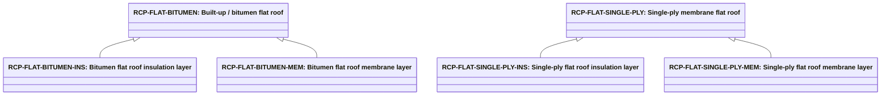

# Abstract roof covering products

Source: [`roof-covering-products.skos.ttl`](sources/roof-covering-product.ttl)

## Scheme

- **definition (de):** Produkttyp-Klassifikation fuer Dachabdichtungen, -bekleidungen und Aufbauten oberhalb der tragenden Dachdecke. Fuer Katalog-, Spezifikations- und Kostenworkflows; mit Trenndeckenrolle L-ROF fuer tragenden Kontext, Trenndeckenprodukten fuer die Tragplatte und abstrakter Materialklassifikation fuer dominante Substanz kombinieren.
- **definition (en):** Product-type classification for roof weatherproofing, cladding, and build-up systems above the structural roof slab. For catalog, specification, and cost workflows; pair with separator slab role L-ROF for structural context, slab separator products for the load-bearing deck, and abstract material classification for dominant substance.
- **prefLabel (de):** Abstrakte Dachbekleidungsprodukte
- **prefLabel (en):** Abstract roof covering products
- **title (en):** Abstract roof covering products

## Hierarchy

```mermaid
classDiagram
direction TB
class n_RCP_FLAT_BITUMEN["RCP-FLAT-BITUMEN: Built-up / bitumen flat roof"]
class n_RCP_FLAT_BITUMEN_INS["RCP-FLAT-BITUMEN-INS: Bitumen flat roof insulation layer"]
class n_RCP_FLAT_BITUMEN_MEM["RCP-FLAT-BITUMEN-MEM: Bitumen flat roof membrane layer"]
class n_RCP_FLAT_SINGLE_PLY["RCP-FLAT-SINGLE-PLY: Single-ply membrane flat roof"]
class n_RCP_FLAT_SINGLE_PLY_INS["RCP-FLAT-SINGLE-PLY-INS: Single-ply flat roof insulation layer"]
class n_RCP_FLAT_SINGLE_PLY_MEM["RCP-FLAT-SINGLE-PLY-MEM: Single-ply flat roof membrane layer"]
n_RCP_FLAT_BITUMEN <|-- n_RCP_FLAT_BITUMEN_INS
n_RCP_FLAT_BITUMEN <|-- n_RCP_FLAT_BITUMEN_MEM
n_RCP_FLAT_SINGLE_PLY <|-- n_RCP_FLAT_SINGLE_PLY_INS
n_RCP_FLAT_SINGLE_PLY <|-- n_RCP_FLAT_SINGLE_PLY_MEM
```

## Concepts

<button type="button" class="pbs-lang-btn" data-lang="de">DE</button>
<button type="button" class="pbs-lang-btn" data-lang="en">EN</button>

<table>
<thead>
<tr>
<th>Notation</th>
<th>Broader</th>
<th class="pbs-lang-col" data-lang="de" data-field="label">Label</th>
<th class="pbs-lang-col" data-lang="de" data-field="definition">Definition</th>
<th class="pbs-lang-col" data-lang="de" data-field="description">Description</th>
<th class="pbs-lang-col" data-lang="de" data-field="scope_note">Scope note</th>
<th class="pbs-lang-col" data-lang="en" data-field="label">Label</th>
<th class="pbs-lang-col" data-lang="en" data-field="definition">Definition</th>
<th class="pbs-lang-col" data-lang="en" data-field="description">Description</th>
<th class="pbs-lang-col" data-lang="en" data-field="scope_note">Scope note</th>
</tr>
</thead>
<tbody>
<tr>
<td>RCP-FLAT-BITUMEN</td>
<td></td>
<td class="pbs-lang-col" data-lang="de" data-field="label">Mehrlagen- / Bitumen-Flachdach</td>
<td class="pbs-lang-col" data-lang="de" data-field="definition">Mehrlagen- oder Polymerbitumen-Flachdachabdichtung mit Daemm- und Schutzschichten.</td>
<td class="pbs-lang-col" data-lang="de" data-field="description">Abdichtungsaufbau für Flach- und flach geneigte Dächer, bei dem mehrere Bitumenbahnen die wasserführende Schicht oberhalb der Tragdecke bilden. Die Lagen werden über der Dämmung mit überlappenden Nähten verschweisst oder heiss verklebt, mit Trenn- und Schutzschichten darunter und darüber. Geeignet für gering geneigte Dächer, beschwerte oder begangene Oberflächen und hohe Anforderungen an die Redundanz der Abdichtung.</td>
<td class="pbs-lang-col" data-lang="de" data-field="scope_note"></td>
<td class="pbs-lang-col" data-lang="en" data-field="label">Built-up / bitumen flat roof</td>
<td class="pbs-lang-col" data-lang="en" data-field="definition">Multi-layer built-up or modified bitumen flat roof waterproofing system with insulation and protection layers.</td>
<td class="pbs-lang-col" data-lang="en" data-field="description">Weatherproofing build-up for flat and low-slope roofs in which several bitumen sheets form the water-bearing layer above the structural deck. The plies are torch-welded or hot-bonded over the insulation with overlapping seams, with separation and protection layers below and above. Suitable for low-pitch roofs, ballasted or trafficked surfaces, and high demands on redundancy of the waterproofing.</td>
<td class="pbs-lang-col" data-lang="en" data-field="scope_note"></td>
</tr>
<tr>
<td>RCP-FLAT-BITUMEN-INS</td>
<td>RCP-FLAT-BITUMEN</td>
<td class="pbs-lang-col" data-lang="de" data-field="label">Bitumen-Flachdach Daemmschicht</td>
<td class="pbs-lang-col" data-lang="de" data-field="definition">Daemmplatten- oder -schicht eines mehrlagigen Bitumen-Flachdachs.</td>
<td class="pbs-lang-col" data-lang="de" data-field="description">Wärmedämmschicht innerhalb eines Bitumen-Flachdachaufbaus, zwischen Tragdecke und Abdichtung angeordnet. Die Platten werden lose verlegt, verklebt oder mechanisch befestigt und können als Gefälledämmung ausgebildet werden. Sie erbringt die Wärmeschutzleistung des Daches und nimmt die Lasten der darüberliegenden Schichten ohne übermässige Zusammendrückung auf.</td>
<td class="pbs-lang-col" data-lang="de" data-field="scope_note">LCA-Schichtkomponente von RCP-FLAT-BITUMEN. Fuer Oekobilanz-Zerlegung und CO2-Berechnung; keine eigenstaendige Dachprodukt-Klassifikation.</td>
<td class="pbs-lang-col" data-lang="en" data-field="label">Bitumen flat roof insulation layer</td>
<td class="pbs-lang-col" data-lang="en" data-field="definition">Insulation board or layer of a built-up bitumen flat roof system.</td>
<td class="pbs-lang-col" data-lang="en" data-field="description">Thermal insulation layer within a bitumen flat roof build-up, located between the structural deck and the waterproofing membrane. Boards are loose-laid, adhered, or mechanically fixed and can be tapered to form the drainage fall. Delivers the thermal performance of the roof and carries the loads of the layers above without excessive compression.</td>
<td class="pbs-lang-col" data-lang="en" data-field="scope_note">LCA layer component of RCP-FLAT-BITUMEN. Used for ecobilans decomposition and carbon calculation; not a standalone roof product classification.</td>
</tr>
<tr>
<td>RCP-FLAT-BITUMEN-MEM</td>
<td>RCP-FLAT-BITUMEN</td>
<td class="pbs-lang-col" data-lang="de" data-field="label">Bitumen-Flachdach Abdichtungsschicht</td>
<td class="pbs-lang-col" data-lang="de" data-field="definition">Primaere Abdichtungsschicht eines mehrlagigen Bitumen-Flachdachs.</td>
<td class="pbs-lang-col" data-lang="de" data-field="description">Wasserführende Abdichtungsschicht eines Bitumen-Flachdachs, die die durchgehende Barriere gegen Regen und stehendes Wasser bildet. Die Bahnen werden mit überlappenden, verschweissten Nähten verlegt und an Aufkanten, Durchdringungen und Entwässerungspunkten hochgeführt. Sie stellt die Wasserdichtheit des Daches sicher und ist entweder UV-beständig oder durch die darüberliegenden Schichten geschützt.</td>
<td class="pbs-lang-col" data-lang="de" data-field="scope_note">LCA-Schichtkomponente von RCP-FLAT-BITUMEN. Fuer Oekobilanz-Zerlegung und CO2-Berechnung; keine eigenstaendige Dachprodukt-Klassifikation.</td>
<td class="pbs-lang-col" data-lang="en" data-field="label">Bitumen flat roof membrane layer</td>
<td class="pbs-lang-col" data-lang="en" data-field="definition">Primary waterproofing membrane layer of a built-up bitumen flat roof system.</td>
<td class="pbs-lang-col" data-lang="en" data-field="description">Water-bearing membrane layer of a bitumen flat roof, forming the continuous barrier against rain and standing water. Sheets are laid with overlapping welded seams and dressed up at upstands, penetrations, and drainage points. Delivers the watertightness of the roof and either resists ultraviolet exposure or is protected by the covering layers above.</td>
<td class="pbs-lang-col" data-lang="en" data-field="scope_note">LCA layer component of RCP-FLAT-BITUMEN. Used for ecobilans decomposition and carbon calculation; not a standalone roof product classification.</td>
</tr>
<tr>
<td>RCP-FLAT-LIQUID</td>
<td></td>
<td class="pbs-lang-col" data-lang="de" data-field="label">Fluessigkunststoff-Flachdach</td>
<td class="pbs-lang-col" data-lang="de" data-field="definition">Fluessig- oder kaltverarbeitete fugenlose Flachdachabdichtung.</td>
<td class="pbs-lang-col" data-lang="de" data-field="description">Fugenlose Abdichtungsschicht für Flach- und flach geneigte Dächer, die flüssig auf den vorbereiteten Untergrund aufgebracht wird und vor Ort aushärtet. Das Harz wird in mehreren Lagen gerollt, gestrichen oder gespritzt, meist mit eingelegtem Verstärkungsvlies, und läuft ohne Stösse über Aufkanten und Durchdringungen. Geeignet für kleine, geometrisch komplexe Dachflächen, detailreiche Anschlüsse und Sanierungen, bei denen Bahnen nicht zuverlässig verlegt werden können.</td>
<td class="pbs-lang-col" data-lang="de" data-field="scope_note"></td>
<td class="pbs-lang-col" data-lang="en" data-field="label">Liquid-applied flat roof</td>
<td class="pbs-lang-col" data-lang="en" data-field="definition">Liquid-applied or cold-fluid-applied seamless flat roof waterproofing membrane.</td>
<td class="pbs-lang-col" data-lang="en" data-field="description">Seamless weatherproofing layer for flat and low-slope roofs, applied in liquid form onto the prepared substrate and cured in place. Resin is rolled, brushed, or sprayed in several coats, usually with an embedded reinforcing fleece, and continues without joints over upstands and penetrations. Suitable for small, geometrically complex roof areas, detail-rich junctions, and refurbishment where sheet membranes cannot be dressed reliably.</td>
<td class="pbs-lang-col" data-lang="en" data-field="scope_note"></td>
</tr>
<tr>
<td>RCP-FLAT-SINGLE-PLY</td>
<td></td>
<td class="pbs-lang-col" data-lang="de" data-field="label">Einfachlagen-Flachdach (EPDM / TPO / PVC)</td>
<td class="pbs-lang-col" data-lang="de" data-field="definition">Einfachlagen-Kunststoffdach (EPDM, TPO oder PVC) mit Daemmung und Ballast oder Klebefixierung.</td>
<td class="pbs-lang-col" data-lang="de" data-field="description">Abdichtungsaufbau für Flach- und flach geneigte Dächer, bei dem eine einzelne Kunststoffbahn die wasserführende Schicht oberhalb der Dämmung bildet. Die Bahn wird lose verlegt und beschwert, mechanisch befestigt oder vollflächig verklebt, die Nähte werden heissluftverschweisst oder verklebt und bilden eine durchgehende Haut. Geeignet für grosse, gering geneigte Dachflächen mit Anforderungen an rasche Montage und geringes Aufbaugewicht.</td>
<td class="pbs-lang-col" data-lang="de" data-field="scope_note"></td>
<td class="pbs-lang-col" data-lang="en" data-field="label">Single-ply membrane flat roof</td>
<td class="pbs-lang-col" data-lang="en" data-field="definition">Single-ply synthetic membrane flat roof system such as EPDM, TPO, or PVC with insulation and ballast or adhesive fixing.</td>
<td class="pbs-lang-col" data-lang="en" data-field="description">Weatherproofing build-up for flat and low-slope roofs in which a single synthetic sheet forms the water-bearing layer above the insulation. The membrane is loose-laid and ballasted, mechanically fixed, or fully adhered, with seams hot-air welded or taped into a continuous skin. Suitable for large low-pitch roof areas where fast installation and low build-up weight are required.</td>
<td class="pbs-lang-col" data-lang="en" data-field="scope_note"></td>
</tr>
<tr>
<td>RCP-FLAT-SINGLE-PLY-INS</td>
<td>RCP-FLAT-SINGLE-PLY</td>
<td class="pbs-lang-col" data-lang="de" data-field="label">Einfachlagen-Flachdach Daemmschicht</td>
<td class="pbs-lang-col" data-lang="de" data-field="definition">Daemmplatten- oder -schicht eines Einfachlagen-Flachdachs.</td>
<td class="pbs-lang-col" data-lang="de" data-field="description">Wärmedämmschicht innerhalb eines Einfachlagen-Flachdachaufbaus, zwischen Tragdecke und Abdichtungsbahn angeordnet. Die Platten werden lose verlegt, verklebt oder gemeinsam mit der Bahn mechanisch befestigt und können als Gefälledämmung ausgebildet werden. Sie erbringt die Wärmeschutzleistung des Daches und bildet einen ebenen, tragfähigen Untergrund für die Abdichtung.</td>
<td class="pbs-lang-col" data-lang="de" data-field="scope_note">LCA-Schichtkomponente von RCP-FLAT-SINGLE-PLY. Fuer Oekobilanz-Zerlegung und CO2-Berechnung; keine eigenstaendige Dachprodukt-Klassifikation.</td>
<td class="pbs-lang-col" data-lang="en" data-field="label">Single-ply flat roof insulation layer</td>
<td class="pbs-lang-col" data-lang="en" data-field="definition">Insulation board or layer of a single-ply membrane flat roof system.</td>
<td class="pbs-lang-col" data-lang="en" data-field="description">Thermal insulation layer within a single-ply flat roof build-up, placed between the structural deck and the membrane. Boards are loose-laid, adhered, or mechanically fixed together with the membrane and can be tapered to form the fall. Delivers the thermal performance of the roof and provides an even, load-bearing substrate for the waterproofing.</td>
<td class="pbs-lang-col" data-lang="en" data-field="scope_note">LCA layer component of RCP-FLAT-SINGLE-PLY. Used for ecobilans decomposition and carbon calculation; not a standalone roof product classification.</td>
</tr>
<tr>
<td>RCP-FLAT-SINGLE-PLY-MEM</td>
<td>RCP-FLAT-SINGLE-PLY</td>
<td class="pbs-lang-col" data-lang="de" data-field="label">Einfachlagen-Flachdach Folien-Schicht</td>
<td class="pbs-lang-col" data-lang="de" data-field="definition">Primaere Einfachlagen-Abdichtungsfolie eines Flachdachs.</td>
<td class="pbs-lang-col" data-lang="de" data-field="description">Wasserführende Kunststoffbahn eines Einfachlagen-Flachdachs, die die durchgehende Barriere gegen Regen und stehendes Wasser bildet. Die Bahn wird an den Nähten verschweisst oder verklebt und an Aufkanten, Durchdringungen und Entwässerungspunkten hochgeführt. Sie stellt die Wasserdichtheit des Daches sicher und bleibt Witterung und UV-Strahlung ausgesetzt, sofern sie nicht durch Ballast oder einen Gründachaufbau abgedeckt ist.</td>
<td class="pbs-lang-col" data-lang="de" data-field="scope_note">LCA-Schichtkomponente von RCP-FLAT-SINGLE-PLY. Fuer Oekobilanz-Zerlegung und CO2-Berechnung; keine eigenstaendige Dachprodukt-Klassifikation.</td>
<td class="pbs-lang-col" data-lang="en" data-field="label">Single-ply flat roof membrane layer</td>
<td class="pbs-lang-col" data-lang="en" data-field="definition">Primary single-ply waterproofing membrane layer of a flat roof system.</td>
<td class="pbs-lang-col" data-lang="en" data-field="description">Water-bearing synthetic sheet layer of a single-ply flat roof, forming the continuous barrier against rain and standing water. The sheet is welded or taped at the seams and dressed up at upstands, penetrations, and drainage points. Delivers the watertightness of the roof and stays exposed to weather and ultraviolet radiation unless covered by ballast or a green roof build-up.</td>
<td class="pbs-lang-col" data-lang="en" data-field="scope_note">LCA layer component of RCP-FLAT-SINGLE-PLY. Used for ecobilans decomposition and carbon calculation; not a standalone roof product classification.</td>
</tr>
<tr>
<td>RCP-GREEN-EXTENSIVE</td>
<td></td>
<td class="pbs-lang-col" data-lang="de" data-field="label">Extensives Gruendach</td>
<td class="pbs-lang-col" data-lang="de" data-field="definition">Pflegearmes extensives Sedum- oder Leichtbau-Gruendach auf abgedichteter Decke.</td>
<td class="pbs-lang-col" data-lang="de" data-field="description">Begrünter Deckaufbau über einer abgedichteten Flach- oder flach geneigten Decke, bei dem eine dünne Substratschicht trockenheitsverträgliche Bepflanzung trägt. Wurzelschutz, Drän- und Filterschicht, Substrat und Vegetation werden lose auf der Abdichtung verlegt und wirken gleichzeitig als deren Schutz und Ballast. Geeignet für nicht regelmässig begangene Dächer mit begrenzter zusätzlicher Auflast, wenn Regenwasserrückhalt und Schutz der Abdichtung gefordert sind.</td>
<td class="pbs-lang-col" data-lang="de" data-field="scope_note"></td>
<td class="pbs-lang-col" data-lang="en" data-field="label">Extensive green roof</td>
<td class="pbs-lang-col" data-lang="en" data-field="definition">Low-maintenance extensive sedum or lightweight green roof build-up on a waterproofed deck.</td>
<td class="pbs-lang-col" data-lang="en" data-field="description">Vegetated covering build-up above a waterproofed flat or low-slope deck, in which a thin substrate layer carries drought-tolerant planting. Root barrier, drainage and filter layers, substrate, and vegetation are laid loose on the membrane and act at the same time as its protection and ballast. Suitable for roofs that are not regularly walked on, with limited additional dead load, where rainwater retention and protection of the waterproofing are required.</td>
<td class="pbs-lang-col" data-lang="en" data-field="scope_note"></td>
</tr>
<tr>
<td>RCP-GREEN-INTENSIVE</td>
<td></td>
<td class="pbs-lang-col" data-lang="de" data-field="label">Intensives Gruendach</td>
<td class="pbs-lang-col" data-lang="de" data-field="definition">Intensives begehbares Gruendach oder Dachgarten mit tieferem Substrat und hoeherer Traglast.</td>
<td class="pbs-lang-col" data-lang="de" data-field="description">Begrünter und nutzbarer Deckaufbau über einer abgedichteten Decke mit tiefer Substratschicht, die Rasen, Sträucher oder Bäume trägt. Wurzelschutz, Drän- und Wasserspeicherschicht, Substrat, Bepflanzung sowie Wege oder Terrassen werden auf der Abdichtung aufgebaut, in der Regel mit Bewässerung. Geeignet für begehbare Dachgärten und Höfe auf Decken, die für die höhere wassergesättigte Auflast ausgelegt sind, und erfordert regelmässige Pflege.</td>
<td class="pbs-lang-col" data-lang="de" data-field="scope_note"></td>
<td class="pbs-lang-col" data-lang="en" data-field="label">Intensive green roof</td>
<td class="pbs-lang-col" data-lang="en" data-field="definition">Intensive accessible green roof or roof garden with deeper substrate and higher structural demand.</td>
<td class="pbs-lang-col" data-lang="en" data-field="description">Vegetated and usable covering build-up above a waterproofed deck, with a deep substrate layer that carries lawn, shrubs, or trees. Root barrier, drainage and water-storage layers, substrate, planting, and paths or terraces are built up on the membrane, usually with irrigation. Suitable for accessible roof gardens and courtyards on decks designed for the higher saturated dead load, and requires regular maintenance.</td>
<td class="pbs-lang-col" data-lang="en" data-field="scope_note"></td>
</tr>
<tr>
<td>RCP-METAL-SHEET</td>
<td></td>
<td class="pbs-lang-col" data-lang="de" data-field="label">Metallblech-Dach</td>
<td class="pbs-lang-col" data-lang="de" data-field="definition">Profiliertes Metallblech- oder Stehfalzdach auf geneigten oder flachen Daechern.</td>
<td class="pbs-lang-col" data-lang="de" data-field="description">Witterungsbeständige äussere Dachhaut aus geformtem Metallblech, auf Lattung, Pfetten oder Schalung über einer Trenn- und Belüftungsschicht befestigt. Die Bahnen werden durch Stehfalze, Hafte oder profilierte Überlappungen verbunden, die thermische Bewegungen zulassen, mit Abschlüssen an Traufe, Ortgang und Durchdringungen. Geeignet für geneigte und flach geneigte Dächer mit grossen Spannweiten, exponierten Lagen und Anforderungen an lange Nutzungsdauer bei geringem Flächengewicht.</td>
<td class="pbs-lang-col" data-lang="de" data-field="scope_note"></td>
<td class="pbs-lang-col" data-lang="en" data-field="label">Metal sheet roof</td>
<td class="pbs-lang-col" data-lang="en" data-field="definition">Profiled metal sheet or standing-seam roof cladding on pitched or low-slope roofs.</td>
<td class="pbs-lang-col" data-lang="en" data-field="description">Weatherproof outer roof skin from formed metal sheet, fixed on battens, purlins, or boarding above a separation and ventilation layer. Panels are joined by standing seams, clips, or profiled overlaps that allow thermal movement, with flashings at eaves, verges, and penetrations. Suitable for pitched and low-slope roofs with long spans, exposed locations, and demands on a long service life at low surface weight.</td>
<td class="pbs-lang-col" data-lang="en" data-field="scope_note"></td>
</tr>
<tr>
<td>RCP-OTH</td>
<td></td>
<td class="pbs-lang-col" data-lang="de" data-field="label">Sonstige / unbekannte Dachbekleidung</td>
<td class="pbs-lang-col" data-lang="de" data-field="definition">Dachbekleidungsprodukt nicht klassifiziert oder noch unbekannt.</td>
<td class="pbs-lang-col" data-lang="de" data-field="description">Platzhalter für Dachbekleidungsprodukte, deren Systemtyp zum Zeitpunkt der Ausschreibung noch nicht festgelegt oder nicht klassifiziert ist. Funktionale Anforderungen wie Wasserdichtheit, zulässige Dachneigung, Wärmeschutz, Begehbarkeit und Brandverhalten sind gesondert zu beschreiben. Nur in frühen Planungsphasen oder bei unvollständiger Datenlage verwenden.</td>
<td class="pbs-lang-col" data-lang="de" data-field="scope_note">Fallback fuer fruehe Entwurfsstufen oder fehlende Daten.</td>
<td class="pbs-lang-col" data-lang="en" data-field="label">Other / unknown roof covering</td>
<td class="pbs-lang-col" data-lang="en" data-field="definition">Roof covering product not classified or not yet known.</td>
<td class="pbs-lang-col" data-lang="en" data-field="description">Placeholder for roof covering products whose system type is not yet fixed or not classified at tender stage. Functional requirements such as watertightness, admissible roof pitch, thermal performance, walkability, and fire behaviour must be stated separately. Use only in early design stages or where data is incomplete.</td>
<td class="pbs-lang-col" data-lang="en" data-field="scope_note">Fallback for early design stages or missing data.</td>
</tr>
<tr>
<td>RCP-PV-ROOF</td>
<td></td>
<td class="pbs-lang-col" data-lang="de" data-field="label">Aufgestaendigtes Photovoltaik-Dach</td>
<td class="pbs-lang-col" data-lang="de" data-field="definition">Photovoltaik-Modulanordnung auf oder integriert in das Dachbekleidungssystem.</td>
<td class="pbs-lang-col" data-lang="de" data-field="description">Stromerzeugende Modulanordnung auf der Dachfläche, entweder aufgeständert über der bestehenden Deckung oder diese als witterungsschützende Schicht ersetzend. Die Module werden beschwert oder auf Schienen und Konsolen befestigt, die in die Tragkonstruktion eingebunden sind, wobei Durchdringungen der Abdichtung dicht ausgeführt und die Leitungen zu den Wechselrichtern geführt werden. Geeignet für Dächer mit ausreichender Lastreserve und Besonnung; übernehmen die Module die Witterungsschutzfunktion, sind Regendichtheit und Windsogsicherheit durch das System selbst zu erbringen.</td>
<td class="pbs-lang-col" data-lang="de" data-field="scope_note">Unterscheidet sich von fassadenintegrierter BIPV (FaCP-BIPV-INTEGRATED); Dachfenster bleiben Fensterverbindungsprodukte (WICP-SKYLIGHT).</td>
<td class="pbs-lang-col" data-lang="en" data-field="label">Roof-mounted photovoltaic system</td>
<td class="pbs-lang-col" data-lang="en" data-field="definition">Photovoltaic module array mounted on or integrated with the roof covering system.</td>
<td class="pbs-lang-col" data-lang="en" data-field="description">Electricity-generating module array carried by the roof surface, either mounted on a frame above the existing covering or replacing it as the weatherproof layer. Modules are ballasted or fixed to rails and brackets tied into the structure, with penetrations of the waterproofing sealed and cabling routed to the inverters. Suitable for roofs with sufficient load reserve and solar exposure; where the modules take over the weatherproofing function, rain-tightness and wind uplift resistance must be delivered by the system itself.</td>
<td class="pbs-lang-col" data-lang="en" data-field="scope_note">Distinct from facade-integrated BIPV (FaCP-BIPV-INTEGRATED); roof skylights remain window connector products (WICP-SKYLIGHT).</td>
</tr>
<tr>
<td>RCP-SLATE</td>
<td></td>
<td class="pbs-lang-col" data-lang="de" data-field="label">Naturschiefer-Dach</td>
<td class="pbs-lang-col" data-lang="de" data-field="definition">Naturschiefer-Steildacheindeckung.</td>
<td class="pbs-lang-col" data-lang="de" data-field="description">Äussere Dachhaut aus gespaltenen Natursteinplatten, in überlappenden Reihen als wasserabführende Oberfläche eines Steildachs verlegt. Die Schiefer werden auf Schalung oder Lattung über einer Unterdachbahn genagelt oder gehakt, wobei Deckbild und Überdeckung nach Neigung und Exposition festgelegt werden. Geeignet für steilere Dächer, auch auf gekrümmten oder komplexen Flächen, wenn eine langlebige Eindeckung mit kleinteiligem Erscheinungsbild gefordert ist.</td>
<td class="pbs-lang-col" data-lang="de" data-field="scope_note"></td>
<td class="pbs-lang-col" data-lang="en" data-field="label">Natural slate roof</td>
<td class="pbs-lang-col" data-lang="en" data-field="definition">Natural slate tile pitched roof covering.</td>
<td class="pbs-lang-col" data-lang="en" data-field="description">Outer roof skin from split natural stone plates laid in overlapping courses as the rain-shedding surface of a pitched roof. Slates are nailed or hooked onto boarding or battens over an underlay, with course pattern and headlap set by pitch and exposure. Suitable for steeper pitched roofs, also on curved or complex surfaces, where a durable covering with a fine-grained appearance is required.</td>
<td class="pbs-lang-col" data-lang="en" data-field="scope_note"></td>
</tr>
<tr>
<td>RCP-TILE-CLAY</td>
<td></td>
<td class="pbs-lang-col" data-lang="de" data-field="label">Tonziegel-Dach</td>
<td class="pbs-lang-col" data-lang="de" data-field="definition">Ton- oder Keramikziegel-Steildach mit Lattung und Unterspannbahn.</td>
<td class="pbs-lang-col" data-lang="de" data-field="description">Äussere Dachhaut aus kleinformatigen gebrannten Tonziegeln, in überlappenden Reihen als wasserabführende Oberfläche eines Steildachs verlegt. Die Ziegel werden auf Lattung über Konterlattung und einer Unterdachbahn eingehängt, die anfallendes Wasser ableitet, und in exponierten Lagen einzeln befestigt oder verklammert. Geeignet für Steildächer oberhalb der Mindestneigung des gewählten Ziegels, mit einzeln austauschbaren Elementen und hinterlüftetem Aufbau.</td>
<td class="pbs-lang-col" data-lang="de" data-field="scope_note"></td>
<td class="pbs-lang-col" data-lang="en" data-field="label">Clay tile roof</td>
<td class="pbs-lang-col" data-lang="en" data-field="definition">Clay or ceramic tile pitched roof covering with battens and underlay.</td>
<td class="pbs-lang-col" data-lang="en" data-field="description">Outer roof skin from small-format fired clay units laid in overlapping courses as the rain-shedding surface of a pitched roof. Tiles are hung on battens above counter-battens and an underlay that drains incidental water, and are individually fixed or clipped in exposed areas. Suitable for pitched roofs above the minimum pitch of the chosen tile, with individually replaceable units and a ventilated build-up.</td>
<td class="pbs-lang-col" data-lang="en" data-field="scope_note"></td>
</tr>
<tr>
<td>RCP-TILE-CONCRETE</td>
<td></td>
<td class="pbs-lang-col" data-lang="de" data-field="label">Betonziegel-Dach</td>
<td class="pbs-lang-col" data-lang="de" data-field="definition">Beton- oder Faserzementziegel-Steildach.</td>
<td class="pbs-lang-col" data-lang="de" data-field="description">Äussere Dachhaut aus kleinformatigen Beton- oder Faserzementelementen, in überlappenden Reihen auf einem Steildach verlegt. Die Elemente werden auf Lattung über Konterlattung und Unterdachbahn eingehängt und dort befestigt oder verklammert, wo Windsog dies erfordert. Geeignet für Steildächer mit robuster, schwerer Eindeckung, höherem Eigengewicht auf der Tragkonstruktion und einzeln austauschbaren Elementen.</td>
<td class="pbs-lang-col" data-lang="de" data-field="scope_note"></td>
<td class="pbs-lang-col" data-lang="en" data-field="label">Concrete tile roof</td>
<td class="pbs-lang-col" data-lang="en" data-field="definition">Concrete or fibre-cement tile pitched roof covering system.</td>
<td class="pbs-lang-col" data-lang="en" data-field="description">Outer roof skin from small-format concrete or fibre-cement units laid in overlapping courses on a pitched roof. Units are hung on battens above counter-battens and an underlay and are fixed or clipped where wind uplift requires it. Suitable for pitched roofs with a robust, heavy covering, a higher dead load on the structure, and individually replaceable units.</td>
<td class="pbs-lang-col" data-lang="en" data-field="scope_note"></td>
</tr>
<tr>
<td>RCP-WOOD-SHINGLE</td>
<td></td>
<td class="pbs-lang-col" data-lang="de" data-field="label">Holzschindel- / -schindeldach</td>
<td class="pbs-lang-col" data-lang="de" data-field="definition">Holzschindel-, Schindel- oder Brett-Steildach.</td>
<td class="pbs-lang-col" data-lang="de" data-field="description">Äussere Dachhaut aus gesägten oder gespaltenen Holzschindeln, Spaltschindeln oder Brettern, in überlappenden Reihen auf einem Steildach verlegt. Die Schindeln werden auf offene Lattung oder Schalung über einem hinterlüfteten Hohlraum genagelt, damit die Deckung beidseitig austrocknen kann. Geeignet für Steildächer mit ausreichender Neigung und guter Belüftung, insbesondere wenn ein erneuerbarer Deckwerkstoff und ein traditionelles Erscheinungsbild gefordert sind.</td>
<td class="pbs-lang-col" data-lang="de" data-field="scope_note"></td>
<td class="pbs-lang-col" data-lang="en" data-field="label">Wood shingle / shake roof</td>
<td class="pbs-lang-col" data-lang="en" data-field="definition">Wood shingle, shake, or board pitched roof covering.</td>
<td class="pbs-lang-col" data-lang="en" data-field="description">Outer roof skin from sawn or split timber shingles, shakes, or boards laid in overlapping courses on a pitched roof. Shingles are nailed onto open battens or boarding over a rear-ventilated cavity so that the covering can dry out on both faces. Suitable for pitched roofs with generous pitch and good ventilation, in particular where a renewable covering material and a traditional appearance are required.</td>
<td class="pbs-lang-col" data-lang="en" data-field="scope_note"></td>
</tr>
</tbody>
</table>

