# Building space activity classification

Source: [`building_space-activity-classification-en.skos.ttl`](sources/room-activity.ttl)

## Scheme

- **definition (de):** Klassifikationssystem fuer Gebaeude-, Raum- und Aktivitaetsflaechen mit hierarchischer Einteilung von Nutzungs-, Unterstuetzungs- und Aussenbereichen.
- **definition (en):** Building Space and Activity Classification System (BuildingSpaceActivityClassification), version 1.0.5.
- **prefLabel (de):** Klassifikationssystem fuer Gebaeude-, Raum- und Aktivitaetsflaechen
- **prefLabel (en):** Building Space and Activity Classification System
- **title (en):** Building Space and Activity Classification System

## Hierarchy

```mermaid
classDiagram
direction TB
class n_M["M: Main Activity Spaces"]
class n_M_CIR["M-CIR: Main Activity Circulation"]
class n_M_COM["M-COM: Commercial Spaces"]
class n_M_HEL["M-HEL: Healthcare Spaces"]
class n_M_LRN["M-LRN: Learning Spaces"]
class n_M_RES["M-RES: Residential Spaces"]
class n_M_WRK["M-WRK: Work Spaces"]
class n_M_WRK_KNW["M-WRK-KNW: Knowledge Work Spaces"]
class n_M_WRK_PRD["M-WRK-PRD: Production Work Spaces"]
class n_O["O: Outdoor Spaces"]
class n_O_CIR["O-CIR: Outdoor Circulation"]
class n_O_CIR_PED["O-CIR-PED: Pedestrian Circulation"]
class n_O_CIR_RD["O-CIR-RD: Roads"]
class n_O_GRN["O-GRN: Green Spaces"]
class n_O_GRN_GDN["O-GRN-GDN: Garden Spaces"]
class n_O_GRN_REC["O-GRN-REC: Recreational Green Spaces"]
class n_O_GRN_SPT["O-GRN-SPT: Sports Spaces"]
class n_S["S: Support Spaces"]
class n_S_CIR["S-CIR: Support Circulation Spaces"]
class n_S_CIR_HOR["S-CIR-HOR: Horizontal Circulation"]
class n_S_CIR_VRT_MAN["S-CIR-VRT-MAN: Stair and Ramp Circulation"]
class n_S_CIR_VRT_MEC["S-CIR-VRT-MEC: Lift and Escalator Circulation"]
class n_S_HYG["S-HYG: Hygiene Spaces"]
class n_S_HYG_GRD["S-HYG-GRD: Cloakroom Spaces"]
class n_S_HYG_SHW["S-HYG-SHW: Shower and Changing Spaces"]
class n_S_HYG_WC["S-HYG-WC: Toilet Spaces"]
class n_S_HYG_WC_F["S-HYG-WC-F: Female Toilet Spaces"]
class n_S_HYG_WC_IV["S-HYG-WC-IV: Accessible Toilet Spaces"]
class n_S_HYG_WC_M["S-HYG-WC-M: Male Toilet Spaces"]
class n_S_HYG_WC_MIX["S-HYG-WC-MIX: Mixed Toilet Spaces"]
class n_S_PRK["S-PRK: Parking Spaces"]
class n_S_PRK_EXT["S-PRK-EXT: Exterior Parking Spaces"]
class n_S_PRK_INT["S-PRK-INT: Interior Parking Spaces"]
class n_S_PRK_SVC["S-PRK-SVC: Service Vehicle Spaces"]
class n_S_STO["S-STO: Storage Spaces"]
class n_S_STO_GEN["S-STO-GEN: General Storage Spaces"]
class n_S_STO_LCK["S-STO-LCK: Locker Storage Spaces"]
class n_S_TEC["S-TEC: Technical Spaces"]
class n_S_VOI["S-VOI: Void Spaces"]
class n_S_VOI_MLT["S-VOI-MLT: Multistory Void Spaces"]
class n_S_VOI_PLN["S-VOI-PLN: Plenum Spaces"]
class n_S_VOI_STR["S-VOI-STR: Structural Voids"]
class n_S_VOI_VRT["S-VOI-VRT: Vertical Void Spaces"]
n_M <|-- n_M_CIR
n_M <|-- n_M_COM
n_M <|-- n_M_HEL
n_M <|-- n_M_LRN
n_M <|-- n_M_RES
n_M <|-- n_M_WRK
n_M_WRK <|-- n_M_WRK_KNW
n_M_WRK <|-- n_M_WRK_PRD
n_O <|-- n_O_CIR
n_O <|-- n_O_GRN
n_O_CIR <|-- n_O_CIR_PED
n_O_CIR <|-- n_O_CIR_RD
n_O_GRN <|-- n_O_GRN_GDN
n_O_GRN <|-- n_O_GRN_REC
n_O_GRN <|-- n_O_GRN_SPT
n_S <|-- n_S_CIR
n_S <|-- n_S_HYG
n_S <|-- n_S_PRK
n_S <|-- n_S_STO
n_S <|-- n_S_TEC
n_S <|-- n_S_VOI
n_S_CIR <|-- n_S_CIR_HOR
n_S_CIR <|-- n_S_CIR_VRT_MAN
n_S_CIR <|-- n_S_CIR_VRT_MEC
n_S_HYG <|-- n_S_HYG_GRD
n_S_HYG <|-- n_S_HYG_SHW
n_S_HYG <|-- n_S_HYG_WC
n_S_HYG_WC <|-- n_S_HYG_WC_F
n_S_HYG_WC <|-- n_S_HYG_WC_IV
n_S_HYG_WC <|-- n_S_HYG_WC_M
n_S_HYG_WC <|-- n_S_HYG_WC_MIX
n_S_PRK <|-- n_S_PRK_EXT
n_S_PRK <|-- n_S_PRK_INT
n_S_PRK <|-- n_S_PRK_SVC
n_S_STO <|-- n_S_STO_GEN
n_S_STO <|-- n_S_STO_LCK
n_S_VOI <|-- n_S_VOI_MLT
n_S_VOI <|-- n_S_VOI_PLN
n_S_VOI <|-- n_S_VOI_STR
n_S_VOI <|-- n_S_VOI_VRT
```

## Concepts

<button type="button" class="pbs-lang-btn" data-lang="de">DE</button>
<button type="button" class="pbs-lang-btn" data-lang="en">EN</button>

<table>
<thead>
<tr>
<th>Notation</th>
<th>Broader</th>
<th class="pbs-lang-col" data-lang="de" data-field="label">Label</th>
<th class="pbs-lang-col" data-lang="de" data-field="definition">Definition</th>
<th class="pbs-lang-col" data-lang="de" data-field="scope_note">Scope note</th>
<th class="pbs-lang-col" data-lang="en" data-field="label">Label</th>
<th class="pbs-lang-col" data-lang="en" data-field="definition">Definition</th>
<th class="pbs-lang-col" data-lang="en" data-field="scope_note">Scope note</th>
</tr>
</thead>
<tbody>
<tr>
<td>M</td>
<td></td>
<td class="pbs-lang-col" data-lang="de" data-field="label">Hauptnutzungsflaechen</td>
<td class="pbs-lang-col" data-lang="de" data-field="definition">Kategorie fuer hauptnutzungsflaechen im Klassifikationssystem.</td>
<td class="pbs-lang-col" data-lang="de" data-field="scope_note"></td>
<td class="pbs-lang-col" data-lang="en" data-field="label">Main Activity Spaces</td>
<td class="pbs-lang-col" data-lang="en" data-field="definition">Primary spaces for building occupants&#x27; activities</td>
<td class="pbs-lang-col" data-lang="en" data-field="scope_note"></td>
</tr>
<tr>
<td>M-CIR</td>
<td>M</td>
<td class="pbs-lang-col" data-lang="de" data-field="label">Hauptnutzungserschliessung</td>
<td class="pbs-lang-col" data-lang="de" data-field="definition">Kategorie fuer hauptnutzungserschliessung im Klassifikationssystem.</td>
<td class="pbs-lang-col" data-lang="de" data-field="scope_note"></td>
<td class="pbs-lang-col" data-lang="en" data-field="label">Main Activity Circulation</td>
<td class="pbs-lang-col" data-lang="en" data-field="definition">Circulation spaces integral to main activities</td>
<td class="pbs-lang-col" data-lang="en" data-field="scope_note"></td>
</tr>
<tr>
<td>M-COM</td>
<td>M</td>
<td class="pbs-lang-col" data-lang="de" data-field="label">Gewerbeflaechen</td>
<td class="pbs-lang-col" data-lang="de" data-field="definition">Kategorie fuer gewerbeflaechen im Klassifikationssystem.</td>
<td class="pbs-lang-col" data-lang="de" data-field="scope_note"></td>
<td class="pbs-lang-col" data-lang="en" data-field="label">Commercial Spaces</td>
<td class="pbs-lang-col" data-lang="en" data-field="definition">Spaces for trading and business activities</td>
<td class="pbs-lang-col" data-lang="en" data-field="scope_note"></td>
</tr>
<tr>
<td>M-HEL</td>
<td>M</td>
<td class="pbs-lang-col" data-lang="de" data-field="label">Gesundheitsflaechen</td>
<td class="pbs-lang-col" data-lang="de" data-field="definition">Kategorie fuer gesundheitsflaechen im Klassifikationssystem.</td>
<td class="pbs-lang-col" data-lang="de" data-field="scope_note"></td>
<td class="pbs-lang-col" data-lang="en" data-field="label">Healthcare Spaces</td>
<td class="pbs-lang-col" data-lang="en" data-field="definition">Spaces for medical and wellness activities</td>
<td class="pbs-lang-col" data-lang="en" data-field="scope_note"></td>
</tr>
<tr>
<td>M-LRN</td>
<td>M</td>
<td class="pbs-lang-col" data-lang="de" data-field="label">Lernflaechen</td>
<td class="pbs-lang-col" data-lang="de" data-field="definition">Kategorie fuer lernflaechen im Klassifikationssystem.</td>
<td class="pbs-lang-col" data-lang="de" data-field="scope_note"></td>
<td class="pbs-lang-col" data-lang="en" data-field="label">Learning Spaces</td>
<td class="pbs-lang-col" data-lang="en" data-field="definition">Spaces for educational and knowledge acquisition</td>
<td class="pbs-lang-col" data-lang="en" data-field="scope_note"></td>
</tr>
<tr>
<td>M-RES</td>
<td>M</td>
<td class="pbs-lang-col" data-lang="de" data-field="label">Wohnflaechen</td>
<td class="pbs-lang-col" data-lang="de" data-field="definition">Kategorie fuer wohnflaechen im Klassifikationssystem.</td>
<td class="pbs-lang-col" data-lang="de" data-field="scope_note"></td>
<td class="pbs-lang-col" data-lang="en" data-field="label">Residential Spaces</td>
<td class="pbs-lang-col" data-lang="en" data-field="definition">Spaces for daily living and personal life activities</td>
<td class="pbs-lang-col" data-lang="en" data-field="scope_note"></td>
</tr>
<tr>
<td>M-WRK</td>
<td>M</td>
<td class="pbs-lang-col" data-lang="de" data-field="label">Arbeitsflaechen</td>
<td class="pbs-lang-col" data-lang="de" data-field="definition">Kategorie fuer arbeitsflaechen im Klassifikationssystem.</td>
<td class="pbs-lang-col" data-lang="de" data-field="scope_note"></td>
<td class="pbs-lang-col" data-lang="en" data-field="label">Work Spaces</td>
<td class="pbs-lang-col" data-lang="en" data-field="definition">Spaces for professional and productive activities</td>
<td class="pbs-lang-col" data-lang="en" data-field="scope_note"></td>
</tr>
<tr>
<td>M-WRK-KNW</td>
<td>M-WRK</td>
<td class="pbs-lang-col" data-lang="de" data-field="label">Wissensarbeitsflaechen</td>
<td class="pbs-lang-col" data-lang="de" data-field="definition">Kategorie fuer wissensarbeitsflaechen im Klassifikationssystem.</td>
<td class="pbs-lang-col" data-lang="de" data-field="scope_note"></td>
<td class="pbs-lang-col" data-lang="en" data-field="label">Knowledge Work Spaces</td>
<td class="pbs-lang-col" data-lang="en" data-field="definition">Spaces for intellectual and information-based work</td>
<td class="pbs-lang-col" data-lang="en" data-field="scope_note"></td>
</tr>
<tr>
<td>M-WRK-PRD</td>
<td>M-WRK</td>
<td class="pbs-lang-col" data-lang="de" data-field="label">Produktionsarbeitsflaechen</td>
<td class="pbs-lang-col" data-lang="de" data-field="definition">Kategorie fuer produktionsarbeitsflaechen im Klassifikationssystem.</td>
<td class="pbs-lang-col" data-lang="de" data-field="scope_note"></td>
<td class="pbs-lang-col" data-lang="en" data-field="label">Production Work Spaces</td>
<td class="pbs-lang-col" data-lang="en" data-field="definition">Spaces for physical production and manufacturing activities</td>
<td class="pbs-lang-col" data-lang="en" data-field="scope_note"></td>
</tr>
<tr>
<td>O</td>
<td></td>
<td class="pbs-lang-col" data-lang="de" data-field="label">Aussenflaechen</td>
<td class="pbs-lang-col" data-lang="de" data-field="definition">Kategorie fuer aussenflaechen im Klassifikationssystem.</td>
<td class="pbs-lang-col" data-lang="de" data-field="scope_note"></td>
<td class="pbs-lang-col" data-lang="en" data-field="label">Outdoor Spaces</td>
<td class="pbs-lang-col" data-lang="en" data-field="definition">External spaces associated with the building</td>
<td class="pbs-lang-col" data-lang="en" data-field="scope_note"></td>
</tr>
<tr>
<td>O-CIR</td>
<td>O</td>
<td class="pbs-lang-col" data-lang="de" data-field="label">Aussenerschliessung</td>
<td class="pbs-lang-col" data-lang="de" data-field="definition">Kategorie fuer aussenerschliessung im Klassifikationssystem.</td>
<td class="pbs-lang-col" data-lang="de" data-field="scope_note"></td>
<td class="pbs-lang-col" data-lang="en" data-field="label">Outdoor Circulation</td>
<td class="pbs-lang-col" data-lang="en" data-field="definition">External movement spaces</td>
<td class="pbs-lang-col" data-lang="en" data-field="scope_note"></td>
</tr>
<tr>
<td>O-CIR-PED</td>
<td>O-CIR</td>
<td class="pbs-lang-col" data-lang="de" data-field="label">Fussgaengererschliessung</td>
<td class="pbs-lang-col" data-lang="de" data-field="definition">Kategorie fuer fussgaengererschliessung im Klassifikationssystem.</td>
<td class="pbs-lang-col" data-lang="de" data-field="scope_note"></td>
<td class="pbs-lang-col" data-lang="en" data-field="label">Pedestrian Circulation</td>
<td class="pbs-lang-col" data-lang="en" data-field="definition">Pedestrian movement spaces</td>
<td class="pbs-lang-col" data-lang="en" data-field="scope_note"></td>
</tr>
<tr>
<td>O-CIR-RD</td>
<td>O-CIR</td>
<td class="pbs-lang-col" data-lang="de" data-field="label">Fahrwege</td>
<td class="pbs-lang-col" data-lang="de" data-field="definition">Kategorie fuer fahrwege im Klassifikationssystem.</td>
<td class="pbs-lang-col" data-lang="de" data-field="scope_note"></td>
<td class="pbs-lang-col" data-lang="en" data-field="label">Roads</td>
<td class="pbs-lang-col" data-lang="en" data-field="definition">Vehicular circulation routes</td>
<td class="pbs-lang-col" data-lang="en" data-field="scope_note"></td>
</tr>
<tr>
<td>O-GRN</td>
<td>O</td>
<td class="pbs-lang-col" data-lang="de" data-field="label">Gruenflaechen</td>
<td class="pbs-lang-col" data-lang="de" data-field="definition">Kategorie fuer gruenflaechen im Klassifikationssystem.</td>
<td class="pbs-lang-col" data-lang="de" data-field="scope_note"></td>
<td class="pbs-lang-col" data-lang="en" data-field="label">Green Spaces</td>
<td class="pbs-lang-col" data-lang="en" data-field="definition">Landscaped and natural area spaces</td>
<td class="pbs-lang-col" data-lang="en" data-field="scope_note"></td>
</tr>
<tr>
<td>O-GRN-GDN</td>
<td>O-GRN</td>
<td class="pbs-lang-col" data-lang="de" data-field="label">Gartenflaechen</td>
<td class="pbs-lang-col" data-lang="de" data-field="definition">Kategorie fuer gartenflaechen im Klassifikationssystem.</td>
<td class="pbs-lang-col" data-lang="de" data-field="scope_note"></td>
<td class="pbs-lang-col" data-lang="en" data-field="label">Garden Spaces</td>
<td class="pbs-lang-col" data-lang="en" data-field="definition">Cultivated green spaces</td>
<td class="pbs-lang-col" data-lang="en" data-field="scope_note"></td>
</tr>
<tr>
<td>O-GRN-REC</td>
<td>O-GRN</td>
<td class="pbs-lang-col" data-lang="de" data-field="label">Erholungsgruenflaechen</td>
<td class="pbs-lang-col" data-lang="de" data-field="definition">Kategorie fuer erholungsgruenflaechen im Klassifikationssystem.</td>
<td class="pbs-lang-col" data-lang="de" data-field="scope_note"></td>
<td class="pbs-lang-col" data-lang="en" data-field="label">Recreational Green Spaces</td>
<td class="pbs-lang-col" data-lang="en" data-field="definition">Spaces for leisure activities</td>
<td class="pbs-lang-col" data-lang="en" data-field="scope_note"></td>
</tr>
<tr>
<td>O-GRN-SPT</td>
<td>O-GRN</td>
<td class="pbs-lang-col" data-lang="de" data-field="label">Sportflaechen</td>
<td class="pbs-lang-col" data-lang="de" data-field="definition">Kategorie fuer sportflaechen im Klassifikationssystem.</td>
<td class="pbs-lang-col" data-lang="de" data-field="scope_note"></td>
<td class="pbs-lang-col" data-lang="en" data-field="label">Sports Spaces</td>
<td class="pbs-lang-col" data-lang="en" data-field="definition">Formal athletic spaces</td>
<td class="pbs-lang-col" data-lang="en" data-field="scope_note"></td>
</tr>
<tr>
<td>S</td>
<td></td>
<td class="pbs-lang-col" data-lang="de" data-field="label">Unterstuetzungsflaechen</td>
<td class="pbs-lang-col" data-lang="de" data-field="definition">Kategorie fuer unterstuetzungsflaechen im Klassifikationssystem.</td>
<td class="pbs-lang-col" data-lang="de" data-field="scope_note"></td>
<td class="pbs-lang-col" data-lang="en" data-field="label">Support Spaces</td>
<td class="pbs-lang-col" data-lang="en" data-field="definition">Auxiliary spaces supporting building operations</td>
<td class="pbs-lang-col" data-lang="en" data-field="scope_note"></td>
</tr>
<tr>
<td>S-CIR</td>
<td>S</td>
<td class="pbs-lang-col" data-lang="de" data-field="label">Nebenerschliessungsflaechen</td>
<td class="pbs-lang-col" data-lang="de" data-field="definition">Kategorie fuer nebenerschliessungsflaechen im Klassifikationssystem.</td>
<td class="pbs-lang-col" data-lang="de" data-field="scope_note"></td>
<td class="pbs-lang-col" data-lang="en" data-field="label">Support Circulation Spaces</td>
<td class="pbs-lang-col" data-lang="en" data-field="definition">Auxiliary circulation spaces</td>
<td class="pbs-lang-col" data-lang="en" data-field="scope_note"></td>
</tr>
<tr>
<td>S-CIR-HOR</td>
<td>S-CIR</td>
<td class="pbs-lang-col" data-lang="de" data-field="label">Horizontale Erschliessung</td>
<td class="pbs-lang-col" data-lang="de" data-field="definition">Kategorie fuer horizontale erschliessung im Klassifikationssystem.</td>
<td class="pbs-lang-col" data-lang="de" data-field="scope_note"></td>
<td class="pbs-lang-col" data-lang="en" data-field="label">Horizontal Circulation</td>
<td class="pbs-lang-col" data-lang="en" data-field="definition">Spaces for horizontal movement</td>
<td class="pbs-lang-col" data-lang="en" data-field="scope_note"></td>
</tr>
<tr>
<td>S-CIR-VRT-MAN</td>
<td>S-CIR</td>
<td class="pbs-lang-col" data-lang="de" data-field="label">Treppen- und Rampenerschliessung</td>
<td class="pbs-lang-col" data-lang="de" data-field="definition">Kategorie fuer treppen- und rampenerschliessung im Klassifikationssystem.</td>
<td class="pbs-lang-col" data-lang="de" data-field="scope_note"></td>
<td class="pbs-lang-col" data-lang="en" data-field="label">Stair and Ramp Circulation</td>
<td class="pbs-lang-col" data-lang="en" data-field="definition">Spaces for human-powered vertical movement</td>
<td class="pbs-lang-col" data-lang="en" data-field="scope_note"></td>
</tr>
<tr>
<td>S-CIR-VRT-MEC</td>
<td>S-CIR</td>
<td class="pbs-lang-col" data-lang="de" data-field="label">Lift- und Rolltreppenerschliessung</td>
<td class="pbs-lang-col" data-lang="de" data-field="definition">Kategorie fuer lift- und rolltreppenerschliessung im Klassifikationssystem.</td>
<td class="pbs-lang-col" data-lang="de" data-field="scope_note"></td>
<td class="pbs-lang-col" data-lang="en" data-field="label">Lift and Escalator Circulation</td>
<td class="pbs-lang-col" data-lang="en" data-field="definition">Spaces for mechanical vertical movement</td>
<td class="pbs-lang-col" data-lang="en" data-field="scope_note"></td>
</tr>
<tr>
<td>S-HYG</td>
<td>S</td>
<td class="pbs-lang-col" data-lang="de" data-field="label">Hygiene- und Sanitaerflaechen</td>
<td class="pbs-lang-col" data-lang="de" data-field="definition">Kategorie fuer hygiene- und sanitaerflaechen im Klassifikationssystem.</td>
<td class="pbs-lang-col" data-lang="de" data-field="scope_note"></td>
<td class="pbs-lang-col" data-lang="en" data-field="label">Hygiene Spaces</td>
<td class="pbs-lang-col" data-lang="en" data-field="definition">Spaces for personal hygiene and sanitary activities</td>
<td class="pbs-lang-col" data-lang="en" data-field="scope_note"></td>
</tr>
<tr>
<td>S-HYG-GRD</td>
<td>S-HYG</td>
<td class="pbs-lang-col" data-lang="de" data-field="label">Garderoben</td>
<td class="pbs-lang-col" data-lang="de" data-field="definition">Raeume zur Abgabe und Aufbewahrung von Oberbekleidung bei Eintritt oder Veranstaltungen.</td>
<td class="pbs-lang-col" data-lang="de" data-field="scope_note"></td>
<td class="pbs-lang-col" data-lang="en" data-field="label">Cloakroom Spaces</td>
<td class="pbs-lang-col" data-lang="en" data-field="definition">Spaces for storing outer garments at building entry or events</td>
<td class="pbs-lang-col" data-lang="en" data-field="scope_note"></td>
</tr>
<tr>
<td>S-HYG-SHW</td>
<td>S-HYG</td>
<td class="pbs-lang-col" data-lang="de" data-field="label">Dusch- und Umkleideraeume</td>
<td class="pbs-lang-col" data-lang="de" data-field="definition">Kategorie fuer dusch- und umkleideraeume im Klassifikationssystem.</td>
<td class="pbs-lang-col" data-lang="de" data-field="scope_note"></td>
<td class="pbs-lang-col" data-lang="en" data-field="label">Shower and Changing Spaces</td>
<td class="pbs-lang-col" data-lang="en" data-field="definition">Spaces for washing, showering, and changing clothes</td>
<td class="pbs-lang-col" data-lang="en" data-field="scope_note"></td>
</tr>
<tr>
<td>S-HYG-WC</td>
<td>S-HYG</td>
<td class="pbs-lang-col" data-lang="de" data-field="label">WC- und Sanitaerraeume</td>
<td class="pbs-lang-col" data-lang="de" data-field="definition">Kategorie fuer wc- und sanitaerraeume im Klassifikationssystem.</td>
<td class="pbs-lang-col" data-lang="de" data-field="scope_note"></td>
<td class="pbs-lang-col" data-lang="en" data-field="label">Toilet Spaces</td>
<td class="pbs-lang-col" data-lang="en" data-field="definition">Spaces for toilet and hand-washing use</td>
<td class="pbs-lang-col" data-lang="en" data-field="scope_note"></td>
</tr>
<tr>
<td>S-HYG-WC-F</td>
<td>S-HYG-WC</td>
<td class="pbs-lang-col" data-lang="de" data-field="label">Damen-WC</td>
<td class="pbs-lang-col" data-lang="de" data-field="definition">WC-Raeume fuer Frauen.</td>
<td class="pbs-lang-col" data-lang="de" data-field="scope_note"></td>
<td class="pbs-lang-col" data-lang="en" data-field="label">Female Toilet Spaces</td>
<td class="pbs-lang-col" data-lang="en" data-field="definition">Toilet spaces designated for female use</td>
<td class="pbs-lang-col" data-lang="en" data-field="scope_note"></td>
</tr>
<tr>
<td>S-HYG-WC-IV</td>
<td>S-HYG-WC</td>
<td class="pbs-lang-col" data-lang="de" data-field="label">Barrierefreie WC-Raeume</td>
<td class="pbs-lang-col" data-lang="de" data-field="definition">WC-Raeume fuer barrierefreie oder inklusive Nutzung.</td>
<td class="pbs-lang-col" data-lang="de" data-field="scope_note"></td>
<td class="pbs-lang-col" data-lang="en" data-field="label">Accessible Toilet Spaces</td>
<td class="pbs-lang-col" data-lang="en" data-field="definition">Toilet spaces designed for accessible or inclusive use</td>
<td class="pbs-lang-col" data-lang="en" data-field="scope_note"></td>
</tr>
<tr>
<td>S-HYG-WC-M</td>
<td>S-HYG-WC</td>
<td class="pbs-lang-col" data-lang="de" data-field="label">Herren-WC</td>
<td class="pbs-lang-col" data-lang="de" data-field="definition">WC-Raeume fuer Maenner.</td>
<td class="pbs-lang-col" data-lang="de" data-field="scope_note"></td>
<td class="pbs-lang-col" data-lang="en" data-field="label">Male Toilet Spaces</td>
<td class="pbs-lang-col" data-lang="en" data-field="definition">Toilet spaces designated for male use</td>
<td class="pbs-lang-col" data-lang="en" data-field="scope_note"></td>
</tr>
<tr>
<td>S-HYG-WC-MIX</td>
<td>S-HYG-WC</td>
<td class="pbs-lang-col" data-lang="de" data-field="label">Allgemeine WC-Raeume</td>
<td class="pbs-lang-col" data-lang="de" data-field="definition">WC-Raeume fuer gemischte oder geschlechtsneutrale Nutzung.</td>
<td class="pbs-lang-col" data-lang="de" data-field="scope_note"></td>
<td class="pbs-lang-col" data-lang="en" data-field="label">Mixed Toilet Spaces</td>
<td class="pbs-lang-col" data-lang="en" data-field="definition">Toilet spaces for mixed or unisex use</td>
<td class="pbs-lang-col" data-lang="en" data-field="scope_note"></td>
</tr>
<tr>
<td>S-PRK</td>
<td>S</td>
<td class="pbs-lang-col" data-lang="de" data-field="label">Parkierungsflaechen</td>
<td class="pbs-lang-col" data-lang="de" data-field="definition">Kategorie fuer parkierungsflaechen im Klassifikationssystem.</td>
<td class="pbs-lang-col" data-lang="de" data-field="scope_note"></td>
<td class="pbs-lang-col" data-lang="en" data-field="label">Parking Spaces</td>
<td class="pbs-lang-col" data-lang="en" data-field="definition">Spaces for vehicle storage and management</td>
<td class="pbs-lang-col" data-lang="en" data-field="scope_note"></td>
</tr>
<tr>
<td>S-PRK-EXT</td>
<td>S-PRK</td>
<td class="pbs-lang-col" data-lang="de" data-field="label">Aussenparkierungsflaechen</td>
<td class="pbs-lang-col" data-lang="de" data-field="definition">Kategorie fuer aussenparkierungsflaechen im Klassifikationssystem.</td>
<td class="pbs-lang-col" data-lang="de" data-field="scope_note"></td>
<td class="pbs-lang-col" data-lang="en" data-field="label">Exterior Parking Spaces</td>
<td class="pbs-lang-col" data-lang="en" data-field="definition">Open-air vehicle parking areas</td>
<td class="pbs-lang-col" data-lang="en" data-field="scope_note"></td>
</tr>
<tr>
<td>S-PRK-INT</td>
<td>S-PRK</td>
<td class="pbs-lang-col" data-lang="de" data-field="label">Innenparkierungsflaechen</td>
<td class="pbs-lang-col" data-lang="de" data-field="definition">Kategorie fuer innenparkierungsflaechen im Klassifikationssystem.</td>
<td class="pbs-lang-col" data-lang="de" data-field="scope_note"></td>
<td class="pbs-lang-col" data-lang="en" data-field="label">Interior Parking Spaces</td>
<td class="pbs-lang-col" data-lang="en" data-field="definition">Enclosed vehicle parking areas</td>
<td class="pbs-lang-col" data-lang="en" data-field="scope_note"></td>
</tr>
<tr>
<td>S-PRK-SVC</td>
<td>S-PRK</td>
<td class="pbs-lang-col" data-lang="de" data-field="label">Servicefahrzeugflaechen</td>
<td class="pbs-lang-col" data-lang="de" data-field="definition">Kategorie fuer servicefahrzeugflaechen im Klassifikationssystem.</td>
<td class="pbs-lang-col" data-lang="de" data-field="scope_note"></td>
<td class="pbs-lang-col" data-lang="en" data-field="label">Service Vehicle Spaces</td>
<td class="pbs-lang-col" data-lang="en" data-field="definition">Specialized parking for service vehicles</td>
<td class="pbs-lang-col" data-lang="en" data-field="scope_note"></td>
</tr>
<tr>
<td>S-STO</td>
<td>S</td>
<td class="pbs-lang-col" data-lang="de" data-field="label">Lager- und Abstellflaechen</td>
<td class="pbs-lang-col" data-lang="de" data-field="definition">Kategorie fuer lager- und abstellflaechen im Klassifikationssystem.</td>
<td class="pbs-lang-col" data-lang="de" data-field="scope_note"></td>
<td class="pbs-lang-col" data-lang="en" data-field="label">Storage Spaces</td>
<td class="pbs-lang-col" data-lang="en" data-field="definition">Spaces for storing materials, equipment, and personal belongings</td>
<td class="pbs-lang-col" data-lang="en" data-field="scope_note"></td>
</tr>
<tr>
<td>S-STO-GEN</td>
<td>S-STO</td>
<td class="pbs-lang-col" data-lang="de" data-field="label">Allgemeine Lagerraeume</td>
<td class="pbs-lang-col" data-lang="de" data-field="definition">Kategorie fuer allgemeine lagerraeume im Klassifikationssystem.</td>
<td class="pbs-lang-col" data-lang="de" data-field="scope_note"></td>
<td class="pbs-lang-col" data-lang="en" data-field="label">General Storage Spaces</td>
<td class="pbs-lang-col" data-lang="en" data-field="definition">Spaces for materials, archives, and general building storage</td>
<td class="pbs-lang-col" data-lang="en" data-field="scope_note"></td>
</tr>
<tr>
<td>S-STO-LCK</td>
<td>S-STO</td>
<td class="pbs-lang-col" data-lang="de" data-field="label">Schliessfach- und Garderobenflaechen</td>
<td class="pbs-lang-col" data-lang="de" data-field="definition">Kategorie fuer schliessfach- und garderobenflaechen im Klassifikationssystem.</td>
<td class="pbs-lang-col" data-lang="de" data-field="scope_note"></td>
<td class="pbs-lang-col" data-lang="en" data-field="label">Locker Storage Spaces</td>
<td class="pbs-lang-col" data-lang="en" data-field="definition">Spaces for personal lockers and assigned storage</td>
<td class="pbs-lang-col" data-lang="en" data-field="scope_note"></td>
</tr>
<tr>
<td>S-TEC</td>
<td>S</td>
<td class="pbs-lang-col" data-lang="de" data-field="label">Technikflaechen</td>
<td class="pbs-lang-col" data-lang="de" data-field="definition">Kategorie fuer technikflaechen im Klassifikationssystem.</td>
<td class="pbs-lang-col" data-lang="de" data-field="scope_note"></td>
<td class="pbs-lang-col" data-lang="en" data-field="label">Technical Spaces</td>
<td class="pbs-lang-col" data-lang="en" data-field="definition">Spaces for building systems and equipment</td>
<td class="pbs-lang-col" data-lang="en" data-field="scope_note"></td>
</tr>
<tr>
<td>S-VOI</td>
<td>S</td>
<td class="pbs-lang-col" data-lang="de" data-field="label">Hohlraeume</td>
<td class="pbs-lang-col" data-lang="de" data-field="definition">Kategorie fuer hohlraeume im Klassifikationssystem.</td>
<td class="pbs-lang-col" data-lang="de" data-field="scope_note"></td>
<td class="pbs-lang-col" data-lang="en" data-field="label">Void Spaces</td>
<td class="pbs-lang-col" data-lang="en" data-field="definition">Spaces not suitable for occupancy or activity</td>
<td class="pbs-lang-col" data-lang="en" data-field="scope_note"></td>
</tr>
<tr>
<td>S-VOI-MLT</td>
<td>S-VOI</td>
<td class="pbs-lang-col" data-lang="de" data-field="label">Mehrgeschossige Hohlraeume</td>
<td class="pbs-lang-col" data-lang="de" data-field="definition">Kategorie fuer mehrgeschossige hohlraeume im Klassifikationssystem.</td>
<td class="pbs-lang-col" data-lang="de" data-field="scope_note"></td>
<td class="pbs-lang-col" data-lang="en" data-field="label">Multistory Void Spaces</td>
<td class="pbs-lang-col" data-lang="en" data-field="definition">Vertical open spaces spanning multiple floors</td>
<td class="pbs-lang-col" data-lang="en" data-field="scope_note"></td>
</tr>
<tr>
<td>S-VOI-PLN</td>
<td>S-VOI</td>
<td class="pbs-lang-col" data-lang="de" data-field="label">Installationszwischenraeume</td>
<td class="pbs-lang-col" data-lang="de" data-field="definition">Kategorie fuer installationszwischenraeume im Klassifikationssystem.</td>
<td class="pbs-lang-col" data-lang="de" data-field="scope_note"></td>
<td class="pbs-lang-col" data-lang="en" data-field="label">Plenum Spaces</td>
<td class="pbs-lang-col" data-lang="en" data-field="definition">Horizontal service voids</td>
<td class="pbs-lang-col" data-lang="en" data-field="scope_note"></td>
</tr>
<tr>
<td>S-VOI-STR</td>
<td>S-VOI</td>
<td class="pbs-lang-col" data-lang="de" data-field="label">Konstruktive Hohlraeume</td>
<td class="pbs-lang-col" data-lang="de" data-field="definition">Kategorie fuer konstruktive hohlraeume im Klassifikationssystem.</td>
<td class="pbs-lang-col" data-lang="de" data-field="scope_note"></td>
<td class="pbs-lang-col" data-lang="en" data-field="label">Structural Voids</td>
<td class="pbs-lang-col" data-lang="en" data-field="definition">Spaces within structural elements</td>
<td class="pbs-lang-col" data-lang="en" data-field="scope_note"></td>
</tr>
<tr>
<td>S-VOI-VRT</td>
<td>S-VOI</td>
<td class="pbs-lang-col" data-lang="de" data-field="label">Vertikale Hohlraeume</td>
<td class="pbs-lang-col" data-lang="de" data-field="definition">Kategorie fuer vertikale hohlraeume im Klassifikationssystem.</td>
<td class="pbs-lang-col" data-lang="de" data-field="scope_note"></td>
<td class="pbs-lang-col" data-lang="en" data-field="label">Vertical Void Spaces</td>
<td class="pbs-lang-col" data-lang="en" data-field="definition">Vertical shafts and wells</td>
<td class="pbs-lang-col" data-lang="en" data-field="scope_note"></td>
</tr>
</tbody>
</table>

