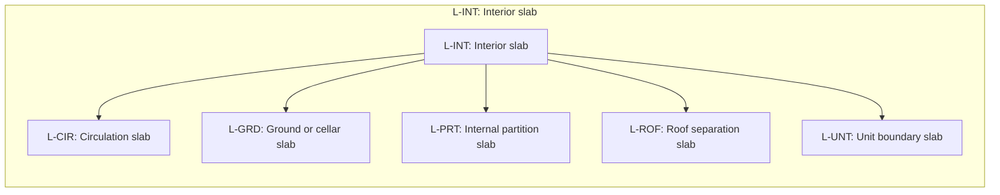

# Separator slab role classification

Source: [`separator-slab-role-classification-en.skos.ttl`](sources/separator-slab-role.ttl)

## Scheme

- **definition (de):** Topologische Rollenklassifikation fuer deckenbasierte Trennelemente (SeparatorSlab), abgeleitet aus angrenzenden Raum- und Geschossbeziehungen.
- **definition (en):** Topological role classification for slab-based separating elements (SeparatorSlab), derived from adjacent space and level relationships.
- **prefLabel (de):** Klassifikation der Trenndeckenrollen
- **prefLabel (en):** Building Separator Slab Role Classification
- **title (en):** Building Separator Slab Role Classification

## Hierarchy

## Concepts

<button type="button" class="pbs-lang-btn" data-lang="de">DE</button>
<button type="button" class="pbs-lang-btn" data-lang="en">EN</button>

<table>
<thead>
<tr>
<th>Notation</th>
<th>Broader</th>
<th class="pbs-lang-col" data-lang="de" data-field="label">Label</th>
<th class="pbs-lang-col" data-lang="de" data-field="definition">Definition</th>
<th class="pbs-lang-col" data-lang="de" data-field="scope_note">Scope note</th>
<th class="pbs-lang-col" data-lang="en" data-field="label">Label</th>
<th class="pbs-lang-col" data-lang="en" data-field="definition">Definition</th>
<th class="pbs-lang-col" data-lang="en" data-field="scope_note">Scope note</th>
</tr>
</thead>
<tbody>
<tr>
<td>L-CIR</td>
<td>L-INT</td>
<td class="pbs-lang-col" data-lang="de" data-field="label">Erschliessungsdecke</td>
<td class="pbs-lang-col" data-lang="de" data-field="definition">Decke mit primaerem Bezug zu Erschliessungsraeumen.</td>
<td class="pbs-lang-col" data-lang="de" data-field="scope_note"></td>
<td class="pbs-lang-col" data-lang="en" data-field="label">Circulation slab</td>
<td class="pbs-lang-col" data-lang="en" data-field="definition">Slab associated primarily with circulation spaces.</td>
<td class="pbs-lang-col" data-lang="en" data-field="scope_note"></td>
</tr>
<tr>
<td>L-EXT</td>
<td></td>
<td class="pbs-lang-col" data-lang="de" data-field="label">Aussendeckung</td>
<td class="pbs-lang-col" data-lang="de" data-field="definition">Decke, die genutzten oder konditionierten Raum von der Aussenumgebung trennt.</td>
<td class="pbs-lang-col" data-lang="de" data-field="scope_note"></td>
<td class="pbs-lang-col" data-lang="en" data-field="label">Exterior slab</td>
<td class="pbs-lang-col" data-lang="en" data-field="definition">Slab separating occupied or conditioned space from the exterior environment.</td>
<td class="pbs-lang-col" data-lang="en" data-field="scope_note"></td>
</tr>
<tr>
<td>L-GRD</td>
<td>L-INT</td>
<td class="pbs-lang-col" data-lang="de" data-field="label">Boden- oder Kellerdecke</td>
<td class="pbs-lang-col" data-lang="de" data-field="definition">Decke auf Erdgeschossniveau oder unterhalb, die Innenraum von Erdreich oder aussenseitigen Untergeschossbedingungen trennt.</td>
<td class="pbs-lang-col" data-lang="de" data-field="scope_note"></td>
<td class="pbs-lang-col" data-lang="en" data-field="label">Ground or cellar slab</td>
<td class="pbs-lang-col" data-lang="en" data-field="definition">Slab at ground level or below grade separating interior from earth or exterior below-grade conditions.</td>
<td class="pbs-lang-col" data-lang="en" data-field="scope_note"></td>
</tr>
<tr>
<td>L-INT</td>
<td></td>
<td class="pbs-lang-col" data-lang="de" data-field="label">Innendeckung</td>
<td class="pbs-lang-col" data-lang="de" data-field="definition">Innendeckung, deren primaere Rolle durch die topologische Lage zu angrenzenden Raeumen oder Geschossen bestimmt wird.</td>
<td class="pbs-lang-col" data-lang="de" data-field="scope_note"></td>
<td class="pbs-lang-col" data-lang="en" data-field="label">Interior slab</td>
<td class="pbs-lang-col" data-lang="en" data-field="definition">Interior slab whose primary role is defined by adjacent space or level topology.</td>
<td class="pbs-lang-col" data-lang="en" data-field="scope_note"></td>
</tr>
<tr>
<td>L-PRT</td>
<td>L-INT</td>
<td class="pbs-lang-col" data-lang="de" data-field="label">Innere Trennplatte</td>
<td class="pbs-lang-col" data-lang="de" data-field="definition">Decke, die Raeume innerhalb derselben Nutzungseinheit ohne besondere Grenzrollenfunktion trennt.</td>
<td class="pbs-lang-col" data-lang="de" data-field="scope_note"></td>
<td class="pbs-lang-col" data-lang="en" data-field="label">Internal partition slab</td>
<td class="pbs-lang-col" data-lang="en" data-field="definition">Slab separating spaces within the same occupancy unit without a special boundary role.</td>
<td class="pbs-lang-col" data-lang="en" data-field="scope_note"></td>
</tr>
<tr>
<td>L-ROF</td>
<td>L-INT</td>
<td class="pbs-lang-col" data-lang="de" data-field="label">Dachabgrenzungsdecke</td>
<td class="pbs-lang-col" data-lang="de" data-field="definition">Decke als primaere Abgrenzung auf Dachniveau zwischen konditionierten und unkonditionierten Zonen.</td>
<td class="pbs-lang-col" data-lang="de" data-field="scope_note"></td>
<td class="pbs-lang-col" data-lang="en" data-field="label">Roof separation slab</td>
<td class="pbs-lang-col" data-lang="en" data-field="definition">Slab forming the primary separation at roof level between conditioned and unconditioned zones.</td>
<td class="pbs-lang-col" data-lang="en" data-field="scope_note"></td>
</tr>
<tr>
<td>L-UNT</td>
<td>L-INT</td>
<td class="pbs-lang-col" data-lang="de" data-field="label">Geschossdecke zwischen Nutzungseinheiten</td>
<td class="pbs-lang-col" data-lang="de" data-field="definition">Decke, die selbstaendige Nutzungs- oder Brandabschnittseinheiten vertikal voneinander trennt.</td>
<td class="pbs-lang-col" data-lang="de" data-field="scope_note"></td>
<td class="pbs-lang-col" data-lang="en" data-field="label">Unit boundary slab</td>
<td class="pbs-lang-col" data-lang="en" data-field="definition">Slab separating independent occupancy or fire-compartment units vertically.</td>
<td class="pbs-lang-col" data-lang="en" data-field="scope_note"></td>
</tr>
</tbody>
</table>

