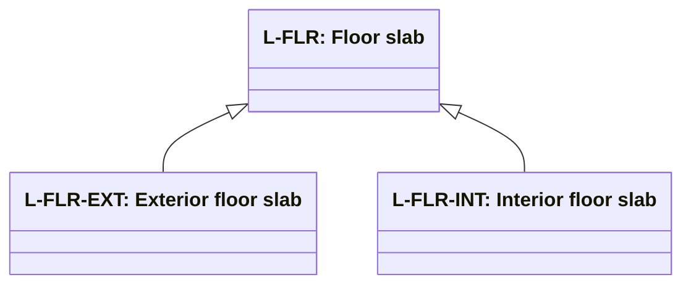

# Separator slab role classification

Source: [`separator-slab-role-classification-en.skos.ttl`](sources/separator-slab-role.ttl)

## Scheme

- **definition (de):** Topologische Rollenklassifikation fuer deckenbasierte Trennelemente (SeparatorSlab), gruppiert nach Deckenelementtyp und angrenzenden Raumbeziehungen.
- **definition (en):** Topological role classification for slab-based separating elements (SeparatorSlab), grouped by slab element type and adjacent space relationships.
- **prefLabel (de):** Klassifikation der Trenndeckenrollen
- **prefLabel (en):** Building Separator Slab Role Classification
- **title (en):** Building Separator Slab Role Classification

## Hierarchy

## Concepts

<button type="button" class="pbs-lang-btn" data-lang="de">DE</button>
<button type="button" class="pbs-lang-btn" data-lang="en">EN</button>

<table>
<thead>
<tr>
<th>Notation</th>
<th>Broader</th>
<th class="pbs-lang-col" data-lang="de" data-field="label">Label</th>
<th class="pbs-lang-col" data-lang="de" data-field="definition">Definition</th>
<th class="pbs-lang-col" data-lang="de" data-field="scope_note">Scope note</th>
<th class="pbs-lang-col" data-lang="en" data-field="label">Label</th>
<th class="pbs-lang-col" data-lang="en" data-field="definition">Definition</th>
<th class="pbs-lang-col" data-lang="en" data-field="scope_note">Scope note</th>
</tr>
</thead>
<tbody>
<tr>
<td>L-BAS</td>
<td></td>
<td class="pbs-lang-col" data-lang="de" data-field="label">Bodenplatte</td>
<td class="pbs-lang-col" data-lang="de" data-field="definition">Platte auf oder unter Gelaendehoehe als primaere Abgrenzung zwischen Gebaeude und Erdreich oder unterirdischen Bedingungen.</td>
<td class="pbs-lang-col" data-lang="de" data-field="scope_note"></td>
<td class="pbs-lang-col" data-lang="en" data-field="label">Base slab</td>
<td class="pbs-lang-col" data-lang="en" data-field="definition">Slab at or below ground level forming the primary separation between the building and earth or below-grade conditions.</td>
<td class="pbs-lang-col" data-lang="en" data-field="scope_note"></td>
</tr>
<tr>
<td>L-FLR</td>
<td></td>
<td class="pbs-lang-col" data-lang="de" data-field="label">Geschossdecke</td>
<td class="pbs-lang-col" data-lang="de" data-field="definition">Horizontale Decke zur Trennung genutzter Geschosse, ohne Bodenplatten- oder Dachrolle.</td>
<td class="pbs-lang-col" data-lang="de" data-field="scope_note"></td>
<td class="pbs-lang-col" data-lang="en" data-field="label">Floor slab</td>
<td class="pbs-lang-col" data-lang="en" data-field="definition">Horizontal slab separating occupied levels, excluding base slab and roof roles.</td>
<td class="pbs-lang-col" data-lang="en" data-field="scope_note"></td>
</tr>
<tr>
<td>L-FLR-EXT</td>
<td>L-FLR</td>
<td class="pbs-lang-col" data-lang="de" data-field="label">Aussere Geschossdecke</td>
<td class="pbs-lang-col" data-lang="de" data-field="definition">Geschossdecke mit Exposition zur Aussenumgebung.</td>
<td class="pbs-lang-col" data-lang="de" data-field="scope_note"></td>
<td class="pbs-lang-col" data-lang="en" data-field="label">Exterior floor slab</td>
<td class="pbs-lang-col" data-lang="en" data-field="definition">Floor slab exposed to the exterior environment.</td>
<td class="pbs-lang-col" data-lang="en" data-field="scope_note"></td>
</tr>
<tr>
<td>L-FLR-INT</td>
<td>L-FLR</td>
<td class="pbs-lang-col" data-lang="de" data-field="label">Innere Geschossdecke</td>
<td class="pbs-lang-col" data-lang="de" data-field="definition">Geschossdecke, die Innenraeume oder Geschosse innerhalb der Gebaeudehuelle voneinander trennt.</td>
<td class="pbs-lang-col" data-lang="de" data-field="scope_note"></td>
<td class="pbs-lang-col" data-lang="en" data-field="label">Interior floor slab</td>
<td class="pbs-lang-col" data-lang="en" data-field="definition">Floor slab separating interior spaces or levels within the building envelope.</td>
<td class="pbs-lang-col" data-lang="en" data-field="scope_note"></td>
</tr>
<tr>
<td>L-ROF</td>
<td></td>
<td class="pbs-lang-col" data-lang="de" data-field="label">Dachdecke</td>
<td class="pbs-lang-col" data-lang="de" data-field="definition">Decke als primaere wetterexponierte Abgrenzung auf Dachniveau.</td>
<td class="pbs-lang-col" data-lang="de" data-field="scope_note"></td>
<td class="pbs-lang-col" data-lang="en" data-field="label">Roof slab</td>
<td class="pbs-lang-col" data-lang="en" data-field="definition">Slab forming the primary weather-exposed separation at roof level.</td>
<td class="pbs-lang-col" data-lang="en" data-field="scope_note"></td>
</tr>
</tbody>
</table>

