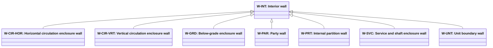

# Separator wall role classification

Source: [`separator-wall-role-classification-en.skos.ttl`](sources/separator-wall-role.ttl)

## Scheme

- **definition (de):** Topologische Rollenklassifikation fuer wandbasierte Trennelemente (SeparatorWall), abgeleitet aus den angrenzenden Raumbeziehungen.
- **definition (en):** Topological role classification for wall-based separating elements (SeparatorWall), derived from adjacent space relationships.
- **prefLabel (de):** Klassifikation der Trennwandrollen
- **prefLabel (en):** Building Separator Wall Role Classification
- **title (en):** Building Separator Wall Role Classification

## Hierarchy

## Concepts

<button type="button" class="pbs-lang-btn" data-lang="de">DE</button>
<button type="button" class="pbs-lang-btn" data-lang="en">EN</button>

<table>
<thead>
<tr>
<th>Notation</th>
<th>Broader</th>
<th class="pbs-lang-col" data-lang="de" data-field="label">Label</th>
<th class="pbs-lang-col" data-lang="de" data-field="definition">Definition</th>
<th class="pbs-lang-col" data-lang="de" data-field="scope_note">Scope note</th>
<th class="pbs-lang-col" data-lang="en" data-field="label">Label</th>
<th class="pbs-lang-col" data-lang="en" data-field="definition">Definition</th>
<th class="pbs-lang-col" data-lang="en" data-field="scope_note">Scope note</th>
</tr>
</thead>
<tbody>
<tr>
<td>W-CIR-HOR</td>
<td>W-INT</td>
<td class="pbs-lang-col" data-lang="de" data-field="label">Wand an horizontaler Erschliessung</td>
<td class="pbs-lang-col" data-lang="de" data-field="definition">Wand, die einen horizontalen Erschliessungsraum begrenzt.</td>
<td class="pbs-lang-col" data-lang="de" data-field="scope_note"></td>
<td class="pbs-lang-col" data-lang="en" data-field="label">Horizontal circulation enclosure wall</td>
<td class="pbs-lang-col" data-lang="en" data-field="definition">Wall bounding a horizontal circulation space.</td>
<td class="pbs-lang-col" data-lang="en" data-field="scope_note"></td>
</tr>
<tr>
<td>W-CIR-VRT</td>
<td>W-INT</td>
<td class="pbs-lang-col" data-lang="de" data-field="label">Treppenhauswand / Aufzugwand</td>
<td class="pbs-lang-col" data-lang="de" data-field="definition">Wand, die einen vertikalen Erschliessungsraum begrenzt.</td>
<td class="pbs-lang-col" data-lang="de" data-field="scope_note"></td>
<td class="pbs-lang-col" data-lang="en" data-field="label">Vertical circulation enclosure wall</td>
<td class="pbs-lang-col" data-lang="en" data-field="definition">Wall bounding a vertical circulation space.</td>
<td class="pbs-lang-col" data-lang="en" data-field="scope_note"></td>
</tr>
<tr>
<td>W-EXT</td>
<td></td>
<td class="pbs-lang-col" data-lang="de" data-field="label">Aussenwand</td>
<td class="pbs-lang-col" data-lang="de" data-field="definition">Wand, die konditionierten oder nutzbaren Raum von der Aussenumgebung trennt.</td>
<td class="pbs-lang-col" data-lang="de" data-field="scope_note"></td>
<td class="pbs-lang-col" data-lang="en" data-field="label">Exterior wall</td>
<td class="pbs-lang-col" data-lang="en" data-field="definition">Wall separating conditioned or occupied space from the exterior environment.</td>
<td class="pbs-lang-col" data-lang="en" data-field="scope_note"></td>
</tr>
<tr>
<td>W-GRD</td>
<td>W-INT</td>
<td class="pbs-lang-col" data-lang="de" data-field="label">Keller-Umfassungswand</td>
<td class="pbs-lang-col" data-lang="de" data-field="definition">Innenwand mit Bezug zu Keller- oder unterirdischen Randbedingungen.</td>
<td class="pbs-lang-col" data-lang="de" data-field="scope_note"></td>
<td class="pbs-lang-col" data-lang="en" data-field="label">Below-grade enclosure wall</td>
<td class="pbs-lang-col" data-lang="en" data-field="definition">Interior wall associated with below-grade or cellar perimeter conditions.</td>
<td class="pbs-lang-col" data-lang="en" data-field="scope_note"></td>
</tr>
<tr>
<td>W-INT</td>
<td></td>
<td class="pbs-lang-col" data-lang="de" data-field="label">Innenwand</td>
<td class="pbs-lang-col" data-lang="de" data-field="definition">Innenwand, deren primaere Rolle durch die topologische Lage zu angrenzenden Raeumen bestimmt wird.</td>
<td class="pbs-lang-col" data-lang="de" data-field="scope_note"></td>
<td class="pbs-lang-col" data-lang="en" data-field="label">Interior wall</td>
<td class="pbs-lang-col" data-lang="en" data-field="definition">Interior wall whose primary role is defined by adjacent space topology.</td>
<td class="pbs-lang-col" data-lang="en" data-field="scope_note"></td>
</tr>
<tr>
<td>W-PAR</td>
<td>W-INT</td>
<td class="pbs-lang-col" data-lang="de" data-field="label">Brandwand / Grenzwand</td>
<td class="pbs-lang-col" data-lang="de" data-field="definition">Wand, die dieses Gebaeude von einem Nachbargebaeude oder einer rechtlichen Grundstuecksgrenze trennt.</td>
<td class="pbs-lang-col" data-lang="de" data-field="scope_note"></td>
<td class="pbs-lang-col" data-lang="en" data-field="label">Party wall</td>
<td class="pbs-lang-col" data-lang="en" data-field="definition">Wall separating this building from an adjacent building or legal plot boundary.</td>
<td class="pbs-lang-col" data-lang="en" data-field="scope_note"></td>
</tr>
<tr>
<td>W-PRT</td>
<td>W-INT</td>
<td class="pbs-lang-col" data-lang="de" data-field="label">Innere Trennwand</td>
<td class="pbs-lang-col" data-lang="de" data-field="definition">Wand, die Raeume innerhalb derselben Nutzungseinheit voneinander trennt.</td>
<td class="pbs-lang-col" data-lang="de" data-field="scope_note"></td>
<td class="pbs-lang-col" data-lang="en" data-field="label">Internal partition wall</td>
<td class="pbs-lang-col" data-lang="en" data-field="definition">Wall separating spaces within the same occupancy unit.</td>
<td class="pbs-lang-col" data-lang="en" data-field="scope_note"></td>
</tr>
<tr>
<td>W-SVC</td>
<td>W-INT</td>
<td class="pbs-lang-col" data-lang="de" data-field="label">Technik- und Schachtwand</td>
<td class="pbs-lang-col" data-lang="de" data-field="definition">Wand, die Technik-, Versorgungs- oder Hohlraeume begrenzt.</td>
<td class="pbs-lang-col" data-lang="de" data-field="scope_note"></td>
<td class="pbs-lang-col" data-lang="en" data-field="label">Service and shaft enclosure wall</td>
<td class="pbs-lang-col" data-lang="en" data-field="definition">Wall bounding technical, utility, or void spaces.</td>
<td class="pbs-lang-col" data-lang="en" data-field="scope_note"></td>
</tr>
<tr>
<td>W-UNT</td>
<td>W-INT</td>
<td class="pbs-lang-col" data-lang="de" data-field="label">Wohnungstrennwand</td>
<td class="pbs-lang-col" data-lang="de" data-field="definition">Wand, die selbstaendige Nutzungs- oder Brandabschnittseinheiten voneinander trennt.</td>
<td class="pbs-lang-col" data-lang="de" data-field="scope_note"></td>
<td class="pbs-lang-col" data-lang="en" data-field="label">Unit boundary wall</td>
<td class="pbs-lang-col" data-lang="en" data-field="definition">Wall separating independent occupancy or fire-compartment units.</td>
<td class="pbs-lang-col" data-lang="en" data-field="scope_note"></td>
</tr>
</tbody>
</table>

