# Abstract slab separator products

Source: [`slab-separator-products.skos.ttl`](sources/slab-separator-product.ttl)

## Scheme

- **definition (de):** Produkttyp-Klassifikation fuer deckenplattenbasierte Trennelemente einschliesslich Geschossdecken, Bodenplatten und Dachdecken. Fuer Katalog-, Spezifikations- und Kostenworkflows; mit abstrakter Materialklassifikation fuer dominante Substanz und Trenndeckenrollen-Klassifikation fuer topologische Rolle kombinieren.
- **definition (en):** Product-type classification for slab-based separating elements including floor slabs, base slabs, and roof slabs. For catalog, specification, and cost workflows; pair with abstract material classification for dominant substance and separator slab role classification for topological role.
- **prefLabel (de):** Abstrakte Deckenplatten-Trennelementprodukte
- **prefLabel (en):** Abstract slab separator products
- **title (en):** Abstract slab separator products

## Hierarchy

```mermaid
classDiagram
direction TB
class n_SSP_HBV["SSP-HBV: Timber–concrete composite slab (HBV)"]
class n_SSP_HBV_CONC["SSP-HBV-CONC: HBV concrete topping layer"]
class n_SSP_HBV_WOD["SSP-HBV-WOD: HBV timber base layer"]
class n_SSP_HOLZ_LEHM["SSP-HOLZ-LEHM: Timber–clay slab / deck"]
class n_SSP_HOLZ_LEHM_MSN["SSP-HOLZ-LEHM-MSN: Timber–clay slab clay infill layer"]
class n_SSP_HOLZ_LEHM_WOD["SSP-HOLZ-LEHM-WOD: Timber–clay slab timber layer"]
class n_SSP_STEEL_COMPOSITE["SSP-STEEL-COMPOSITE: Steel deck / composite slab"]
class n_SSP_STEEL_COMPOSITE_CONC["SSP-STEEL-COMPOSITE-CONC: Composite slab concrete topping layer"]
class n_SSP_STEEL_COMPOSITE_STL["SSP-STEEL-COMPOSITE-STL: Steel deck layer"]
n_SSP_HBV <|-- n_SSP_HBV_CONC
n_SSP_HBV <|-- n_SSP_HBV_WOD
n_SSP_HOLZ_LEHM <|-- n_SSP_HOLZ_LEHM_MSN
n_SSP_HOLZ_LEHM <|-- n_SSP_HOLZ_LEHM_WOD
n_SSP_STEEL_COMPOSITE <|-- n_SSP_STEEL_COMPOSITE_CONC
n_SSP_STEEL_COMPOSITE <|-- n_SSP_STEEL_COMPOSITE_STL
```

## Concepts

<button type="button" class="pbs-lang-btn" data-lang="de">DE</button>
<button type="button" class="pbs-lang-btn" data-lang="en">EN</button>

<table>
<thead>
<tr>
<th>Notation</th>
<th>Broader</th>
<th class="pbs-lang-col" data-lang="de" data-field="label">Label</th>
<th class="pbs-lang-col" data-lang="de" data-field="definition">Definition</th>
<th class="pbs-lang-col" data-lang="de" data-field="description">Description</th>
<th class="pbs-lang-col" data-lang="de" data-field="scope_note">Scope note</th>
<th class="pbs-lang-col" data-lang="en" data-field="label">Label</th>
<th class="pbs-lang-col" data-lang="en" data-field="definition">Definition</th>
<th class="pbs-lang-col" data-lang="en" data-field="description">Description</th>
<th class="pbs-lang-col" data-lang="en" data-field="scope_note">Scope note</th>
</tr>
</thead>
<tbody>
<tr>
<td>SSP-CLT</td>
<td></td>
<td class="pbs-lang-col" data-lang="de" data-field="label">Brettsperrholz-Decke / -Platte (CLT)</td>
<td class="pbs-lang-col" data-lang="de" data-field="definition">Decke oder Platte mit primaerer Brettsperrholz- (CLT-) oder Brettschichtholz-Plattenkonstruktion, einschliesslich werkseitig vorgefertigter Holz-Massivdecken.</td>
<td class="pbs-lang-col" data-lang="de" data-field="description">Tragendes horizontales Bauteil aus massiven Holzplatten, ein- oder zweiachsig spannend. Die Platten werden im Werk einschliesslich Öffnungen und Installationsführungen abgebunden, eingehoben und entlang der Plattenstösse verschraubt. Geeignet für Geschoss- und Dachdecken mit sichtbarer Holzuntersicht, hohem Vorfertigungsgrad und geringem Eigengewicht.</td>
<td class="pbs-lang-col" data-lang="de" data-field="scope_note"></td>
<td class="pbs-lang-col" data-lang="en" data-field="label">Cross-laminated timber (CLT) slab</td>
<td class="pbs-lang-col" data-lang="en" data-field="definition">Slab or deck with primary cross-laminated timber (CLT) or glulam plate structure, including factory-prefabricated mass-timber floor and roof decks.</td>
<td class="pbs-lang-col" data-lang="en" data-field="description">Load-bearing horizontal element formed by solid mass timber plates that span in one or two directions. Plates are cut to size in the factory including openings and service routes, lifted into position, and screwed along the panel joints. Suitable for floor and roof decks where a visible timber soffit, a high degree of prefabrication, and low dead load are required.</td>
<td class="pbs-lang-col" data-lang="en" data-field="scope_note"></td>
</tr>
<tr>
<td>SSP-HBV</td>
<td></td>
<td class="pbs-lang-col" data-lang="de" data-field="label">Holz-Beton-Verbunddecke (HBV)</td>
<td class="pbs-lang-col" data-lang="de" data-field="definition">Hybride Decke mit Holztragwerk (z. B. Blockholzplatte, Brettsperrholz oder Rippendecke) und schubfest verbundener Ortbeton- oder Fertigbetonauflage.</td>
<td class="pbs-lang-col" data-lang="de" data-field="description">Tragendes horizontales Bauteil, das eine Holzplatten- oder Rippenkonstruktion mit einer druckübertragenden Betonauflage verbindet. Beide Schichten werden über Kerven, Schrauben oder Verbindungsmittel schubfest gekoppelt, der Beton wird vor Ort eingebracht oder als vorgefertigtes Verbundelement geliefert. Geeignet für Geschossdecken mit grösseren Spannweiten, besserem Schallschutz und höherer Masse als reine Holzdecken.</td>
<td class="pbs-lang-col" data-lang="de" data-field="scope_note"></td>
<td class="pbs-lang-col" data-lang="en" data-field="label">Timber–concrete composite slab (HBV)</td>
<td class="pbs-lang-col" data-lang="en" data-field="definition">Hybrid slab with timber base (for example block timber, CLT, or rib deck) and a shear-connected concrete topping cast on site or prefabricated as a composite element.</td>
<td class="pbs-lang-col" data-lang="en" data-field="description">Load-bearing horizontal element combining a timber plate or rib structure with a concrete topping that takes the compression forces. Both layers are joined shear-resistant by notches, screws, or connectors, with the concrete cast on site or supplied as a prefabricated composite element. Suitable for floor decks that require longer spans, better acoustic performance, and more mass than a pure timber deck.</td>
<td class="pbs-lang-col" data-lang="en" data-field="scope_note"></td>
</tr>
<tr>
<td>SSP-HBV-CONC</td>
<td>SSP-HBV</td>
<td class="pbs-lang-col" data-lang="de" data-field="label">HBV Betonauflage-Schicht</td>
<td class="pbs-lang-col" data-lang="de" data-field="definition">Betonauflage-Schicht einer HBV-Decke, in Ortbeton oder als Fertigteil, schubfest mit dem Holztragwerk verbunden.</td>
<td class="pbs-lang-col" data-lang="de" data-field="description">Betonanteil einer Holz-Beton-Verbunddecke, der die Druckzone, die schalltechnisch wirksame Masse und die lastverteilende Oberfläche bildet. Vor Ort auf das Holztragwerk betoniert oder gemeinsam mit diesem vorgefertigt, bewehrt und an die Verbindungsmittel angeschlossen. Wird separat ausgewiesen, wenn Holz- und Betonanteil der Decke getrennt ermittelt oder bewertet werden.</td>
<td class="pbs-lang-col" data-lang="de" data-field="scope_note">LCA-Schichtkomponente von SSP-HBV. Fuer Oekobilanz-Zerlegung und CO2-Berechnung; keine eigenstaendige Deckenprodukt-Klassifikation.</td>
<td class="pbs-lang-col" data-lang="en" data-field="label">HBV concrete topping layer</td>
<td class="pbs-lang-col" data-lang="en" data-field="definition">Concrete topping layer of an HBV slab, cast in situ or prefabricated, shear-connected to the timber base.</td>
<td class="pbs-lang-col" data-lang="en" data-field="description">Concrete part of a timber-concrete composite deck, forming the compression zone, the mass for acoustic performance, and the load-distributing surface. Cast on the timber base on site or prefabricated together with it, reinforced and tied to the shear connectors. Accounted separately where the timber and concrete parts of the deck are quantified or assessed individually.</td>
<td class="pbs-lang-col" data-lang="en" data-field="scope_note">LCA layer component of SSP-HBV. Used for ecobilans decomposition and carbon calculation; not a standalone slab product classification.</td>
</tr>
<tr>
<td>SSP-HBV-WOD</td>
<td>SSP-HBV</td>
<td class="pbs-lang-col" data-lang="de" data-field="label">HBV Holztragwerk-Schicht</td>
<td class="pbs-lang-col" data-lang="de" data-field="definition">Holztragwerk-Schicht einer HBV-Decke (Blockholz, Brettsperrholz, Rippendecke oder aehnliche Holzwerkstoff-Konstruktion).</td>
<td class="pbs-lang-col" data-lang="de" data-field="description">Holzanteil einer Holz-Beton-Verbunddecke, der Zug- und Biegekräfte aufnimmt und die Untersicht der fertigen Decke bildet. Als Massivholzplatte, Brettsperrholzelement oder Rippendecke vorgefertigt und mit bereits eingebauten Verbindungsmitteln geliefert. Wird separat ausgewiesen, wenn Holz- und Betonanteil der Decke getrennt ermittelt oder bewertet werden.</td>
<td class="pbs-lang-col" data-lang="de" data-field="scope_note">LCA-Schichtkomponente von SSP-HBV. Fuer Oekobilanz-Zerlegung und CO2-Berechnung; keine eigenstaendige Deckenprodukt-Klassifikation.</td>
<td class="pbs-lang-col" data-lang="en" data-field="label">HBV timber base layer</td>
<td class="pbs-lang-col" data-lang="en" data-field="definition">Timber base layer of an HBV slab (block timber, CLT, rib deck, or similar engineered-wood structure).</td>
<td class="pbs-lang-col" data-lang="en" data-field="description">Timber part of a timber-concrete composite deck, taking the tensile and bending forces and forming the soffit of the finished slab. Prefabricated as solid timber plate, cross-laminated panel, or rib deck and delivered with the shear connectors already fitted. Accounted separately where the timber and concrete parts of the deck are quantified or assessed individually.</td>
<td class="pbs-lang-col" data-lang="en" data-field="scope_note">LCA layer component of SSP-HBV. Used for ecobilans decomposition and carbon calculation; not a standalone slab product classification.</td>
</tr>
<tr>
<td>SSP-HOLZ-LEHM</td>
<td></td>
<td class="pbs-lang-col" data-lang="de" data-field="label">Holz-Lehm-Decke</td>
<td class="pbs-lang-col" data-lang="de" data-field="definition">Decke mit Holztraegern oder -rahmen und Stampflehm-Ausfachung oder -auflage, einschliesslich vorgefertigter Holz-Lehm-Deckenelemente.</td>
<td class="pbs-lang-col" data-lang="de" data-field="description">Tragendes horizontales Bauteil mit Holzbalken oder Holzrahmen und schwerer Lehmausfachung oder Lehmauflage zwischen oder über den Holzteilen. Als vorgefertigte Elemente hergestellt oder vor Ort verfüllt, wobei der feuchte Lehm verdichtet und vor dem Bodenaufbau getrocknet wird. Geeignet für Geschossdecken mit Anforderungen an zusätzliche Masse für den Schallschutz, Feuchtepufferung und emissionsarme Naturbaustoffe.</td>
<td class="pbs-lang-col" data-lang="de" data-field="scope_note"></td>
<td class="pbs-lang-col" data-lang="en" data-field="label">Timber–clay slab / deck</td>
<td class="pbs-lang-col" data-lang="en" data-field="definition">Slab or deck with timber joists or frame and rammed-clay (Stampflehm) infill or topping, including prefabricated timber–clay panel systems.</td>
<td class="pbs-lang-col" data-lang="en" data-field="description">Load-bearing horizontal element with timber joists or a timber frame and a heavy clay infill or topping between or above the timber members. Produced as prefabricated panels or filled on site, with the moist clay compacted and dried before the floor build-up follows. Suitable for floor decks that need added mass for sound insulation, humidity buffering, and low-emission natural materials.</td>
<td class="pbs-lang-col" data-lang="en" data-field="scope_note"></td>
</tr>
<tr>
<td>SSP-HOLZ-LEHM-MSN</td>
<td>SSP-HOLZ-LEHM</td>
<td class="pbs-lang-col" data-lang="de" data-field="label">Holz-Lehm-Decke Lehmschicht</td>
<td class="pbs-lang-col" data-lang="de" data-field="definition">Stampflehm-Ausfachungs- oder -auflage-Schicht einer Holz-Lehm-Decke.</td>
<td class="pbs-lang-col" data-lang="de" data-field="description">Lehmanteil einer Holz-Lehm-Decke, der Masse für Schallschutz, Wärmespeicherung und Feuchtepufferung im Innenraum liefert. Als feuchter Stampflehm, Lehmplatten oder Lehmelemente zwischen oder auf der Holzkonstruktion eingebracht, verdichtet und vor weiteren Schichten getrocknet. Wird separat ausgewiesen, wenn Holz- und Lehmanteil der Decke getrennt ermittelt oder bewertet werden.</td>
<td class="pbs-lang-col" data-lang="de" data-field="scope_note">LCA-Schichtkomponente von SSP-HOLZ-LEHM. Fuer Oekobilanz-Zerlegung und CO2-Berechnung; keine eigenstaendige Deckenprodukt-Klassifikation.</td>
<td class="pbs-lang-col" data-lang="en" data-field="label">Timber–clay slab clay infill layer</td>
<td class="pbs-lang-col" data-lang="en" data-field="definition">Rammed-clay (Stampflehm) infill or topping layer of a timber–clay slab.</td>
<td class="pbs-lang-col" data-lang="en" data-field="description">Clay part of a timber-clay deck, supplying mass for sound insulation, thermal storage, and indoor humidity buffering. Placed as moist rammed clay, clay boards, or clay elements between or on the timber structure, compacted, and dried before further layers follow. Accounted separately where the timber and clay parts of the deck are quantified or assessed individually.</td>
<td class="pbs-lang-col" data-lang="en" data-field="scope_note">LCA layer component of SSP-HOLZ-LEHM. Used for ecobilans decomposition and carbon calculation; not a standalone slab product classification.</td>
</tr>
<tr>
<td>SSP-HOLZ-LEHM-WOD</td>
<td>SSP-HOLZ-LEHM</td>
<td class="pbs-lang-col" data-lang="de" data-field="label">Holz-Lehm-Decke Holzschicht</td>
<td class="pbs-lang-col" data-lang="de" data-field="definition">Holztraeger- oder -rahmen-Schicht einer Holz-Lehm-Decke.</td>
<td class="pbs-lang-col" data-lang="de" data-field="description">Holzanteil einer Holz-Lehm-Decke, der die Spannweite, die Lastabtragung und das Traggerüst für die Lehmfüllung bereitstellt. Als Balken, Rippen oder Rahmenelement vorgefertigt und vor dem Einbringen der Füllung auf die tragenden Wände aufgelegt. Wird separat ausgewiesen, wenn Holz- und Lehmanteil der Decke getrennt ermittelt oder bewertet werden.</td>
<td class="pbs-lang-col" data-lang="de" data-field="scope_note">LCA-Schichtkomponente von SSP-HOLZ-LEHM. Fuer Oekobilanz-Zerlegung und CO2-Berechnung; keine eigenstaendige Deckenprodukt-Klassifikation.</td>
<td class="pbs-lang-col" data-lang="en" data-field="label">Timber–clay slab timber layer</td>
<td class="pbs-lang-col" data-lang="en" data-field="definition">Timber joist or frame layer of a timber–clay slab.</td>
<td class="pbs-lang-col" data-lang="en" data-field="description">Timber part of a timber-clay deck, providing the span, the load transfer, and the frame that holds the clay fill. Prefabricated as joists, ribs, or a panel frame and set on the supporting walls before the fill is placed. Accounted separately where the timber and clay parts of the deck are quantified or assessed individually.</td>
<td class="pbs-lang-col" data-lang="en" data-field="scope_note">LCA layer component of SSP-HOLZ-LEHM. Used for ecobilans decomposition and carbon calculation; not a standalone slab product classification.</td>
</tr>
<tr>
<td>SSP-INSITU</td>
<td></td>
<td class="pbs-lang-col" data-lang="de" data-field="label">Ortbeton-Decke / -Platte</td>
<td class="pbs-lang-col" data-lang="de" data-field="definition">Decke oder Platte in Ortbeton oder Stahlbeton ausgefuehrt.</td>
<td class="pbs-lang-col" data-lang="de" data-field="description">Tragendes horizontales Bauteil aus vor Ort betoniertem Stahlbeton, das zwischen Wänden, Unterzügen oder Stützen spannt. Schalung, Bewehrung und Betonage erfolgen auf der Baustelle, wodurch eine fugenlose monolithische Platte entsteht. Geeignet für Geschossdecken, Bodenplatten und Dachdecken mit hoher Tragfähigkeit, Feuerwiderstand und Speichermasse.</td>
<td class="pbs-lang-col" data-lang="de" data-field="scope_note"></td>
<td class="pbs-lang-col" data-lang="en" data-field="label">In-situ concrete slab</td>
<td class="pbs-lang-col" data-lang="en" data-field="definition">Slab cast in place from reinforced or plain concrete.</td>
<td class="pbs-lang-col" data-lang="en" data-field="description">Load-bearing horizontal element cast in place from reinforced concrete, spanning between walls, beams, or columns. Formwork, reinforcement, and pouring are carried out on site, producing a jointless monolithic plate. Suitable for floor, base, and roof slabs with high load capacity, fire resistance, and thermal mass.</td>
<td class="pbs-lang-col" data-lang="en" data-field="scope_note"></td>
</tr>
<tr>
<td>SSP-LIGHTWEIGHT</td>
<td></td>
<td class="pbs-lang-col" data-lang="de" data-field="label">Leichtbau-Decke / -Platte</td>
<td class="pbs-lang-col" data-lang="de" data-field="definition">Leichtbau-Decken- oder Plattensystem mit nicht-monolithischer Primaerkonstruktion.</td>
<td class="pbs-lang-col" data-lang="de" data-field="description">Horizontale Decke oder Plattform mit leichter, nicht monolithischer Primärkonstruktion aus Profilen, Rippen oder Paneelen für begrenzte Lasten. Vor Ort aus vorgefertigten Teilen montiert und am Tragwerk befestigt, in der Regel ohne schwere Auflage. Geeignet für untergeordnete Decken, Technikpodeste und Installationsebenen, bei denen geringes Eigengewicht und Rückbaubarkeit wichtiger sind als Masse.</td>
<td class="pbs-lang-col" data-lang="de" data-field="scope_note"></td>
<td class="pbs-lang-col" data-lang="en" data-field="label">Lightweight slab system</td>
<td class="pbs-lang-col" data-lang="en" data-field="definition">Lightweight slab system with non-monolithic primary structure.</td>
<td class="pbs-lang-col" data-lang="en" data-field="description">Horizontal deck or platform with a light, non-monolithic primary structure of profiles, ribs, or panels carrying limited loads. Assembled on site from prefabricated parts and fixed to the supporting structure, normally without a heavy topping. Suitable for secondary decks, technical platforms, and service levels where low dead load and demountability matter more than mass.</td>
<td class="pbs-lang-col" data-lang="en" data-field="scope_note"></td>
</tr>
<tr>
<td>SSP-OTH</td>
<td></td>
<td class="pbs-lang-col" data-lang="de" data-field="label">Sonstige / unbekannte Decke / Platte</td>
<td class="pbs-lang-col" data-lang="de" data-field="definition">Deckenplatten-Trennelementprodukt nicht klassifiziert oder noch unbekannt.</td>
<td class="pbs-lang-col" data-lang="de" data-field="description">Platzhalter für Deckenprodukte, deren Bauart zum Zeitpunkt der Ausschreibung noch nicht festgelegt oder nicht klassifiziert ist. Funktionale Anforderungen wie Spannweite, Nutzlast, Feuerwiderstand und Schallschutz sind gesondert zu beschreiben. Nur in frühen Planungsphasen oder bei unvollständiger Datenlage verwenden.</td>
<td class="pbs-lang-col" data-lang="de" data-field="scope_note">Fallback fuer fruehe Entwurfsstufen oder fehlende Daten.</td>
<td class="pbs-lang-col" data-lang="en" data-field="label">Other / unknown slab separator</td>
<td class="pbs-lang-col" data-lang="en" data-field="definition">Slab separator product not classified or not yet known.</td>
<td class="pbs-lang-col" data-lang="en" data-field="description">Placeholder for slab products whose construction type is not yet fixed or not classified at tender stage. Functional requirements such as span, imposed load, fire resistance, and acoustic performance must be stated separately. Use only in early design stages or where data is incomplete.</td>
<td class="pbs-lang-col" data-lang="en" data-field="scope_note">Fallback for early design stages or missing data.</td>
</tr>
<tr>
<td>SSP-PREFAB-CONC</td>
<td></td>
<td class="pbs-lang-col" data-lang="de" data-field="label">Elementdecke / -platte Beton</td>
<td class="pbs-lang-col" data-lang="de" data-field="definition">Decke oder Platte aus vorgefertigten Betonelementen wie Hohldiele, Doppel-T-Traeger oder Flachdeckelementen.</td>
<td class="pbs-lang-col" data-lang="de" data-field="description">Tragendes horizontales Bauteil aus werkseitig hergestellten Betonelementen wie Hohldielen, Doppel-T-Trägern oder Flachdeckenelementen. Die Elemente werden einbaufertig geliefert, auf das Tragwerk versetzt und über Fugenverguss oder eine statisch wirksame Ortbetonauflage verbunden. Geeignet für Geschoss- und Dachdecken mit kurzer Montagezeit und grossen Spannweiten bei geringem Aufwand auf der Baustelle.</td>
<td class="pbs-lang-col" data-lang="de" data-field="scope_note"></td>
<td class="pbs-lang-col" data-lang="en" data-field="label">Prefabricated concrete slab</td>
<td class="pbs-lang-col" data-lang="en" data-field="definition">Slab from prefabricated concrete elements such as hollow-core, double-tee, or flat slabs.</td>
<td class="pbs-lang-col" data-lang="en" data-field="description">Load-bearing horizontal element assembled from factory-made concrete units such as hollow-core, double-tee, or flat slab elements. Elements are delivered ready to install, set on the supporting structure, and joined with grouted joints or a structural concrete topping. Suitable for floor and roof slabs where short erection times and large spans with little site labour are required.</td>
<td class="pbs-lang-col" data-lang="en" data-field="scope_note"></td>
</tr>
<tr>
<td>SSP-STEEL-COMPOSITE</td>
<td></td>
<td class="pbs-lang-col" data-lang="de" data-field="label">Stahlverbunddecke</td>
<td class="pbs-lang-col" data-lang="de" data-field="definition">Decke mit primaerer Stahltrapezprofil-, Traeger- oder Stahl-Beton-Verbundkonstruktion.</td>
<td class="pbs-lang-col" data-lang="de" data-field="description">Tragendes horizontales Bauteil, bei dem Stahltrapezprofile oder Stahlträger mit einer Betonplatte zusammenwirken. Das Stahlprofilblech wird als verlorene Schalung auf das Stahltragwerk verlegt und über Kopfbolzendübel schubfest mit dem aufbetonierten Beton verbunden. Geeignet für Geschoss- und Dachdecken mit grossen Spannweiten, geringer Konstruktionshöhe und rascher Montage.</td>
<td class="pbs-lang-col" data-lang="de" data-field="scope_note"></td>
<td class="pbs-lang-col" data-lang="en" data-field="label">Steel deck / composite slab</td>
<td class="pbs-lang-col" data-lang="en" data-field="definition">Slab with primary steel deck, beams, or composite steel-concrete system.</td>
<td class="pbs-lang-col" data-lang="en" data-field="description">Load-bearing horizontal element in which profiled steel decking or steel beams act together with a concrete slab. The steel deck is laid as permanent formwork on the steel frame and connected by shear studs to the concrete cast on top. Suitable for floor and roof slabs with long spans, low structural depth, and fast erection.</td>
<td class="pbs-lang-col" data-lang="en" data-field="scope_note"></td>
</tr>
<tr>
<td>SSP-STEEL-COMPOSITE-CONC</td>
<td>SSP-STEEL-COMPOSITE</td>
<td class="pbs-lang-col" data-lang="de" data-field="label">Stahlverbunddecke Betonauflage-Schicht</td>
<td class="pbs-lang-col" data-lang="de" data-field="definition">Betonauflage-Schicht einer Stahlverbunddecke.</td>
<td class="pbs-lang-col" data-lang="de" data-field="description">Betonanteil einer Verbunddecke, der die Druckzone und die belastbare Oberfläche der fertigen Decke bildet. Vor Ort auf das Stahlprofilblech betoniert, mit Matten- oder Stabbewehrung versehen und über Verbundmittel mit dem Stahl verbunden. Wird separat ausgewiesen, wenn Stahl- und Betonanteil der Decke getrennt ermittelt oder bewertet werden.</td>
<td class="pbs-lang-col" data-lang="de" data-field="scope_note">LCA-Schichtkomponente von SSP-STEEL-COMPOSITE. Fuer Oekobilanz-Zerlegung und CO2-Berechnung; keine eigenstaendige Deckenprodukt-Klassifikation.</td>
<td class="pbs-lang-col" data-lang="en" data-field="label">Composite slab concrete topping layer</td>
<td class="pbs-lang-col" data-lang="en" data-field="definition">Concrete topping layer of a steel-composite slab.</td>
<td class="pbs-lang-col" data-lang="en" data-field="description">Concrete part of a composite slab, forming the compression zone and the loadable surface of the finished deck. Cast on the steel decking on site with mesh or bar reinforcement and bonded to the steel through shear connectors. Accounted separately where the steel and concrete parts of the deck are quantified or assessed individually.</td>
<td class="pbs-lang-col" data-lang="en" data-field="scope_note">LCA layer component of SSP-STEEL-COMPOSITE. Used for ecobilans decomposition and carbon calculation; not a standalone slab product classification.</td>
</tr>
<tr>
<td>SSP-STEEL-COMPOSITE-STL</td>
<td>SSP-STEEL-COMPOSITE</td>
<td class="pbs-lang-col" data-lang="de" data-field="label">Stahltrapezprofil-Schicht</td>
<td class="pbs-lang-col" data-lang="de" data-field="definition">Stahltrapezprofil- oder Traeger-Schicht einer Stahlverbunddecke.</td>
<td class="pbs-lang-col" data-lang="de" data-field="description">Stahlanteil einer Verbunddecke aus Profilblech oder Trägern, der den Frischbeton aufnimmt und im fertigen Zustand als Zugbewehrung wirkt. Als gewalzte oder kaltgeformte Profile geliefert, eingehoben und vor dem Betonieren am Primärtragwerk befestigt. Wird separat ausgewiesen, wenn Stahl- und Betonanteil der Decke getrennt ermittelt oder bewertet werden.</td>
<td class="pbs-lang-col" data-lang="de" data-field="scope_note">LCA-Schichtkomponente von SSP-STEEL-COMPOSITE. Fuer Oekobilanz-Zerlegung und CO2-Berechnung; keine eigenstaendige Deckenprodukt-Klassifikation.</td>
<td class="pbs-lang-col" data-lang="en" data-field="label">Steel deck layer</td>
<td class="pbs-lang-col" data-lang="en" data-field="definition">Steel deck or profile layer of a steel-composite slab.</td>
<td class="pbs-lang-col" data-lang="en" data-field="description">Steel part of a composite slab, consisting of profiled sheeting or supporting beams that carry the wet concrete and act as tensile reinforcement in the finished deck. Delivered as rolled or cold-formed sections, lifted into place, and fixed to the primary frame before concreting. Accounted separately where the steel and concrete parts of the deck are quantified or assessed individually.</td>
<td class="pbs-lang-col" data-lang="en" data-field="scope_note">LCA layer component of SSP-STEEL-COMPOSITE. Used for ecobilans decomposition and carbon calculation; not a standalone slab product classification.</td>
</tr>
<tr>
<td>SSP-TIMBER</td>
<td></td>
<td class="pbs-lang-col" data-lang="de" data-field="label">Holzdecke / -platte</td>
<td class="pbs-lang-col" data-lang="de" data-field="definition">Decke oder Platte mit primaerer Holz- oder Holzwerkstoff-Konstruktion aus Traegern, Paneelen oder Rippendecke, ohne Brettsperrholz- (CLT-) Platten.</td>
<td class="pbs-lang-col" data-lang="de" data-field="description">Tragendes horizontales Bauteil mit primärer Konstruktion aus Holzbalken, Rippen oder Holzwerkstoffplatten, in der Regel mit Beplankung und darüberliegendem Bodenaufbau. Als Balken- oder Rippendeckenmodule vorgefertigt, vor Ort auf Wände oder Unterzüge aufgelegt und mit Schallschutzschichten und Beschwerung ergänzt. Geeignet für Geschoss- und Dachdecken mit geringem Eigengewicht, trockener Bauweise und kurzer Montagezeit.</td>
<td class="pbs-lang-col" data-lang="de" data-field="scope_note">Fuer Brettsperrholz- (CLT-) Platten SSP-CLT verwenden.</td>
<td class="pbs-lang-col" data-lang="en" data-field="label">Timber slab / deck</td>
<td class="pbs-lang-col" data-lang="en" data-field="definition">Slab or deck with primary timber joists, panels, or rib-deck structure, excluding cross-laminated timber (CLT) plate slabs.</td>
<td class="pbs-lang-col" data-lang="en" data-field="description">Load-bearing horizontal element with a primary structure of timber joists, ribs, or wood-based panels, usually with sheathing and a separating floor build-up above. Prefabricated as joist or rib-deck modules, set on walls or beams on site, and completed with acoustic layers and ballast fill. Suitable for floor and roof decks with low dead load, dry construction, and short erection times.</td>
<td class="pbs-lang-col" data-lang="en" data-field="scope_note">For cross-laminated timber (CLT) plate slabs use SSP-CLT.</td>
</tr>
</tbody>
</table>

