# Abstract topic classification

Source: [`topic-classification.skos.ttl`](sources/topic.ttl)

## Scheme

- **description (de):** Allgemeine Personeninteressen und Themenbereiche für CRM-Geschichten und LLM-Extraktion.
- **description (en):** General person interests and subject areas for CRM stories and LLM extraction.
- **prefLabel (de):** Abstrakte Themen-Klassifikation
- **prefLabel (en):** Abstract topic classification
- **title (en):** Abstract topic classification

## Hierarchy

```mermaid
classDiagram
direction TB
class n_ART["ART: Arts and entertainment"]
class n_ART_DSN["ART-DSN: Design"]
class n_ART_FAN["ART-FAN: Fan culture"]
class n_ART_FLM["ART-FLM: Film and cinema"]
class n_ART_LIT["ART-LIT: Literature"]
class n_ART_MUS["ART-MUS: Music"]
class n_ART_MUS_CLS["ART-MUS-CLS: Classical music"]
class n_ART_MUS_FLK["ART-MUS-FLK: Folk music"]
class n_ART_MUS_JAZ["ART-MUS-JAZ: Jazz"]
class n_ART_MUS_MUS["ART-MUS-MUS: Musicians"]
class n_ART_MUS_OPR["ART-MUS-OPR: Opera"]
class n_ART_MUS_ORC["ART-MUS-ORC: Orchestra"]
class n_ART_MUS_ROK["ART-MUS-ROK: Rock"]
class n_ART_MUS_SNG["ART-MUS-SNG: Singers"]
class n_ART_PHO["ART-PHO: Photography"]
class n_ART_THR["ART-THR: Theater"]
class n_ART_THR_ACT["ART-THR-ACT: Actors"]
class n_ART_VID["ART-VID: Video"]
class n_CAU["CAU: Causes and volunteering"]
class n_CAU_EDU["CAU-EDU: Education"]
class n_CAU_ENV["CAU-ENV: Environment"]
class n_FAM["FAM: Family and parenting"]
class n_FAM_PAR["FAM-PAR: Parenting"]
class n_FOD["FOD: Food and drink"]
class n_FOD_COK["FOD-COK: Cooking"]
class n_FOD_VEG["FOD-VEG: Vegan"]
class n_FOD_VGT["FOD-VGT: Vegetarian"]
class n_FOD_WIN["FOD-WIN: Wine"]
class n_POL["POL: Politics"]
class n_POL_ACT["POL-ACT: Active"]
class n_POL_AT["POL-AT: Austria"]
class n_POL_EU["POL-EU: European Union"]
class n_POL_RET["POL-RET: In retirement"]
class n_PRO["PRO: Professional topics"]
class n_PRO_CON["PRO-CON: Construction and AEC"]
class n_PRO_CON_BIM["PRO-CON-BIM: BIM and digital construction"]
class n_PRO_CON_FIR["PRO-CON-FIR: Fire safety"]
class n_PRO_FIN["PRO-FIN: Finance"]
class n_PRO_TEC["PRO-TEC: Technology"]
class n_PRO_TEC_AI["PRO-TEC-AI: Artificial intelligence"]
class n_PRO_TEC_SFT["PRO-TEC-SFT: Software"]
class n_SPT["SPT: Sports and recreation"]
class n_SPT_OUT["SPT-OUT: Outdoor activities"]
class n_SPT_OUT_HIK["SPT-OUT-HIK: Hiking"]
class n_SPT_OUT_HNT["SPT-OUT-HNT: Hunting"]
class n_SPT_OUT_SKI["SPT-OUT-SKI: Skiing"]
class n_SPT_OUT_XCS["SPT-OUT-XCS: Cross-country skiing"]
class n_SPT_SPO["SPT-SPO: Sport"]
class n_SPT_SPO_AFB["SPT-SPO-AFB: American football"]
class n_SPT_SPO_FBL["SPT-SPO-FBL: Football"]
class n_SPT_SPO_FLY["SPT-SPO-FLY: Flying and aviation"]
class n_SPT_SPO_HBL["SPT-SPO-HBL: Handball"]
class n_SPT_SPO_IHK["SPT-SPO-IHK: Ice hockey"]
class n_SPT_SPO_MAR["SPT-SPO-MAR: Marathon"]
class n_SPT_SPO_RAC["SPT-SPO-RAC: Racing"]
class n_SPT_SPO_RAC_CYC["SPT-SPO-RAC-CYC: Cycling"]
class n_SPT_SPO_RAC_F1["SPT-SPO-RAC-F1: Formula 1"]
class n_SPT_SPO_RAC_MOT["SPT-SPO-RAC-MOT: Motorsport"]
class n_SPT_SPO_RAC_MOT_CRR["SPT-SPO-RAC-MOT-CRR: Car racing"]
class n_SPT_SPO_RAC_MOT_HCP["SPT-SPO-RAC-MOT-HCP: Histo Cup"]
class n_SPT_SPO_RAC_MOT_HRC["SPT-SPO-RAC-MOT-HRC: Historic racing cars"]
class n_SPT_SPO_RAC_MOT_MCY["SPT-SPO-RAC-MOT-MCY: Motorcycle racing"]
class n_SPT_SPO_RAC_MOT_RLY["SPT-SPO-RAC-MOT-RLY: Rally"]
class n_SPT_SPO_RAC_MOT_VIN["SPT-SPO-RAC-MOT-VIN: Vintage cars"]
class n_SPT_SPO_RUN["SPT-SPO-RUN: Running"]
class n_TRV["TRV: Travel"]
class n_TRV_ADV["TRV-ADV: Adventure travel"]
class n_TRV_CIT["TRV-CIT: City breaks"]
n_ART <|-- n_ART_DSN
n_ART <|-- n_ART_FAN
n_ART <|-- n_ART_FLM
n_ART <|-- n_ART_LIT
n_ART <|-- n_ART_MUS
n_ART <|-- n_ART_PHO
n_ART <|-- n_ART_THR
n_ART <|-- n_ART_VID
n_ART_MUS <|-- n_ART_MUS_CLS
n_ART_MUS <|-- n_ART_MUS_FLK
n_ART_MUS <|-- n_ART_MUS_JAZ
n_ART_MUS <|-- n_ART_MUS_MUS
n_ART_MUS <|-- n_ART_MUS_OPR
n_ART_MUS <|-- n_ART_MUS_ORC
n_ART_MUS <|-- n_ART_MUS_ROK
n_ART_MUS <|-- n_ART_MUS_SNG
n_ART_THR <|-- n_ART_THR_ACT
n_CAU <|-- n_CAU_EDU
n_CAU <|-- n_CAU_ENV
n_FAM <|-- n_FAM_PAR
n_FOD <|-- n_FOD_COK
n_FOD <|-- n_FOD_VEG
n_FOD <|-- n_FOD_VGT
n_FOD <|-- n_FOD_WIN
n_POL <|-- n_POL_ACT
n_POL <|-- n_POL_AT
n_POL <|-- n_POL_EU
n_POL <|-- n_POL_RET
n_PRO <|-- n_PRO_CON
n_PRO <|-- n_PRO_FIN
n_PRO <|-- n_PRO_TEC
n_PRO_CON <|-- n_PRO_CON_BIM
n_PRO_CON <|-- n_PRO_CON_FIR
n_PRO_TEC <|-- n_PRO_TEC_AI
n_PRO_TEC <|-- n_PRO_TEC_SFT
n_SPT <|-- n_SPT_OUT
n_SPT <|-- n_SPT_SPO
n_SPT_OUT <|-- n_SPT_OUT_HIK
n_SPT_OUT <|-- n_SPT_OUT_HNT
n_SPT_OUT <|-- n_SPT_OUT_SKI
n_SPT_OUT <|-- n_SPT_OUT_XCS
n_SPT_SPO <|-- n_SPT_SPO_AFB
n_SPT_SPO <|-- n_SPT_SPO_FBL
n_SPT_SPO <|-- n_SPT_SPO_FLY
n_SPT_SPO <|-- n_SPT_SPO_HBL
n_SPT_SPO <|-- n_SPT_SPO_IHK
n_SPT_SPO <|-- n_SPT_SPO_MAR
n_SPT_SPO <|-- n_SPT_SPO_RAC
n_SPT_SPO <|-- n_SPT_SPO_RUN
n_SPT_SPO_RAC <|-- n_SPT_SPO_RAC_CYC
n_SPT_SPO_RAC <|-- n_SPT_SPO_RAC_F1
n_SPT_SPO_RAC <|-- n_SPT_SPO_RAC_MOT
n_SPT_SPO_RAC_MOT <|-- n_SPT_SPO_RAC_MOT_CRR
n_SPT_SPO_RAC_MOT <|-- n_SPT_SPO_RAC_MOT_HCP
n_SPT_SPO_RAC_MOT <|-- n_SPT_SPO_RAC_MOT_HRC
n_SPT_SPO_RAC_MOT <|-- n_SPT_SPO_RAC_MOT_MCY
n_SPT_SPO_RAC_MOT <|-- n_SPT_SPO_RAC_MOT_RLY
n_SPT_SPO_RAC_MOT <|-- n_SPT_SPO_RAC_MOT_VIN
n_TRV <|-- n_TRV_ADV
n_TRV <|-- n_TRV_CIT
```

## Concepts

<button type="button" class="pbs-lang-btn" data-lang="de">DE</button>
<button type="button" class="pbs-lang-btn" data-lang="en">EN</button>

<table>
<thead>
<tr>
<th>Notation</th>
<th>Broader</th>
<th class="pbs-lang-col" data-lang="de" data-field="label">Label</th>
<th class="pbs-lang-col" data-lang="de" data-field="definition">Definition</th>
<th class="pbs-lang-col" data-lang="de" data-field="scope_note">Scope note</th>
<th class="pbs-lang-col" data-lang="en" data-field="label">Label</th>
<th class="pbs-lang-col" data-lang="en" data-field="definition">Definition</th>
<th class="pbs-lang-col" data-lang="en" data-field="scope_note">Scope note</th>
</tr>
</thead>
<tbody>
<tr>
<td>ART</td>
<td></td>
<td class="pbs-lang-col" data-lang="de" data-field="label">Kunst und Unterhaltung</td>
<td class="pbs-lang-col" data-lang="de" data-field="definition"></td>
<td class="pbs-lang-col" data-lang="de" data-field="scope_note"></td>
<td class="pbs-lang-col" data-lang="en" data-field="label">Arts and entertainment</td>
<td class="pbs-lang-col" data-lang="en" data-field="definition"></td>
<td class="pbs-lang-col" data-lang="en" data-field="scope_note"></td>
</tr>
<tr>
<td>ART-DSN</td>
<td>ART</td>
<td class="pbs-lang-col" data-lang="de" data-field="label">Design</td>
<td class="pbs-lang-col" data-lang="de" data-field="definition"></td>
<td class="pbs-lang-col" data-lang="de" data-field="scope_note"></td>
<td class="pbs-lang-col" data-lang="en" data-field="label">Design</td>
<td class="pbs-lang-col" data-lang="en" data-field="definition"></td>
<td class="pbs-lang-col" data-lang="en" data-field="scope_note"></td>
</tr>
<tr>
<td>ART-FAN</td>
<td>ART</td>
<td class="pbs-lang-col" data-lang="de" data-field="label">Fan</td>
<td class="pbs-lang-col" data-lang="de" data-field="definition"></td>
<td class="pbs-lang-col" data-lang="de" data-field="scope_note"></td>
<td class="pbs-lang-col" data-lang="en" data-field="label">Fan culture</td>
<td class="pbs-lang-col" data-lang="en" data-field="definition"></td>
<td class="pbs-lang-col" data-lang="en" data-field="scope_note"></td>
</tr>
<tr>
<td>ART-FLM</td>
<td>ART</td>
<td class="pbs-lang-col" data-lang="de" data-field="label">Film und Kino</td>
<td class="pbs-lang-col" data-lang="de" data-field="definition"></td>
<td class="pbs-lang-col" data-lang="de" data-field="scope_note"></td>
<td class="pbs-lang-col" data-lang="en" data-field="label">Film and cinema</td>
<td class="pbs-lang-col" data-lang="en" data-field="definition"></td>
<td class="pbs-lang-col" data-lang="en" data-field="scope_note"></td>
</tr>
<tr>
<td>ART-LIT</td>
<td>ART</td>
<td class="pbs-lang-col" data-lang="de" data-field="label">Literatur</td>
<td class="pbs-lang-col" data-lang="de" data-field="definition"></td>
<td class="pbs-lang-col" data-lang="de" data-field="scope_note"></td>
<td class="pbs-lang-col" data-lang="en" data-field="label">Literature</td>
<td class="pbs-lang-col" data-lang="en" data-field="definition"></td>
<td class="pbs-lang-col" data-lang="en" data-field="scope_note"></td>
</tr>
<tr>
<td>ART-MUS</td>
<td>ART</td>
<td class="pbs-lang-col" data-lang="de" data-field="label">Musik</td>
<td class="pbs-lang-col" data-lang="de" data-field="definition"></td>
<td class="pbs-lang-col" data-lang="de" data-field="scope_note"></td>
<td class="pbs-lang-col" data-lang="en" data-field="label">Music</td>
<td class="pbs-lang-col" data-lang="en" data-field="definition"></td>
<td class="pbs-lang-col" data-lang="en" data-field="scope_note"></td>
</tr>
<tr>
<td>ART-MUS-CLS</td>
<td>ART-MUS</td>
<td class="pbs-lang-col" data-lang="de" data-field="label">Klassische Musik</td>
<td class="pbs-lang-col" data-lang="de" data-field="definition"></td>
<td class="pbs-lang-col" data-lang="de" data-field="scope_note"></td>
<td class="pbs-lang-col" data-lang="en" data-field="label">Classical music</td>
<td class="pbs-lang-col" data-lang="en" data-field="definition"></td>
<td class="pbs-lang-col" data-lang="en" data-field="scope_note"></td>
</tr>
<tr>
<td>ART-MUS-FLK</td>
<td>ART-MUS</td>
<td class="pbs-lang-col" data-lang="de" data-field="label">Volksmusik</td>
<td class="pbs-lang-col" data-lang="de" data-field="definition"></td>
<td class="pbs-lang-col" data-lang="de" data-field="scope_note"></td>
<td class="pbs-lang-col" data-lang="en" data-field="label">Folk music</td>
<td class="pbs-lang-col" data-lang="en" data-field="definition"></td>
<td class="pbs-lang-col" data-lang="en" data-field="scope_note"></td>
</tr>
<tr>
<td>ART-MUS-JAZ</td>
<td>ART-MUS</td>
<td class="pbs-lang-col" data-lang="de" data-field="label">Jazz</td>
<td class="pbs-lang-col" data-lang="de" data-field="definition"></td>
<td class="pbs-lang-col" data-lang="de" data-field="scope_note"></td>
<td class="pbs-lang-col" data-lang="en" data-field="label">Jazz</td>
<td class="pbs-lang-col" data-lang="en" data-field="definition"></td>
<td class="pbs-lang-col" data-lang="en" data-field="scope_note"></td>
</tr>
<tr>
<td>ART-MUS-MUS</td>
<td>ART-MUS</td>
<td class="pbs-lang-col" data-lang="de" data-field="label">Musiker</td>
<td class="pbs-lang-col" data-lang="de" data-field="definition"></td>
<td class="pbs-lang-col" data-lang="de" data-field="scope_note"></td>
<td class="pbs-lang-col" data-lang="en" data-field="label">Musicians</td>
<td class="pbs-lang-col" data-lang="en" data-field="definition"></td>
<td class="pbs-lang-col" data-lang="en" data-field="scope_note"></td>
</tr>
<tr>
<td>ART-MUS-OPR</td>
<td>ART-MUS</td>
<td class="pbs-lang-col" data-lang="de" data-field="label">Oper</td>
<td class="pbs-lang-col" data-lang="de" data-field="definition"></td>
<td class="pbs-lang-col" data-lang="de" data-field="scope_note"></td>
<td class="pbs-lang-col" data-lang="en" data-field="label">Opera</td>
<td class="pbs-lang-col" data-lang="en" data-field="definition"></td>
<td class="pbs-lang-col" data-lang="en" data-field="scope_note"></td>
</tr>
<tr>
<td>ART-MUS-ORC</td>
<td>ART-MUS</td>
<td class="pbs-lang-col" data-lang="de" data-field="label">Orchester</td>
<td class="pbs-lang-col" data-lang="de" data-field="definition"></td>
<td class="pbs-lang-col" data-lang="de" data-field="scope_note"></td>
<td class="pbs-lang-col" data-lang="en" data-field="label">Orchestra</td>
<td class="pbs-lang-col" data-lang="en" data-field="definition"></td>
<td class="pbs-lang-col" data-lang="en" data-field="scope_note"></td>
</tr>
<tr>
<td>ART-MUS-ROK</td>
<td>ART-MUS</td>
<td class="pbs-lang-col" data-lang="de" data-field="label">Rock</td>
<td class="pbs-lang-col" data-lang="de" data-field="definition"></td>
<td class="pbs-lang-col" data-lang="de" data-field="scope_note"></td>
<td class="pbs-lang-col" data-lang="en" data-field="label">Rock</td>
<td class="pbs-lang-col" data-lang="en" data-field="definition"></td>
<td class="pbs-lang-col" data-lang="en" data-field="scope_note"></td>
</tr>
<tr>
<td>ART-MUS-SNG</td>
<td>ART-MUS</td>
<td class="pbs-lang-col" data-lang="de" data-field="label">Sänger</td>
<td class="pbs-lang-col" data-lang="de" data-field="definition"></td>
<td class="pbs-lang-col" data-lang="de" data-field="scope_note"></td>
<td class="pbs-lang-col" data-lang="en" data-field="label">Singers</td>
<td class="pbs-lang-col" data-lang="en" data-field="definition"></td>
<td class="pbs-lang-col" data-lang="en" data-field="scope_note"></td>
</tr>
<tr>
<td>ART-PHO</td>
<td>ART</td>
<td class="pbs-lang-col" data-lang="de" data-field="label">Fotografie</td>
<td class="pbs-lang-col" data-lang="de" data-field="definition"></td>
<td class="pbs-lang-col" data-lang="de" data-field="scope_note"></td>
<td class="pbs-lang-col" data-lang="en" data-field="label">Photography</td>
<td class="pbs-lang-col" data-lang="en" data-field="definition"></td>
<td class="pbs-lang-col" data-lang="en" data-field="scope_note"></td>
</tr>
<tr>
<td>ART-THR</td>
<td>ART</td>
<td class="pbs-lang-col" data-lang="de" data-field="label">Theater</td>
<td class="pbs-lang-col" data-lang="de" data-field="definition"></td>
<td class="pbs-lang-col" data-lang="de" data-field="scope_note"></td>
<td class="pbs-lang-col" data-lang="en" data-field="label">Theater</td>
<td class="pbs-lang-col" data-lang="en" data-field="definition"></td>
<td class="pbs-lang-col" data-lang="en" data-field="scope_note"></td>
</tr>
<tr>
<td>ART-THR-ACT</td>
<td>ART-THR</td>
<td class="pbs-lang-col" data-lang="de" data-field="label">Schauspieler</td>
<td class="pbs-lang-col" data-lang="de" data-field="definition"></td>
<td class="pbs-lang-col" data-lang="de" data-field="scope_note"></td>
<td class="pbs-lang-col" data-lang="en" data-field="label">Actors</td>
<td class="pbs-lang-col" data-lang="en" data-field="definition"></td>
<td class="pbs-lang-col" data-lang="en" data-field="scope_note"></td>
</tr>
<tr>
<td>ART-VID</td>
<td>ART</td>
<td class="pbs-lang-col" data-lang="de" data-field="label">Video</td>
<td class="pbs-lang-col" data-lang="de" data-field="definition"></td>
<td class="pbs-lang-col" data-lang="de" data-field="scope_note"></td>
<td class="pbs-lang-col" data-lang="en" data-field="label">Video</td>
<td class="pbs-lang-col" data-lang="en" data-field="definition"></td>
<td class="pbs-lang-col" data-lang="en" data-field="scope_note"></td>
</tr>
<tr>
<td>CAU</td>
<td></td>
<td class="pbs-lang-col" data-lang="de" data-field="label">Engagement und Freiwilligenarbeit</td>
<td class="pbs-lang-col" data-lang="de" data-field="definition"></td>
<td class="pbs-lang-col" data-lang="de" data-field="scope_note"></td>
<td class="pbs-lang-col" data-lang="en" data-field="label">Causes and volunteering</td>
<td class="pbs-lang-col" data-lang="en" data-field="definition"></td>
<td class="pbs-lang-col" data-lang="en" data-field="scope_note"></td>
</tr>
<tr>
<td>CAU-EDU</td>
<td>CAU</td>
<td class="pbs-lang-col" data-lang="de" data-field="label">Bildung</td>
<td class="pbs-lang-col" data-lang="de" data-field="definition"></td>
<td class="pbs-lang-col" data-lang="de" data-field="scope_note"></td>
<td class="pbs-lang-col" data-lang="en" data-field="label">Education</td>
<td class="pbs-lang-col" data-lang="en" data-field="definition"></td>
<td class="pbs-lang-col" data-lang="en" data-field="scope_note"></td>
</tr>
<tr>
<td>CAU-ENV</td>
<td>CAU</td>
<td class="pbs-lang-col" data-lang="de" data-field="label">Umwelt</td>
<td class="pbs-lang-col" data-lang="de" data-field="definition"></td>
<td class="pbs-lang-col" data-lang="de" data-field="scope_note"></td>
<td class="pbs-lang-col" data-lang="en" data-field="label">Environment</td>
<td class="pbs-lang-col" data-lang="en" data-field="definition"></td>
<td class="pbs-lang-col" data-lang="en" data-field="scope_note"></td>
</tr>
<tr>
<td>FAM</td>
<td></td>
<td class="pbs-lang-col" data-lang="de" data-field="label">Familie und Elternschaft</td>
<td class="pbs-lang-col" data-lang="de" data-field="definition"></td>
<td class="pbs-lang-col" data-lang="de" data-field="scope_note"></td>
<td class="pbs-lang-col" data-lang="en" data-field="label">Family and parenting</td>
<td class="pbs-lang-col" data-lang="en" data-field="definition"></td>
<td class="pbs-lang-col" data-lang="en" data-field="scope_note"></td>
</tr>
<tr>
<td>FAM-PAR</td>
<td>FAM</td>
<td class="pbs-lang-col" data-lang="de" data-field="label">Elternschaft</td>
<td class="pbs-lang-col" data-lang="de" data-field="definition"></td>
<td class="pbs-lang-col" data-lang="de" data-field="scope_note"></td>
<td class="pbs-lang-col" data-lang="en" data-field="label">Parenting</td>
<td class="pbs-lang-col" data-lang="en" data-field="definition"></td>
<td class="pbs-lang-col" data-lang="en" data-field="scope_note"></td>
</tr>
<tr>
<td>FOD</td>
<td></td>
<td class="pbs-lang-col" data-lang="de" data-field="label">Essen und Trinken</td>
<td class="pbs-lang-col" data-lang="de" data-field="definition"></td>
<td class="pbs-lang-col" data-lang="de" data-field="scope_note"></td>
<td class="pbs-lang-col" data-lang="en" data-field="label">Food and drink</td>
<td class="pbs-lang-col" data-lang="en" data-field="definition"></td>
<td class="pbs-lang-col" data-lang="en" data-field="scope_note"></td>
</tr>
<tr>
<td>FOD-COK</td>
<td>FOD</td>
<td class="pbs-lang-col" data-lang="de" data-field="label">Kochen</td>
<td class="pbs-lang-col" data-lang="de" data-field="definition"></td>
<td class="pbs-lang-col" data-lang="de" data-field="scope_note"></td>
<td class="pbs-lang-col" data-lang="en" data-field="label">Cooking</td>
<td class="pbs-lang-col" data-lang="en" data-field="definition"></td>
<td class="pbs-lang-col" data-lang="en" data-field="scope_note"></td>
</tr>
<tr>
<td>FOD-VEG</td>
<td>FOD</td>
<td class="pbs-lang-col" data-lang="de" data-field="label">Vegan</td>
<td class="pbs-lang-col" data-lang="de" data-field="definition"></td>
<td class="pbs-lang-col" data-lang="de" data-field="scope_note"></td>
<td class="pbs-lang-col" data-lang="en" data-field="label">Vegan</td>
<td class="pbs-lang-col" data-lang="en" data-field="definition"></td>
<td class="pbs-lang-col" data-lang="en" data-field="scope_note"></td>
</tr>
<tr>
<td>FOD-VGT</td>
<td>FOD</td>
<td class="pbs-lang-col" data-lang="de" data-field="label">Vegetarisch</td>
<td class="pbs-lang-col" data-lang="de" data-field="definition"></td>
<td class="pbs-lang-col" data-lang="de" data-field="scope_note"></td>
<td class="pbs-lang-col" data-lang="en" data-field="label">Vegetarian</td>
<td class="pbs-lang-col" data-lang="en" data-field="definition"></td>
<td class="pbs-lang-col" data-lang="en" data-field="scope_note"></td>
</tr>
<tr>
<td>FOD-WIN</td>
<td>FOD</td>
<td class="pbs-lang-col" data-lang="de" data-field="label">Wein</td>
<td class="pbs-lang-col" data-lang="de" data-field="definition"></td>
<td class="pbs-lang-col" data-lang="de" data-field="scope_note"></td>
<td class="pbs-lang-col" data-lang="en" data-field="label">Wine</td>
<td class="pbs-lang-col" data-lang="en" data-field="definition"></td>
<td class="pbs-lang-col" data-lang="en" data-field="scope_note"></td>
</tr>
<tr>
<td>POL</td>
<td></td>
<td class="pbs-lang-col" data-lang="de" data-field="label">Politik</td>
<td class="pbs-lang-col" data-lang="de" data-field="definition"></td>
<td class="pbs-lang-col" data-lang="de" data-field="scope_note"></td>
<td class="pbs-lang-col" data-lang="en" data-field="label">Politics</td>
<td class="pbs-lang-col" data-lang="en" data-field="definition"></td>
<td class="pbs-lang-col" data-lang="en" data-field="scope_note"></td>
</tr>
<tr>
<td>POL-ACT</td>
<td>POL</td>
<td class="pbs-lang-col" data-lang="de" data-field="label">Aktiv</td>
<td class="pbs-lang-col" data-lang="de" data-field="definition"></td>
<td class="pbs-lang-col" data-lang="de" data-field="scope_note">Derzeit politisches Mandat oder Amt innehabend oder aktiv anstreben.</td>
<td class="pbs-lang-col" data-lang="en" data-field="label">Active</td>
<td class="pbs-lang-col" data-lang="en" data-field="definition"></td>
<td class="pbs-lang-col" data-lang="en" data-field="scope_note">Currently holding or actively pursuing a political mandate or office.</td>
</tr>
<tr>
<td>POL-AT</td>
<td>POL</td>
<td class="pbs-lang-col" data-lang="de" data-field="label">Österreich</td>
<td class="pbs-lang-col" data-lang="de" data-field="definition"></td>
<td class="pbs-lang-col" data-lang="de" data-field="scope_note">Österreichische nationale oder bundespolitische Tätigkeit.</td>
<td class="pbs-lang-col" data-lang="en" data-field="label">Austria</td>
<td class="pbs-lang-col" data-lang="en" data-field="definition"></td>
<td class="pbs-lang-col" data-lang="en" data-field="scope_note">Austrian national or federal politics and public affairs.</td>
</tr>
<tr>
<td>POL-EU</td>
<td>POL</td>
<td class="pbs-lang-col" data-lang="de" data-field="label">EU</td>
<td class="pbs-lang-col" data-lang="de" data-field="definition"></td>
<td class="pbs-lang-col" data-lang="de" data-field="scope_note">Politik und Institutionen auf EU-Ebene.</td>
<td class="pbs-lang-col" data-lang="en" data-field="label">European Union</td>
<td class="pbs-lang-col" data-lang="en" data-field="definition"></td>
<td class="pbs-lang-col" data-lang="en" data-field="scope_note">EU-level politics and institutions.</td>
</tr>
<tr>
<td>POL-RET</td>
<td>POL</td>
<td class="pbs-lang-col" data-lang="de" data-field="label">Im Ruhestand</td>
<td class="pbs-lang-col" data-lang="de" data-field="definition"></td>
<td class="pbs-lang-col" data-lang="de" data-field="scope_note">Ehemaliges politisches Mandat; nicht mehr im Amt.</td>
<td class="pbs-lang-col" data-lang="en" data-field="label">In retirement</td>
<td class="pbs-lang-col" data-lang="en" data-field="definition"></td>
<td class="pbs-lang-col" data-lang="en" data-field="scope_note">Former political mandate holder; no longer active in office.</td>
</tr>
<tr>
<td>PRO</td>
<td></td>
<td class="pbs-lang-col" data-lang="de" data-field="label">Berufliche Themen</td>
<td class="pbs-lang-col" data-lang="de" data-field="definition"></td>
<td class="pbs-lang-col" data-lang="de" data-field="scope_note"></td>
<td class="pbs-lang-col" data-lang="en" data-field="label">Professional topics</td>
<td class="pbs-lang-col" data-lang="en" data-field="definition"></td>
<td class="pbs-lang-col" data-lang="en" data-field="scope_note"></td>
</tr>
<tr>
<td>PRO-CON</td>
<td>PRO</td>
<td class="pbs-lang-col" data-lang="de" data-field="label">Bau und AEC</td>
<td class="pbs-lang-col" data-lang="de" data-field="definition"></td>
<td class="pbs-lang-col" data-lang="de" data-field="scope_note"></td>
<td class="pbs-lang-col" data-lang="en" data-field="label">Construction and AEC</td>
<td class="pbs-lang-col" data-lang="en" data-field="definition"></td>
<td class="pbs-lang-col" data-lang="en" data-field="scope_note"></td>
</tr>
<tr>
<td>PRO-CON-BIM</td>
<td>PRO-CON</td>
<td class="pbs-lang-col" data-lang="de" data-field="label">BIM und digitales Bauen</td>
<td class="pbs-lang-col" data-lang="de" data-field="definition"></td>
<td class="pbs-lang-col" data-lang="de" data-field="scope_note"></td>
<td class="pbs-lang-col" data-lang="en" data-field="label">BIM and digital construction</td>
<td class="pbs-lang-col" data-lang="en" data-field="definition"></td>
<td class="pbs-lang-col" data-lang="en" data-field="scope_note"></td>
</tr>
<tr>
<td>PRO-CON-FIR</td>
<td>PRO-CON</td>
<td class="pbs-lang-col" data-lang="de" data-field="label">Brandschutz</td>
<td class="pbs-lang-col" data-lang="de" data-field="definition"></td>
<td class="pbs-lang-col" data-lang="de" data-field="scope_note"></td>
<td class="pbs-lang-col" data-lang="en" data-field="label">Fire safety</td>
<td class="pbs-lang-col" data-lang="en" data-field="definition"></td>
<td class="pbs-lang-col" data-lang="en" data-field="scope_note"></td>
</tr>
<tr>
<td>PRO-FIN</td>
<td>PRO</td>
<td class="pbs-lang-col" data-lang="de" data-field="label">Finanzen</td>
<td class="pbs-lang-col" data-lang="de" data-field="definition"></td>
<td class="pbs-lang-col" data-lang="de" data-field="scope_note"></td>
<td class="pbs-lang-col" data-lang="en" data-field="label">Finance</td>
<td class="pbs-lang-col" data-lang="en" data-field="definition"></td>
<td class="pbs-lang-col" data-lang="en" data-field="scope_note"></td>
</tr>
<tr>
<td>PRO-TEC</td>
<td>PRO</td>
<td class="pbs-lang-col" data-lang="de" data-field="label">Technologie</td>
<td class="pbs-lang-col" data-lang="de" data-field="definition"></td>
<td class="pbs-lang-col" data-lang="de" data-field="scope_note"></td>
<td class="pbs-lang-col" data-lang="en" data-field="label">Technology</td>
<td class="pbs-lang-col" data-lang="en" data-field="definition"></td>
<td class="pbs-lang-col" data-lang="en" data-field="scope_note"></td>
</tr>
<tr>
<td>PRO-TEC-AI</td>
<td>PRO-TEC</td>
<td class="pbs-lang-col" data-lang="de" data-field="label">Künstliche Intelligenz</td>
<td class="pbs-lang-col" data-lang="de" data-field="definition"></td>
<td class="pbs-lang-col" data-lang="de" data-field="scope_note"></td>
<td class="pbs-lang-col" data-lang="en" data-field="label">Artificial intelligence</td>
<td class="pbs-lang-col" data-lang="en" data-field="definition"></td>
<td class="pbs-lang-col" data-lang="en" data-field="scope_note"></td>
</tr>
<tr>
<td>PRO-TEC-SFT</td>
<td>PRO-TEC</td>
<td class="pbs-lang-col" data-lang="de" data-field="label">Software</td>
<td class="pbs-lang-col" data-lang="de" data-field="definition"></td>
<td class="pbs-lang-col" data-lang="de" data-field="scope_note"></td>
<td class="pbs-lang-col" data-lang="en" data-field="label">Software</td>
<td class="pbs-lang-col" data-lang="en" data-field="definition"></td>
<td class="pbs-lang-col" data-lang="en" data-field="scope_note"></td>
</tr>
<tr>
<td>SPT</td>
<td></td>
<td class="pbs-lang-col" data-lang="de" data-field="label">Sport und Freizeit</td>
<td class="pbs-lang-col" data-lang="de" data-field="definition"></td>
<td class="pbs-lang-col" data-lang="de" data-field="scope_note"></td>
<td class="pbs-lang-col" data-lang="en" data-field="label">Sports and recreation</td>
<td class="pbs-lang-col" data-lang="en" data-field="definition"></td>
<td class="pbs-lang-col" data-lang="en" data-field="scope_note"></td>
</tr>
<tr>
<td>SPT-OUT</td>
<td>SPT</td>
<td class="pbs-lang-col" data-lang="de" data-field="label">Outdoor-Aktivitäten</td>
<td class="pbs-lang-col" data-lang="de" data-field="definition"></td>
<td class="pbs-lang-col" data-lang="de" data-field="scope_note"></td>
<td class="pbs-lang-col" data-lang="en" data-field="label">Outdoor activities</td>
<td class="pbs-lang-col" data-lang="en" data-field="definition"></td>
<td class="pbs-lang-col" data-lang="en" data-field="scope_note"></td>
</tr>
<tr>
<td>SPT-OUT-HIK</td>
<td>SPT-OUT</td>
<td class="pbs-lang-col" data-lang="de" data-field="label">Wandern</td>
<td class="pbs-lang-col" data-lang="de" data-field="definition"></td>
<td class="pbs-lang-col" data-lang="de" data-field="scope_note"></td>
<td class="pbs-lang-col" data-lang="en" data-field="label">Hiking</td>
<td class="pbs-lang-col" data-lang="en" data-field="definition"></td>
<td class="pbs-lang-col" data-lang="en" data-field="scope_note"></td>
</tr>
<tr>
<td>SPT-OUT-HNT</td>
<td>SPT-OUT</td>
<td class="pbs-lang-col" data-lang="de" data-field="label">Jagen</td>
<td class="pbs-lang-col" data-lang="de" data-field="definition"></td>
<td class="pbs-lang-col" data-lang="de" data-field="scope_note"></td>
<td class="pbs-lang-col" data-lang="en" data-field="label">Hunting</td>
<td class="pbs-lang-col" data-lang="en" data-field="definition"></td>
<td class="pbs-lang-col" data-lang="en" data-field="scope_note"></td>
</tr>
<tr>
<td>SPT-OUT-SKI</td>
<td>SPT-OUT</td>
<td class="pbs-lang-col" data-lang="de" data-field="label">Skifahren</td>
<td class="pbs-lang-col" data-lang="de" data-field="definition"></td>
<td class="pbs-lang-col" data-lang="de" data-field="scope_note">Abfahrts- oder Alpinski.</td>
<td class="pbs-lang-col" data-lang="en" data-field="label">Skiing</td>
<td class="pbs-lang-col" data-lang="en" data-field="definition"></td>
<td class="pbs-lang-col" data-lang="en" data-field="scope_note">Downhill or alpine skiing.</td>
</tr>
<tr>
<td>SPT-OUT-XCS</td>
<td>SPT-OUT</td>
<td class="pbs-lang-col" data-lang="de" data-field="label">Langlauf</td>
<td class="pbs-lang-col" data-lang="de" data-field="definition"></td>
<td class="pbs-lang-col" data-lang="de" data-field="scope_note"></td>
<td class="pbs-lang-col" data-lang="en" data-field="label">Cross-country skiing</td>
<td class="pbs-lang-col" data-lang="en" data-field="definition"></td>
<td class="pbs-lang-col" data-lang="en" data-field="scope_note"></td>
</tr>
<tr>
<td>SPT-SPO</td>
<td>SPT</td>
<td class="pbs-lang-col" data-lang="de" data-field="label">Sport</td>
<td class="pbs-lang-col" data-lang="de" data-field="definition"></td>
<td class="pbs-lang-col" data-lang="de" data-field="scope_note"></td>
<td class="pbs-lang-col" data-lang="en" data-field="label">Sport</td>
<td class="pbs-lang-col" data-lang="en" data-field="definition"></td>
<td class="pbs-lang-col" data-lang="en" data-field="scope_note"></td>
</tr>
<tr>
<td>SPT-SPO-AFB</td>
<td>SPT-SPO</td>
<td class="pbs-lang-col" data-lang="de" data-field="label">American Football</td>
<td class="pbs-lang-col" data-lang="de" data-field="definition"></td>
<td class="pbs-lang-col" data-lang="de" data-field="scope_note"></td>
<td class="pbs-lang-col" data-lang="en" data-field="label">American football</td>
<td class="pbs-lang-col" data-lang="en" data-field="definition"></td>
<td class="pbs-lang-col" data-lang="en" data-field="scope_note"></td>
</tr>
<tr>
<td>SPT-SPO-FBL</td>
<td>SPT-SPO</td>
<td class="pbs-lang-col" data-lang="de" data-field="label">Fussball</td>
<td class="pbs-lang-col" data-lang="de" data-field="definition"></td>
<td class="pbs-lang-col" data-lang="de" data-field="scope_note">Association Football, nicht American Football.</td>
<td class="pbs-lang-col" data-lang="en" data-field="label">Football</td>
<td class="pbs-lang-col" data-lang="en" data-field="definition"></td>
<td class="pbs-lang-col" data-lang="en" data-field="scope_note">Association football, not American football.</td>
</tr>
<tr>
<td>SPT-SPO-FLY</td>
<td>SPT-SPO</td>
<td class="pbs-lang-col" data-lang="de" data-field="label">Fliegen</td>
<td class="pbs-lang-col" data-lang="de" data-field="definition"></td>
<td class="pbs-lang-col" data-lang="de" data-field="scope_note">Fliegen als Sport oder Hobby, einschliesslich Segelflug und Privatfliegerei.</td>
<td class="pbs-lang-col" data-lang="en" data-field="label">Flying and aviation</td>
<td class="pbs-lang-col" data-lang="en" data-field="definition"></td>
<td class="pbs-lang-col" data-lang="en" data-field="scope_note">Aviation as a sport or hobby, including gliding and private flying.</td>
</tr>
<tr>
<td>SPT-SPO-HBL</td>
<td>SPT-SPO</td>
<td class="pbs-lang-col" data-lang="de" data-field="label">Handball</td>
<td class="pbs-lang-col" data-lang="de" data-field="definition"></td>
<td class="pbs-lang-col" data-lang="de" data-field="scope_note"></td>
<td class="pbs-lang-col" data-lang="en" data-field="label">Handball</td>
<td class="pbs-lang-col" data-lang="en" data-field="definition"></td>
<td class="pbs-lang-col" data-lang="en" data-field="scope_note"></td>
</tr>
<tr>
<td>SPT-SPO-IHK</td>
<td>SPT-SPO</td>
<td class="pbs-lang-col" data-lang="de" data-field="label">Eishockey</td>
<td class="pbs-lang-col" data-lang="de" data-field="definition"></td>
<td class="pbs-lang-col" data-lang="de" data-field="scope_note"></td>
<td class="pbs-lang-col" data-lang="en" data-field="label">Ice hockey</td>
<td class="pbs-lang-col" data-lang="en" data-field="definition"></td>
<td class="pbs-lang-col" data-lang="en" data-field="scope_note"></td>
</tr>
<tr>
<td>SPT-SPO-MAR</td>
<td>SPT-SPO</td>
<td class="pbs-lang-col" data-lang="de" data-field="label">Marathon</td>
<td class="pbs-lang-col" data-lang="de" data-field="definition"></td>
<td class="pbs-lang-col" data-lang="de" data-field="scope_note"></td>
<td class="pbs-lang-col" data-lang="en" data-field="label">Marathon</td>
<td class="pbs-lang-col" data-lang="en" data-field="definition"></td>
<td class="pbs-lang-col" data-lang="en" data-field="scope_note"></td>
</tr>
<tr>
<td>SPT-SPO-RAC</td>
<td>SPT-SPO</td>
<td class="pbs-lang-col" data-lang="de" data-field="label">Rennsport</td>
<td class="pbs-lang-col" data-lang="de" data-field="definition"></td>
<td class="pbs-lang-col" data-lang="de" data-field="scope_note"></td>
<td class="pbs-lang-col" data-lang="en" data-field="label">Racing</td>
<td class="pbs-lang-col" data-lang="en" data-field="definition"></td>
<td class="pbs-lang-col" data-lang="en" data-field="scope_note"></td>
</tr>
<tr>
<td>SPT-SPO-RAC-CYC</td>
<td>SPT-SPO-RAC</td>
<td class="pbs-lang-col" data-lang="de" data-field="label">Radrennsport</td>
<td class="pbs-lang-col" data-lang="de" data-field="definition"></td>
<td class="pbs-lang-col" data-lang="de" data-field="scope_note"></td>
<td class="pbs-lang-col" data-lang="en" data-field="label">Cycling</td>
<td class="pbs-lang-col" data-lang="en" data-field="definition"></td>
<td class="pbs-lang-col" data-lang="en" data-field="scope_note"></td>
</tr>
<tr>
<td>SPT-SPO-RAC-F1</td>
<td>SPT-SPO-RAC</td>
<td class="pbs-lang-col" data-lang="de" data-field="label">Formel 1</td>
<td class="pbs-lang-col" data-lang="de" data-field="definition"></td>
<td class="pbs-lang-col" data-lang="de" data-field="scope_note"></td>
<td class="pbs-lang-col" data-lang="en" data-field="label">Formula 1</td>
<td class="pbs-lang-col" data-lang="en" data-field="definition"></td>
<td class="pbs-lang-col" data-lang="en" data-field="scope_note"></td>
</tr>
<tr>
<td>SPT-SPO-RAC-MOT</td>
<td>SPT-SPO-RAC</td>
<td class="pbs-lang-col" data-lang="de" data-field="label">Motorsport</td>
<td class="pbs-lang-col" data-lang="de" data-field="definition"></td>
<td class="pbs-lang-col" data-lang="de" data-field="scope_note"></td>
<td class="pbs-lang-col" data-lang="en" data-field="label">Motorsport</td>
<td class="pbs-lang-col" data-lang="en" data-field="definition"></td>
<td class="pbs-lang-col" data-lang="en" data-field="scope_note"></td>
</tr>
<tr>
<td>SPT-SPO-RAC-MOT-CRR</td>
<td>SPT-SPO-RAC-MOT</td>
<td class="pbs-lang-col" data-lang="de" data-field="label">Autorennen</td>
<td class="pbs-lang-col" data-lang="de" data-field="definition"></td>
<td class="pbs-lang-col" data-lang="de" data-field="scope_note"></td>
<td class="pbs-lang-col" data-lang="en" data-field="label">Car racing</td>
<td class="pbs-lang-col" data-lang="en" data-field="definition"></td>
<td class="pbs-lang-col" data-lang="en" data-field="scope_note"></td>
</tr>
<tr>
<td>SPT-SPO-RAC-MOT-HCP</td>
<td>SPT-SPO-RAC-MOT</td>
<td class="pbs-lang-col" data-lang="de" data-field="label">Histo Cup</td>
<td class="pbs-lang-col" data-lang="de" data-field="definition"></td>
<td class="pbs-lang-col" data-lang="de" data-field="scope_note"></td>
<td class="pbs-lang-col" data-lang="en" data-field="label">Histo Cup</td>
<td class="pbs-lang-col" data-lang="en" data-field="definition"></td>
<td class="pbs-lang-col" data-lang="en" data-field="scope_note"></td>
</tr>
<tr>
<td>SPT-SPO-RAC-MOT-HRC</td>
<td>SPT-SPO-RAC-MOT</td>
<td class="pbs-lang-col" data-lang="de" data-field="label">Historische Rennautos</td>
<td class="pbs-lang-col" data-lang="de" data-field="definition"></td>
<td class="pbs-lang-col" data-lang="de" data-field="scope_note"></td>
<td class="pbs-lang-col" data-lang="en" data-field="label">Historic racing cars</td>
<td class="pbs-lang-col" data-lang="en" data-field="definition"></td>
<td class="pbs-lang-col" data-lang="en" data-field="scope_note"></td>
</tr>
<tr>
<td>SPT-SPO-RAC-MOT-MCY</td>
<td>SPT-SPO-RAC-MOT</td>
<td class="pbs-lang-col" data-lang="de" data-field="label">Motorrad</td>
<td class="pbs-lang-col" data-lang="de" data-field="definition"></td>
<td class="pbs-lang-col" data-lang="de" data-field="scope_note"></td>
<td class="pbs-lang-col" data-lang="en" data-field="label">Motorcycle racing</td>
<td class="pbs-lang-col" data-lang="en" data-field="definition"></td>
<td class="pbs-lang-col" data-lang="en" data-field="scope_note"></td>
</tr>
<tr>
<td>SPT-SPO-RAC-MOT-RLY</td>
<td>SPT-SPO-RAC-MOT</td>
<td class="pbs-lang-col" data-lang="de" data-field="label">Rallye</td>
<td class="pbs-lang-col" data-lang="de" data-field="definition"></td>
<td class="pbs-lang-col" data-lang="de" data-field="scope_note"></td>
<td class="pbs-lang-col" data-lang="en" data-field="label">Rally</td>
<td class="pbs-lang-col" data-lang="en" data-field="definition"></td>
<td class="pbs-lang-col" data-lang="en" data-field="scope_note"></td>
</tr>
<tr>
<td>SPT-SPO-RAC-MOT-VIN</td>
<td>SPT-SPO-RAC-MOT</td>
<td class="pbs-lang-col" data-lang="de" data-field="label">Oldtimer</td>
<td class="pbs-lang-col" data-lang="de" data-field="definition"></td>
<td class="pbs-lang-col" data-lang="de" data-field="scope_note"></td>
<td class="pbs-lang-col" data-lang="en" data-field="label">Vintage cars</td>
<td class="pbs-lang-col" data-lang="en" data-field="definition"></td>
<td class="pbs-lang-col" data-lang="en" data-field="scope_note"></td>
</tr>
<tr>
<td>SPT-SPO-RUN</td>
<td>SPT-SPO</td>
<td class="pbs-lang-col" data-lang="de" data-field="label">Laufen</td>
<td class="pbs-lang-col" data-lang="de" data-field="definition"></td>
<td class="pbs-lang-col" data-lang="de" data-field="scope_note"></td>
<td class="pbs-lang-col" data-lang="en" data-field="label">Running</td>
<td class="pbs-lang-col" data-lang="en" data-field="definition"></td>
<td class="pbs-lang-col" data-lang="en" data-field="scope_note"></td>
</tr>
<tr>
<td>TRV</td>
<td></td>
<td class="pbs-lang-col" data-lang="de" data-field="label">Reisen</td>
<td class="pbs-lang-col" data-lang="de" data-field="definition"></td>
<td class="pbs-lang-col" data-lang="de" data-field="scope_note"></td>
<td class="pbs-lang-col" data-lang="en" data-field="label">Travel</td>
<td class="pbs-lang-col" data-lang="en" data-field="definition"></td>
<td class="pbs-lang-col" data-lang="en" data-field="scope_note"></td>
</tr>
<tr>
<td>TRV-ADV</td>
<td>TRV</td>
<td class="pbs-lang-col" data-lang="de" data-field="label">Abenteuerreisen</td>
<td class="pbs-lang-col" data-lang="de" data-field="definition"></td>
<td class="pbs-lang-col" data-lang="de" data-field="scope_note"></td>
<td class="pbs-lang-col" data-lang="en" data-field="label">Adventure travel</td>
<td class="pbs-lang-col" data-lang="en" data-field="definition"></td>
<td class="pbs-lang-col" data-lang="en" data-field="scope_note"></td>
</tr>
<tr>
<td>TRV-CIT</td>
<td>TRV</td>
<td class="pbs-lang-col" data-lang="de" data-field="label">Städtereisen</td>
<td class="pbs-lang-col" data-lang="de" data-field="definition"></td>
<td class="pbs-lang-col" data-lang="de" data-field="scope_note"></td>
<td class="pbs-lang-col" data-lang="en" data-field="label">City breaks</td>
<td class="pbs-lang-col" data-lang="en" data-field="definition"></td>
<td class="pbs-lang-col" data-lang="en" data-field="scope_note"></td>
</tr>
</tbody>
</table>

