# Abstract topic classification

Source: [`topic-classification.skos.ttl`](sources/topic.ttl)

## Scheme

- **description (de):** Allgemeine Personeninteressen und Themenbereiche für CRM-Geschichten und LLM-Extraktion.
- **description (en):** General person interests and subject areas for CRM stories and LLM extraction.
- **prefLabel (de):** Abstrakte Themen-Klassifikation
- **prefLabel (en):** Abstract topic classification
- **title (en):** Abstract topic classification

## Hierarchy

```mermaid
classDiagram
direction TB
class n_ART["ART: Arts and entertainment"]
class n_ART_FLM["ART-FLM: Film and cinema"]
class n_ART_LIT["ART-LIT: Literature"]
class n_ART_MUS["ART-MUS: Music"]
class n_ART_MUS_CLS["ART-MUS-CLS: Classical music"]
class n_ART_MUS_JAZ["ART-MUS-JAZ: Jazz"]
class n_ART_MUS_ROK["ART-MUS-ROK: Rock"]
class n_CAU["CAU: Causes and volunteering"]
class n_CAU_EDU["CAU-EDU: Education"]
class n_CAU_ENV["CAU-ENV: Environment"]
class n_FAM["FAM: Family and parenting"]
class n_FAM_PAR["FAM-PAR: Parenting"]
class n_FOD["FOD: Food and drink"]
class n_FOD_COK["FOD-COK: Cooking"]
class n_FOD_WIN["FOD-WIN: Wine"]
class n_PRO["PRO: Professional topics"]
class n_PRO_CON["PRO-CON: Construction and AEC"]
class n_PRO_CON_BIM["PRO-CON-BIM: BIM and digital construction"]
class n_PRO_CON_FIR["PRO-CON-FIR: Fire safety"]
class n_PRO_FIN["PRO-FIN: Finance"]
class n_PRO_TEC["PRO-TEC: Technology"]
class n_PRO_TEC_AI["PRO-TEC-AI: Artificial intelligence"]
class n_PRO_TEC_SFT["PRO-TEC-SFT: Software"]
class n_SPT["SPT: Sports and recreation"]
class n_SPT_OUT["SPT-OUT: Outdoor activities"]
class n_SPT_OUT_HIK["SPT-OUT-HIK: Hiking"]
class n_SPT_OUT_SKI["SPT-OUT-SKI: Skiing"]
class n_SPT_SPO["SPT-SPO: Sport"]
class n_SPT_SPO_FBL["SPT-SPO-FBL: Football"]
class n_SPT_SPO_RAC["SPT-SPO-RAC: Racing"]
class n_SPT_SPO_RAC_CYC["SPT-SPO-RAC-CYC: Cycling"]
class n_SPT_SPO_RAC_F1["SPT-SPO-RAC-F1: Formula 1"]
class n_SPT_SPO_RAC_MOT["SPT-SPO-RAC-MOT: Motorsport"]
class n_TRV["TRV: Travel"]
class n_TRV_ADV["TRV-ADV: Adventure travel"]
class n_TRV_CIT["TRV-CIT: City breaks"]
n_ART <|-- n_ART_FLM
n_ART <|-- n_ART_LIT
n_ART <|-- n_ART_MUS
n_ART_MUS <|-- n_ART_MUS_CLS
n_ART_MUS <|-- n_ART_MUS_JAZ
n_ART_MUS <|-- n_ART_MUS_ROK
n_CAU <|-- n_CAU_EDU
n_CAU <|-- n_CAU_ENV
n_FAM <|-- n_FAM_PAR
n_FOD <|-- n_FOD_COK
n_FOD <|-- n_FOD_WIN
n_PRO <|-- n_PRO_CON
n_PRO <|-- n_PRO_FIN
n_PRO <|-- n_PRO_TEC
n_PRO_CON <|-- n_PRO_CON_BIM
n_PRO_CON <|-- n_PRO_CON_FIR
n_PRO_TEC <|-- n_PRO_TEC_AI
n_PRO_TEC <|-- n_PRO_TEC_SFT
n_SPT <|-- n_SPT_OUT
n_SPT <|-- n_SPT_SPO
n_SPT_OUT <|-- n_SPT_OUT_HIK
n_SPT_OUT <|-- n_SPT_OUT_SKI
n_SPT_SPO <|-- n_SPT_SPO_FBL
n_SPT_SPO <|-- n_SPT_SPO_RAC
n_SPT_SPO_RAC <|-- n_SPT_SPO_RAC_CYC
n_SPT_SPO_RAC <|-- n_SPT_SPO_RAC_F1
n_SPT_SPO_RAC <|-- n_SPT_SPO_RAC_MOT
n_TRV <|-- n_TRV_ADV
n_TRV <|-- n_TRV_CIT
```

## Concepts

<button type="button" class="pbs-lang-btn" data-lang="de">DE</button>
<button type="button" class="pbs-lang-btn" data-lang="en">EN</button>

<table>
<thead>
<tr>
<th>Notation</th>
<th>Broader</th>
<th class="pbs-lang-col" data-lang="de" data-field="label">Label</th>
<th class="pbs-lang-col" data-lang="de" data-field="definition">Definition</th>
<th class="pbs-lang-col" data-lang="de" data-field="scope_note">Scope note</th>
<th class="pbs-lang-col" data-lang="en" data-field="label">Label</th>
<th class="pbs-lang-col" data-lang="en" data-field="definition">Definition</th>
<th class="pbs-lang-col" data-lang="en" data-field="scope_note">Scope note</th>
</tr>
</thead>
<tbody>
<tr>
<td>ART</td>
<td></td>
<td class="pbs-lang-col" data-lang="de" data-field="label">Kunst und Unterhaltung</td>
<td class="pbs-lang-col" data-lang="de" data-field="definition"></td>
<td class="pbs-lang-col" data-lang="de" data-field="scope_note"></td>
<td class="pbs-lang-col" data-lang="en" data-field="label">Arts and entertainment</td>
<td class="pbs-lang-col" data-lang="en" data-field="definition"></td>
<td class="pbs-lang-col" data-lang="en" data-field="scope_note"></td>
</tr>
<tr>
<td>ART-FLM</td>
<td>ART</td>
<td class="pbs-lang-col" data-lang="de" data-field="label">Film und Kino</td>
<td class="pbs-lang-col" data-lang="de" data-field="definition"></td>
<td class="pbs-lang-col" data-lang="de" data-field="scope_note"></td>
<td class="pbs-lang-col" data-lang="en" data-field="label">Film and cinema</td>
<td class="pbs-lang-col" data-lang="en" data-field="definition"></td>
<td class="pbs-lang-col" data-lang="en" data-field="scope_note"></td>
</tr>
<tr>
<td>ART-LIT</td>
<td>ART</td>
<td class="pbs-lang-col" data-lang="de" data-field="label">Literatur</td>
<td class="pbs-lang-col" data-lang="de" data-field="definition"></td>
<td class="pbs-lang-col" data-lang="de" data-field="scope_note"></td>
<td class="pbs-lang-col" data-lang="en" data-field="label">Literature</td>
<td class="pbs-lang-col" data-lang="en" data-field="definition"></td>
<td class="pbs-lang-col" data-lang="en" data-field="scope_note"></td>
</tr>
<tr>
<td>ART-MUS</td>
<td>ART</td>
<td class="pbs-lang-col" data-lang="de" data-field="label">Musik</td>
<td class="pbs-lang-col" data-lang="de" data-field="definition"></td>
<td class="pbs-lang-col" data-lang="de" data-field="scope_note"></td>
<td class="pbs-lang-col" data-lang="en" data-field="label">Music</td>
<td class="pbs-lang-col" data-lang="en" data-field="definition"></td>
<td class="pbs-lang-col" data-lang="en" data-field="scope_note"></td>
</tr>
<tr>
<td>ART-MUS-CLS</td>
<td>ART-MUS</td>
<td class="pbs-lang-col" data-lang="de" data-field="label">Klassische Musik</td>
<td class="pbs-lang-col" data-lang="de" data-field="definition"></td>
<td class="pbs-lang-col" data-lang="de" data-field="scope_note"></td>
<td class="pbs-lang-col" data-lang="en" data-field="label">Classical music</td>
<td class="pbs-lang-col" data-lang="en" data-field="definition"></td>
<td class="pbs-lang-col" data-lang="en" data-field="scope_note"></td>
</tr>
<tr>
<td>ART-MUS-JAZ</td>
<td>ART-MUS</td>
<td class="pbs-lang-col" data-lang="de" data-field="label">Jazz</td>
<td class="pbs-lang-col" data-lang="de" data-field="definition"></td>
<td class="pbs-lang-col" data-lang="de" data-field="scope_note"></td>
<td class="pbs-lang-col" data-lang="en" data-field="label">Jazz</td>
<td class="pbs-lang-col" data-lang="en" data-field="definition"></td>
<td class="pbs-lang-col" data-lang="en" data-field="scope_note"></td>
</tr>
<tr>
<td>ART-MUS-ROK</td>
<td>ART-MUS</td>
<td class="pbs-lang-col" data-lang="de" data-field="label">Rock</td>
<td class="pbs-lang-col" data-lang="de" data-field="definition"></td>
<td class="pbs-lang-col" data-lang="de" data-field="scope_note"></td>
<td class="pbs-lang-col" data-lang="en" data-field="label">Rock</td>
<td class="pbs-lang-col" data-lang="en" data-field="definition"></td>
<td class="pbs-lang-col" data-lang="en" data-field="scope_note"></td>
</tr>
<tr>
<td>CAU</td>
<td></td>
<td class="pbs-lang-col" data-lang="de" data-field="label">Engagement und Freiwilligenarbeit</td>
<td class="pbs-lang-col" data-lang="de" data-field="definition"></td>
<td class="pbs-lang-col" data-lang="de" data-field="scope_note"></td>
<td class="pbs-lang-col" data-lang="en" data-field="label">Causes and volunteering</td>
<td class="pbs-lang-col" data-lang="en" data-field="definition"></td>
<td class="pbs-lang-col" data-lang="en" data-field="scope_note"></td>
</tr>
<tr>
<td>CAU-EDU</td>
<td>CAU</td>
<td class="pbs-lang-col" data-lang="de" data-field="label">Bildung</td>
<td class="pbs-lang-col" data-lang="de" data-field="definition"></td>
<td class="pbs-lang-col" data-lang="de" data-field="scope_note"></td>
<td class="pbs-lang-col" data-lang="en" data-field="label">Education</td>
<td class="pbs-lang-col" data-lang="en" data-field="definition"></td>
<td class="pbs-lang-col" data-lang="en" data-field="scope_note"></td>
</tr>
<tr>
<td>CAU-ENV</td>
<td>CAU</td>
<td class="pbs-lang-col" data-lang="de" data-field="label">Umwelt</td>
<td class="pbs-lang-col" data-lang="de" data-field="definition"></td>
<td class="pbs-lang-col" data-lang="de" data-field="scope_note"></td>
<td class="pbs-lang-col" data-lang="en" data-field="label">Environment</td>
<td class="pbs-lang-col" data-lang="en" data-field="definition"></td>
<td class="pbs-lang-col" data-lang="en" data-field="scope_note"></td>
</tr>
<tr>
<td>FAM</td>
<td></td>
<td class="pbs-lang-col" data-lang="de" data-field="label">Familie und Elternschaft</td>
<td class="pbs-lang-col" data-lang="de" data-field="definition"></td>
<td class="pbs-lang-col" data-lang="de" data-field="scope_note"></td>
<td class="pbs-lang-col" data-lang="en" data-field="label">Family and parenting</td>
<td class="pbs-lang-col" data-lang="en" data-field="definition"></td>
<td class="pbs-lang-col" data-lang="en" data-field="scope_note"></td>
</tr>
<tr>
<td>FAM-PAR</td>
<td>FAM</td>
<td class="pbs-lang-col" data-lang="de" data-field="label">Elternschaft</td>
<td class="pbs-lang-col" data-lang="de" data-field="definition"></td>
<td class="pbs-lang-col" data-lang="de" data-field="scope_note"></td>
<td class="pbs-lang-col" data-lang="en" data-field="label">Parenting</td>
<td class="pbs-lang-col" data-lang="en" data-field="definition"></td>
<td class="pbs-lang-col" data-lang="en" data-field="scope_note"></td>
</tr>
<tr>
<td>FOD</td>
<td></td>
<td class="pbs-lang-col" data-lang="de" data-field="label">Essen und Trinken</td>
<td class="pbs-lang-col" data-lang="de" data-field="definition"></td>
<td class="pbs-lang-col" data-lang="de" data-field="scope_note"></td>
<td class="pbs-lang-col" data-lang="en" data-field="label">Food and drink</td>
<td class="pbs-lang-col" data-lang="en" data-field="definition"></td>
<td class="pbs-lang-col" data-lang="en" data-field="scope_note"></td>
</tr>
<tr>
<td>FOD-COK</td>
<td>FOD</td>
<td class="pbs-lang-col" data-lang="de" data-field="label">Kochen</td>
<td class="pbs-lang-col" data-lang="de" data-field="definition"></td>
<td class="pbs-lang-col" data-lang="de" data-field="scope_note"></td>
<td class="pbs-lang-col" data-lang="en" data-field="label">Cooking</td>
<td class="pbs-lang-col" data-lang="en" data-field="definition"></td>
<td class="pbs-lang-col" data-lang="en" data-field="scope_note"></td>
</tr>
<tr>
<td>FOD-WIN</td>
<td>FOD</td>
<td class="pbs-lang-col" data-lang="de" data-field="label">Wein</td>
<td class="pbs-lang-col" data-lang="de" data-field="definition"></td>
<td class="pbs-lang-col" data-lang="de" data-field="scope_note"></td>
<td class="pbs-lang-col" data-lang="en" data-field="label">Wine</td>
<td class="pbs-lang-col" data-lang="en" data-field="definition"></td>
<td class="pbs-lang-col" data-lang="en" data-field="scope_note"></td>
</tr>
<tr>
<td>PRO</td>
<td></td>
<td class="pbs-lang-col" data-lang="de" data-field="label">Berufliche Themen</td>
<td class="pbs-lang-col" data-lang="de" data-field="definition"></td>
<td class="pbs-lang-col" data-lang="de" data-field="scope_note"></td>
<td class="pbs-lang-col" data-lang="en" data-field="label">Professional topics</td>
<td class="pbs-lang-col" data-lang="en" data-field="definition"></td>
<td class="pbs-lang-col" data-lang="en" data-field="scope_note"></td>
</tr>
<tr>
<td>PRO-CON</td>
<td>PRO</td>
<td class="pbs-lang-col" data-lang="de" data-field="label">Bau und AEC</td>
<td class="pbs-lang-col" data-lang="de" data-field="definition"></td>
<td class="pbs-lang-col" data-lang="de" data-field="scope_note"></td>
<td class="pbs-lang-col" data-lang="en" data-field="label">Construction and AEC</td>
<td class="pbs-lang-col" data-lang="en" data-field="definition"></td>
<td class="pbs-lang-col" data-lang="en" data-field="scope_note"></td>
</tr>
<tr>
<td>PRO-CON-BIM</td>
<td>PRO-CON</td>
<td class="pbs-lang-col" data-lang="de" data-field="label">BIM und digitales Bauen</td>
<td class="pbs-lang-col" data-lang="de" data-field="definition"></td>
<td class="pbs-lang-col" data-lang="de" data-field="scope_note"></td>
<td class="pbs-lang-col" data-lang="en" data-field="label">BIM and digital construction</td>
<td class="pbs-lang-col" data-lang="en" data-field="definition"></td>
<td class="pbs-lang-col" data-lang="en" data-field="scope_note"></td>
</tr>
<tr>
<td>PRO-CON-FIR</td>
<td>PRO-CON</td>
<td class="pbs-lang-col" data-lang="de" data-field="label">Brandschutz</td>
<td class="pbs-lang-col" data-lang="de" data-field="definition"></td>
<td class="pbs-lang-col" data-lang="de" data-field="scope_note"></td>
<td class="pbs-lang-col" data-lang="en" data-field="label">Fire safety</td>
<td class="pbs-lang-col" data-lang="en" data-field="definition"></td>
<td class="pbs-lang-col" data-lang="en" data-field="scope_note"></td>
</tr>
<tr>
<td>PRO-FIN</td>
<td>PRO</td>
<td class="pbs-lang-col" data-lang="de" data-field="label">Finanzen</td>
<td class="pbs-lang-col" data-lang="de" data-field="definition"></td>
<td class="pbs-lang-col" data-lang="de" data-field="scope_note"></td>
<td class="pbs-lang-col" data-lang="en" data-field="label">Finance</td>
<td class="pbs-lang-col" data-lang="en" data-field="definition"></td>
<td class="pbs-lang-col" data-lang="en" data-field="scope_note"></td>
</tr>
<tr>
<td>PRO-TEC</td>
<td>PRO</td>
<td class="pbs-lang-col" data-lang="de" data-field="label">Technologie</td>
<td class="pbs-lang-col" data-lang="de" data-field="definition"></td>
<td class="pbs-lang-col" data-lang="de" data-field="scope_note"></td>
<td class="pbs-lang-col" data-lang="en" data-field="label">Technology</td>
<td class="pbs-lang-col" data-lang="en" data-field="definition"></td>
<td class="pbs-lang-col" data-lang="en" data-field="scope_note"></td>
</tr>
<tr>
<td>PRO-TEC-AI</td>
<td>PRO-TEC</td>
<td class="pbs-lang-col" data-lang="de" data-field="label">Künstliche Intelligenz</td>
<td class="pbs-lang-col" data-lang="de" data-field="definition"></td>
<td class="pbs-lang-col" data-lang="de" data-field="scope_note"></td>
<td class="pbs-lang-col" data-lang="en" data-field="label">Artificial intelligence</td>
<td class="pbs-lang-col" data-lang="en" data-field="definition"></td>
<td class="pbs-lang-col" data-lang="en" data-field="scope_note"></td>
</tr>
<tr>
<td>PRO-TEC-SFT</td>
<td>PRO-TEC</td>
<td class="pbs-lang-col" data-lang="de" data-field="label">Software</td>
<td class="pbs-lang-col" data-lang="de" data-field="definition"></td>
<td class="pbs-lang-col" data-lang="de" data-field="scope_note"></td>
<td class="pbs-lang-col" data-lang="en" data-field="label">Software</td>
<td class="pbs-lang-col" data-lang="en" data-field="definition"></td>
<td class="pbs-lang-col" data-lang="en" data-field="scope_note"></td>
</tr>
<tr>
<td>SPT</td>
<td></td>
<td class="pbs-lang-col" data-lang="de" data-field="label">Sport und Freizeit</td>
<td class="pbs-lang-col" data-lang="de" data-field="definition"></td>
<td class="pbs-lang-col" data-lang="de" data-field="scope_note"></td>
<td class="pbs-lang-col" data-lang="en" data-field="label">Sports and recreation</td>
<td class="pbs-lang-col" data-lang="en" data-field="definition"></td>
<td class="pbs-lang-col" data-lang="en" data-field="scope_note"></td>
</tr>
<tr>
<td>SPT-OUT</td>
<td>SPT</td>
<td class="pbs-lang-col" data-lang="de" data-field="label">Outdoor-Aktivitäten</td>
<td class="pbs-lang-col" data-lang="de" data-field="definition"></td>
<td class="pbs-lang-col" data-lang="de" data-field="scope_note"></td>
<td class="pbs-lang-col" data-lang="en" data-field="label">Outdoor activities</td>
<td class="pbs-lang-col" data-lang="en" data-field="definition"></td>
<td class="pbs-lang-col" data-lang="en" data-field="scope_note"></td>
</tr>
<tr>
<td>SPT-OUT-HIK</td>
<td>SPT-OUT</td>
<td class="pbs-lang-col" data-lang="de" data-field="label">Wandern</td>
<td class="pbs-lang-col" data-lang="de" data-field="definition"></td>
<td class="pbs-lang-col" data-lang="de" data-field="scope_note"></td>
<td class="pbs-lang-col" data-lang="en" data-field="label">Hiking</td>
<td class="pbs-lang-col" data-lang="en" data-field="definition"></td>
<td class="pbs-lang-col" data-lang="en" data-field="scope_note"></td>
</tr>
<tr>
<td>SPT-OUT-SKI</td>
<td>SPT-OUT</td>
<td class="pbs-lang-col" data-lang="de" data-field="label">Skifahren</td>
<td class="pbs-lang-col" data-lang="de" data-field="definition"></td>
<td class="pbs-lang-col" data-lang="de" data-field="scope_note"></td>
<td class="pbs-lang-col" data-lang="en" data-field="label">Skiing</td>
<td class="pbs-lang-col" data-lang="en" data-field="definition"></td>
<td class="pbs-lang-col" data-lang="en" data-field="scope_note"></td>
</tr>
<tr>
<td>SPT-SPO</td>
<td>SPT</td>
<td class="pbs-lang-col" data-lang="de" data-field="label">Sport</td>
<td class="pbs-lang-col" data-lang="de" data-field="definition"></td>
<td class="pbs-lang-col" data-lang="de" data-field="scope_note"></td>
<td class="pbs-lang-col" data-lang="en" data-field="label">Sport</td>
<td class="pbs-lang-col" data-lang="en" data-field="definition"></td>
<td class="pbs-lang-col" data-lang="en" data-field="scope_note"></td>
</tr>
<tr>
<td>SPT-SPO-FBL</td>
<td>SPT-SPO</td>
<td class="pbs-lang-col" data-lang="de" data-field="label">Fussball</td>
<td class="pbs-lang-col" data-lang="de" data-field="definition"></td>
<td class="pbs-lang-col" data-lang="de" data-field="scope_note">Association Football, nicht American Football.</td>
<td class="pbs-lang-col" data-lang="en" data-field="label">Football</td>
<td class="pbs-lang-col" data-lang="en" data-field="definition"></td>
<td class="pbs-lang-col" data-lang="en" data-field="scope_note">Association football, not American football.</td>
</tr>
<tr>
<td>SPT-SPO-RAC</td>
<td>SPT-SPO</td>
<td class="pbs-lang-col" data-lang="de" data-field="label">Rennsport</td>
<td class="pbs-lang-col" data-lang="de" data-field="definition"></td>
<td class="pbs-lang-col" data-lang="de" data-field="scope_note"></td>
<td class="pbs-lang-col" data-lang="en" data-field="label">Racing</td>
<td class="pbs-lang-col" data-lang="en" data-field="definition"></td>
<td class="pbs-lang-col" data-lang="en" data-field="scope_note"></td>
</tr>
<tr>
<td>SPT-SPO-RAC-CYC</td>
<td>SPT-SPO-RAC</td>
<td class="pbs-lang-col" data-lang="de" data-field="label">Radrennsport</td>
<td class="pbs-lang-col" data-lang="de" data-field="definition"></td>
<td class="pbs-lang-col" data-lang="de" data-field="scope_note"></td>
<td class="pbs-lang-col" data-lang="en" data-field="label">Cycling</td>
<td class="pbs-lang-col" data-lang="en" data-field="definition"></td>
<td class="pbs-lang-col" data-lang="en" data-field="scope_note"></td>
</tr>
<tr>
<td>SPT-SPO-RAC-F1</td>
<td>SPT-SPO-RAC</td>
<td class="pbs-lang-col" data-lang="de" data-field="label">Formel 1</td>
<td class="pbs-lang-col" data-lang="de" data-field="definition"></td>
<td class="pbs-lang-col" data-lang="de" data-field="scope_note"></td>
<td class="pbs-lang-col" data-lang="en" data-field="label">Formula 1</td>
<td class="pbs-lang-col" data-lang="en" data-field="definition"></td>
<td class="pbs-lang-col" data-lang="en" data-field="scope_note"></td>
</tr>
<tr>
<td>SPT-SPO-RAC-MOT</td>
<td>SPT-SPO-RAC</td>
<td class="pbs-lang-col" data-lang="de" data-field="label">Motorsport</td>
<td class="pbs-lang-col" data-lang="de" data-field="definition"></td>
<td class="pbs-lang-col" data-lang="de" data-field="scope_note"></td>
<td class="pbs-lang-col" data-lang="en" data-field="label">Motorsport</td>
<td class="pbs-lang-col" data-lang="en" data-field="definition"></td>
<td class="pbs-lang-col" data-lang="en" data-field="scope_note"></td>
</tr>
<tr>
<td>TRV</td>
<td></td>
<td class="pbs-lang-col" data-lang="de" data-field="label">Reisen</td>
<td class="pbs-lang-col" data-lang="de" data-field="definition"></td>
<td class="pbs-lang-col" data-lang="de" data-field="scope_note"></td>
<td class="pbs-lang-col" data-lang="en" data-field="label">Travel</td>
<td class="pbs-lang-col" data-lang="en" data-field="definition"></td>
<td class="pbs-lang-col" data-lang="en" data-field="scope_note"></td>
</tr>
<tr>
<td>TRV-ADV</td>
<td>TRV</td>
<td class="pbs-lang-col" data-lang="de" data-field="label">Abenteuerreisen</td>
<td class="pbs-lang-col" data-lang="de" data-field="definition"></td>
<td class="pbs-lang-col" data-lang="de" data-field="scope_note"></td>
<td class="pbs-lang-col" data-lang="en" data-field="label">Adventure travel</td>
<td class="pbs-lang-col" data-lang="en" data-field="definition"></td>
<td class="pbs-lang-col" data-lang="en" data-field="scope_note"></td>
</tr>
<tr>
<td>TRV-CIT</td>
<td>TRV</td>
<td class="pbs-lang-col" data-lang="de" data-field="label">Städtereisen</td>
<td class="pbs-lang-col" data-lang="de" data-field="definition"></td>
<td class="pbs-lang-col" data-lang="de" data-field="scope_note"></td>
<td class="pbs-lang-col" data-lang="en" data-field="label">City breaks</td>
<td class="pbs-lang-col" data-lang="en" data-field="definition"></td>
<td class="pbs-lang-col" data-lang="en" data-field="scope_note"></td>
</tr>
</tbody>
</table>

