# Abstract window connector products

Source: [`window-connector-products.skos.ttl`](sources/window-connector-product.ttl)

## Scheme

- **definition (de):** Produkttyp-Klassifikation fuer Fenster-Verbindungen (ConnectionPhysical mit funktionalem Typ visual; IFC-physischer Typ window). Fuer Katalog-, Spezifikations- und Kostenworkflows; mit abstrakter Materialklassifikation fuer Rahmen- und Verglasungssubstanz kombinieren.
- **definition (en):** Product-type classification for window connectors (ConnectionPhysical with functional type visual; IFC physical type window). For catalog, specification, and cost workflows; pair with abstract material classification for frame and glazing substance.
- **prefLabel (de):** Abstrakte Fenster-Verbindungsprodukte
- **prefLabel (en):** Abstract window connector products
- **title (en):** Abstract window connector products

## Hierarchy

```mermaid
classDiagram
direction TB
class n_WICP_ALUMINIUM["WICP-ALUMINIUM: Aluminium window system"]
class n_WICP_ALUMINIUM_FRAME["WICP-ALUMINIUM-FRAME: Aluminium window frame layer"]
class n_WICP_ALUMINIUM_GLZ_2P["WICP-ALUMINIUM-GLZ-2P: Aluminium window 2-pane glazing layer"]
class n_WICP_PVC["WICP-PVC: Plastic / PVC window system"]
class n_WICP_PVC_FRAME["WICP-PVC-FRAME: PVC window frame layer"]
class n_WICP_PVC_GLZ_2P["WICP-PVC-GLZ-2P: PVC window 2-pane glazing layer"]
class n_WICP_STEEL["WICP-STEEL: Steel window system"]
class n_WICP_STEEL_FRAME["WICP-STEEL-FRAME: Steel window frame layer"]
class n_WICP_STEEL_GLZ_2P["WICP-STEEL-GLZ-2P: Steel window 2-pane glazing layer"]
class n_WICP_WOOD["WICP-WOOD: Wood window system"]
class n_WICP_WOOD_FRAME["WICP-WOOD-FRAME: Wood window frame layer"]
class n_WICP_WOOD_GLZ_2P["WICP-WOOD-GLZ-2P: Wood window 2-pane glazing layer"]
class n_WICP_WOOD_METAL["WICP-WOOD-METAL: Wood–metal composite window"]
class n_WICP_WOOD_METAL_FRAME["WICP-WOOD-METAL-FRAME: Wood–metal window frame layer"]
class n_WICP_WOOD_METAL_GLZ_2P["WICP-WOOD-METAL-GLZ-2P: Wood–metal window 2-pane glazing layer"]
n_WICP_ALUMINIUM <|-- n_WICP_ALUMINIUM_FRAME
n_WICP_ALUMINIUM <|-- n_WICP_ALUMINIUM_GLZ_2P
n_WICP_PVC <|-- n_WICP_PVC_FRAME
n_WICP_PVC <|-- n_WICP_PVC_GLZ_2P
n_WICP_STEEL <|-- n_WICP_STEEL_FRAME
n_WICP_STEEL <|-- n_WICP_STEEL_GLZ_2P
n_WICP_WOOD <|-- n_WICP_WOOD_FRAME
n_WICP_WOOD <|-- n_WICP_WOOD_GLZ_2P
n_WICP_WOOD_METAL <|-- n_WICP_WOOD_METAL_FRAME
n_WICP_WOOD_METAL <|-- n_WICP_WOOD_METAL_GLZ_2P
```

## Concepts

<button type="button" class="pbs-lang-btn" data-lang="de">DE</button>
<button type="button" class="pbs-lang-btn" data-lang="en">EN</button>

<table>
<thead>
<tr>
<th>Notation</th>
<th>Broader</th>
<th class="pbs-lang-col" data-lang="de" data-field="label">Label</th>
<th class="pbs-lang-col" data-lang="de" data-field="definition">Definition</th>
<th class="pbs-lang-col" data-lang="de" data-field="scope_note">Scope note</th>
<th class="pbs-lang-col" data-lang="en" data-field="label">Label</th>
<th class="pbs-lang-col" data-lang="en" data-field="definition">Definition</th>
<th class="pbs-lang-col" data-lang="en" data-field="scope_note">Scope note</th>
</tr>
</thead>
<tbody>
<tr>
<td>WICP-ALUMINIUM</td>
<td></td>
<td class="pbs-lang-col" data-lang="de" data-field="label">Aluminiumfenster</td>
<td class="pbs-lang-col" data-lang="de" data-field="definition">Fenster mit primaerem Aluminium- oder Leichtmetall-Rahmen und -fluegelsystem.</td>
<td class="pbs-lang-col" data-lang="de" data-field="scope_note"></td>
<td class="pbs-lang-col" data-lang="en" data-field="label">Aluminium window system</td>
<td class="pbs-lang-col" data-lang="en" data-field="definition">Window with primary aluminium or light-metal frame and sash system.</td>
<td class="pbs-lang-col" data-lang="en" data-field="scope_note"></td>
</tr>
<tr>
<td>WICP-ALUMINIUM-FRAME</td>
<td>WICP-ALUMINIUM</td>
<td class="pbs-lang-col" data-lang="de" data-field="label">Aluminiumfenster Rahmen-Schicht</td>
<td class="pbs-lang-col" data-lang="de" data-field="definition">Aluminiumrahmen- und -fluegel-Schicht eines Aluminiumfensters.</td>
<td class="pbs-lang-col" data-lang="de" data-field="scope_note">LCA-Schichtkomponente von WICP-ALUMINIUM. Fuer Oekobilanz-Zerlegung und CO2-Berechnung; keine eigenstaendige Fensterprodukt-Klassifikation.</td>
<td class="pbs-lang-col" data-lang="en" data-field="label">Aluminium window frame layer</td>
<td class="pbs-lang-col" data-lang="en" data-field="definition">Aluminium frame and sash layer of an aluminium window system.</td>
<td class="pbs-lang-col" data-lang="en" data-field="scope_note">LCA layer component of WICP-ALUMINIUM. Used for ecobilans decomposition and carbon calculation; not a standalone window product classification.</td>
</tr>
<tr>
<td>WICP-ALUMINIUM-GLZ-2P</td>
<td>WICP-ALUMINIUM</td>
<td class="pbs-lang-col" data-lang="de" data-field="label">Aluminiumfenster 2-fach Verglasung-Schicht</td>
<td class="pbs-lang-col" data-lang="de" data-field="definition">Standard-Isolierverglasung (2-fach) eines Aluminiumfensters.</td>
<td class="pbs-lang-col" data-lang="de" data-field="scope_note">LCA-Schichtkomponente von WICP-ALUMINIUM. Fuer Oekobilanz-Zerlegung und CO2-Berechnung; keine eigenstaendige Fensterprodukt-Klassifikation.</td>
<td class="pbs-lang-col" data-lang="en" data-field="label">Aluminium window 2-pane glazing layer</td>
<td class="pbs-lang-col" data-lang="en" data-field="definition">Default double-pane insulating glazing layer of an aluminium window system.</td>
<td class="pbs-lang-col" data-lang="en" data-field="scope_note">LCA layer component of WICP-ALUMINIUM. Used for ecobilans decomposition and carbon calculation; not a standalone window product classification.</td>
</tr>
<tr>
<td>WICP-FACADE-UNIT</td>
<td></td>
<td class="pbs-lang-col" data-lang="de" data-field="label">Fassaden-Verglasungselement</td>
<td class="pbs-lang-col" data-lang="de" data-field="definition">Element- oder Pfosten-Riegel-Fassaden-Verglasungspaneel als fensterartige Verbindungs-Oeffnung.</td>
<td class="pbs-lang-col" data-lang="de" data-field="scope_note">Unterscheidet sich vom SWP-CURTAIN-WALL-Trennelementprodukt; kennzeichnet das feste oder oeffnende Verglasungselement als ConnectionPhysical.</td>
<td class="pbs-lang-col" data-lang="en" data-field="label">Facade glazing unit</td>
<td class="pbs-lang-col" data-lang="en" data-field="definition">Unitised or stick-system facade glazing panel integrated as a window-type connector opening.</td>
<td class="pbs-lang-col" data-lang="en" data-field="scope_note">Distinct from SWP-CURTAIN-WALL separator product; tags the operable or fixed glazing unit as ConnectionPhysical.</td>
</tr>
<tr>
<td>WICP-OTH</td>
<td></td>
<td class="pbs-lang-col" data-lang="de" data-field="label">Sonstiges / unbekanntes Fenster</td>
<td class="pbs-lang-col" data-lang="de" data-field="definition">Fenster-Verbindungsprodukt nicht klassifiziert oder noch unbekannt.</td>
<td class="pbs-lang-col" data-lang="de" data-field="scope_note">Fallback fuer fruehe Entwurfsstufen oder fehlende Daten.</td>
<td class="pbs-lang-col" data-lang="en" data-field="label">Other / unknown window</td>
<td class="pbs-lang-col" data-lang="en" data-field="definition">Window connector product not classified or not yet known.</td>
<td class="pbs-lang-col" data-lang="en" data-field="scope_note">Fallback for early design stages or missing data.</td>
</tr>
<tr>
<td>WICP-PVC</td>
<td></td>
<td class="pbs-lang-col" data-lang="de" data-field="label">Kunststoff- / PVC-Fenster</td>
<td class="pbs-lang-col" data-lang="de" data-field="definition">Fenster mit primaerem PVC- oder uPVC-Rahmen und -fluegelsystem.</td>
<td class="pbs-lang-col" data-lang="de" data-field="scope_note"></td>
<td class="pbs-lang-col" data-lang="en" data-field="label">Plastic / PVC window system</td>
<td class="pbs-lang-col" data-lang="en" data-field="definition">Window with primary PVC or uPVC frame and sash system.</td>
<td class="pbs-lang-col" data-lang="en" data-field="scope_note"></td>
</tr>
<tr>
<td>WICP-PVC-FRAME</td>
<td>WICP-PVC</td>
<td class="pbs-lang-col" data-lang="de" data-field="label">PVC-Fenster Rahmen-Schicht</td>
<td class="pbs-lang-col" data-lang="de" data-field="definition">PVC-Rahmen- und -fluegel-Schicht eines PVC-Fensters.</td>
<td class="pbs-lang-col" data-lang="de" data-field="scope_note">LCA-Schichtkomponente von WICP-PVC. Fuer Oekobilanz-Zerlegung und CO2-Berechnung; keine eigenstaendige Fensterprodukt-Klassifikation.</td>
<td class="pbs-lang-col" data-lang="en" data-field="label">PVC window frame layer</td>
<td class="pbs-lang-col" data-lang="en" data-field="definition">PVC frame and sash layer of a PVC window system.</td>
<td class="pbs-lang-col" data-lang="en" data-field="scope_note">LCA layer component of WICP-PVC. Used for ecobilans decomposition and carbon calculation; not a standalone window product classification.</td>
</tr>
<tr>
<td>WICP-PVC-GLZ-2P</td>
<td>WICP-PVC</td>
<td class="pbs-lang-col" data-lang="de" data-field="label">PVC-Fenster 2-fach Verglasung-Schicht</td>
<td class="pbs-lang-col" data-lang="de" data-field="definition">Standard-Isolierverglasung (2-fach) eines PVC-Fensters.</td>
<td class="pbs-lang-col" data-lang="de" data-field="scope_note">LCA-Schichtkomponente von WICP-PVC. Fuer Oekobilanz-Zerlegung und CO2-Berechnung; keine eigenstaendige Fensterprodukt-Klassifikation.</td>
<td class="pbs-lang-col" data-lang="en" data-field="label">PVC window 2-pane glazing layer</td>
<td class="pbs-lang-col" data-lang="en" data-field="definition">Default double-pane insulating glazing layer of a PVC window system.</td>
<td class="pbs-lang-col" data-lang="en" data-field="scope_note">LCA layer component of WICP-PVC. Used for ecobilans decomposition and carbon calculation; not a standalone window product classification.</td>
</tr>
<tr>
<td>WICP-SKYLIGHT</td>
<td></td>
<td class="pbs-lang-col" data-lang="de" data-field="label">Dachfenster / Oberlicht</td>
<td class="pbs-lang-col" data-lang="de" data-field="definition">Dachmontiertes Fenster, Oberlicht oder Dachflaechenfenster-Produkt.</td>
<td class="pbs-lang-col" data-lang="de" data-field="scope_note">Wird oft unter BKP 224 (Bedachungsarbeiten) bei Dachintegration kalkuliert; siehe BKP-Mapping.</td>
<td class="pbs-lang-col" data-lang="en" data-field="label">Roof window / skylight</td>
<td class="pbs-lang-col" data-lang="en" data-field="definition">Roof-mounted window, skylight, or rooflight product.</td>
<td class="pbs-lang-col" data-lang="en" data-field="scope_note">Often costed under BKP 224 (Bedachungsarbeiten) for roof integration; see BKP mapping bridge.</td>
</tr>
<tr>
<td>WICP-SPECIAL</td>
<td></td>
<td class="pbs-lang-col" data-lang="de" data-field="label">Spezielles lichtdurchlaessiges Bauteil</td>
<td class="pbs-lang-col" data-lang="de" data-field="definition">Spezielles lichtdurchlaessiges Oeffnungsprodukt ausserhalb ueblicher Fensterrahmentypen.</td>
<td class="pbs-lang-col" data-lang="de" data-field="scope_note"></td>
<td class="pbs-lang-col" data-lang="en" data-field="label">Special transparent opening</td>
<td class="pbs-lang-col" data-lang="en" data-field="definition">Special transparent or light-transmitting opening product not covered by standard window frame types.</td>
<td class="pbs-lang-col" data-lang="en" data-field="scope_note"></td>
</tr>
<tr>
<td>WICP-STEEL</td>
<td></td>
<td class="pbs-lang-col" data-lang="de" data-field="label">Stahlfenster</td>
<td class="pbs-lang-col" data-lang="de" data-field="definition">Fenster mit primaerem Stahlrahmen und -fluegel, einschliesslich historischer und industrieller Stahlfenster.</td>
<td class="pbs-lang-col" data-lang="de" data-field="scope_note"></td>
<td class="pbs-lang-col" data-lang="en" data-field="label">Steel window system</td>
<td class="pbs-lang-col" data-lang="en" data-field="definition">Window with primary steel frame and sash, including historic and industrial steel windows.</td>
<td class="pbs-lang-col" data-lang="en" data-field="scope_note"></td>
</tr>
<tr>
<td>WICP-STEEL-FRAME</td>
<td>WICP-STEEL</td>
<td class="pbs-lang-col" data-lang="de" data-field="label">Stahlfenster Rahmen-Schicht</td>
<td class="pbs-lang-col" data-lang="de" data-field="definition">Stahlrahmen- und -fluegel-Schicht eines Stahlfensters.</td>
<td class="pbs-lang-col" data-lang="de" data-field="scope_note">LCA-Schichtkomponente von WICP-STEEL. Fuer Oekobilanz-Zerlegung und CO2-Berechnung; keine eigenstaendige Fensterprodukt-Klassifikation.</td>
<td class="pbs-lang-col" data-lang="en" data-field="label">Steel window frame layer</td>
<td class="pbs-lang-col" data-lang="en" data-field="definition">Steel frame and sash layer of a steel window system.</td>
<td class="pbs-lang-col" data-lang="en" data-field="scope_note">LCA layer component of WICP-STEEL. Used for ecobilans decomposition and carbon calculation; not a standalone window product classification.</td>
</tr>
<tr>
<td>WICP-STEEL-GLZ-2P</td>
<td>WICP-STEEL</td>
<td class="pbs-lang-col" data-lang="de" data-field="label">Stahlfenster 2-fach Verglasung-Schicht</td>
<td class="pbs-lang-col" data-lang="de" data-field="definition">Standard-Isolierverglasung (2-fach) eines Stahlfensters.</td>
<td class="pbs-lang-col" data-lang="de" data-field="scope_note">LCA-Schichtkomponente von WICP-STEEL. Fuer Oekobilanz-Zerlegung und CO2-Berechnung; keine eigenstaendige Fensterprodukt-Klassifikation.</td>
<td class="pbs-lang-col" data-lang="en" data-field="label">Steel window 2-pane glazing layer</td>
<td class="pbs-lang-col" data-lang="en" data-field="definition">Default double-pane insulating glazing layer of a steel window system.</td>
<td class="pbs-lang-col" data-lang="en" data-field="scope_note">LCA layer component of WICP-STEEL. Used for ecobilans decomposition and carbon calculation; not a standalone window product classification.</td>
</tr>
<tr>
<td>WICP-WOOD</td>
<td></td>
<td class="pbs-lang-col" data-lang="de" data-field="label">Holzfenster</td>
<td class="pbs-lang-col" data-lang="de" data-field="definition">Fenster mit primaerem Holzrahmen und -fluegel, einschliesslich traditioneller Holzfenster.</td>
<td class="pbs-lang-col" data-lang="de" data-field="scope_note"></td>
<td class="pbs-lang-col" data-lang="en" data-field="label">Wood window system</td>
<td class="pbs-lang-col" data-lang="en" data-field="definition">Window with primary wood frame and sash, including traditional timber windows.</td>
<td class="pbs-lang-col" data-lang="en" data-field="scope_note"></td>
</tr>
<tr>
<td>WICP-WOOD-FRAME</td>
<td>WICP-WOOD</td>
<td class="pbs-lang-col" data-lang="de" data-field="label">Holzfenster Rahmen-Schicht</td>
<td class="pbs-lang-col" data-lang="de" data-field="definition">Holzrahmen- und -fluegel-Schicht eines Holzfensters.</td>
<td class="pbs-lang-col" data-lang="de" data-field="scope_note">LCA-Schichtkomponente von WICP-WOOD. Fuer Oekobilanz-Zerlegung und CO2-Berechnung; keine eigenstaendige Fensterprodukt-Klassifikation.</td>
<td class="pbs-lang-col" data-lang="en" data-field="label">Wood window frame layer</td>
<td class="pbs-lang-col" data-lang="en" data-field="definition">Wood frame and sash layer of a wood window system.</td>
<td class="pbs-lang-col" data-lang="en" data-field="scope_note">LCA layer component of WICP-WOOD. Used for ecobilans decomposition and carbon calculation; not a standalone window product classification.</td>
</tr>
<tr>
<td>WICP-WOOD-GLZ-2P</td>
<td>WICP-WOOD</td>
<td class="pbs-lang-col" data-lang="de" data-field="label">Holzfenster 2-fach Verglasung-Schicht</td>
<td class="pbs-lang-col" data-lang="de" data-field="definition">Standard-Isolierverglasung (2-fach) eines Holzfensters.</td>
<td class="pbs-lang-col" data-lang="de" data-field="scope_note">LCA-Schichtkomponente von WICP-WOOD. Fuer Oekobilanz-Zerlegung und CO2-Berechnung; keine eigenstaendige Fensterprodukt-Klassifikation.</td>
<td class="pbs-lang-col" data-lang="en" data-field="label">Wood window 2-pane glazing layer</td>
<td class="pbs-lang-col" data-lang="en" data-field="definition">Default double-pane insulating glazing layer of a wood window system.</td>
<td class="pbs-lang-col" data-lang="en" data-field="scope_note">LCA layer component of WICP-WOOD. Used for ecobilans decomposition and carbon calculation; not a standalone window product classification.</td>
</tr>
<tr>
<td>WICP-WOOD-METAL</td>
<td></td>
<td class="pbs-lang-col" data-lang="de" data-field="label">Holz-Metall-Fenster</td>
<td class="pbs-lang-col" data-lang="de" data-field="definition">Fenster mit Holzinnenseite und Metall-Aussenrahmen oder Holz-Aluminium-Verbundsystem.</td>
<td class="pbs-lang-col" data-lang="de" data-field="scope_note"></td>
<td class="pbs-lang-col" data-lang="en" data-field="label">Wood–metal composite window</td>
<td class="pbs-lang-col" data-lang="en" data-field="definition">Window with wood interior and metal exterior frame or wood-aluminium composite system.</td>
<td class="pbs-lang-col" data-lang="en" data-field="scope_note"></td>
</tr>
<tr>
<td>WICP-WOOD-METAL-FRAME</td>
<td>WICP-WOOD-METAL</td>
<td class="pbs-lang-col" data-lang="de" data-field="label">Holz-Metall-Fenster Rahmen-Schicht</td>
<td class="pbs-lang-col" data-lang="de" data-field="definition">Holz-Metall-Verbund-Rahmen-Schicht eines Holz-Metall-Fensters.</td>
<td class="pbs-lang-col" data-lang="de" data-field="scope_note">LCA-Schichtkomponente von WICP-WOOD-METAL. Fuer Oekobilanz-Zerlegung und CO2-Berechnung; keine eigenstaendige Fensterprodukt-Klassifikation.</td>
<td class="pbs-lang-col" data-lang="en" data-field="label">Wood–metal window frame layer</td>
<td class="pbs-lang-col" data-lang="en" data-field="definition">Wood–metal composite frame layer of a wood–metal window system.</td>
<td class="pbs-lang-col" data-lang="en" data-field="scope_note">LCA layer component of WICP-WOOD-METAL. Used for ecobilans decomposition and carbon calculation; not a standalone window product classification.</td>
</tr>
<tr>
<td>WICP-WOOD-METAL-GLZ-2P</td>
<td>WICP-WOOD-METAL</td>
<td class="pbs-lang-col" data-lang="de" data-field="label">Holz-Metall-Fenster 2-fach Verglasung-Schicht</td>
<td class="pbs-lang-col" data-lang="de" data-field="definition">Standard-Isolierverglasung (2-fach) eines Holz-Metall-Fensters.</td>
<td class="pbs-lang-col" data-lang="de" data-field="scope_note">LCA-Schichtkomponente von WICP-WOOD-METAL. Fuer Oekobilanz-Zerlegung und CO2-Berechnung; keine eigenstaendige Fensterprodukt-Klassifikation.</td>
<td class="pbs-lang-col" data-lang="en" data-field="label">Wood–metal window 2-pane glazing layer</td>
<td class="pbs-lang-col" data-lang="en" data-field="definition">Default double-pane insulating glazing layer of a wood–metal window system.</td>
<td class="pbs-lang-col" data-lang="en" data-field="scope_note">LCA layer component of WICP-WOOD-METAL. Used for ecobilans decomposition and carbon calculation; not a standalone window product classification.</td>
</tr>
</tbody>
</table>

