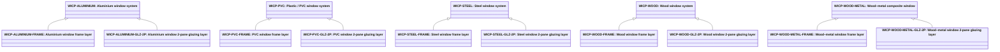

# Abstract window connector products

Source: [`window-connector-products.skos.ttl`](sources/window-connector-product.ttl)

## Scheme

- **definition (de):** Produkttyp-Klassifikation fuer Fenster-Verbindungen (ConnectionPhysical mit funktionalem Typ visual; IFC-physischer Typ window). Fuer Katalog-, Spezifikations- und Kostenworkflows; mit abstrakter Materialklassifikation fuer Rahmen- und Verglasungssubstanz kombinieren.
- **definition (en):** Product-type classification for window connectors (ConnectionPhysical with functional type visual; IFC physical type window). For catalog, specification, and cost workflows; pair with abstract material classification for frame and glazing substance.
- **prefLabel (de):** Abstrakte Fenster-Verbindungsprodukte
- **prefLabel (en):** Abstract window connector products
- **title (en):** Abstract window connector products

## Hierarchy

```mermaid
classDiagram
direction TB
class n_WICP_ALUMINIUM["WICP-ALUMINIUM: Aluminium window system"]
class n_WICP_ALUMINIUM_FRAME["WICP-ALUMINIUM-FRAME: Aluminium window frame layer"]
class n_WICP_ALUMINIUM_GLZ_2P["WICP-ALUMINIUM-GLZ-2P: Aluminium window 2-pane glazing layer"]
class n_WICP_PVC["WICP-PVC: Plastic / PVC window system"]
class n_WICP_PVC_FRAME["WICP-PVC-FRAME: PVC window frame layer"]
class n_WICP_PVC_GLZ_2P["WICP-PVC-GLZ-2P: PVC window 2-pane glazing layer"]
class n_WICP_STEEL["WICP-STEEL: Steel window system"]
class n_WICP_STEEL_FRAME["WICP-STEEL-FRAME: Steel window frame layer"]
class n_WICP_STEEL_GLZ_2P["WICP-STEEL-GLZ-2P: Steel window 2-pane glazing layer"]
class n_WICP_WOOD["WICP-WOOD: Wood window system"]
class n_WICP_WOOD_FRAME["WICP-WOOD-FRAME: Wood window frame layer"]
class n_WICP_WOOD_GLZ_2P["WICP-WOOD-GLZ-2P: Wood window 2-pane glazing layer"]
class n_WICP_WOOD_METAL["WICP-WOOD-METAL: Wood–metal composite window"]
class n_WICP_WOOD_METAL_FRAME["WICP-WOOD-METAL-FRAME: Wood–metal window frame layer"]
class n_WICP_WOOD_METAL_GLZ_2P["WICP-WOOD-METAL-GLZ-2P: Wood–metal window 2-pane glazing layer"]
n_WICP_ALUMINIUM <|-- n_WICP_ALUMINIUM_FRAME
n_WICP_ALUMINIUM <|-- n_WICP_ALUMINIUM_GLZ_2P
n_WICP_PVC <|-- n_WICP_PVC_FRAME
n_WICP_PVC <|-- n_WICP_PVC_GLZ_2P
n_WICP_STEEL <|-- n_WICP_STEEL_FRAME
n_WICP_STEEL <|-- n_WICP_STEEL_GLZ_2P
n_WICP_WOOD <|-- n_WICP_WOOD_FRAME
n_WICP_WOOD <|-- n_WICP_WOOD_GLZ_2P
n_WICP_WOOD_METAL <|-- n_WICP_WOOD_METAL_FRAME
n_WICP_WOOD_METAL <|-- n_WICP_WOOD_METAL_GLZ_2P
```

## Concepts

<button type="button" class="pbs-lang-btn" data-lang="de">DE</button>
<button type="button" class="pbs-lang-btn" data-lang="en">EN</button>

<table>
<thead>
<tr>
<th>Notation</th>
<th>Broader</th>
<th class="pbs-lang-col" data-lang="de" data-field="label">Label</th>
<th class="pbs-lang-col" data-lang="de" data-field="definition">Definition</th>
<th class="pbs-lang-col" data-lang="de" data-field="description">Description</th>
<th class="pbs-lang-col" data-lang="de" data-field="scope_note">Scope note</th>
<th class="pbs-lang-col" data-lang="en" data-field="label">Label</th>
<th class="pbs-lang-col" data-lang="en" data-field="definition">Definition</th>
<th class="pbs-lang-col" data-lang="en" data-field="description">Description</th>
<th class="pbs-lang-col" data-lang="en" data-field="scope_note">Scope note</th>
</tr>
</thead>
<tbody>
<tr>
<td>WICP-ALUMINIUM</td>
<td></td>
<td class="pbs-lang-col" data-lang="de" data-field="label">Aluminiumfenster</td>
<td class="pbs-lang-col" data-lang="de" data-field="definition">Fenster mit primaerem Aluminium- oder Leichtmetall-Rahmen und -fluegelsystem.</td>
<td class="pbs-lang-col" data-lang="de" data-field="description">Fenstereinheit mit thermisch getrennten Aluminiumprofilen für Rahmen und Flügel und einer Isolierverglasung, die eine Fassadenöffnung verschliesst. Die Profile werden im Werk zugeschnitten, gefügt und verglast, danach in die Laibung eingesetzt, am Rohbau verankert und an die angrenzende Konstruktion abgedichtet. Geeignet für grossformatige und stark genutzte Fassadenöffnungen mit dauerhaft beschichteten Oberflächen und geringem Unterhaltsaufwand auf der Wetterseite.</td>
<td class="pbs-lang-col" data-lang="de" data-field="scope_note"></td>
<td class="pbs-lang-col" data-lang="en" data-field="label">Aluminium window system</td>
<td class="pbs-lang-col" data-lang="en" data-field="definition">Window with primary aluminium or light-metal frame and sash system.</td>
<td class="pbs-lang-col" data-lang="en" data-field="description">Window unit with thermally separated aluminium frame and sash profiles and an insulating glazing infill, closing a facade opening. Profiles are cut, joined, and glazed in the factory, then set into the reveal, anchored to the structure and sealed against the adjoining construction. Suitable for large-format and heavily used facade openings, with durable coated surfaces and low maintenance effort on the weather side.</td>
<td class="pbs-lang-col" data-lang="en" data-field="scope_note"></td>
</tr>
<tr>
<td>WICP-ALUMINIUM-FRAME</td>
<td>WICP-ALUMINIUM</td>
<td class="pbs-lang-col" data-lang="de" data-field="label">Aluminiumfenster Rahmen-Schicht</td>
<td class="pbs-lang-col" data-lang="de" data-field="definition">Aluminiumrahmen- und -fluegel-Schicht eines Aluminiumfensters.</td>
<td class="pbs-lang-col" data-lang="de" data-field="description">Aluminium-Rahmen- und Flügelkomponente einer Aluminiumfenster-Einheit aus Strangpressprofilen mit isolierender Trennung zwischen Innen- und Aussenschale. Wird im Werk zugeschnitten, auf Gehrung gefügt, mechanisch verbunden und vor dem Verglasen mit Dichtungen und Beschlägen ausgerüstet. Trägt grosse Flügelformate bei schmalen Ansichtsbreiten und bestimmt Wärmetrennung und Luftdichtheit im Anschlussbereich.</td>
<td class="pbs-lang-col" data-lang="de" data-field="scope_note">LCA-Schichtkomponente von WICP-ALUMINIUM. Fuer Oekobilanz-Zerlegung und CO2-Berechnung; keine eigenstaendige Fensterprodukt-Klassifikation.</td>
<td class="pbs-lang-col" data-lang="en" data-field="label">Aluminium window frame layer</td>
<td class="pbs-lang-col" data-lang="en" data-field="definition">Aluminium frame and sash layer of an aluminium window system.</td>
<td class="pbs-lang-col" data-lang="en" data-field="description">Aluminium frame and sash component of an aluminium window unit, built from extruded profiles with an insulating barrier between inner and outer shell. Cut, mitred, and mechanically joined in the factory and fitted with gaskets and hardware before glazing. Carries large sash formats at narrow face widths and determines the thermal separation and airtightness of the perimeter.</td>
<td class="pbs-lang-col" data-lang="en" data-field="scope_note">LCA layer component of WICP-ALUMINIUM. Used for ecobilans decomposition and carbon calculation; not a standalone window product classification.</td>
</tr>
<tr>
<td>WICP-ALUMINIUM-GLZ-2P</td>
<td>WICP-ALUMINIUM</td>
<td class="pbs-lang-col" data-lang="de" data-field="label">Aluminiumfenster 2-fach Verglasung-Schicht</td>
<td class="pbs-lang-col" data-lang="de" data-field="definition">Standard-Isolierverglasung (2-fach) eines Aluminiumfensters.</td>
<td class="pbs-lang-col" data-lang="de" data-field="description">Zweifach-Isolierverglasung als Füllung einer Aluminiumfenster-Einheit, die den transparenten Verschluss der Öffnung bildet. Wird als randverbundene Einheit hergestellt und im Werk mit Klötzen, Andruckleisten oder Glashalteleisten und Dichtungen in den Aluminiumflügel eingeglast. Bestimmt Tageslichteintrag sowie Wärme- und Schalltrennung der Glasfläche und ist von aussen ohne Demontage des Rahmens ersetzbar.</td>
<td class="pbs-lang-col" data-lang="de" data-field="scope_note">LCA-Schichtkomponente von WICP-ALUMINIUM. Fuer Oekobilanz-Zerlegung und CO2-Berechnung; keine eigenstaendige Fensterprodukt-Klassifikation.</td>
<td class="pbs-lang-col" data-lang="en" data-field="label">Aluminium window 2-pane glazing layer</td>
<td class="pbs-lang-col" data-lang="en" data-field="definition">Default double-pane insulating glazing layer of an aluminium window system.</td>
<td class="pbs-lang-col" data-lang="en" data-field="description">Double-pane insulating glass infill of an aluminium window unit, forming the transparent closure of the opening. Produced as a sealed unit and glazed into the aluminium sash with packers, pressure plates or beads, and gaskets in the factory. Determines daylight transmission and the thermal and acoustic separation of the glazed area and is replaceable from outside without dismantling the frame.</td>
<td class="pbs-lang-col" data-lang="en" data-field="scope_note">LCA layer component of WICP-ALUMINIUM. Used for ecobilans decomposition and carbon calculation; not a standalone window product classification.</td>
</tr>
<tr>
<td>WICP-FACADE-UNIT</td>
<td></td>
<td class="pbs-lang-col" data-lang="de" data-field="label">Fassaden-Verglasungselement</td>
<td class="pbs-lang-col" data-lang="de" data-field="definition">Element- oder Pfosten-Riegel-Fassaden-Verglasungspaneel als fensterartige Verbindungs-Oeffnung.</td>
<td class="pbs-lang-col" data-lang="de" data-field="description">Verglasungsfeld eines Fassadensystems, das die Fensteröffnung bildet, mit Festverglasungen und integrierten Öffnungsflügeln oder Lüftungsklappen im Pfosten-Riegel- oder Elementraster. Wird als komplettes Glaselement vorgefertigt, eingehoben, an Konsolen am Tragwerk befestigt und oben, unten und seitlich in das Fassadenraster eingedichtet. Geeignet für vollflächig verglaste Fassaden, bei denen Öffnungsfunktion, Wärme- und Schalltrennung sowie späteres Reinigen und Ersetzen von Scheiben innerhalb des Fassadensystems gelöst werden müssen.</td>
<td class="pbs-lang-col" data-lang="de" data-field="scope_note">Unterscheidet sich vom SWP-CURTAIN-WALL-Trennelementprodukt; kennzeichnet das feste oder oeffnende Verglasungselement als ConnectionPhysical.</td>
<td class="pbs-lang-col" data-lang="en" data-field="label">Facade glazing unit</td>
<td class="pbs-lang-col" data-lang="en" data-field="definition">Unitised or stick-system facade glazing panel integrated as a window-type connector opening.</td>
<td class="pbs-lang-col" data-lang="en" data-field="description">Glazed field of a facade system that acts as the window opening, with fixed panes and integrated opening lights or ventilation flaps within a mullion-transom or unitised grid. Prefabricated as a complete glazed element, lifted into position, fixed to brackets on the load-bearing structure and sealed into the facade grid at head, sill, and jambs. Suitable for fully glazed facades where opening function, thermal and acoustic separation, and later cleaning and pane replacement have to be resolved inside the facade system.</td>
<td class="pbs-lang-col" data-lang="en" data-field="scope_note">Distinct from SWP-CURTAIN-WALL separator product; tags the operable or fixed glazing unit as ConnectionPhysical.</td>
</tr>
<tr>
<td>WICP-OTH</td>
<td></td>
<td class="pbs-lang-col" data-lang="de" data-field="label">Sonstiges / unbekanntes Fenster</td>
<td class="pbs-lang-col" data-lang="de" data-field="definition">Fenster-Verbindungsprodukt nicht klassifiziert oder noch unbekannt.</td>
<td class="pbs-lang-col" data-lang="de" data-field="description">Platzhalter für Fensterprodukte, deren Rahmenmaterial, System und Öffnungsart zum Zeitpunkt der Ausschreibung noch nicht festgelegt oder nicht klassifiziert sind. Funktionale Anforderungen an Öffnung, Verglasung, Bedienung und Anschluss an die angrenzende Konstruktion sind gesondert zu beschreiben. Nur in frühen Planungsphasen oder bei unvollständiger Datenlage verwenden.</td>
<td class="pbs-lang-col" data-lang="de" data-field="scope_note">Fallback fuer fruehe Entwurfsstufen oder fehlende Daten.</td>
<td class="pbs-lang-col" data-lang="en" data-field="label">Other / unknown window</td>
<td class="pbs-lang-col" data-lang="en" data-field="definition">Window connector product not classified or not yet known.</td>
<td class="pbs-lang-col" data-lang="en" data-field="description">Placeholder for window products whose frame material, system, and opening type are not yet fixed or not classified at tender stage. Functional requirements for the opening, the glazing, the operation, and the connection to the adjoining construction must be stated separately. Use only in early design stages or where data is incomplete.</td>
<td class="pbs-lang-col" data-lang="en" data-field="scope_note">Fallback for early design stages or missing data.</td>
</tr>
<tr>
<td>WICP-PVC</td>
<td></td>
<td class="pbs-lang-col" data-lang="de" data-field="label">Kunststoff- / PVC-Fenster</td>
<td class="pbs-lang-col" data-lang="de" data-field="definition">Fenster mit primaerem PVC- oder uPVC-Rahmen und -fluegelsystem.</td>
<td class="pbs-lang-col" data-lang="de" data-field="description">Fenstereinheit mit Mehrkammer-Kunststoffprofilen für Rahmen und Flügel und einer Isolierverglasung, die eine Wandöffnung verschliesst. Die Profile werden im Werk verschweisst und innen armiert, verglast und mit Beschlägen versehen, anschliessend in die Laibung eingesetzt, verankert und beidseitig abgedichtet. Geeignet für Fassadenöffnungen mit Anforderungen an Wärme- und Schalltrennung, wenn eine wartungsarme, abwaschbare Oberfläche ohne Anstricherneuerung gefordert ist.</td>
<td class="pbs-lang-col" data-lang="de" data-field="scope_note"></td>
<td class="pbs-lang-col" data-lang="en" data-field="label">Plastic / PVC window system</td>
<td class="pbs-lang-col" data-lang="en" data-field="definition">Window with primary PVC or uPVC frame and sash system.</td>
<td class="pbs-lang-col" data-lang="en" data-field="description">Window unit with multi-chamber plastic frame and sash profiles and an insulating glazing infill, closing a wall opening. Profiles are welded and internally reinforced in the factory, glazed and fitted with hardware, then set into the reveal, anchored and sealed on both faces. Suitable for facade openings with thermal and acoustic separation duty where a low-maintenance, washable surface without coating renewal is required.</td>
<td class="pbs-lang-col" data-lang="en" data-field="scope_note"></td>
</tr>
<tr>
<td>WICP-PVC-FRAME</td>
<td>WICP-PVC</td>
<td class="pbs-lang-col" data-lang="de" data-field="label">PVC-Fenster Rahmen-Schicht</td>
<td class="pbs-lang-col" data-lang="de" data-field="definition">PVC-Rahmen- und -fluegel-Schicht eines PVC-Fensters.</td>
<td class="pbs-lang-col" data-lang="de" data-field="description">Kunststoff-Rahmen- und Flügelkomponente einer PVC-Fenstereinheit aus Mehrkammer-Hohlprofilen mit innerer Aussteifung. Die Ecken werden im Werk verschweisst und das Profil mit Dichtungen und Beschlägen ausgerüstet, bevor die komplette Einheit verglast und eingebaut wird. Übernimmt Wärmetrennung und Luftdichtheit im Anschlussbereich, nimmt die Flügellasten auf und benötigt keinen Oberflächenschutz.</td>
<td class="pbs-lang-col" data-lang="de" data-field="scope_note">LCA-Schichtkomponente von WICP-PVC. Fuer Oekobilanz-Zerlegung und CO2-Berechnung; keine eigenstaendige Fensterprodukt-Klassifikation.</td>
<td class="pbs-lang-col" data-lang="en" data-field="label">PVC window frame layer</td>
<td class="pbs-lang-col" data-lang="en" data-field="definition">PVC frame and sash layer of a PVC window system.</td>
<td class="pbs-lang-col" data-lang="en" data-field="description">Plastic frame and sash component of a PVC window unit, formed from hollow multi-chamber profiles with internal stiffening. Corners are welded in the factory and the profile is fitted with gaskets and hardware before the complete unit is glazed and installed. Provides the thermal separation and airtightness of the perimeter, carries the sash loads, and needs no protective coating.</td>
<td class="pbs-lang-col" data-lang="en" data-field="scope_note">LCA layer component of WICP-PVC. Used for ecobilans decomposition and carbon calculation; not a standalone window product classification.</td>
</tr>
<tr>
<td>WICP-PVC-GLZ-2P</td>
<td>WICP-PVC</td>
<td class="pbs-lang-col" data-lang="de" data-field="label">PVC-Fenster 2-fach Verglasung-Schicht</td>
<td class="pbs-lang-col" data-lang="de" data-field="definition">Standard-Isolierverglasung (2-fach) eines PVC-Fensters.</td>
<td class="pbs-lang-col" data-lang="de" data-field="description">Zweifach-Isolierverglasung als Füllung einer PVC-Fenstereinheit, die den transparenten Verschluss der Öffnung bildet. Wird als randverbundene Einheit hergestellt, im Werk in den Kunststoffflügel eingeglast, verklotzt und mit Glashalteleisten und Dichtungen gesichert. Bestimmt Tageslichteintrag sowie Wärme- und Schalltrennung der Glasfläche und ist im eingebauten Rahmen ersetzbar.</td>
<td class="pbs-lang-col" data-lang="de" data-field="scope_note">LCA-Schichtkomponente von WICP-PVC. Fuer Oekobilanz-Zerlegung und CO2-Berechnung; keine eigenstaendige Fensterprodukt-Klassifikation.</td>
<td class="pbs-lang-col" data-lang="en" data-field="label">PVC window 2-pane glazing layer</td>
<td class="pbs-lang-col" data-lang="en" data-field="definition">Default double-pane insulating glazing layer of a PVC window system.</td>
<td class="pbs-lang-col" data-lang="en" data-field="description">Double-pane insulating glass infill of a PVC window unit, forming the transparent closure of the opening. Produced as a sealed unit and glazed into the plastic sash in the factory, packed and secured with glazing beads and gaskets. Determines daylight transmission and the thermal and acoustic separation of the glazed area and is replaceable in the installed frame.</td>
<td class="pbs-lang-col" data-lang="en" data-field="scope_note">LCA layer component of WICP-PVC. Used for ecobilans decomposition and carbon calculation; not a standalone window product classification.</td>
</tr>
<tr>
<td>WICP-SKYLIGHT</td>
<td></td>
<td class="pbs-lang-col" data-lang="de" data-field="label">Dachfenster / Oberlicht</td>
<td class="pbs-lang-col" data-lang="de" data-field="definition">Dachmontiertes Fenster, Oberlicht oder Dachflaechenfenster-Produkt.</td>
<td class="pbs-lang-col" data-lang="de" data-field="description">Verglastes Öffnungselement in der Dachfläche, als Dachflächenfenster, Flachdachkuppel oder Oberlichtband mit festen oder öffenbaren Flügeln. Wird als werkseitig verglaste Einheit geliefert und auf einem Aufsatzkranz oder im Sparrenfeld montiert und mit Anschlussmanschetten und Blechabschlüssen an Dachabdichtung und Dampfbremse angeschlossen. Geeignet für Belichtung und für Rauch- oder Komfortlüftung von Räumen unter dem Dach; erfordert Schlagregen- und Schneelastsicherheit, sicheren Zugang für die Reinigung und bei Bedarf Absturzsicherung.</td>
<td class="pbs-lang-col" data-lang="de" data-field="scope_note">Wird oft unter BKP 224 (Bedachungsarbeiten) bei Dachintegration kalkuliert; siehe BKP-Mapping.</td>
<td class="pbs-lang-col" data-lang="en" data-field="label">Roof window / skylight</td>
<td class="pbs-lang-col" data-lang="en" data-field="definition">Roof-mounted window, skylight, or rooflight product.</td>
<td class="pbs-lang-col" data-lang="en" data-field="description">Glazed opening element set into a roof surface, as a pitched roof window, flat-roof dome, or rooflight band with fixed or operable leaves. Delivered as a factory-glazed unit and mounted on an upstand kerb or in the rafter field, connected to the roof waterproofing and vapour barrier with collars and metal flashings. Suitable for daylighting and for smoke or comfort ventilation of rooms under the roof; requires driving-rain and snow-load resistance, safe access for cleaning, and fall protection where needed.</td>
<td class="pbs-lang-col" data-lang="en" data-field="scope_note">Often costed under BKP 224 (Bedachungsarbeiten) for roof integration; see BKP mapping bridge.</td>
</tr>
<tr>
<td>WICP-SPECIAL</td>
<td></td>
<td class="pbs-lang-col" data-lang="de" data-field="label">Spezielles lichtdurchlaessiges Bauteil</td>
<td class="pbs-lang-col" data-lang="de" data-field="definition">Spezielles lichtdurchlaessiges Oeffnungsprodukt ausserhalb ueblicher Fensterrahmentypen.</td>
<td class="pbs-lang-col" data-lang="de" data-field="description">Lichtdurchlässiges Öffnungsprodukt, das eine Öffnung ohne herkömmlichen Rahmen und Flügel verschliesst, zum Beispiel als Glasbausteinfeld, transluzentes Paneelfeld, Festverglasung oder verglaste Klappe. Wird als Sonderelement gefertigt oder vor Ort aufgebaut und über einen tragenden Blindrahmen, Bettung und umlaufende Abdichtung an die umgebende Konstruktion angeschlossen. Geeignet, wo Tageslicht ohne öffenbaren Flügel gefordert ist; Anforderungen an Öffnungsverhalten, Stossfestigkeit und Reinigungszugang sind je Fall zu beschreiben.</td>
<td class="pbs-lang-col" data-lang="de" data-field="scope_note"></td>
<td class="pbs-lang-col" data-lang="en" data-field="label">Special transparent opening</td>
<td class="pbs-lang-col" data-lang="en" data-field="definition">Special transparent or light-transmitting opening product not covered by standard window frame types.</td>
<td class="pbs-lang-col" data-lang="en" data-field="description">Light-transmitting opening product that closes an opening without a conventional frame and sash, for example a glass block field, a translucent panel field, a fixed light, or a glazed hatch. Fabricated as a purpose-made element or built up on site and connected to the surrounding construction with a supporting subframe, bedding, and perimeter seal. Suitable where daylight is required without an operable sash; the requirements for opening behaviour, impact resistance, and cleaning access have to be stated per case.</td>
<td class="pbs-lang-col" data-lang="en" data-field="scope_note"></td>
</tr>
<tr>
<td>WICP-STEEL</td>
<td></td>
<td class="pbs-lang-col" data-lang="de" data-field="label">Stahlfenster</td>
<td class="pbs-lang-col" data-lang="de" data-field="definition">Fenster mit primaerem Stahlrahmen und -fluegel, einschliesslich historischer und industrieller Stahlfenster.</td>
<td class="pbs-lang-col" data-lang="de" data-field="description">Fenstereinheit mit schlanken Stahlprofilen für Rahmen und Flügel und verglaster Füllung, die eine Öffnung in einer Wand oder Trennwand verschliesst. Die Profile werden in der Werkstatt geschweisst oder verschraubt, beschichtet, verglast und mit Beschlägen versehen, danach in der Öffnung verankert und an die angrenzende Konstruktion abgedichtet. Geeignet für Öffnungen mit schmalen Ansichtsbreiten, hoher mechanischer Beanspruchung oder Aufgaben im Brandabschnitts- und Sicherheitsbereich, einschliesslich Ersatzeinheiten in bestehenden Industrie- und Baudenkmalbauten.</td>
<td class="pbs-lang-col" data-lang="de" data-field="scope_note"></td>
<td class="pbs-lang-col" data-lang="en" data-field="label">Steel window system</td>
<td class="pbs-lang-col" data-lang="en" data-field="definition">Window with primary steel frame and sash, including historic and industrial steel windows.</td>
<td class="pbs-lang-col" data-lang="en" data-field="description">Window unit with slender steel frame and sash profiles and a glazed infill, closing an opening in a wall or partition. Profiles are welded or screwed into frames in the workshop, coated, glazed and fitted with hardware, then anchored in the opening and sealed against the adjoining construction. Suitable for openings with narrow sight lines, high mechanical loading, or fire compartmentation and security duty, including replacement units in existing industrial and heritage buildings.</td>
<td class="pbs-lang-col" data-lang="en" data-field="scope_note"></td>
</tr>
<tr>
<td>WICP-STEEL-FRAME</td>
<td>WICP-STEEL</td>
<td class="pbs-lang-col" data-lang="de" data-field="label">Stahlfenster Rahmen-Schicht</td>
<td class="pbs-lang-col" data-lang="de" data-field="definition">Stahlrahmen- und -fluegel-Schicht eines Stahlfensters.</td>
<td class="pbs-lang-col" data-lang="de" data-field="description">Stahl-Rahmen- und Flügelkomponente einer Stahlfenster-Einheit aus gewalzten oder geschweissten Profilen mit schmalen Ansichtsbreiten. Wird in der Werkstatt gefertigt und beschichtet, danach verglast und mit Bändern, Verschlüssen und Dichtungen ausgerüstet, bevor die Einheit in der Öffnung verankert wird. Nimmt hohe Flügellasten bei grossen Formaten auf, erlaubt schlanke Ansichten und benötigt Korrosionsschutz auf bewitterten Flächen.</td>
<td class="pbs-lang-col" data-lang="de" data-field="scope_note">LCA-Schichtkomponente von WICP-STEEL. Fuer Oekobilanz-Zerlegung und CO2-Berechnung; keine eigenstaendige Fensterprodukt-Klassifikation.</td>
<td class="pbs-lang-col" data-lang="en" data-field="label">Steel window frame layer</td>
<td class="pbs-lang-col" data-lang="en" data-field="definition">Steel frame and sash layer of a steel window system.</td>
<td class="pbs-lang-col" data-lang="en" data-field="description">Steel frame and sash component of a steel window unit, made from rolled or welded sections with narrow face widths. Fabricated and coated in the workshop, then glazed and fitted with hinges, locking, and gaskets before the unit is anchored in the opening. Carries high sash loads over large formats, allows slender sight lines, and requires corrosion protection on weather-exposed surfaces.</td>
<td class="pbs-lang-col" data-lang="en" data-field="scope_note">LCA layer component of WICP-STEEL. Used for ecobilans decomposition and carbon calculation; not a standalone window product classification.</td>
</tr>
<tr>
<td>WICP-STEEL-GLZ-2P</td>
<td>WICP-STEEL</td>
<td class="pbs-lang-col" data-lang="de" data-field="label">Stahlfenster 2-fach Verglasung-Schicht</td>
<td class="pbs-lang-col" data-lang="de" data-field="definition">Standard-Isolierverglasung (2-fach) eines Stahlfensters.</td>
<td class="pbs-lang-col" data-lang="de" data-field="description">Zweifach-Isolierverglasung als Füllung einer Stahlfenster-Einheit, die den transparenten Verschluss der Öffnung bildet. Wird als randverbundene Einheit hergestellt und mit Klötzen, Glashalteleisten und Dichtungen in den Stahlflügel eingeglast, in der Werkstatt oder bei grossen Formaten auf der Baustelle. Bestimmt Tageslichteintrag sowie Wärme- und Schalltrennung der Glasfläche und kann mit zusätzlichen Schutzfunktionen im Glasaufbau ausgeschrieben werden.</td>
<td class="pbs-lang-col" data-lang="de" data-field="scope_note">LCA-Schichtkomponente von WICP-STEEL. Fuer Oekobilanz-Zerlegung und CO2-Berechnung; keine eigenstaendige Fensterprodukt-Klassifikation.</td>
<td class="pbs-lang-col" data-lang="en" data-field="label">Steel window 2-pane glazing layer</td>
<td class="pbs-lang-col" data-lang="en" data-field="definition">Default double-pane insulating glazing layer of a steel window system.</td>
<td class="pbs-lang-col" data-lang="en" data-field="description">Double-pane insulating glass infill of a steel window unit, forming the transparent closure of the opening. Produced as a sealed unit and glazed into the steel sash with packers, beads, and gaskets, in the workshop or on site for large formats. Determines daylight transmission and the thermal and acoustic separation of the glazed area and can be specified with additional protective functions in the glass build-up.</td>
<td class="pbs-lang-col" data-lang="en" data-field="scope_note">LCA layer component of WICP-STEEL. Used for ecobilans decomposition and carbon calculation; not a standalone window product classification.</td>
</tr>
<tr>
<td>WICP-WOOD</td>
<td></td>
<td class="pbs-lang-col" data-lang="de" data-field="label">Holzfenster</td>
<td class="pbs-lang-col" data-lang="de" data-field="definition">Fenster mit primaerem Holzrahmen und -fluegel, einschliesslich traditioneller Holzfenster.</td>
<td class="pbs-lang-col" data-lang="de" data-field="description">Fenstereinheit mit Rahmen und Flügel aus Vollholz oder verleimtem Holz, die eine Wand- oder Dachöffnung mit einer Isolierverglasung verschliesst. Wird als werkseitig verglaste und oberflächenbehandelte Einheit geliefert, in die Laibung eingesetzt, befestigt und innen wie aussen an die angrenzende Konstruktion abgedichtet. Geeignet für Fassadenöffnungen mit Anforderungen an Wärme- und Schalltrennung, mit öffenbaren oder festen Flügeln und regelmässiger Pflege der bewitterten Holzoberflächen.</td>
<td class="pbs-lang-col" data-lang="de" data-field="scope_note"></td>
<td class="pbs-lang-col" data-lang="en" data-field="label">Wood window system</td>
<td class="pbs-lang-col" data-lang="en" data-field="definition">Window with primary wood frame and sash, including traditional timber windows.</td>
<td class="pbs-lang-col" data-lang="en" data-field="description">Window unit with frame and sash from solid or laminated timber, closing a wall or roof opening with an insulating glazing infill. Delivered as a factory-glazed and pre-finished unit, set into the reveal, fixed and sealed against the adjoining construction on the inside and the outside. Suitable for facade openings with thermal and acoustic separation duty, with operable or fixed sashes and periodic surface maintenance of the weather-exposed timber.</td>
<td class="pbs-lang-col" data-lang="en" data-field="scope_note"></td>
</tr>
<tr>
<td>WICP-WOOD-FRAME</td>
<td>WICP-WOOD</td>
<td class="pbs-lang-col" data-lang="de" data-field="label">Holzfenster Rahmen-Schicht</td>
<td class="pbs-lang-col" data-lang="de" data-field="definition">Holzrahmen- und -fluegel-Schicht eines Holzfensters.</td>
<td class="pbs-lang-col" data-lang="de" data-field="description">Holzrahmen- und Flügelkomponente einer Holzfenster-Einheit, die als dichtender Umfang die Verglasung hält und die Beschläge aufnimmt. Wird im Werk profiliert, zusammengesetzt, mit Dichtungen und Beschlägen ausgerüstet und verglast, bevor die komplette Einheit in die Öffnung eingesetzt und befestigt wird. Bestimmt Wärmetrennung, Luftdichtheit und Bedienverhalten des Fensters und benötigt Oberflächenschutz auf bewitterten Flächen.</td>
<td class="pbs-lang-col" data-lang="de" data-field="scope_note">LCA-Schichtkomponente von WICP-WOOD. Fuer Oekobilanz-Zerlegung und CO2-Berechnung; keine eigenstaendige Fensterprodukt-Klassifikation.</td>
<td class="pbs-lang-col" data-lang="en" data-field="label">Wood window frame layer</td>
<td class="pbs-lang-col" data-lang="en" data-field="definition">Wood frame and sash layer of a wood window system.</td>
<td class="pbs-lang-col" data-lang="en" data-field="description">Timber frame and sash component of a wood window unit, forming the sealing perimeter that holds the glazing and carries the hardware. Profiled and assembled in the factory, fitted with gaskets and fittings and glazed before the complete unit is set and fixed into the opening. Determines the thermal separation, airtightness, and operating behaviour of the window and requires surface protection on weather-exposed faces.</td>
<td class="pbs-lang-col" data-lang="en" data-field="scope_note">LCA layer component of WICP-WOOD. Used for ecobilans decomposition and carbon calculation; not a standalone window product classification.</td>
</tr>
<tr>
<td>WICP-WOOD-GLZ-2P</td>
<td>WICP-WOOD</td>
<td class="pbs-lang-col" data-lang="de" data-field="label">Holzfenster 2-fach Verglasung-Schicht</td>
<td class="pbs-lang-col" data-lang="de" data-field="definition">Standard-Isolierverglasung (2-fach) eines Holzfensters.</td>
<td class="pbs-lang-col" data-lang="de" data-field="description">Zweifach-Isolierverglasung als Füllung einer Holzfenster-Einheit, die den transparenten Verschluss der Öffnung bildet. Wird als randverbundene Einheit mit Abstandhalter und Scheibenzwischenraumfüllung hergestellt, im Werk in den Holzflügel eingeglast und mit Klötzen, Glashalteleisten und Dichtungen gesichert. Bestimmt Tageslichteintrag sowie Wärme- und Schalltrennung der Glasfläche und ist ohne Ausbau des Rahmens ersetzbar.</td>
<td class="pbs-lang-col" data-lang="de" data-field="scope_note">LCA-Schichtkomponente von WICP-WOOD. Fuer Oekobilanz-Zerlegung und CO2-Berechnung; keine eigenstaendige Fensterprodukt-Klassifikation.</td>
<td class="pbs-lang-col" data-lang="en" data-field="label">Wood window 2-pane glazing layer</td>
<td class="pbs-lang-col" data-lang="en" data-field="definition">Default double-pane insulating glazing layer of a wood window system.</td>
<td class="pbs-lang-col" data-lang="en" data-field="description">Double-pane insulating glass infill of a wood window unit, providing the transparent closure of the opening. Manufactured as a sealed unit with edge spacer and cavity fill, glazed into the timber sash in the factory and secured with packers, beads, and gaskets. Determines daylight transmission and the thermal and acoustic separation of the glazed area and is replaceable without removing the frame.</td>
<td class="pbs-lang-col" data-lang="en" data-field="scope_note">LCA layer component of WICP-WOOD. Used for ecobilans decomposition and carbon calculation; not a standalone window product classification.</td>
</tr>
<tr>
<td>WICP-WOOD-METAL</td>
<td></td>
<td class="pbs-lang-col" data-lang="de" data-field="label">Holz-Metall-Fenster</td>
<td class="pbs-lang-col" data-lang="de" data-field="definition">Fenster mit Holzinnenseite und Metall-Aussenrahmen oder Holz-Aluminium-Verbundsystem.</td>
<td class="pbs-lang-col" data-lang="de" data-field="description">Fenstereinheit mit Holzrahmen auf der Raumseite und Metallschale auf der Wetterseite, die eine Fassadenöffnung mit einer Isolierverglasung verschliesst. Rahmen- und Deckschalenprofile werden im Werk zusammengefügt und verglast, anschliessend in die Laibung eingesetzt, verankert und an die angrenzende Konstruktion abgedichtet. Geeignet für stark bewitterte Fassadenöffnungen, bei denen innen eine Holzoberfläche gewünscht und aussen ein wetterfester, wartungsarmer Abschluss gefordert ist.</td>
<td class="pbs-lang-col" data-lang="de" data-field="scope_note"></td>
<td class="pbs-lang-col" data-lang="en" data-field="label">Wood–metal composite window</td>
<td class="pbs-lang-col" data-lang="en" data-field="definition">Window with wood interior and metal exterior frame or wood-aluminium composite system.</td>
<td class="pbs-lang-col" data-lang="en" data-field="description">Window unit with a timber frame on the room side and a metal cover shell on the weather side, closing a facade opening with an insulating glazing infill. Frame and cover profiles are combined and glazed in the factory, then set into the reveal, anchored and sealed against the adjoining construction. Suitable for exposed facade openings where a timber interior surface is wanted and the exterior face has to stay weather-resistant and low-maintenance.</td>
<td class="pbs-lang-col" data-lang="en" data-field="scope_note"></td>
</tr>
<tr>
<td>WICP-WOOD-METAL-FRAME</td>
<td>WICP-WOOD-METAL</td>
<td class="pbs-lang-col" data-lang="de" data-field="label">Holz-Metall-Fenster Rahmen-Schicht</td>
<td class="pbs-lang-col" data-lang="de" data-field="definition">Holz-Metall-Verbund-Rahmen-Schicht eines Holz-Metall-Fensters.</td>
<td class="pbs-lang-col" data-lang="de" data-field="description">Verbund-Rahmen- und Flügelkomponente einer Holz-Metall-Fenstereinheit, die einen Holzkern mit einer hinterlüfteten Metall-Deckschale auf der Aussenseite verbindet. Wird im Werk als zusammenhängender Profilquerschnitt mit Wärmetrennung, Dichtungen und Beschlagsitzen vorgefertigt und danach verglast. Nimmt die Flügellasten auf, schützt das Holz vor Bewitterung und bestimmt Luftdichtheit und Bedienverhalten der Einheit.</td>
<td class="pbs-lang-col" data-lang="de" data-field="scope_note">LCA-Schichtkomponente von WICP-WOOD-METAL. Fuer Oekobilanz-Zerlegung und CO2-Berechnung; keine eigenstaendige Fensterprodukt-Klassifikation.</td>
<td class="pbs-lang-col" data-lang="en" data-field="label">Wood–metal window frame layer</td>
<td class="pbs-lang-col" data-lang="en" data-field="definition">Wood–metal composite frame layer of a wood–metal window system.</td>
<td class="pbs-lang-col" data-lang="en" data-field="description">Composite frame and sash component of a wood and metal window unit, combining a timber core with a ventilated metal cover profile on the outside. Assembled in the factory as one profile section with thermal separation, gaskets, and hardware seats before glazing. Carries the sash loads, protects the timber from weathering, and determines airtightness and operating behaviour of the unit.</td>
<td class="pbs-lang-col" data-lang="en" data-field="scope_note">LCA layer component of WICP-WOOD-METAL. Used for ecobilans decomposition and carbon calculation; not a standalone window product classification.</td>
</tr>
<tr>
<td>WICP-WOOD-METAL-GLZ-2P</td>
<td>WICP-WOOD-METAL</td>
<td class="pbs-lang-col" data-lang="de" data-field="label">Holz-Metall-Fenster 2-fach Verglasung-Schicht</td>
<td class="pbs-lang-col" data-lang="de" data-field="definition">Standard-Isolierverglasung (2-fach) eines Holz-Metall-Fensters.</td>
<td class="pbs-lang-col" data-lang="de" data-field="description">Zweifach-Isolierverglasung als Füllung einer Holz-Metall-Fenstereinheit, die den transparenten Verschluss der Öffnung bildet. Wird als randverbundene Einheit hergestellt, im Werk in den Verbundflügel eingeglast und durch die Metall-Deckschale und umlaufende Dichtungen gehalten. Bestimmt Tageslichteintrag sowie Wärme- und Schalltrennung der Glasfläche und ist über die Deckschale von aussen ersetzbar.</td>
<td class="pbs-lang-col" data-lang="de" data-field="scope_note">LCA-Schichtkomponente von WICP-WOOD-METAL. Fuer Oekobilanz-Zerlegung und CO2-Berechnung; keine eigenstaendige Fensterprodukt-Klassifikation.</td>
<td class="pbs-lang-col" data-lang="en" data-field="label">Wood–metal window 2-pane glazing layer</td>
<td class="pbs-lang-col" data-lang="en" data-field="definition">Default double-pane insulating glazing layer of a wood–metal window system.</td>
<td class="pbs-lang-col" data-lang="en" data-field="description">Double-pane insulating glass infill of a wood and metal window unit, forming the transparent closure of the opening. Produced as a sealed unit and glazed into the composite sash in the factory, retained by the metal cover profile and perimeter gaskets. Determines daylight transmission and the thermal and acoustic separation of the glazed area and can be replaced from outside via the cover profile.</td>
<td class="pbs-lang-col" data-lang="en" data-field="scope_note">LCA layer component of WICP-WOOD-METAL. Used for ecobilans decomposition and carbon calculation; not a standalone window product classification.</td>
</tr>
</tbody>
</table>

