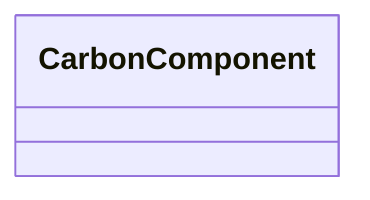

---
search:
  boost: 10.0
---

# Class: CarbonComponent 


_One layer or row contributing to a layer_recipe_sum carbon total._


<div data-search-exclude markdown="1">


URI: [cost:CarbonComponent](https://schema.pragmaticbim.ch/cost/CarbonComponent)





<!-- no inheritance hierarchy -->

## Class Properties

| Property | Value |
| --- | --- |
| Class URI | [cost:CarbonComponent](https://schema.pragmaticbim.ch/cost/CarbonComponent) |


## Slots

| Name | Cardinality and Range | Description | Inheritance |
| ---  | --- | --- | --- |
| [notation](notation.md) | 0..1 <br/> [ConceptNotation](ConceptNotation.md) | SKOS notation of a layer component product. | direct |
| [kbob_id](kbob_id.md) | 0..1 <br/> [String](String.md) | KBOB ecobilans row id (for example 05.005). | direct |
| [quantity_per_price_unit](quantity_per_price_unit.md) | 0..1 <br/> [Float](Float.md) | Layer quantity per one parent price unit. | direct |
| [quantity_unit](quantity_unit.md) | 0..1 <br/> [String](String.md) | Unit of the layer quantity. | direct |
| [gwp_kg_co2eq](gwp_kg_co2eq.md) | 0..1 <br/> [Float](Float.md) | Global warming potential in kg CO2eq per price unit. | direct |


## Usages

| used by | used in | type | used |
| ---  | --- | --- | --- |
| [CarbonEstimate](CarbonEstimate.md) | [components](components.md) | range | [CarbonComponent](CarbonComponent.md) |


## Identifier and Mapping Information


### Schema Source


* from schema: https://schema.pragmaticbim.ch/cost/baseline-cost


## Mappings

| Mapping Type | Mapped Value |
| ---  | ---  |
| self | cost:CarbonComponent |
| native | cost:CarbonComponent |


## LinkML Source

<!-- TODO: investigate https://stackoverflow.com/questions/37606292/how-to-create-tabbed-code-blocks-in-mkdocs-or-sphinx -->

### Direct

<details>
```yaml
name: CarbonComponent
description: One layer or row contributing to a layer_recipe_sum carbon total.
from_schema: https://schema.pragmaticbim.ch/cost/baseline-cost
slots:
- notation
- kbob_id
- quantity_per_price_unit
- quantity_unit
- gwp_kg_co2eq
slot_usage:
  notation:
    name: notation
    range: ConceptNotation
class_uri: cost:CarbonComponent

```
</details>

### Induced

<details>
```yaml
name: CarbonComponent
description: One layer or row contributing to a layer_recipe_sum carbon total.
from_schema: https://schema.pragmaticbim.ch/cost/baseline-cost
slot_usage:
  notation:
    name: notation
    range: ConceptNotation
attributes:
  notation:
    name: notation
    description: SKOS notation of a layer component product.
    from_schema: https://schema.pragmaticbim.ch/cost/baseline-cost
    rank: 1000
    owner: CarbonComponent
    domain_of:
    - CarbonComponent
    range: ConceptNotation
  kbob_id:
    name: kbob_id
    description: KBOB ecobilans row id (for example 05.005).
    from_schema: https://schema.pragmaticbim.ch/cost/baseline-cost
    rank: 1000
    owner: CarbonComponent
    domain_of:
    - CarbonComponent
    range: string
  quantity_per_price_unit:
    name: quantity_per_price_unit
    description: Layer quantity per one parent price unit.
    from_schema: https://schema.pragmaticbim.ch/cost/baseline-cost
    rank: 1000
    owner: CarbonComponent
    domain_of:
    - CarbonComponent
    range: float
  quantity_unit:
    name: quantity_unit
    description: Unit of the layer quantity.
    from_schema: https://schema.pragmaticbim.ch/cost/baseline-cost
    rank: 1000
    owner: CarbonComponent
    domain_of:
    - CarbonComponent
    range: string
  gwp_kg_co2eq:
    name: gwp_kg_co2eq
    description: Global warming potential in kg CO2eq per price unit.
    from_schema: https://schema.pragmaticbim.ch/cost/baseline-cost
    rank: 1000
    owner: CarbonComponent
    domain_of:
    - CarbonEstimate
    - CarbonComponent
    range: float
class_uri: cost:CarbonComponent

```
</details></div>