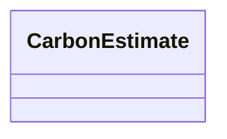

---
search:
  boost: 10.0
---

# Class: CarbonEstimate 


_Generated embodied-carbon estimate per price unit (optional output). Unit-conversion geometry is stored in typed slots — not in assumptions. density_kg_m3 for method density; mass_per_area_kg_m2 for area_yield; area_per_piece_m2 for piece_area. Optional thickness_m documents derived mass_per_area when thickness × density was used._


<div data-search-exclude markdown="1">


URI: [cost:CarbonEstimate](https://schema.pragmaticbim.ch/cost/CarbonEstimate)





<!-- no inheritance hierarchy -->

## Class Properties

| Property | Value |
| --- | --- |
| Class URI | [cost:CarbonEstimate](https://schema.pragmaticbim.ch/cost/CarbonEstimate) |


## Slots

| Name | Cardinality and Range | Description | Inheritance |
| ---  | --- | --- | --- |
| [gwp_kg_co2eq](gwp_kg_co2eq.md) | 0..1 <br/> [Float](Float.md) | Global warming potential in kg CO2eq per price unit. | direct |
| [method](method.md) | 0..1 <br/> [CarbonMethodEnum](CarbonMethodEnum.md) | Carbon conversion method. | direct |
| [density_kg_m3](density_kg_m3.md) | 0..1 <br/> [Float](Float.md) | Material density (kg/m³) used when method is density (price m³, KBOB kg). | direct |
| [mass_per_area_kg_m2](mass_per_area_kg_m2.md) | 0..1 <br/> [Float](Float.md) | Mass per m² (kg/m²) used when method is area_yield (price m², KBOB kg). | direct |
| [area_per_piece_m2](area_per_piece_m2.md) | 0..1 <br/> [Float](Float.md) | Area per piece (m²/pcs) used when method is piece_area (price pcs, KBOB m²). | direct |
| [thickness_m](thickness_m.md) | 0..1 <br/> [Float](Float.md) | Optional layer thickness (m) when mass_per_area_kg_m2 was derived as thickness_m × density_kg_m3. | direct |
| [assumptions](assumptions.md) | 0..1 <br/> [String](String.md) | Human-readable notes only (for example layer_recipe quantity_basis). Not used for unit conversion. | direct |
| [components](components.md) | * <br/> [CarbonComponent](CarbonComponent.md) | Layer components for layer_recipe_sum carbon totals. | direct |


## Usages

| used by | used in | type | used |
| ---  | --- | --- | --- |
| [UnitPriceEntry](UnitPriceEntry.md) | [carbon_per_price_unit](carbon_per_price_unit.md) | range | [CarbonEstimate](CarbonEstimate.md) |


## Identifier and Mapping Information


### Schema Source


* from schema: https://schema.pragmaticbim.ch/cost/baseline-cost


## Mappings

| Mapping Type | Mapped Value |
| ---  | ---  |
| self | cost:CarbonEstimate |
| native | cost:CarbonEstimate |


## LinkML Source

<!-- TODO: investigate https://stackoverflow.com/questions/37606292/how-to-create-tabbed-code-blocks-in-mkdocs-or-sphinx -->

### Direct

<details>
```yaml
name: CarbonEstimate
description: Generated embodied-carbon estimate per price unit (optional output).
  Unit-conversion geometry is stored in typed slots — not in assumptions. density_kg_m3
  for method density; mass_per_area_kg_m2 for area_yield; area_per_piece_m2 for piece_area.
  Optional thickness_m documents derived mass_per_area when thickness × density was
  used.
from_schema: https://schema.pragmaticbim.ch/cost/baseline-cost
slots:
- gwp_kg_co2eq
- method
- density_kg_m3
- mass_per_area_kg_m2
- area_per_piece_m2
- thickness_m
- assumptions
- components
slot_usage:
  method:
    name: method
    range: CarbonMethodEnum
  density_kg_m3:
    name: density_kg_m3
    range: float
    minimum_value: 0
  mass_per_area_kg_m2:
    name: mass_per_area_kg_m2
    range: float
    minimum_value: 0
  area_per_piece_m2:
    name: area_per_piece_m2
    range: float
    minimum_value: 0
  thickness_m:
    name: thickness_m
    range: float
    minimum_value: 0
  components:
    name: components
    range: CarbonComponent
    multivalued: true
    inlined: true
class_uri: cost:CarbonEstimate

```
</details>

### Induced

<details>
```yaml
name: CarbonEstimate
description: Generated embodied-carbon estimate per price unit (optional output).
  Unit-conversion geometry is stored in typed slots — not in assumptions. density_kg_m3
  for method density; mass_per_area_kg_m2 for area_yield; area_per_piece_m2 for piece_area.
  Optional thickness_m documents derived mass_per_area when thickness × density was
  used.
from_schema: https://schema.pragmaticbim.ch/cost/baseline-cost
slot_usage:
  method:
    name: method
    range: CarbonMethodEnum
  density_kg_m3:
    name: density_kg_m3
    range: float
    minimum_value: 0
  mass_per_area_kg_m2:
    name: mass_per_area_kg_m2
    range: float
    minimum_value: 0
  area_per_piece_m2:
    name: area_per_piece_m2
    range: float
    minimum_value: 0
  thickness_m:
    name: thickness_m
    range: float
    minimum_value: 0
  components:
    name: components
    range: CarbonComponent
    multivalued: true
    inlined: true
attributes:
  gwp_kg_co2eq:
    name: gwp_kg_co2eq
    description: Global warming potential in kg CO2eq per price unit.
    from_schema: https://schema.pragmaticbim.ch/cost/baseline-cost
    rank: 1000
    owner: CarbonEstimate
    domain_of:
    - CarbonEstimate
    - CarbonComponent
    range: float
  method:
    name: method
    description: Carbon conversion method.
    from_schema: https://schema.pragmaticbim.ch/cost/baseline-cost
    rank: 1000
    owner: CarbonEstimate
    domain_of:
    - CarbonEstimate
    range: CarbonMethodEnum
  density_kg_m3:
    name: density_kg_m3
    description: Material density (kg/m³) used when method is density (price m³, KBOB
      kg).
    from_schema: https://schema.pragmaticbim.ch/cost/baseline-cost
    rank: 1000
    owner: CarbonEstimate
    domain_of:
    - CarbonEstimate
    range: float
    minimum_value: 0
  mass_per_area_kg_m2:
    name: mass_per_area_kg_m2
    description: Mass per m² (kg/m²) used when method is area_yield (price m², KBOB
      kg).
    from_schema: https://schema.pragmaticbim.ch/cost/baseline-cost
    rank: 1000
    owner: CarbonEstimate
    domain_of:
    - CarbonEstimate
    range: float
    minimum_value: 0
  area_per_piece_m2:
    name: area_per_piece_m2
    description: Area per piece (m²/pcs) used when method is piece_area (price pcs,
      KBOB m²).
    from_schema: https://schema.pragmaticbim.ch/cost/baseline-cost
    rank: 1000
    owner: CarbonEstimate
    domain_of:
    - CarbonEstimate
    range: float
    minimum_value: 0
  thickness_m:
    name: thickness_m
    description: Optional layer thickness (m) when mass_per_area_kg_m2 was derived
      as thickness_m × density_kg_m3.
    from_schema: https://schema.pragmaticbim.ch/cost/baseline-cost
    rank: 1000
    owner: CarbonEstimate
    domain_of:
    - CarbonEstimate
    range: float
    minimum_value: 0
  assumptions:
    name: assumptions
    description: Human-readable notes only (for example layer_recipe quantity_basis).
      Not used for unit conversion.
    from_schema: https://schema.pragmaticbim.ch/cost/baseline-cost
    rank: 1000
    owner: CarbonEstimate
    domain_of:
    - CarbonEstimate
    range: string
  components:
    name: components
    description: Layer components for layer_recipe_sum carbon totals.
    from_schema: https://schema.pragmaticbim.ch/cost/baseline-cost
    rank: 1000
    owner: CarbonEstimate
    domain_of:
    - CarbonEstimate
    range: CarbonComponent
    multivalued: true
    inlined: true
class_uri: cost:CarbonEstimate

```
</details></div>