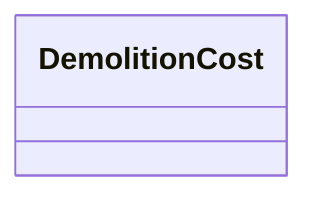

---
search:
  boost: 10.0
---

# Class: DemolitionCost 


_Disassembly/demolition labor and disposal per price unit (EUR, net, VAT excluded)._


<div data-search-exclude markdown="1">


URI: [cost:DemolitionCost](https://schema.pragmaticbim.ch/cost/DemolitionCost)





<!-- no inheritance hierarchy -->

## Class Properties

| Property | Value |
| --- | --- |
| Class URI | [cost:DemolitionCost](https://schema.pragmaticbim.ch/cost/DemolitionCost) |


## Slots

| Name | Cardinality and Range | Description | Inheritance |
| ---  | --- | --- | --- |
| [hours_per_unit](hours_per_unit.md) | 0..1 <br/> [Float](Float.md) | Demolition labor hours per price unit. | direct |
| [disposal_cost](disposal_cost.md) | 0..1 <br/> [Decimal](Decimal.md) | Disposal cost per price unit in EUR (net, VAT excluded). | direct |
| [unit](unit.md) | 0..1 <br/> [PriceUnitEnum](PriceUnitEnum.md) | Unit for demolition quantities. | direct |


## Usages

| used by | used in | type | used |
| ---  | --- | --- | --- |
| [UnitPriceEntry](UnitPriceEntry.md) | [demolition](demolition.md) | range | [DemolitionCost](DemolitionCost.md) |


## Identifier and Mapping Information


### Schema Source


* from schema: https://schema.pragmaticbim.ch/cost/baseline-cost


## Mappings

| Mapping Type | Mapped Value |
| ---  | ---  |
| self | cost:DemolitionCost |
| native | cost:DemolitionCost |


## LinkML Source

<!-- TODO: investigate https://stackoverflow.com/questions/37606292/how-to-create-tabbed-code-blocks-in-mkdocs-or-sphinx -->

### Direct

<details>
```yaml
name: DemolitionCost
description: Disassembly/demolition labor and disposal per price unit (EUR, net, VAT
  excluded).
from_schema: https://schema.pragmaticbim.ch/cost/baseline-cost
slots:
- hours_per_unit
- disposal_cost
- unit
slot_usage:
  hours_per_unit:
    name: hours_per_unit
    range: float
    minimum_value: 0
  disposal_cost:
    name: disposal_cost
    range: decimal
    minimum_value: 0
  unit:
    name: unit
    range: PriceUnitEnum
class_uri: cost:DemolitionCost

```
</details>

### Induced

<details>
```yaml
name: DemolitionCost
description: Disassembly/demolition labor and disposal per price unit (EUR, net, VAT
  excluded).
from_schema: https://schema.pragmaticbim.ch/cost/baseline-cost
slot_usage:
  hours_per_unit:
    name: hours_per_unit
    range: float
    minimum_value: 0
  disposal_cost:
    name: disposal_cost
    range: decimal
    minimum_value: 0
  unit:
    name: unit
    range: PriceUnitEnum
attributes:
  hours_per_unit:
    name: hours_per_unit
    description: Demolition labor hours per price unit.
    from_schema: https://schema.pragmaticbim.ch/cost/baseline-cost
    rank: 1000
    owner: DemolitionCost
    domain_of:
    - DemolitionCost
    range: float
    minimum_value: 0
  disposal_cost:
    name: disposal_cost
    description: Disposal cost per price unit in EUR (net, VAT excluded).
    from_schema: https://schema.pragmaticbim.ch/cost/baseline-cost
    rank: 1000
    owner: DemolitionCost
    domain_of:
    - DemolitionCost
    range: decimal
    minimum_value: 0
  unit:
    name: unit
    description: Unit for demolition quantities.
    from_schema: https://schema.pragmaticbim.ch/cost/baseline-cost
    rank: 1000
    owner: DemolitionCost
    domain_of:
    - DemolitionCost
    range: PriceUnitEnum
class_uri: cost:DemolitionCost

```
</details></div>