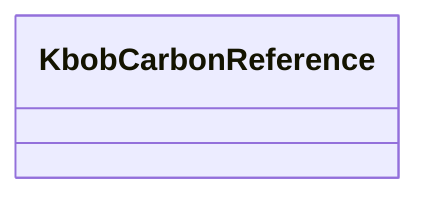

---
search:
  boost: 10.0
---

# Class: KbobCarbonReference 


_Reference to KBOB ecobilans benchmark concept IRIs. Indicator values are resolved from kbob-ecobilans-lca-factors.json, not stored here._


<div data-search-exclude markdown="1">


URI: [cost:KbobCarbonReference](https://schema.pragmaticbim.ch/cost/KbobCarbonReference)





<!-- no inheritance hierarchy -->

## Class Properties

| Property | Value |
| --- | --- |
| Class URI | [cost:KbobCarbonReference](https://schema.pragmaticbim.ch/cost/KbobCarbonReference) |


## Slots

| Name | Cardinality and Range | Description | Inheritance |
| ---  | --- | --- | --- |
| [primary_match_type](primary_match_type.md) | 0..1 <br/> [KbobMatchTypeEnum](KbobMatchTypeEnum.md) | SKOS mapping match type used for the primary carbon reference. | direct |
| [benchmark_uris](benchmark_uris.md) | * <br/> [Uriorcurie](Uriorcurie.md) | KBOB ecobilans concept IRIs for carbon lookup. | direct |
| [carbon_method](carbon_method.md) | 0..1 <br/> [CarbonMethodEnum](CarbonMethodEnum.md) | Method used to normalize carbon to the price unit. | direct |


## Usages

| used by | used in | type | used |
| ---  | --- | --- | --- |
| [UnitPriceEntry](UnitPriceEntry.md) | [kbob](kbob.md) | range | [KbobCarbonReference](KbobCarbonReference.md) |


## Identifier and Mapping Information


### Schema Source


* from schema: https://schema.pragmaticbim.ch/cost/baseline-cost


## Mappings

| Mapping Type | Mapped Value |
| ---  | ---  |
| self | cost:KbobCarbonReference |
| native | cost:KbobCarbonReference |


## LinkML Source

<!-- TODO: investigate https://stackoverflow.com/questions/37606292/how-to-create-tabbed-code-blocks-in-mkdocs-or-sphinx -->

### Direct

<details>
```yaml
name: KbobCarbonReference
description: Reference to KBOB ecobilans benchmark concept IRIs. Indicator values
  are resolved from kbob-ecobilans-lca-factors.json, not stored here.
from_schema: https://schema.pragmaticbim.ch/cost/baseline-cost
slots:
- primary_match_type
- benchmark_uris
- carbon_method
slot_usage:
  benchmark_uris:
    name: benchmark_uris
    range: uriorcurie
    multivalued: true
class_uri: cost:KbobCarbonReference

```
</details>

### Induced

<details>
```yaml
name: KbobCarbonReference
description: Reference to KBOB ecobilans benchmark concept IRIs. Indicator values
  are resolved from kbob-ecobilans-lca-factors.json, not stored here.
from_schema: https://schema.pragmaticbim.ch/cost/baseline-cost
slot_usage:
  benchmark_uris:
    name: benchmark_uris
    range: uriorcurie
    multivalued: true
attributes:
  primary_match_type:
    name: primary_match_type
    description: SKOS mapping match type used for the primary carbon reference.
    from_schema: https://schema.pragmaticbim.ch/cost/baseline-cost
    rank: 1000
    owner: KbobCarbonReference
    domain_of:
    - KbobCarbonReference
    range: KbobMatchTypeEnum
  benchmark_uris:
    name: benchmark_uris
    description: KBOB ecobilans concept IRIs for carbon lookup.
    from_schema: https://schema.pragmaticbim.ch/cost/baseline-cost
    rank: 1000
    owner: KbobCarbonReference
    domain_of:
    - KbobCarbonReference
    range: uriorcurie
    multivalued: true
  carbon_method:
    name: carbon_method
    description: Method used to normalize carbon to the price unit.
    from_schema: https://schema.pragmaticbim.ch/cost/baseline-cost
    rank: 1000
    owner: KbobCarbonReference
    domain_of:
    - KbobCarbonReference
    range: CarbonMethodEnum
class_uri: cost:KbobCarbonReference

```
</details></div>