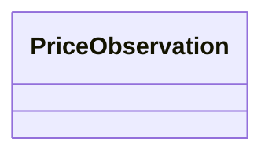

---
search:
  boost: 10.0
---

# Class: PriceObservation 


_One contributed or reference value for a canonical UnitPriceEntry slot. Observations support multi-party authoring and audit; they do not replace the canonical scalar fields on the parent entry._


<div data-search-exclude markdown="1">


URI: [cost:PriceObservation](https://schema.pragmaticbim.ch/cost/PriceObservation)





<!-- no inheritance hierarchy -->

## Class Properties

| Property | Value |
| --- | --- |
| Class URI | [cost:PriceObservation](https://schema.pragmaticbim.ch/cost/PriceObservation) |


## Slots

| Name | Cardinality and Range | Description | Inheritance |
| ---  | --- | --- | --- |
| [aspect](aspect.md) | 1 <br/> [PriceObservationAspectEnum](PriceObservationAspectEnum.md) | Canonical slot this observation applies to. | direct |
| [value](value.md) | 1 <br/> [Decimal](Decimal.md) | Observed numeric value in the same unit as the parent aspect. | direct |
| [reference_source](reference_source.md) | 1 <br/> [String](String.md) | Reference dataset, organisation, or document identifier. | direct |
| [contributor](contributor.md) | 0..1 <br/> [String](String.md) | Person or team that supplied the observation (optional display name or id). | direct |
| [contributed_at](contributed_at.md) | 0..1 <br/> [Date](Date.md) | Date the observation was recorded or published. | direct |
| [provenance_status](provenance_status.md) | 0..1 <br/> [ProvenanceStatusEnum](ProvenanceStatusEnum.md) | How the unit-price point estimate was sourced and validated. | direct |
| [notes](notes.md) | 0..1 <br/> [String](String.md) | Free-text context (edition, region, scope, assumptions). | direct |
| [selects_canonical](selects_canonical.md) | 0..1 <br/> [Boolean](Boolean.md) | When true, marks this observation as the chosen source for the parent entry's canonical value for the given aspect. | direct |


## Usages

| used by | used in | type | used |
| ---  | --- | --- | --- |
| [UnitPriceEntry](UnitPriceEntry.md) | [observations](observations.md) | range | [PriceObservation](PriceObservation.md) |


## Identifier and Mapping Information


### Schema Source


* from schema: https://schema.pragmaticbim.ch/cost/baseline-cost


## Mappings

| Mapping Type | Mapped Value |
| ---  | ---  |
| self | cost:PriceObservation |
| native | cost:PriceObservation |


## LinkML Source

<!-- TODO: investigate https://stackoverflow.com/questions/37606292/how-to-create-tabbed-code-blocks-in-mkdocs-or-sphinx -->

### Direct

<details>
```yaml
name: PriceObservation
description: One contributed or reference value for a canonical UnitPriceEntry slot.
  Observations support multi-party authoring and audit; they do not replace the canonical
  scalar fields on the parent entry.
from_schema: https://schema.pragmaticbim.ch/cost/baseline-cost
slots:
- aspect
- value
- reference_source
- contributor
- contributed_at
- provenance_status
- notes
- selects_canonical
slot_usage:
  aspect:
    name: aspect
    range: PriceObservationAspectEnum
    required: true
  value:
    name: value
    range: decimal
    required: true
  reference_source:
    name: reference_source
    description: Reference dataset, organisation, or document identifier.
    required: true
  contributor:
    name: contributor
    description: Person or team that supplied the observation (optional display name
      or id).
  contributed_at:
    name: contributed_at
    range: date
  provenance_status:
    name: provenance_status
    range: ProvenanceStatusEnum
  notes:
    name: notes
    description: Free-text context (edition, region, scope, assumptions).
  selects_canonical:
    name: selects_canonical
    description: When true, marks this observation as the chosen source for the parent
      entry's canonical value for the given aspect.
    range: boolean
class_uri: cost:PriceObservation

```
</details>

### Induced

<details>
```yaml
name: PriceObservation
description: One contributed or reference value for a canonical UnitPriceEntry slot.
  Observations support multi-party authoring and audit; they do not replace the canonical
  scalar fields on the parent entry.
from_schema: https://schema.pragmaticbim.ch/cost/baseline-cost
slot_usage:
  aspect:
    name: aspect
    range: PriceObservationAspectEnum
    required: true
  value:
    name: value
    range: decimal
    required: true
  reference_source:
    name: reference_source
    description: Reference dataset, organisation, or document identifier.
    required: true
  contributor:
    name: contributor
    description: Person or team that supplied the observation (optional display name
      or id).
  contributed_at:
    name: contributed_at
    range: date
  provenance_status:
    name: provenance_status
    range: ProvenanceStatusEnum
  notes:
    name: notes
    description: Free-text context (edition, region, scope, assumptions).
  selects_canonical:
    name: selects_canonical
    description: When true, marks this observation as the chosen source for the parent
      entry's canonical value for the given aspect.
    range: boolean
attributes:
  aspect:
    name: aspect
    description: Canonical slot this observation applies to.
    from_schema: https://schema.pragmaticbim.ch/cost/baseline-cost
    rank: 1000
    owner: PriceObservation
    domain_of:
    - PriceObservation
    range: PriceObservationAspectEnum
    required: true
  value:
    name: value
    description: Observed numeric value in the same unit as the parent aspect.
    from_schema: https://schema.pragmaticbim.ch/cost/baseline-cost
    rank: 1000
    owner: PriceObservation
    domain_of:
    - PriceObservation
    range: decimal
    required: true
  reference_source:
    name: reference_source
    description: Reference dataset, organisation, or document identifier.
    from_schema: https://schema.pragmaticbim.ch/cost/baseline-cost
    rank: 1000
    owner: PriceObservation
    domain_of:
    - PriceObservation
    range: string
    required: true
  contributor:
    name: contributor
    description: Person or team that supplied the observation (optional display name
      or id).
    from_schema: https://schema.pragmaticbim.ch/cost/baseline-cost
    rank: 1000
    owner: PriceObservation
    domain_of:
    - PriceObservation
    range: string
  contributed_at:
    name: contributed_at
    description: Date the observation was recorded or published.
    from_schema: https://schema.pragmaticbim.ch/cost/baseline-cost
    rank: 1000
    owner: PriceObservation
    domain_of:
    - PriceObservation
    range: date
  provenance_status:
    name: provenance_status
    description: How the unit-price point estimate was sourced and validated.
    from_schema: https://schema.pragmaticbim.ch/cost/baseline-cost
    rank: 1000
    owner: PriceObservation
    domain_of:
    - UnitPriceEntry
    - PriceObservation
    range: ProvenanceStatusEnum
  notes:
    name: notes
    description: Free-text context (edition, region, scope, assumptions).
    from_schema: https://schema.pragmaticbim.ch/cost/baseline-cost
    rank: 1000
    owner: PriceObservation
    domain_of:
    - PriceObservation
    range: string
  selects_canonical:
    name: selects_canonical
    description: When true, marks this observation as the chosen source for the parent
      entry's canonical value for the given aspect.
    from_schema: https://schema.pragmaticbim.ch/cost/baseline-cost
    rank: 1000
    owner: PriceObservation
    domain_of:
    - PriceObservation
    range: boolean
class_uri: cost:PriceObservation

```
</details></div>