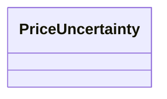

---
search:
  boost: 10.0
---

# Class: PriceUncertainty 


_Relative uncertainty band around point material cost and labor hours. Percent slots are signed fractions relative to the point estimate (for example material_low_pct -0.12 → low = point × 0.88). Derived EUR and hour bounds are optional generator output for convenience._


<div data-search-exclude markdown="1">


URI: [cost:PriceUncertainty](https://schema.pragmaticbim.ch/cost/PriceUncertainty)





<!-- no inheritance hierarchy -->

## Class Properties

| Property | Value |
| --- | --- |
| Class URI | [cost:PriceUncertainty](https://schema.pragmaticbim.ch/cost/PriceUncertainty) |


## Slots

| Name | Cardinality and Range | Description | Inheritance |
| ---  | --- | --- | --- |
| [material_low_pct](material_low_pct.md) | 1 <br/> [Float](Float.md) | Lower material bound as signed fraction of material_cost (≤ 0). | direct |
| [material_high_pct](material_high_pct.md) | 1 <br/> [Float](Float.md) | Upper material bound as signed fraction of material_cost (≥ 0). | direct |
| [labor_low_pct](labor_low_pct.md) | 1 <br/> [Float](Float.md) | Lower labor bound as signed fraction of labor hours (≤ 0). | direct |
| [labor_high_pct](labor_high_pct.md) | 1 <br/> [Float](Float.md) | Upper labor bound as signed fraction of labor hours (≥ 0). | direct |
| [material_cost_low](material_cost_low.md) | 0..1 <br/> [Decimal](Decimal.md) | Derived lower material_cost in EUR (net, VAT excluded). | direct |
| [material_cost_high](material_cost_high.md) | 0..1 <br/> [Decimal](Decimal.md) | Derived upper material_cost in EUR (net, VAT excluded). | direct |
| [delivered_material_cost_low](delivered_material_cost_low.md) | 0..1 <br/> [Decimal](Decimal.md) | Derived lower delivered_material_cost in EUR. | direct |
| [delivered_material_cost_high](delivered_material_cost_high.md) | 0..1 <br/> [Decimal](Decimal.md) | Derived upper delivered_material_cost in EUR. | direct |
| [onsite_labor_hours_low](onsite_labor_hours_low.md) | 0..1 <br/> [Float](Float.md) | Derived lower onsite labor hours per price unit. | direct |
| [onsite_labor_hours_high](onsite_labor_hours_high.md) | 0..1 <br/> [Float](Float.md) | Derived upper onsite labor hours per price unit. | direct |
| [offsite_labor_hours_low](offsite_labor_hours_low.md) | 0..1 <br/> [Float](Float.md) | Derived lower offsite labor hours per price unit. | direct |
| [offsite_labor_hours_high](offsite_labor_hours_high.md) | 0..1 <br/> [Float](Float.md) | Derived upper offsite labor hours per price unit. | direct |


## Usages

| used by | used in | type | used |
| ---  | --- | --- | --- |
| [UnitPriceEntry](UnitPriceEntry.md) | [uncertainty](uncertainty.md) | range | [PriceUncertainty](PriceUncertainty.md) |


## Identifier and Mapping Information


### Schema Source


* from schema: https://schema.pragmaticbim.ch/cost/baseline-cost


## Mappings

| Mapping Type | Mapped Value |
| ---  | ---  |
| self | cost:PriceUncertainty |
| native | cost:PriceUncertainty |


## LinkML Source

<!-- TODO: investigate https://stackoverflow.com/questions/37606292/how-to-create-tabbed-code-blocks-in-mkdocs-or-sphinx -->

### Direct

<details>
```yaml
name: PriceUncertainty
description: Relative uncertainty band around point material cost and labor hours.
  Percent slots are signed fractions relative to the point estimate (for example material_low_pct
  -0.12 → low = point × 0.88). Derived EUR and hour bounds are optional generator
  output for convenience.
from_schema: https://schema.pragmaticbim.ch/cost/baseline-cost
slots:
- material_low_pct
- material_high_pct
- labor_low_pct
- labor_high_pct
- material_cost_low
- material_cost_high
- delivered_material_cost_low
- delivered_material_cost_high
- onsite_labor_hours_low
- onsite_labor_hours_high
- offsite_labor_hours_low
- offsite_labor_hours_high
slot_usage:
  material_low_pct:
    name: material_low_pct
    range: float
    required: true
    maximum_value: 0
  material_high_pct:
    name: material_high_pct
    range: float
    required: true
    minimum_value: 0
  labor_low_pct:
    name: labor_low_pct
    range: float
    required: true
    maximum_value: 0
  labor_high_pct:
    name: labor_high_pct
    range: float
    required: true
    minimum_value: 0
class_uri: cost:PriceUncertainty

```
</details>

### Induced

<details>
```yaml
name: PriceUncertainty
description: Relative uncertainty band around point material cost and labor hours.
  Percent slots are signed fractions relative to the point estimate (for example material_low_pct
  -0.12 → low = point × 0.88). Derived EUR and hour bounds are optional generator
  output for convenience.
from_schema: https://schema.pragmaticbim.ch/cost/baseline-cost
slot_usage:
  material_low_pct:
    name: material_low_pct
    range: float
    required: true
    maximum_value: 0
  material_high_pct:
    name: material_high_pct
    range: float
    required: true
    minimum_value: 0
  labor_low_pct:
    name: labor_low_pct
    range: float
    required: true
    maximum_value: 0
  labor_high_pct:
    name: labor_high_pct
    range: float
    required: true
    minimum_value: 0
attributes:
  material_low_pct:
    name: material_low_pct
    description: Lower material bound as signed fraction of material_cost (≤ 0).
    from_schema: https://schema.pragmaticbim.ch/cost/baseline-cost
    rank: 1000
    owner: PriceUncertainty
    domain_of:
    - PriceUncertainty
    range: float
    required: true
    maximum_value: 0
  material_high_pct:
    name: material_high_pct
    description: Upper material bound as signed fraction of material_cost (≥ 0).
    from_schema: https://schema.pragmaticbim.ch/cost/baseline-cost
    rank: 1000
    owner: PriceUncertainty
    domain_of:
    - PriceUncertainty
    range: float
    required: true
    minimum_value: 0
  labor_low_pct:
    name: labor_low_pct
    description: Lower labor bound as signed fraction of labor hours (≤ 0).
    from_schema: https://schema.pragmaticbim.ch/cost/baseline-cost
    rank: 1000
    owner: PriceUncertainty
    domain_of:
    - PriceUncertainty
    range: float
    required: true
    maximum_value: 0
  labor_high_pct:
    name: labor_high_pct
    description: Upper labor bound as signed fraction of labor hours (≥ 0).
    from_schema: https://schema.pragmaticbim.ch/cost/baseline-cost
    rank: 1000
    owner: PriceUncertainty
    domain_of:
    - PriceUncertainty
    range: float
    required: true
    minimum_value: 0
  material_cost_low:
    name: material_cost_low
    description: Derived lower material_cost in EUR (net, VAT excluded).
    from_schema: https://schema.pragmaticbim.ch/cost/baseline-cost
    rank: 1000
    owner: PriceUncertainty
    domain_of:
    - PriceUncertainty
    range: decimal
  material_cost_high:
    name: material_cost_high
    description: Derived upper material_cost in EUR (net, VAT excluded).
    from_schema: https://schema.pragmaticbim.ch/cost/baseline-cost
    rank: 1000
    owner: PriceUncertainty
    domain_of:
    - PriceUncertainty
    range: decimal
  delivered_material_cost_low:
    name: delivered_material_cost_low
    description: Derived lower delivered_material_cost in EUR.
    from_schema: https://schema.pragmaticbim.ch/cost/baseline-cost
    rank: 1000
    owner: PriceUncertainty
    domain_of:
    - PriceUncertainty
    range: decimal
  delivered_material_cost_high:
    name: delivered_material_cost_high
    description: Derived upper delivered_material_cost in EUR.
    from_schema: https://schema.pragmaticbim.ch/cost/baseline-cost
    rank: 1000
    owner: PriceUncertainty
    domain_of:
    - PriceUncertainty
    range: decimal
  onsite_labor_hours_low:
    name: onsite_labor_hours_low
    description: Derived lower onsite labor hours per price unit.
    from_schema: https://schema.pragmaticbim.ch/cost/baseline-cost
    rank: 1000
    owner: PriceUncertainty
    domain_of:
    - PriceUncertainty
    range: float
  onsite_labor_hours_high:
    name: onsite_labor_hours_high
    description: Derived upper onsite labor hours per price unit.
    from_schema: https://schema.pragmaticbim.ch/cost/baseline-cost
    rank: 1000
    owner: PriceUncertainty
    domain_of:
    - PriceUncertainty
    range: float
  offsite_labor_hours_low:
    name: offsite_labor_hours_low
    description: Derived lower offsite labor hours per price unit.
    from_schema: https://schema.pragmaticbim.ch/cost/baseline-cost
    rank: 1000
    owner: PriceUncertainty
    domain_of:
    - PriceUncertainty
    range: float
  offsite_labor_hours_high:
    name: offsite_labor_hours_high
    description: Derived upper offsite labor hours per price unit.
    from_schema: https://schema.pragmaticbim.ch/cost/baseline-cost
    rank: 1000
    owner: PriceUncertainty
    domain_of:
    - PriceUncertainty
    range: float
class_uri: cost:PriceUncertainty

```
</details></div>