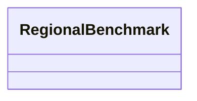

---
search:
  boost: 10.0
---

# Class: RegionalBenchmark 


_Material and labor factors for one region._


<div data-search-exclude markdown="1">


URI: [cost:RegionalBenchmark](https://schema.pragmaticbim.ch/cost/RegionalBenchmark)





<!-- no inheritance hierarchy -->

## Class Properties

| Property | Value |
| --- | --- |
| Class URI | [cost:RegionalBenchmark](https://schema.pragmaticbim.ch/cost/RegionalBenchmark) |


## Slots

| Name | Cardinality and Range | Description | Inheritance |
| ---  | --- | --- | --- |
| [code](code.md) | 1 <br/> [String](String.md) | Region code (for example CH_ZH, DE_MU). | direct |
| [currency](currency.md) | 1 <br/> [CurrencyEnum](CurrencyEnum.md) | Local currency for labor rates and installed-cost total. | direct |
| [material_factor](material_factor.md) | 1 <br/> [Float](Float.md) | Regional material price level vs anchor region (DE_MU = 1.0). | direct |
| [fx_to_eur](fx_to_eur.md) | 1 <br/> [Float](Float.md) | Material FX only. Multiply local currency → EUR (for example 1 CHF × 0.95). EUR book → local uses delivered_eur / fx_to_eur. | direct |
| [labor_factor](labor_factor.md) | 1 <br/> [Float](Float.md) | Regional labor cost multiplier (default 1.0). | direct |
| [labor_unit_price](labor_unit_price.md) | 1 <br/> [Decimal](Decimal.md) | Onsite installation labor rate per hour in currency (net, VAT excluded). | direct |
| [offsite_labor_unit_price](offsite_labor_unit_price.md) | 0..1 <br/> [Decimal](Decimal.md) | Factory/offsite labor rate per hour in currency (net, VAT excluded). | direct |


## Usages

| used by | used in | type | used |
| ---  | --- | --- | --- |
| [RegionalCostBenchmarkBook](RegionalCostBenchmarkBook.md) | [regions](regions.md) | range | [RegionalBenchmark](RegionalBenchmark.md) |


## Identifier and Mapping Information


### Schema Source


* from schema: https://schema.pragmaticbim.ch/cost/baseline-cost


## Mappings

| Mapping Type | Mapped Value |
| ---  | ---  |
| self | cost:RegionalBenchmark |
| native | cost:RegionalBenchmark |


## LinkML Source

<!-- TODO: investigate https://stackoverflow.com/questions/37606292/how-to-create-tabbed-code-blocks-in-mkdocs-or-sphinx -->

### Direct

<details>
```yaml
name: RegionalBenchmark
description: Material and labor factors for one region.
from_schema: https://schema.pragmaticbim.ch/cost/baseline-cost
slots:
- code
- currency
- material_factor
- fx_to_eur
- labor_factor
- labor_unit_price
- offsite_labor_unit_price
slot_usage:
  code:
    name: code
    identifier: true
    required: true
  currency:
    name: currency
    range: CurrencyEnum
    required: true
  material_factor:
    name: material_factor
    range: float
    required: true
    minimum_value: 0
  fx_to_eur:
    name: fx_to_eur
    range: float
    required: true
    minimum_value: 0
  labor_factor:
    name: labor_factor
    ifabsent: '1.0'
    range: float
    required: true
    minimum_value: 0
  labor_unit_price:
    name: labor_unit_price
    range: decimal
    required: true
    minimum_value: 0
  offsite_labor_unit_price:
    name: offsite_labor_unit_price
    range: decimal
    minimum_value: 0
class_uri: cost:RegionalBenchmark

```
</details>

### Induced

<details>
```yaml
name: RegionalBenchmark
description: Material and labor factors for one region.
from_schema: https://schema.pragmaticbim.ch/cost/baseline-cost
slot_usage:
  code:
    name: code
    identifier: true
    required: true
  currency:
    name: currency
    range: CurrencyEnum
    required: true
  material_factor:
    name: material_factor
    range: float
    required: true
    minimum_value: 0
  fx_to_eur:
    name: fx_to_eur
    range: float
    required: true
    minimum_value: 0
  labor_factor:
    name: labor_factor
    ifabsent: '1.0'
    range: float
    required: true
    minimum_value: 0
  labor_unit_price:
    name: labor_unit_price
    range: decimal
    required: true
    minimum_value: 0
  offsite_labor_unit_price:
    name: offsite_labor_unit_price
    range: decimal
    minimum_value: 0
attributes:
  code:
    name: code
    description: Region code (for example CH_ZH, DE_MU).
    from_schema: https://schema.pragmaticbim.ch/cost/baseline-cost
    rank: 1000
    identifier: true
    owner: RegionalBenchmark
    domain_of:
    - RegionalBenchmark
    range: string
    required: true
  currency:
    name: currency
    description: Local currency for labor rates and installed-cost total.
    from_schema: https://schema.pragmaticbim.ch/cost/baseline-cost
    rank: 1000
    owner: RegionalBenchmark
    domain_of:
    - RegionalBenchmark
    range: CurrencyEnum
    required: true
  material_factor:
    name: material_factor
    description: Regional material price level vs anchor region (DE_MU = 1.0).
    from_schema: https://schema.pragmaticbim.ch/cost/baseline-cost
    rank: 1000
    owner: RegionalBenchmark
    domain_of:
    - RegionalBenchmark
    range: float
    required: true
    minimum_value: 0
  fx_to_eur:
    name: fx_to_eur
    description: Material FX only. Multiply local currency → EUR (for example 1 CHF
      × 0.95). EUR book → local uses delivered_eur / fx_to_eur.
    from_schema: https://schema.pragmaticbim.ch/cost/baseline-cost
    rank: 1000
    owner: RegionalBenchmark
    domain_of:
    - RegionalBenchmark
    range: float
    required: true
    minimum_value: 0
  labor_factor:
    name: labor_factor
    description: Regional labor cost multiplier (default 1.0).
    from_schema: https://schema.pragmaticbim.ch/cost/baseline-cost
    rank: 1000
    ifabsent: '1.0'
    owner: RegionalBenchmark
    domain_of:
    - RegionalBenchmark
    range: float
    required: true
    minimum_value: 0
  labor_unit_price:
    name: labor_unit_price
    description: Onsite installation labor rate per hour in currency (net, VAT excluded).
    from_schema: https://schema.pragmaticbim.ch/cost/baseline-cost
    rank: 1000
    owner: RegionalBenchmark
    domain_of:
    - RegionalBenchmark
    range: decimal
    required: true
    minimum_value: 0
  offsite_labor_unit_price:
    name: offsite_labor_unit_price
    description: Factory/offsite labor rate per hour in currency (net, VAT excluded).
    from_schema: https://schema.pragmaticbim.ch/cost/baseline-cost
    rank: 1000
    owner: RegionalBenchmark
    domain_of:
    - RegionalBenchmark
    range: decimal
    minimum_value: 0
class_uri: cost:RegionalBenchmark

```
</details></div>