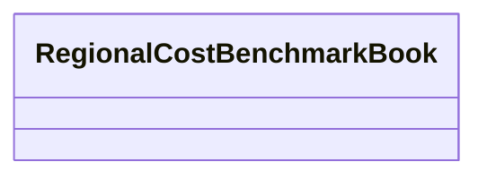

---
search:
  boost: 10.0
---

# Class: RegionalCostBenchmarkBook 


_Regional material and labor benchmarks paired with a BaselinePriceBook. Installed cost in regional currency uses fx_to_eur for material EUR→local and labor_unit_price in local currency. All monetary rates are net (VAT excluded)._


<div data-search-exclude markdown="1">


URI: [cost:RegionalCostBenchmarkBook](https://schema.pragmaticbim.ch/cost/RegionalCostBenchmarkBook)





<!-- no inheritance hierarchy -->

## Class Properties

| Property | Value |
| --- | --- |
| Class URI | [cost:RegionalCostBenchmarkBook](https://schema.pragmaticbim.ch/cost/RegionalCostBenchmarkBook) |
| Tree Root | Yes |


## Slots

| Name | Cardinality and Range | Description | Inheritance |
| ---  | --- | --- | --- |
| [version](version.md) | 0..1 <br/> [String](String.md) | Edition label (for example v12). | direct |
| [issued](issued.md) | 1 <br/> [Date](Date.md) | Publication date of this dataset edition. | direct |
| [anchor_region](anchor_region.md) | 1 <br/> [String](String.md) | Region code where material_factor and labor_factor are 1.0 (for example DE_MU). | direct |
| [source](source.md) | 0..1 <br/> [String](String.md) | Path or URI of the editorial source workbook. | direct |
| [license](license.md) | 0..1 <br/> [Uriorcurie](Uriorcurie.md) | License URI for the dataset (CC BY 4.0 for benchmark data). | direct |
| [disclaimer](disclaimer.md) | 0..1 <br/> [String](String.md) | Pointer to notice/disclaimer text. | direct |
| [regions](regions.md) | * <br/> [RegionalBenchmark](RegionalBenchmark.md) | Regional benchmarks keyed by region code. | direct |


## Identifier and Mapping Information


### Schema Source


* from schema: https://schema.pragmaticbim.ch/cost/baseline-cost


## Mappings

| Mapping Type | Mapped Value |
| ---  | ---  |
| self | cost:RegionalCostBenchmarkBook |
| native | cost:RegionalCostBenchmarkBook |


## LinkML Source

<!-- TODO: investigate https://stackoverflow.com/questions/37606292/how-to-create-tabbed-code-blocks-in-mkdocs-or-sphinx -->

### Direct

<details>
```yaml
name: RegionalCostBenchmarkBook
description: Regional material and labor benchmarks paired with a BaselinePriceBook.
  Installed cost in regional currency uses fx_to_eur for material EUR→local and labor_unit_price
  in local currency. All monetary rates are net (VAT excluded).
from_schema: https://schema.pragmaticbim.ch/cost/baseline-cost
slots:
- version
- issued
- anchor_region
- source
- license
- disclaimer
- regions
slot_usage:
  issued:
    name: issued
    required: true
  anchor_region:
    name: anchor_region
    required: true
  regions:
    name: regions
    range: RegionalBenchmark
    multivalued: true
    inlined: true
class_uri: cost:RegionalCostBenchmarkBook
tree_root: true

```
</details>

### Induced

<details>
```yaml
name: RegionalCostBenchmarkBook
description: Regional material and labor benchmarks paired with a BaselinePriceBook.
  Installed cost in regional currency uses fx_to_eur for material EUR→local and labor_unit_price
  in local currency. All monetary rates are net (VAT excluded).
from_schema: https://schema.pragmaticbim.ch/cost/baseline-cost
slot_usage:
  issued:
    name: issued
    required: true
  anchor_region:
    name: anchor_region
    required: true
  regions:
    name: regions
    range: RegionalBenchmark
    multivalued: true
    inlined: true
attributes:
  version:
    name: version
    description: Edition label (for example v12).
    from_schema: https://schema.pragmaticbim.ch/cost/baseline-cost
    rank: 1000
    owner: RegionalCostBenchmarkBook
    domain_of:
    - BaselinePriceBook
    - RegionalCostBenchmarkBook
    range: string
  issued:
    name: issued
    description: Publication date of this dataset edition.
    from_schema: https://schema.pragmaticbim.ch/cost/baseline-cost
    rank: 1000
    owner: RegionalCostBenchmarkBook
    domain_of:
    - BaselinePriceBook
    - RegionalCostBenchmarkBook
    range: date
    required: true
  anchor_region:
    name: anchor_region
    description: Region code where material_factor and labor_factor are 1.0 (for example
      DE_MU).
    from_schema: https://schema.pragmaticbim.ch/cost/baseline-cost
    rank: 1000
    owner: RegionalCostBenchmarkBook
    domain_of:
    - BaselinePriceBook
    - RegionalCostBenchmarkBook
    range: string
    required: true
  source:
    name: source
    description: Path or URI of the editorial source workbook.
    from_schema: https://schema.pragmaticbim.ch/cost/baseline-cost
    rank: 1000
    owner: RegionalCostBenchmarkBook
    domain_of:
    - BaselinePriceBook
    - RegionalCostBenchmarkBook
    range: string
  license:
    name: license
    description: License URI for the dataset (CC BY 4.0 for benchmark data).
    from_schema: https://schema.pragmaticbim.ch/cost/baseline-cost
    rank: 1000
    owner: RegionalCostBenchmarkBook
    domain_of:
    - BaselinePriceBook
    - RegionalCostBenchmarkBook
    range: uriorcurie
  disclaimer:
    name: disclaimer
    description: Pointer to notice/disclaimer text.
    from_schema: https://schema.pragmaticbim.ch/cost/baseline-cost
    rank: 1000
    owner: RegionalCostBenchmarkBook
    domain_of:
    - BaselinePriceBook
    - RegionalCostBenchmarkBook
    range: string
  regions:
    name: regions
    description: Regional benchmarks keyed by region code.
    from_schema: https://schema.pragmaticbim.ch/cost/baseline-cost
    rank: 1000
    owner: RegionalCostBenchmarkBook
    domain_of:
    - RegionalCostBenchmarkBook
    range: RegionalBenchmark
    multivalued: true
    inlined: true
class_uri: cost:RegionalCostBenchmarkBook
tree_root: true

```
</details></div>