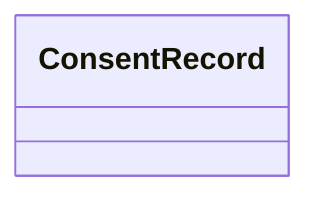

---
search:
  boost: 2.0
---

# Class: ConsentRecord 


_Record of lawful basis, scope, and lifecycle for processing personal data on a Person._

> **Embedded value type** — nested inside a parent record, not a graph node.

<div data-search-exclude markdown="1">


URI: [pbs:ConsentRecord](https://schema.pragmaticbim.ch/ConsentRecord)





<!-- no inheritance hierarchy -->

## Class Properties

| Property | Value |
| --- | --- |
| Class URI | [pbs:ConsentRecord](https://schema.pragmaticbim.ch/ConsentRecord) |


## Slots

| Name | Cardinality and Range | Description | Inheritance |
| ---  | --- | --- | --- |
| [lawful_basis](lawful_basis.md) | 1 <br/> [LawfulBasis](LawfulBasis.md) | Lawful basis for processing the scoped personal data categories. | direct |
| [processing_purpose](processing_purpose.md) | 1 <br/> [String](String.md) | Human-readable purpose for which the personal data categories are processed. | direct |
| [data_categories](data_categories.md) | 1..* <br/> [PersonalDataCategory](PersonalDataCategory.md) | Personal data categories covered by this consent or processing record. | direct |
| [granted_at](granted_at.md) | 0..1 <br/> [Datetime](Datetime.md) | Timestamp when consent was given. Required when lawful_basis is consent. | direct |
| [withdrawn_at](withdrawn_at.md) | 0..1 <br/> [Datetime](Datetime.md) | Timestamp when consent was withdrawn, if applicable. | direct |
| [privacy_policy_uri](privacy_policy_uri.md) | 1 <br/> [Uriorcurie](Uriorcurie.md) | URI of the current or default privacy policy or notice applicable to this person record. | direct |
| [consent_notes](consent_notes.md) | 0..1 <br/> [String](String.md) | Optional notes about how or where consent was captured. | direct |


## Usages

| used by | used in | type | used |
| ---  | --- | --- | --- |
| [Person](Person.md) | [consent_records](consent_records.md) | range | [ConsentRecord](ConsentRecord.md) |


## Identifier and Mapping Information


### Schema Source


* from schema: https://schema.pragmaticbim.ch


## Mappings

| Mapping Type | Mapped Value |
| ---  | ---  |
| self | pbs:ConsentRecord |
| native | pbs:ConsentRecord |


## LinkML Source

<!-- TODO: investigate https://stackoverflow.com/questions/37606292/how-to-create-tabbed-code-blocks-in-mkdocs-or-sphinx -->

### Direct

<details>
```yaml
name: ConsentRecord
description: Record of lawful basis, scope, and lifecycle for processing personal
  data on a Person.
from_schema: https://schema.pragmaticbim.ch
slots:
- lawful_basis
- processing_purpose
- data_categories
- granted_at
- withdrawn_at
- privacy_policy_uri
- consent_notes
slot_usage:
  lawful_basis:
    name: lawful_basis
    required: true
  processing_purpose:
    name: processing_purpose
    required: true
  data_categories:
    name: data_categories
    required: true
  privacy_policy_uri:
    name: privacy_policy_uri
    required: true
class_uri: pbs:ConsentRecord

```
</details>

### Induced

<details>
```yaml
name: ConsentRecord
description: Record of lawful basis, scope, and lifecycle for processing personal
  data on a Person.
from_schema: https://schema.pragmaticbim.ch
slot_usage:
  lawful_basis:
    name: lawful_basis
    required: true
  processing_purpose:
    name: processing_purpose
    required: true
  data_categories:
    name: data_categories
    required: true
  privacy_policy_uri:
    name: privacy_policy_uri
    required: true
attributes:
  lawful_basis:
    name: lawful_basis
    description: Lawful basis for processing the scoped personal data categories.
    from_schema: https://schema.pragmaticbim.ch
    rank: 1000
    owner: ConsentRecord
    domain_of:
    - ConsentRecord
    range: LawfulBasis
    required: true
  processing_purpose:
    name: processing_purpose
    description: Human-readable purpose for which the personal data categories are
      processed.
    from_schema: https://schema.pragmaticbim.ch
    rank: 1000
    owner: ConsentRecord
    domain_of:
    - ConsentRecord
    range: string
    required: true
  data_categories:
    name: data_categories
    description: Personal data categories covered by this consent or processing record.
    from_schema: https://schema.pragmaticbim.ch
    rank: 1000
    owner: ConsentRecord
    domain_of:
    - ConsentRecord
    range: PersonalDataCategory
    required: true
    multivalued: true
  granted_at:
    name: granted_at
    description: Timestamp when consent was given. Required when lawful_basis is consent.
    from_schema: https://schema.pragmaticbim.ch
    rank: 1000
    owner: ConsentRecord
    domain_of:
    - ConsentRecord
    range: datetime
  withdrawn_at:
    name: withdrawn_at
    description: Timestamp when consent was withdrawn, if applicable.
    from_schema: https://schema.pragmaticbim.ch
    rank: 1000
    owner: ConsentRecord
    domain_of:
    - ConsentRecord
    range: datetime
  privacy_policy_uri:
    name: privacy_policy_uri
    description: URI of the current or default privacy policy or notice applicable
      to this person record.
    from_schema: https://schema.pragmaticbim.ch
    rank: 1000
    owner: ConsentRecord
    domain_of:
    - Person
    - ConsentRecord
    range: uriorcurie
    required: true
  consent_notes:
    name: consent_notes
    description: Optional notes about how or where consent was captured.
    from_schema: https://schema.pragmaticbim.ch
    rank: 1000
    owner: ConsentRecord
    domain_of:
    - ConsentRecord
    range: string
class_uri: pbs:ConsentRecord

```
</details></div>