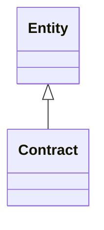

---
search:
  boost: 10.0
---

# Class: Contract 


_Commercial agreement entity for project scope, parties, and governance. Links to a signed artifact and related model entities via applies_to_entities. Entity.status covers record lifecycle; contract_status uses workflow vocabulary URIs._

__


<div data-search-exclude markdown="1">


URI: [pbs:Contract](https://schema.pragmaticbim.ch/Contract)





## Inheritance
* [Entity](Entity.md)
    * **Contract**


## Class Properties

| Property | Value |
| --- | --- |
| Class URI | [pbs:Contract](https://schema.pragmaticbim.ch/Contract) |


## Slots

| Name | Cardinality and Range | Description | Inheritance |
| ---  | --- | --- | --- |
| [contract_type](contract_type.md) | 0..1 <br/> [Uriorcurie](Uriorcurie.md) | Contract type expressed as a URI/CURIE from a controlled vocabulary (for example design, construction, supply). | direct |
| [contract_status](contract_status.md) | 0..1 <br/> [Uriorcurie](Uriorcurie.md) | Contract status expressed as a URI/CURIE (for example draft, signed, active, terminated, superseded). | direct |
| [contract_parties](contract_parties.md) | * <br/> [Agent](Agent.md) | Agents party to the contract (for example client, contractor, consultant). | direct |
| [contract_reference](contract_reference.md) | 0..1 <br/> [String](String.md) | Human-readable contract number or external reference. | direct |
| [signed_artifact](signed_artifact.md) | 0..1 <br/> [Artifact](Artifact.md) | Optional signed contract artifact at storage_link. | direct |
| [signed_at](signed_at.md) | 0..1 <br/> [Datetime](Datetime.md) | Timestamp when the contract was signed. | direct |
| [effective_from](effective_from.md) | 0..1 <br/> [Datetime](Datetime.md) | Start of contractual validity. | direct |
| [effective_until](effective_until.md) | 0..1 <br/> [Datetime](Datetime.md) | End of contractual validity when applicable. | direct |
| [id](id.md) | 1 <br/> [String](String.md) | Unique local identifier. | [Entity](Entity.md) |
| [content_kind](content_kind.md) | 1 <br/> [String](String.md) | Entity type discriminator for adapter projection and querying. Must be a ContentKind value. | [Entity](Entity.md) |
| [name](name.md) | 1 <br/> [String](String.md) | Default display name. | [Entity](Entity.md) |
| [localized_names](localized_names.md) | * <br/> [LocalizedText](LocalizedText.md) | Localized variants of name. | [Entity](Entity.md) |
| [description](description.md) | 0..1 <br/> [String](String.md) | Default description text. | [Entity](Entity.md) |
| [meaning_uri](meaning_uri.md) | 0..1 <br/> [Uriorcurie](Uriorcurie.md) | Optional semantic URI for linking the entity instance to an external ontology concept. | [Entity](Entity.md) |
| [localized_descriptions](localized_descriptions.md) | * <br/> [LocalizedText](LocalizedText.md) | Localized variants of description. | [Entity](Entity.md) |
| [ifc_global_id](ifc_global_id.md) | 0..1 <br/> [String](String.md) | IFC GlobalId of the mapped entity. | [Entity](Entity.md) |
| [classifications](classifications.md) | * <br/> [Classification](Classification.md) | Classification entries from IFC and other schemes. | [Entity](Entity.md) |
| [geometry_representations](geometry_representations.md) | * <br/> [GeometryRepresentation](GeometryRepresentation.md) | Geometry references associated with the entity. A single element may link to multiple geometry representations to serve different intents (authoring, coordination, analysis, visualization) without duplicating the element itself. | [Entity](Entity.md) |
| [quantity_values](quantity_values.md) | * <br/> [QuantityValue](QuantityValue.md) | Quantities associated with the entity. | [Entity](Entity.md) |
| [metadata](metadata.md) | * <br/> [MetadataEntry](MetadataEntry.md) | Generic metadata container for IFC attributes/properties and project-specific extensions. | [Entity](Entity.md) |
| [performance_properties](performance_properties.md) | * <br/> [PerformanceProperty](PerformanceProperty.md) | Normalized, strongly typed domain properties (fire/acoustic/thermal/structural/ security/material) extracted from raw IFC PropertySet values. | [Entity](Entity.md) |
| [applies_to_entities](applies_to_entities.md) | * <br/> [Entity](Entity.md) | Model entities this record applies to (requirements, cost items, schedule items, etc.). | [Entity](Entity.md) |
| [created_at](created_at.md) | 0..1 <br/> [Datetime](Datetime.md) | Creation timestamp for this entity record. | [Entity](Entity.md) |
| [modified_at](modified_at.md) | 0..1 <br/> [Datetime](Datetime.md) | Last modification timestamp for this entity record. | [Entity](Entity.md) |
| [revision](revision.md) | 0..1 <br/> [Integer](Integer.md) | Integer revision counter for change tracking. | [Entity](Entity.md) |
| [status](status.md) | 0..1 <br/> [StatusType](StatusType.md) | Lifecycle or QA status. | [Entity](Entity.md) |


## Identifier and Mapping Information


### Schema Source


* from schema: https://schema.pragmaticbim.ch


## Mappings

| Mapping Type | Mapped Value |
| ---  | ---  |
| self | pbs:Contract |
| native | pbs:Contract |


## LinkML Source

<!-- TODO: investigate https://stackoverflow.com/questions/37606292/how-to-create-tabbed-code-blocks-in-mkdocs-or-sphinx -->

### Direct

<details>
```yaml
name: Contract
description: 'Commercial agreement entity for project scope, parties, and governance.
  Links to a signed artifact and related model entities via applies_to_entities. Entity.status
  covers record lifecycle; contract_status uses workflow vocabulary URIs.

  '
from_schema: https://schema.pragmaticbim.ch
is_a: Entity
slots:
- contract_type
- contract_status
- contract_parties
- contract_reference
- signed_artifact
- signed_at
- effective_from
- effective_until
slot_usage:
  content_kind:
    name: content_kind
    equals_string: contract
class_uri: pbs:Contract

```
</details>

### Induced

<details>
```yaml
name: Contract
description: 'Commercial agreement entity for project scope, parties, and governance.
  Links to a signed artifact and related model entities via applies_to_entities. Entity.status
  covers record lifecycle; contract_status uses workflow vocabulary URIs.

  '
from_schema: https://schema.pragmaticbim.ch
is_a: Entity
slot_usage:
  content_kind:
    name: content_kind
    equals_string: contract
attributes:
  contract_type:
    name: contract_type
    description: Contract type expressed as a URI/CURIE from a controlled vocabulary
      (for example design, construction, supply).
    from_schema: https://schema.pragmaticbim.ch
    rank: 1000
    slot_uri: dcterms:type
    owner: Contract
    domain_of:
    - Contract
    range: uriorcurie
  contract_status:
    name: contract_status
    description: Contract status expressed as a URI/CURIE (for example draft, signed,
      active, terminated, superseded).
    from_schema: https://schema.pragmaticbim.ch
    rank: 1000
    slot_uri: adms:status
    owner: Contract
    domain_of:
    - Contract
    range: uriorcurie
  contract_parties:
    name: contract_parties
    description: Agents party to the contract (for example client, contractor, consultant).
    from_schema: https://schema.pragmaticbim.ch
    rank: 1000
    owner: Contract
    domain_of:
    - Contract
    range: Agent
    multivalued: true
    inlined: false
  contract_reference:
    name: contract_reference
    description: Human-readable contract number or external reference.
    from_schema: https://schema.pragmaticbim.ch
    rank: 1000
    owner: Contract
    domain_of:
    - Contract
    range: string
  signed_artifact:
    name: signed_artifact
    description: Optional signed contract artifact at storage_link.
    from_schema: https://schema.pragmaticbim.ch
    rank: 1000
    owner: Contract
    domain_of:
    - Contract
    range: Artifact
    inlined: false
  signed_at:
    name: signed_at
    description: Timestamp when the contract was signed.
    from_schema: https://schema.pragmaticbim.ch
    rank: 1000
    owner: Contract
    domain_of:
    - Contract
    range: datetime
  effective_from:
    name: effective_from
    description: Start of contractual validity.
    from_schema: https://schema.pragmaticbim.ch
    rank: 1000
    owner: Contract
    domain_of:
    - Contract
    range: datetime
  effective_until:
    name: effective_until
    description: End of contractual validity when applicable.
    from_schema: https://schema.pragmaticbim.ch
    rank: 1000
    owner: Contract
    domain_of:
    - Contract
    range: datetime
  id:
    name: id
    description: Unique local identifier.
    from_schema: https://schema.pragmaticbim.ch
    rank: 1000
    identifier: true
    owner: Contract
    domain_of:
    - Entity
    - Change
    range: string
    required: true
  content_kind:
    name: content_kind
    description: Entity type discriminator for adapter projection and querying. Must
      be a ContentKind value.
    from_schema: https://schema.pragmaticbim.ch
    rank: 1000
    owner: Contract
    domain_of:
    - Entity
    range: string
    required: true
    equals_string: contract
  name:
    name: name
    description: Default display name.
    from_schema: https://schema.pragmaticbim.ch
    rank: 1000
    owner: Contract
    domain_of:
    - Entity
    range: string
    required: true
  localized_names:
    name: localized_names
    description: Localized variants of name.
    from_schema: https://schema.pragmaticbim.ch
    rank: 1000
    owner: Contract
    domain_of:
    - Entity
    range: LocalizedText
    multivalued: true
    inlined: true
  description:
    name: description
    description: Default description text.
    from_schema: https://schema.pragmaticbim.ch
    rank: 1000
    owner: Contract
    domain_of:
    - Entity
    range: string
  meaning_uri:
    name: meaning_uri
    description: Optional semantic URI for linking the entity instance to an external
      ontology concept.
    from_schema: https://schema.pragmaticbim.ch
    rank: 1000
    owner: Contract
    domain_of:
    - Entity
    range: uriorcurie
  localized_descriptions:
    name: localized_descriptions
    description: Localized variants of description.
    from_schema: https://schema.pragmaticbim.ch
    rank: 1000
    owner: Contract
    domain_of:
    - Entity
    range: LocalizedText
    multivalued: true
    inlined: true
  ifc_global_id:
    name: ifc_global_id
    description: IFC GlobalId of the mapped entity.
    from_schema: https://schema.pragmaticbim.ch
    rank: 1000
    owner: Contract
    domain_of:
    - Entity
    - Change
    range: string
    pattern: ^[0-3][0-9A-Za-z_$]{21}$
  classifications:
    name: classifications
    description: Classification entries from IFC and other schemes.
    from_schema: https://schema.pragmaticbim.ch
    rank: 1000
    owner: Contract
    domain_of:
    - Entity
    - Artifact
    range: Classification
    multivalued: true
    inlined: true
  geometry_representations:
    name: geometry_representations
    description: 'Geometry references associated with the entity. A single element
      may link to multiple geometry representations to serve different intents (authoring,
      coordination, analysis, visualization) without duplicating the element itself.

      '
    from_schema: https://schema.pragmaticbim.ch
    rank: 1000
    owner: Contract
    domain_of:
    - Entity
    range: GeometryRepresentation
    multivalued: true
    inlined: true
  quantity_values:
    name: quantity_values
    description: Quantities associated with the entity.
    from_schema: https://schema.pragmaticbim.ch
    rank: 1000
    owner: Contract
    domain_of:
    - Entity
    range: QuantityValue
    multivalued: true
    inlined: true
  metadata:
    name: metadata
    description: Generic metadata container for IFC attributes/properties and project-specific
      extensions.
    from_schema: https://schema.pragmaticbim.ch
    rank: 1000
    owner: Contract
    domain_of:
    - Entity
    range: MetadataEntry
    multivalued: true
    inlined: true
  performance_properties:
    name: performance_properties
    description: 'Normalized, strongly typed domain properties (fire/acoustic/thermal/structural/
      security/material) extracted from raw IFC PropertySet values.

      '
    from_schema: https://schema.pragmaticbim.ch
    rank: 1000
    owner: Contract
    domain_of:
    - Entity
    range: PerformanceProperty
    multivalued: true
    inlined: true
  applies_to_entities:
    name: applies_to_entities
    description: Model entities this record applies to (requirements, cost items,
      schedule items, etc.).
    from_schema: https://schema.pragmaticbim.ch
    rank: 1000
    owner: Contract
    domain_of:
    - Entity
    - TimeRecord
    - CostRecord
    range: Entity
    multivalued: true
    inlined: false
  created_at:
    name: created_at
    description: Creation timestamp for this entity record.
    from_schema: https://schema.pragmaticbim.ch
    rank: 1000
    owner: Contract
    domain_of:
    - Entity
    range: datetime
  modified_at:
    name: modified_at
    description: Last modification timestamp for this entity record.
    from_schema: https://schema.pragmaticbim.ch
    rank: 1000
    owner: Contract
    domain_of:
    - Entity
    range: datetime
  revision:
    name: revision
    description: Integer revision counter for change tracking.
    from_schema: https://schema.pragmaticbim.ch
    rank: 1000
    owner: Contract
    domain_of:
    - Entity
    range: integer
    minimum_value: 0
  status:
    name: status
    description: Lifecycle or QA status.
    from_schema: https://schema.pragmaticbim.ch
    rank: 1000
    owner: Contract
    domain_of:
    - Entity
    range: StatusType
class_uri: pbs:Contract

```
</details></div>