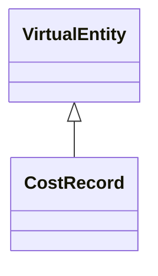

---
search:
  boost: 10.0
---

# Class: CostRecord 


_Cost record for estimation, catalog pricing, and calculation. Use cost_record_role to distinguish catalog cost/price (on Product) from project estimate/actual lines. Populate component_cost_items to act as an assembly (aggregated unit price)._


<div data-search-exclude markdown="1">


URI: [pbs:CostRecord](https://schema.pragmaticbim.ch/CostRecord)





## Inheritance
* [Entity](Entity.md)
    * [VirtualEntity](VirtualEntity.md)
        * **CostRecord**


## Class Properties

| Property | Value |
| --- | --- |
| Class URI | [pbs:CostRecord](https://schema.pragmaticbim.ch/CostRecord) |


## Slots

| Name | Cardinality and Range | Description | Inheritance |
| ---  | --- | --- | --- |
| [cost_record_role](cost_record_role.md) | 1 <br/> [CostRecordRole](CostRecordRole.md) | Role of this cost record (catalog cost, catalog price, project estimate, or actual). | direct |
| [cost_category](cost_category.md) | 0..1 <br/> [String](String.md) | Cost category label kept intentionally open pending classification-backed modeling. | direct |
| [unit_cost](unit_cost.md) | 1 <br/> [Double](Double.md) | Unit cost for this cost item. | direct |
| [currency](currency.md) | 1 <br/> [String](String.md) | ISO 4217 currency code (for example EUR, USD). | direct |
| [cost_quantity_type](cost_quantity_type.md) | 0..1 <br/> [QuantityType](QuantityType.md) | Quantity type used as basis for this cost calculation. | direct |
| [cost_quantity_value](cost_quantity_value.md) | 0..1 <br/> [Double](Double.md) | Quantity magnitude used as basis for this cost calculation. | direct |
| [cost_quantity_unit](cost_quantity_unit.md) | 0..1 <br/> [String](String.md) | Unit of the cost quantity value. | direct |
| [related_product](related_product.md) | 0..1 <br/> [Product](Product.md) | Optional catalog product this deliverable implements or this cost record is priced from. | direct |
| [priced_for_customer](priced_for_customer.md) | 0..1 <br/> [Company](Company.md) | Optional customer for a customer-specific catalog price when cost_record_role is price. | direct |
| [applies_to_entities](applies_to_entities.md) | * <br/> [Entity](Entity.md) | Model entities this record applies to (requirements, cost items, schedule items, etc.). | direct |
| [component_cost_items](component_cost_items.md) | * <br/> [CostRecord](CostRecord.md) | Cost records aggregated into this assembly record. | direct |
| [cost_records](cost_records.md) | * <br/> [CostRecord](CostRecord.md) | Cost records associated with this entity. | [VirtualEntity](VirtualEntity.md) |
| [time_records](time_records.md) | * <br/> [TimeRecord](TimeRecord.md) | Time records associated with this entity. | [VirtualEntity](VirtualEntity.md) |
| [materials](materials.md) | * <br/> [Material](Material.md) | Material definitions associated with this entity. | [VirtualEntity](VirtualEntity.md) |
| [id](id.md) | 1 <br/> [String](String.md) | Unique local identifier. | [Entity](Entity.md) |
| [content_kind](content_kind.md) | 1 <br/> [String](String.md) | Entity type discriminator for adapter projection and querying. Must be a ContentKind value. | [Entity](Entity.md) |
| [name](name.md) | 1 <br/> [String](String.md) | Default display name. | [Entity](Entity.md) |
| [localized_names](localized_names.md) | * <br/> [LocalizedText](LocalizedText.md) | Localized variants of name. | [Entity](Entity.md) |
| [description](description.md) | 0..1 <br/> [String](String.md) | Default description text. | [Entity](Entity.md) |
| [meaning_uri](meaning_uri.md) | 0..1 <br/> [Uriorcurie](Uriorcurie.md) | Optional semantic URI for linking the entity instance to an external ontology concept. | [Entity](Entity.md) |
| [localized_descriptions](localized_descriptions.md) | * <br/> [LocalizedText](LocalizedText.md) | Localized variants of description. | [Entity](Entity.md) |
| [ifc_global_id](ifc_global_id.md) | 0..1 <br/> [String](String.md) | IFC GlobalId of the mapped entity. | [Entity](Entity.md) |
| [classifications](classifications.md) | * <br/> [Classification](Classification.md) | Classification entries from IFC and other schemes. | [Entity](Entity.md) |
| [geometry_representations](geometry_representations.md) | * <br/> [GeometryRepresentation](GeometryRepresentation.md) | Geometry references associated with the entity. A single element may link to multiple geometry representations to serve different intents (authoring, coordination, analysis, visualization) without duplicating the element itself. | [Entity](Entity.md) |
| [quantity_values](quantity_values.md) | * <br/> [QuantityValue](QuantityValue.md) | Quantities associated with the entity. | [Entity](Entity.md) |
| [metadata](metadata.md) | * <br/> [MetadataEntry](MetadataEntry.md) | Generic metadata container for IFC attributes/properties and project-specific extensions. | [Entity](Entity.md) |
| [performance_properties](performance_properties.md) | * <br/> [PerformanceProperty](PerformanceProperty.md) | Normalized, strongly typed domain properties (fire/acoustic/thermal/structural/ security/material) extracted from raw IFC PropertySet values. | [Entity](Entity.md) |
| [created_at](created_at.md) | 0..1 <br/> [Datetime](Datetime.md) | Creation timestamp for this entity record. | [Entity](Entity.md) |
| [modified_at](modified_at.md) | 0..1 <br/> [Datetime](Datetime.md) | Last modification timestamp for this entity record. | [Entity](Entity.md) |
| [revision](revision.md) | 0..1 <br/> [Integer](Integer.md) | Integer revision counter for change tracking. | [Entity](Entity.md) |
| [status](status.md) | 0..1 <br/> [StatusType](StatusType.md) | Lifecycle or QA status. | [Entity](Entity.md) |


## Usages

| used by | used in | type | used |
| ---  | --- | --- | --- |
| [Product](Product.md) | [catalog_cost_records](catalog_cost_records.md) | range | [CostRecord](CostRecord.md) |
| [VirtualEntity](VirtualEntity.md) | [cost_records](cost_records.md) | range | [CostRecord](CostRecord.md) |
| [SpatialContext](SpatialContext.md) | [cost_records](cost_records.md) | range | [CostRecord](CostRecord.md) |
| [PerimeterContext](PerimeterContext.md) | [cost_records](cost_records.md) | range | [CostRecord](CostRecord.md) |
| [LegalSiteContext](LegalSiteContext.md) | [cost_records](cost_records.md) | range | [CostRecord](CostRecord.md) |
| [BuiltAssetContext](BuiltAssetContext.md) | [cost_records](cost_records.md) | range | [CostRecord](CostRecord.md) |
| [BuildingContext](BuildingContext.md) | [cost_records](cost_records.md) | range | [CostRecord](CostRecord.md) |
| [CivilStructureContext](CivilStructureContext.md) | [cost_records](cost_records.md) | range | [CostRecord](CostRecord.md) |
| [LevelContext](LevelContext.md) | [cost_records](cost_records.md) | range | [CostRecord](CostRecord.md) |
| [ZoneContext](ZoneContext.md) | [cost_records](cost_records.md) | range | [CostRecord](CostRecord.md) |
| [Space](Space.md) | [cost_records](cost_records.md) | range | [CostRecord](CostRecord.md) |
| [System](System.md) | [cost_records](cost_records.md) | range | [CostRecord](CostRecord.md) |
| [ConnectionVirtual](ConnectionVirtual.md) | [cost_records](cost_records.md) | range | [CostRecord](CostRecord.md) |
| [TimeRecord](TimeRecord.md) | [cost_records](cost_records.md) | range | [CostRecord](CostRecord.md) |
| [CostRecord](CostRecord.md) | [component_cost_items](component_cost_items.md) | range | [CostRecord](CostRecord.md) |
| [CostRecord](CostRecord.md) | [cost_records](cost_records.md) | range | [CostRecord](CostRecord.md) |
| [Material](Material.md) | [cost_records](cost_records.md) | range | [CostRecord](CostRecord.md) |


## Identifier and Mapping Information


### Schema Source


* from schema: https://schema.pragmaticbim.ch


## Mappings

| Mapping Type | Mapped Value |
| ---  | ---  |
| self | pbs:CostRecord |
| native | pbs:CostRecord |


## LinkML Source

<!-- TODO: investigate https://stackoverflow.com/questions/37606292/how-to-create-tabbed-code-blocks-in-mkdocs-or-sphinx -->

### Direct

<details>
```yaml
name: CostRecord
description: Cost record for estimation, catalog pricing, and calculation. Use cost_record_role
  to distinguish catalog cost/price (on Product) from project estimate/actual lines.
  Populate component_cost_items to act as an assembly (aggregated unit price).
from_schema: https://schema.pragmaticbim.ch
is_a: VirtualEntity
slots:
- cost_record_role
- cost_category
- unit_cost
- currency
- cost_quantity_type
- cost_quantity_value
- cost_quantity_unit
- related_product
- priced_for_customer
- applies_to_entities
- component_cost_items
slot_usage:
  cost_record_role:
    name: cost_record_role
    required: true
  related_product:
    name: related_product
    range: Product
  priced_for_customer:
    name: priced_for_customer
    range: Company
class_uri: pbs:CostRecord

```
</details>

### Induced

<details>
```yaml
name: CostRecord
description: Cost record for estimation, catalog pricing, and calculation. Use cost_record_role
  to distinguish catalog cost/price (on Product) from project estimate/actual lines.
  Populate component_cost_items to act as an assembly (aggregated unit price).
from_schema: https://schema.pragmaticbim.ch
is_a: VirtualEntity
slot_usage:
  cost_record_role:
    name: cost_record_role
    required: true
  related_product:
    name: related_product
    range: Product
  priced_for_customer:
    name: priced_for_customer
    range: Company
attributes:
  cost_record_role:
    name: cost_record_role
    description: Role of this cost record (catalog cost, catalog price, project estimate,
      or actual).
    from_schema: https://schema.pragmaticbim.ch
    rank: 1000
    owner: CostRecord
    domain_of:
    - CostRecord
    range: CostRecordRole
    required: true
  cost_category:
    name: cost_category
    description: Cost category label kept intentionally open pending classification-backed
      modeling.
    from_schema: https://schema.pragmaticbim.ch
    rank: 1000
    owner: CostRecord
    domain_of:
    - CostRequirement
    - CostRecord
    range: string
  unit_cost:
    name: unit_cost
    description: Unit cost for this cost item.
    from_schema: https://schema.pragmaticbim.ch
    rank: 1000
    owner: CostRecord
    domain_of:
    - CostRecord
    range: double
    required: true
    minimum_value: 0
  currency:
    name: currency
    description: ISO 4217 currency code (for example EUR, USD).
    from_schema: https://schema.pragmaticbim.ch
    rank: 1000
    owner: CostRecord
    domain_of:
    - CostRequirement
    - CostRecord
    range: string
    required: true
    pattern: ^[A-Z]{3}$
  cost_quantity_type:
    name: cost_quantity_type
    description: Quantity type used as basis for this cost calculation.
    from_schema: https://schema.pragmaticbim.ch
    rank: 1000
    owner: CostRecord
    domain_of:
    - CostRequirement
    - CostRecord
    range: QuantityType
  cost_quantity_value:
    name: cost_quantity_value
    description: Quantity magnitude used as basis for this cost calculation.
    from_schema: https://schema.pragmaticbim.ch
    rank: 1000
    owner: CostRecord
    domain_of:
    - CostRecord
    range: double
    minimum_value: 0
  cost_quantity_unit:
    name: cost_quantity_unit
    description: Unit of the cost quantity value.
    from_schema: https://schema.pragmaticbim.ch
    rank: 1000
    owner: CostRecord
    domain_of:
    - CostRecord
    range: string
  related_product:
    name: related_product
    description: Optional catalog product this deliverable implements or this cost
      record is priced from.
    from_schema: https://schema.pragmaticbim.ch
    rank: 1000
    owner: CostRecord
    domain_of:
    - Deliverable
    - CostRecord
    range: Product
    inlined: false
  priced_for_customer:
    name: priced_for_customer
    description: Optional customer for a customer-specific catalog price when cost_record_role
      is price.
    from_schema: https://schema.pragmaticbim.ch
    rank: 1000
    owner: CostRecord
    domain_of:
    - CostRecord
    range: Company
    inlined: false
  applies_to_entities:
    name: applies_to_entities
    description: Model entities this record applies to (requirements, cost items,
      schedule items, etc.).
    from_schema: https://schema.pragmaticbim.ch
    rank: 1000
    owner: CostRecord
    domain_of:
    - Entity
    - TimeRecord
    - CostRecord
    range: Entity
    multivalued: true
    inlined: false
  component_cost_items:
    name: component_cost_items
    description: Cost records aggregated into this assembly record.
    from_schema: https://schema.pragmaticbim.ch
    rank: 1000
    owner: CostRecord
    domain_of:
    - CostRecord
    range: CostRecord
    multivalued: true
    inlined: false
  cost_records:
    name: cost_records
    description: Cost records associated with this entity.
    from_schema: https://schema.pragmaticbim.ch
    rank: 1000
    owner: CostRecord
    domain_of:
    - VirtualEntity
    range: CostRecord
    multivalued: true
    inlined: false
  time_records:
    name: time_records
    description: Time records associated with this entity.
    from_schema: https://schema.pragmaticbim.ch
    rank: 1000
    owner: CostRecord
    domain_of:
    - VirtualEntity
    range: TimeRecord
    multivalued: true
    inlined: false
  materials:
    name: materials
    description: Material definitions associated with this entity.
    from_schema: https://schema.pragmaticbim.ch
    rank: 1000
    owner: CostRecord
    domain_of:
    - VirtualEntity
    range: Material
    multivalued: true
    inlined: false
  id:
    name: id
    description: Unique local identifier.
    from_schema: https://schema.pragmaticbim.ch
    rank: 1000
    identifier: true
    owner: CostRecord
    domain_of:
    - Entity
    - Change
    range: string
    required: true
  content_kind:
    name: content_kind
    description: Entity type discriminator for adapter projection and querying. Must
      be a ContentKind value.
    from_schema: https://schema.pragmaticbim.ch
    rank: 1000
    owner: CostRecord
    domain_of:
    - Entity
    range: string
    required: true
    equals_string: virtual
  name:
    name: name
    description: Default display name.
    from_schema: https://schema.pragmaticbim.ch
    rank: 1000
    owner: CostRecord
    domain_of:
    - Entity
    range: string
    required: true
  localized_names:
    name: localized_names
    description: Localized variants of name.
    from_schema: https://schema.pragmaticbim.ch
    rank: 1000
    owner: CostRecord
    domain_of:
    - Entity
    range: LocalizedText
    multivalued: true
    inlined: true
  description:
    name: description
    description: Default description text.
    from_schema: https://schema.pragmaticbim.ch
    rank: 1000
    owner: CostRecord
    domain_of:
    - Entity
    range: string
  meaning_uri:
    name: meaning_uri
    description: Optional semantic URI for linking the entity instance to an external
      ontology concept.
    from_schema: https://schema.pragmaticbim.ch
    rank: 1000
    owner: CostRecord
    domain_of:
    - Entity
    range: uriorcurie
  localized_descriptions:
    name: localized_descriptions
    description: Localized variants of description.
    from_schema: https://schema.pragmaticbim.ch
    rank: 1000
    owner: CostRecord
    domain_of:
    - Entity
    range: LocalizedText
    multivalued: true
    inlined: true
  ifc_global_id:
    name: ifc_global_id
    description: IFC GlobalId of the mapped entity.
    from_schema: https://schema.pragmaticbim.ch
    rank: 1000
    owner: CostRecord
    domain_of:
    - Entity
    - Change
    range: string
    pattern: ^[0-3][0-9A-Za-z_$]{21}$
  classifications:
    name: classifications
    description: Classification entries from IFC and other schemes.
    from_schema: https://schema.pragmaticbim.ch
    rank: 1000
    owner: CostRecord
    domain_of:
    - Entity
    - Artifact
    range: Classification
    multivalued: true
    inlined: true
  geometry_representations:
    name: geometry_representations
    description: 'Geometry references associated with the entity. A single element
      may link to multiple geometry representations to serve different intents (authoring,
      coordination, analysis, visualization) without duplicating the element itself.

      '
    from_schema: https://schema.pragmaticbim.ch
    rank: 1000
    owner: CostRecord
    domain_of:
    - Entity
    range: GeometryRepresentation
    multivalued: true
    inlined: true
  quantity_values:
    name: quantity_values
    description: Quantities associated with the entity.
    from_schema: https://schema.pragmaticbim.ch
    rank: 1000
    owner: CostRecord
    domain_of:
    - Entity
    range: QuantityValue
    multivalued: true
    inlined: true
  metadata:
    name: metadata
    description: Generic metadata container for IFC attributes/properties and project-specific
      extensions.
    from_schema: https://schema.pragmaticbim.ch
    rank: 1000
    owner: CostRecord
    domain_of:
    - Entity
    range: MetadataEntry
    multivalued: true
    inlined: true
  performance_properties:
    name: performance_properties
    description: 'Normalized, strongly typed domain properties (fire/acoustic/thermal/structural/
      security/material) extracted from raw IFC PropertySet values.

      '
    from_schema: https://schema.pragmaticbim.ch
    rank: 1000
    owner: CostRecord
    domain_of:
    - Entity
    range: PerformanceProperty
    multivalued: true
    inlined: true
  created_at:
    name: created_at
    description: Creation timestamp for this entity record.
    from_schema: https://schema.pragmaticbim.ch
    rank: 1000
    owner: CostRecord
    domain_of:
    - Entity
    range: datetime
  modified_at:
    name: modified_at
    description: Last modification timestamp for this entity record.
    from_schema: https://schema.pragmaticbim.ch
    rank: 1000
    owner: CostRecord
    domain_of:
    - Entity
    range: datetime
  revision:
    name: revision
    description: Integer revision counter for change tracking.
    from_schema: https://schema.pragmaticbim.ch
    rank: 1000
    owner: CostRecord
    domain_of:
    - Entity
    range: integer
    minimum_value: 0
  status:
    name: status
    description: Lifecycle or QA status.
    from_schema: https://schema.pragmaticbim.ch
    rank: 1000
    owner: CostRecord
    domain_of:
    - Entity
    range: StatusType
class_uri: pbs:CostRecord

```
</details></div>