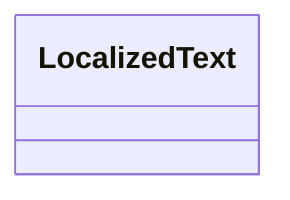

---
search:
  boost: 2.0
---

# Class: LocalizedText 


_Localized text value for a specific language tag._

> **Embedded value type** — nested inside a parent record, not a graph node.

<div data-search-exclude markdown="1">


URI: [pbs:LocalizedText](https://schema.pragmaticbim.ch/LocalizedText)





<!-- no inheritance hierarchy -->

## Class Properties

| Property | Value |
| --- | --- |
| Class URI | [pbs:LocalizedText](https://schema.pragmaticbim.ch/LocalizedText) |


## Slots

| Name | Cardinality and Range | Description | Inheritance |
| ---  | --- | --- | --- |
| [language_tag](language_tag.md) | 1 <br/> [String](String.md) | IETF BCP 47 language tag (for example en, de, pt-BR). | direct |
| [text_value](text_value.md) | 1 <br/> [String](String.md) | Localized text value. | direct |


## Usages

| used by | used in | type | used |
| ---  | --- | --- | --- |
| [Entity](Entity.md) | [localized_names](localized_names.md) | range | [LocalizedText](LocalizedText.md) |
| [Entity](Entity.md) | [localized_descriptions](localized_descriptions.md) | range | [LocalizedText](LocalizedText.md) |
| [Agent](Agent.md) | [localized_names](localized_names.md) | range | [LocalizedText](LocalizedText.md) |
| [Agent](Agent.md) | [localized_descriptions](localized_descriptions.md) | range | [LocalizedText](LocalizedText.md) |
| [Person](Person.md) | [localized_names](localized_names.md) | range | [LocalizedText](LocalizedText.md) |
| [Person](Person.md) | [localized_descriptions](localized_descriptions.md) | range | [LocalizedText](LocalizedText.md) |
| [Company](Company.md) | [localized_names](localized_names.md) | range | [LocalizedText](LocalizedText.md) |
| [Company](Company.md) | [localized_descriptions](localized_descriptions.md) | range | [LocalizedText](LocalizedText.md) |
| [SoftwareAgent](SoftwareAgent.md) | [localized_names](localized_names.md) | range | [LocalizedText](LocalizedText.md) |
| [SoftwareAgent](SoftwareAgent.md) | [localized_descriptions](localized_descriptions.md) | range | [LocalizedText](LocalizedText.md) |
| [Decision](Decision.md) | [localized_names](localized_names.md) | range | [LocalizedText](LocalizedText.md) |
| [Decision](Decision.md) | [localized_descriptions](localized_descriptions.md) | range | [LocalizedText](LocalizedText.md) |
| [Task](Task.md) | [localized_names](localized_names.md) | range | [LocalizedText](LocalizedText.md) |
| [Task](Task.md) | [localized_descriptions](localized_descriptions.md) | range | [LocalizedText](LocalizedText.md) |
| [Process](Process.md) | [localized_names](localized_names.md) | range | [LocalizedText](LocalizedText.md) |
| [Process](Process.md) | [localized_descriptions](localized_descriptions.md) | range | [LocalizedText](LocalizedText.md) |
| [Message](Message.md) | [localized_names](localized_names.md) | range | [LocalizedText](LocalizedText.md) |
| [Message](Message.md) | [localized_descriptions](localized_descriptions.md) | range | [LocalizedText](LocalizedText.md) |
| [Artifact](Artifact.md) | [localized_names](localized_names.md) | range | [LocalizedText](LocalizedText.md) |
| [Artifact](Artifact.md) | [localized_descriptions](localized_descriptions.md) | range | [LocalizedText](LocalizedText.md) |
| [Contract](Contract.md) | [localized_names](localized_names.md) | range | [LocalizedText](LocalizedText.md) |
| [Contract](Contract.md) | [localized_descriptions](localized_descriptions.md) | range | [LocalizedText](LocalizedText.md) |
| [Project](Project.md) | [localized_names](localized_names.md) | range | [LocalizedText](LocalizedText.md) |
| [Project](Project.md) | [localized_descriptions](localized_descriptions.md) | range | [LocalizedText](LocalizedText.md) |
| [Program](Program.md) | [localized_names](localized_names.md) | range | [LocalizedText](LocalizedText.md) |
| [Program](Program.md) | [localized_descriptions](localized_descriptions.md) | range | [LocalizedText](LocalizedText.md) |
| [Product](Product.md) | [localized_names](localized_names.md) | range | [LocalizedText](LocalizedText.md) |
| [Product](Product.md) | [localized_descriptions](localized_descriptions.md) | range | [LocalizedText](LocalizedText.md) |
| [Deliverable](Deliverable.md) | [localized_names](localized_names.md) | range | [LocalizedText](LocalizedText.md) |
| [Deliverable](Deliverable.md) | [localized_descriptions](localized_descriptions.md) | range | [LocalizedText](LocalizedText.md) |
| [Requirement](Requirement.md) | [localized_names](localized_names.md) | range | [LocalizedText](LocalizedText.md) |
| [Requirement](Requirement.md) | [localized_descriptions](localized_descriptions.md) | range | [LocalizedText](LocalizedText.md) |
| [PerformanceRequirement](PerformanceRequirement.md) | [localized_names](localized_names.md) | range | [LocalizedText](LocalizedText.md) |
| [PerformanceRequirement](PerformanceRequirement.md) | [localized_descriptions](localized_descriptions.md) | range | [LocalizedText](LocalizedText.md) |
| [SpatialRequirement](SpatialRequirement.md) | [localized_names](localized_names.md) | range | [LocalizedText](LocalizedText.md) |
| [SpatialRequirement](SpatialRequirement.md) | [localized_descriptions](localized_descriptions.md) | range | [LocalizedText](LocalizedText.md) |
| [RegulatoryRequirement](RegulatoryRequirement.md) | [localized_names](localized_names.md) | range | [LocalizedText](LocalizedText.md) |
| [RegulatoryRequirement](RegulatoryRequirement.md) | [localized_descriptions](localized_descriptions.md) | range | [LocalizedText](LocalizedText.md) |
| [BriefRequirement](BriefRequirement.md) | [localized_names](localized_names.md) | range | [LocalizedText](LocalizedText.md) |
| [BriefRequirement](BriefRequirement.md) | [localized_descriptions](localized_descriptions.md) | range | [LocalizedText](LocalizedText.md) |
| [DeliverableRequirement](DeliverableRequirement.md) | [localized_names](localized_names.md) | range | [LocalizedText](LocalizedText.md) |
| [DeliverableRequirement](DeliverableRequirement.md) | [localized_descriptions](localized_descriptions.md) | range | [LocalizedText](LocalizedText.md) |
| [ScheduleRequirement](ScheduleRequirement.md) | [localized_names](localized_names.md) | range | [LocalizedText](LocalizedText.md) |
| [ScheduleRequirement](ScheduleRequirement.md) | [localized_descriptions](localized_descriptions.md) | range | [LocalizedText](LocalizedText.md) |
| [CostRequirement](CostRequirement.md) | [localized_names](localized_names.md) | range | [LocalizedText](LocalizedText.md) |
| [CostRequirement](CostRequirement.md) | [localized_descriptions](localized_descriptions.md) | range | [LocalizedText](LocalizedText.md) |
| [MaterialRequirement](MaterialRequirement.md) | [localized_names](localized_names.md) | range | [LocalizedText](LocalizedText.md) |
| [MaterialRequirement](MaterialRequirement.md) | [localized_descriptions](localized_descriptions.md) | range | [LocalizedText](LocalizedText.md) |
| [PhysicalElement](PhysicalElement.md) | [localized_names](localized_names.md) | range | [LocalizedText](LocalizedText.md) |
| [PhysicalElement](PhysicalElement.md) | [localized_descriptions](localized_descriptions.md) | range | [LocalizedText](LocalizedText.md) |
| [Separator](Separator.md) | [localized_names](localized_names.md) | range | [LocalizedText](LocalizedText.md) |
| [Separator](Separator.md) | [localized_descriptions](localized_descriptions.md) | range | [LocalizedText](LocalizedText.md) |
| [SeparatorWall](SeparatorWall.md) | [localized_names](localized_names.md) | range | [LocalizedText](LocalizedText.md) |
| [SeparatorWall](SeparatorWall.md) | [localized_descriptions](localized_descriptions.md) | range | [LocalizedText](LocalizedText.md) |
| [SeparatorSlab](SeparatorSlab.md) | [localized_names](localized_names.md) | range | [LocalizedText](LocalizedText.md) |
| [SeparatorSlab](SeparatorSlab.md) | [localized_descriptions](localized_descriptions.md) | range | [LocalizedText](LocalizedText.md) |
| [ConnectionPhysical](ConnectionPhysical.md) | [localized_names](localized_names.md) | range | [LocalizedText](LocalizedText.md) |
| [ConnectionPhysical](ConnectionPhysical.md) | [localized_descriptions](localized_descriptions.md) | range | [LocalizedText](LocalizedText.md) |
| [Boundary](Boundary.md) | [localized_names](localized_names.md) | range | [LocalizedText](LocalizedText.md) |
| [Boundary](Boundary.md) | [localized_descriptions](localized_descriptions.md) | range | [LocalizedText](LocalizedText.md) |
| [Equipment](Equipment.md) | [localized_names](localized_names.md) | range | [LocalizedText](LocalizedText.md) |
| [Equipment](Equipment.md) | [localized_descriptions](localized_descriptions.md) | range | [LocalizedText](LocalizedText.md) |
| [VirtualEntity](VirtualEntity.md) | [localized_names](localized_names.md) | range | [LocalizedText](LocalizedText.md) |
| [VirtualEntity](VirtualEntity.md) | [localized_descriptions](localized_descriptions.md) | range | [LocalizedText](LocalizedText.md) |
| [SpatialContext](SpatialContext.md) | [localized_names](localized_names.md) | range | [LocalizedText](LocalizedText.md) |
| [SpatialContext](SpatialContext.md) | [localized_descriptions](localized_descriptions.md) | range | [LocalizedText](LocalizedText.md) |
| [PerimeterContext](PerimeterContext.md) | [localized_names](localized_names.md) | range | [LocalizedText](LocalizedText.md) |
| [PerimeterContext](PerimeterContext.md) | [localized_descriptions](localized_descriptions.md) | range | [LocalizedText](LocalizedText.md) |
| [LegalSiteContext](LegalSiteContext.md) | [localized_names](localized_names.md) | range | [LocalizedText](LocalizedText.md) |
| [LegalSiteContext](LegalSiteContext.md) | [localized_descriptions](localized_descriptions.md) | range | [LocalizedText](LocalizedText.md) |
| [BuiltAssetContext](BuiltAssetContext.md) | [localized_names](localized_names.md) | range | [LocalizedText](LocalizedText.md) |
| [BuiltAssetContext](BuiltAssetContext.md) | [localized_descriptions](localized_descriptions.md) | range | [LocalizedText](LocalizedText.md) |
| [BuildingContext](BuildingContext.md) | [localized_names](localized_names.md) | range | [LocalizedText](LocalizedText.md) |
| [BuildingContext](BuildingContext.md) | [localized_descriptions](localized_descriptions.md) | range | [LocalizedText](LocalizedText.md) |
| [CivilStructureContext](CivilStructureContext.md) | [localized_names](localized_names.md) | range | [LocalizedText](LocalizedText.md) |
| [CivilStructureContext](CivilStructureContext.md) | [localized_descriptions](localized_descriptions.md) | range | [LocalizedText](LocalizedText.md) |
| [LevelContext](LevelContext.md) | [localized_names](localized_names.md) | range | [LocalizedText](LocalizedText.md) |
| [LevelContext](LevelContext.md) | [localized_descriptions](localized_descriptions.md) | range | [LocalizedText](LocalizedText.md) |
| [ZoneContext](ZoneContext.md) | [localized_names](localized_names.md) | range | [LocalizedText](LocalizedText.md) |
| [ZoneContext](ZoneContext.md) | [localized_descriptions](localized_descriptions.md) | range | [LocalizedText](LocalizedText.md) |
| [Space](Space.md) | [localized_names](localized_names.md) | range | [LocalizedText](LocalizedText.md) |
| [Space](Space.md) | [localized_descriptions](localized_descriptions.md) | range | [LocalizedText](LocalizedText.md) |
| [System](System.md) | [localized_names](localized_names.md) | range | [LocalizedText](LocalizedText.md) |
| [System](System.md) | [localized_descriptions](localized_descriptions.md) | range | [LocalizedText](LocalizedText.md) |
| [ConnectionVirtual](ConnectionVirtual.md) | [localized_names](localized_names.md) | range | [LocalizedText](LocalizedText.md) |
| [ConnectionVirtual](ConnectionVirtual.md) | [localized_descriptions](localized_descriptions.md) | range | [LocalizedText](LocalizedText.md) |
| [TimeRecord](TimeRecord.md) | [localized_names](localized_names.md) | range | [LocalizedText](LocalizedText.md) |
| [TimeRecord](TimeRecord.md) | [localized_descriptions](localized_descriptions.md) | range | [LocalizedText](LocalizedText.md) |
| [CostRecord](CostRecord.md) | [localized_names](localized_names.md) | range | [LocalizedText](LocalizedText.md) |
| [CostRecord](CostRecord.md) | [localized_descriptions](localized_descriptions.md) | range | [LocalizedText](LocalizedText.md) |
| [Material](Material.md) | [localized_names](localized_names.md) | range | [LocalizedText](LocalizedText.md) |
| [Material](Material.md) | [localized_descriptions](localized_descriptions.md) | range | [LocalizedText](LocalizedText.md) |


## Identifier and Mapping Information


### Schema Source


* from schema: https://schema.pragmaticbim.ch


## Mappings

| Mapping Type | Mapped Value |
| ---  | ---  |
| self | pbs:LocalizedText |
| native | pbs:LocalizedText |


## LinkML Source

<!-- TODO: investigate https://stackoverflow.com/questions/37606292/how-to-create-tabbed-code-blocks-in-mkdocs-or-sphinx -->

### Direct

<details>
```yaml
name: LocalizedText
description: Localized text value for a specific language tag.
from_schema: https://schema.pragmaticbim.ch
slots:
- language_tag
- text_value
class_uri: pbs:LocalizedText

```
</details>

### Induced

<details>
```yaml
name: LocalizedText
description: Localized text value for a specific language tag.
from_schema: https://schema.pragmaticbim.ch
attributes:
  language_tag:
    name: language_tag
    description: IETF BCP 47 language tag (for example en, de, pt-BR).
    from_schema: https://schema.pragmaticbim.ch
    rank: 1000
    owner: LocalizedText
    domain_of:
    - LocalizedText
    range: string
    required: true
  text_value:
    name: text_value
    description: Localized text value.
    from_schema: https://schema.pragmaticbim.ch
    rank: 1000
    owner: LocalizedText
    domain_of:
    - LocalizedText
    range: string
    required: true
class_uri: pbs:LocalizedText

```
</details></div>