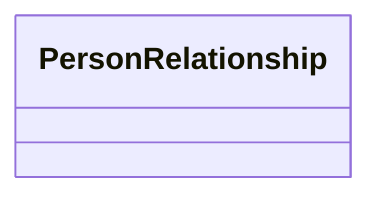

---
search:
  boost: 2.0
---

# Class: PersonRelationship 


_Typed link from a person to another agent or to a topic concept. The predicate is expressed as a Classification referencing AbstractPersonRelationshipType. Exactly one of related_person, related_company, or related_topic must be set; see the target-kind mapping for predicate-to-slot rules._

> **Embedded value type** — nested inside a parent record, not a graph node.

__


<div data-search-exclude markdown="1">


URI: [pbs:PersonRelationship](https://schema.pragmaticbim.ch/PersonRelationship)





<!-- no inheritance hierarchy -->

## Class Properties

| Property | Value |
| --- | --- |
| Class URI | [pbs:PersonRelationship](https://schema.pragmaticbim.ch/PersonRelationship) |


## Slots

| Name | Cardinality and Range | Description | Inheritance |
| ---  | --- | --- | --- |
| [relationship_type](relationship_type.md) | 1 <br/> [Classification](Classification.md) | Relationship predicate. classification_scheme must be AbstractPersonRelationshipType; classification_code and classification_uri reference the SKOS concept. | direct |
| [related_person](related_person.md) | 0..1 <br/> [Person](Person.md) | Target person for social and professional predicates such as knows, was_colleague_of, reports_to, or has_key_account_manager. | direct |
| [related_company](related_company.md) | 0..1 <br/> [Company](Company.md) | Target organization for org and commercial predicates such as works_at, worked_at, is_key_account_manager_for, client_of, or vendor_of. | direct |
| [related_topic](related_topic.md) | 0..1 <br/> [Classification](Classification.md) | Topic of interest. classification_scheme must be AbstractTopicClassification; classification_uri references the SKOS topic concept. | direct |
| [valid_from](valid_from.md) | 0..1 <br/> [Datetime](Datetime.md) | Optional start of the relationship period (for example employment start for worked_at). | direct |
| [valid_to](valid_to.md) | 0..1 <br/> [Datetime](Datetime.md) | Optional end of the relationship period (for example employment end for worked_at). | direct |
| [relationship_notes](relationship_notes.md) | 0..1 <br/> [String](String.md) | Optional free-text context for this relationship record. | direct |
| [relationship_source](relationship_source.md) | 0..1 <br/> [String](String.md) | Optional provenance label (for example manual, crm:manual, llm:story-msg-0042, LinkedIn). | direct |


## Usages

| used by | used in | type | used |
| ---  | --- | --- | --- |
| [Person](Person.md) | [person_relationships](person_relationships.md) | range | [PersonRelationship](PersonRelationship.md) |


## Identifier and Mapping Information


### Schema Source


* from schema: https://schema.pragmaticbim.ch


## Mappings

| Mapping Type | Mapped Value |
| ---  | ---  |
| self | pbs:PersonRelationship |
| native | pbs:PersonRelationship |


## LinkML Source

<!-- TODO: investigate https://stackoverflow.com/questions/37606292/how-to-create-tabbed-code-blocks-in-mkdocs-or-sphinx -->

### Direct

<details>
```yaml
name: PersonRelationship
description: 'Typed link from a person to another agent or to a topic concept. The
  predicate is expressed as a Classification referencing AbstractPersonRelationshipType.
  Exactly one of related_person, related_company, or related_topic must be set; see
  the target-kind mapping for predicate-to-slot rules.

  '
from_schema: https://schema.pragmaticbim.ch
slots:
- relationship_type
- related_person
- related_company
- related_topic
- valid_from
- valid_to
- relationship_notes
- relationship_source
slot_usage:
  relationship_type:
    name: relationship_type
    required: true
class_uri: pbs:PersonRelationship

```
</details>

### Induced

<details>
```yaml
name: PersonRelationship
description: 'Typed link from a person to another agent or to a topic concept. The
  predicate is expressed as a Classification referencing AbstractPersonRelationshipType.
  Exactly one of related_person, related_company, or related_topic must be set; see
  the target-kind mapping for predicate-to-slot rules.

  '
from_schema: https://schema.pragmaticbim.ch
slot_usage:
  relationship_type:
    name: relationship_type
    required: true
attributes:
  relationship_type:
    name: relationship_type
    description: 'Relationship predicate. classification_scheme must be AbstractPersonRelationshipType;
      classification_code and classification_uri reference the SKOS concept.

      '
    from_schema: https://schema.pragmaticbim.ch
    rank: 1000
    owner: PersonRelationship
    domain_of:
    - PersonRelationship
    range: Classification
    required: true
    inlined: true
  related_person:
    name: related_person
    description: Target person for social and professional predicates such as knows,
      was_colleague_of, reports_to, or has_key_account_manager.
    from_schema: https://schema.pragmaticbim.ch
    rank: 1000
    owner: PersonRelationship
    domain_of:
    - PersonRelationship
    range: Person
    inlined: false
  related_company:
    name: related_company
    description: Target organization for org and commercial predicates such as works_at,
      worked_at, is_key_account_manager_for, client_of, or vendor_of.
    from_schema: https://schema.pragmaticbim.ch
    rank: 1000
    owner: PersonRelationship
    domain_of:
    - PersonRelationship
    range: Company
    inlined: false
  related_topic:
    name: related_topic
    description: 'Topic of interest. classification_scheme must be AbstractTopicClassification;
      classification_uri references the SKOS topic concept.

      '
    from_schema: https://schema.pragmaticbim.ch
    rank: 1000
    owner: PersonRelationship
    domain_of:
    - PersonRelationship
    range: Classification
    inlined: true
  valid_from:
    name: valid_from
    description: Optional start of the relationship period (for example employment
      start for worked_at).
    from_schema: https://schema.pragmaticbim.ch
    rank: 1000
    owner: PersonRelationship
    domain_of:
    - PersonRelationship
    range: datetime
  valid_to:
    name: valid_to
    description: Optional end of the relationship period (for example employment end
      for worked_at).
    from_schema: https://schema.pragmaticbim.ch
    rank: 1000
    owner: PersonRelationship
    domain_of:
    - PersonRelationship
    range: datetime
  relationship_notes:
    name: relationship_notes
    description: Optional free-text context for this relationship record.
    from_schema: https://schema.pragmaticbim.ch
    rank: 1000
    owner: PersonRelationship
    domain_of:
    - PersonRelationship
    range: string
  relationship_source:
    name: relationship_source
    description: Optional provenance label (for example manual, crm:manual, llm:story-msg-0042,
      LinkedIn).
    from_schema: https://schema.pragmaticbim.ch
    rank: 1000
    owner: PersonRelationship
    domain_of:
    - PersonRelationship
    range: string
class_uri: pbs:PersonRelationship

```
</details></div>