# Abstract workflow participant roles

Source: [`roles.skos.ttl`](sources/roles.ttl)

## Scheme

- **definition (de):** Workflow-Teilnehmerrollen für Organisationsvorlagen; stabile IDs für BPMN oder Prozessvariablen.
- **definition (en):** Workflow participant roles for org templates; stable ids for BPMN or process variables.
- **prefLabel (de):** Abstrakte Workflow-Teilnehmerrollen
- **prefLabel (en):** Abstract workflow participant roles
- **title (en):** Abstract workflow participant roles

## Hierarchy

```mermaid
flowchart TD
  n_aec_group_contractor["aec.group.contractor: Contractor side"] --> n_aec_contractor["aec.contractor: Contractor"]
  n_aec_group_contractor["aec.group.contractor: Contractor side"] --> n_aec_supplier["aec.supplier: Supplier"]
  n_aec_group_owner["aec.group.owner: Owner side"] --> n_aec_client["aec.client: Client"]
  n_aec_group_owner["aec.group.owner: Owner side"] --> n_aec_developer["aec.developer: Developer"]
  n_aec_group_owner["aec.group.owner: Owner side"] --> n_aec_facility_manager["aec.facility_manager: Facility manager"]
  n_aec_group_owner["aec.group.owner: Owner side"] --> n_aec_owner["aec.owner: Owner"]
  n_aec_group_planner["aec.group.planner: Planner"] --> n_aec_architect["aec.architect: Architect"]
  n_aec_group_planner["aec.group.planner: Planner"] --> n_aec_bim_coordinator["aec.bim_coordinator: BIM coordinator"]
  n_aec_group_planner["aec.group.planner: Planner"] --> n_aec_bim_manager["aec.bim_manager: BIM manager"]
  n_aec_group_planner["aec.group.planner: Planner"] --> n_aec_electrical_engineer["aec.electrical_engineer: Electrical engineer"]
  n_aec_group_planner["aec.group.planner: Planner"] --> n_aec_heating_engineer["aec.heating_engineer: Heating engineer"]
  n_aec_group_planner["aec.group.planner: Planner"] --> n_aec_plumbing_engineer["aec.plumbing_engineer: Plumbing engineer"]
  n_aec_group_planner["aec.group.planner: Planner"] --> n_aec_project_lead["aec.project_lead: Project lead"]
  n_aec_group_planner["aec.group.planner: Planner"] --> n_aec_project_manager["aec.project_manager: Project manager"]
  n_aec_group_planner["aec.group.planner: Planner"] --> n_aec_site_manager["aec.site_manager: Site manager"]
  n_aec_group_planner["aec.group.planner: Planner"] --> n_aec_structural_engineer["aec.structural_engineer: Structural engineer"]
  n_aec_group_planner["aec.group.planner: Planner"] --> n_aec_sustainability_consultant["aec.sustainability_consultant: Sustainability consultant"]
  n_aec_group_planner["aec.group.planner: Planner"] --> n_aec_ventilation_engineer["aec.ventilation_engineer: Ventilation engineer"]
```

## Concepts

| Notation | Broader | Label (de) | Label (en) | Definition (de) | Definition (en) | Scope note (de) | Scope note (en) |
| --- | --- | --- | --- | --- | --- | --- | --- |
| aec.architect | aec.group.planner | Architekt | Architect | Der Architekt ist verantwortlich für die Architektur des Projekts. | The architect is responsible for the architecture of the project. |  |  |
| aec.bim_coordinator | aec.group.planner | BIM-Koordination | BIM coordinator | Der BIM-Koordinator ist verantwortlich für das BIM-Modell. | The BIM coordinator is responsible for the BIM model. |  |  |
| aec.bim_manager | aec.group.planner | BIM-Manager | BIM manager | Der BIM-Manager ist verantwortlich für das BIM-Modell. | The BIM manager to support the . |  |  |
| aec.client | aec.group.owner | Kunde | Client |  |  |  |  |
| aec.contractor | aec.group.contractor | Bauunternehmer | Contractor | Der Bauunternehmer ist verantwortlich für die Bauarbeiten des Projekts. | The contractor is responsible for the construction of the project. |  |  |
| aec.developer | aec.group.owner | Entwickler | Developer |  |  |  |  |
| aec.electrical_engineer | aec.group.planner | Elektroingenieur | Electrical engineer | Der Elektroingenieur ist verantwortlich für die Elektroplanung des Projekts. | The electrical engineer is responsible for the electrical design of the project. |  |  |
| aec.facility_manager | aec.group.owner | Facility Management | Facility manager |  |  |  |  |
| aec.group.contractor |  | Ausführung / Unternehmerseite | Contractor side | Ausführung und Lieferkette auf Unternehmerseite. | Construction execution and supply-chain roles. |  |  |
| aec.group.owner |  | Bauherr / Eigentümerseite | Owner side | Auftraggeber, Eigentümer, Projektentwickler und betreibende Rollen auf Eigentümerseite. | Client, asset owner, developer, and owner-side operations roles. |  |  |
| aec.group.planner |  | Planer | Planner | Planungs-, Ingenieur-, Koordinations-, Projektleitungs- und Bauüberwachungsrollen. | Design, engineering, coordination, project-management, and site supervision roles on the planning side. |  |  |
| aec.group.tenant |  | Mieter / Nutzerseite | Tenant side | Mieter- und Nutzerrollen (Blattkonzepte bei Bedarf ergänzen). | Occupier and tenant-side roles (extend with leaf concepts when needed). |  |  |
| aec.heating_engineer | aec.group.planner | Heizungplaner | Heating engineer | Der Heizungplaner ist verantwortlich für die Heizungplanung des Projekts. | The heating engineer is responsible for the heating design of the project. |  |  |
| aec.owner | aec.group.owner | Eigentuemer | Owner |  |  |  |  |
| aec.plumbing_engineer | aec.group.planner | Sanitärplaner | Plumbing engineer | Der Sanitärplaner ist verantwortlich für die Sanitärplanung des Projekts. | The plumbing engineer is responsible for the plumbing design of the project. |  |  |
| aec.project_lead | aec.group.planner | Projektleitung | Project lead | Der Projektleitung ist verantwortlich für das Projekt innerhalb der Organisation. | The project lead is responsible for the project within the organization. |  |  |
| aec.project_manager | aec.group.planner | Gesamtprojektleitung | Project manager | Die Gesamtprojektleitung ist verantwortlich für das Gesamtprojekt. | The project manager is responsible for the overall project. |  |  |
| aec.site_manager | aec.group.planner | Bauleiter | Site manager |  |  |  |  |
| aec.structural_engineer | aec.group.planner | Tragwerksplaner | Structural engineer | Der Tragwerksplaner ist verantwortlich für die Tragwerksplanung des Projekts. | The structural engineer is responsible for the structural design of the project. |  |  |
| aec.supplier | aec.group.contractor | Lieferant | Supplier |  |  |  |  |
| aec.sustainability_consultant | aec.group.planner | Nachhaltigkeitsberater | Sustainability consultant |  |  |  |  |
| aec.ventilation_engineer | aec.group.planner | Lüftungsplaner | Ventilation engineer | Der Lüftungsplaner ist verantwortlich für die Lüftungplanung des Projekts. | The ventilation engineer is responsible for the ventilation design of the project. |  |  |
