# Building space activity classification

Source: [`building_space-activity-classification-en.skos.ttl`](sources/room-activity.ttl)

## Scheme

- **definition (de):** Klassifikationssystem fuer Gebaeude-, Raum- und Aktivitaetsflaechen mit hierarchischer Einteilung von Nutzungs-, Unterstuetzungs- und Aussenbereichen.
- **definition (en):** Building Space and Activity Classification System (BuildingSpaceActivityClassification), version 1.0.3.
- **prefLabel (de):** Klassifikationssystem fuer Gebaeude-, Raum- und Aktivitaetsflaechen
- **prefLabel (en):** Building Space and Activity Classification System
- **title (en):** Building Space and Activity Classification System

## Hierarchy

```mermaid
flowchart TD
  n_M["M: Main Activity Spaces"] --> n_M_CIR["M-CIR: Main Activity Circulation"]
  n_M["M: Main Activity Spaces"] --> n_M_COM["M-COM: Commercial Spaces"]
  n_M["M: Main Activity Spaces"] --> n_M_HEL["M-HEL: Healthcare Spaces"]
  n_M["M: Main Activity Spaces"] --> n_M_LRN["M-LRN: Learning Spaces"]
  n_M["M: Main Activity Spaces"] --> n_M_RES["M-RES: Residential Spaces"]
  n_M["M: Main Activity Spaces"] --> n_M_WRK["M-WRK: Work Spaces"]
  n_M_WRK["M-WRK: Work Spaces"] --> n_M_WRK_KNW["M-WRK-KNW: Knowledge Work Spaces"]
  n_M_WRK["M-WRK: Work Spaces"] --> n_M_WRK_PRD["M-WRK-PRD: Production Work Spaces"]
  n_O["O: Outdoor Spaces"] --> n_O_CIR["O-CIR: Outdoor Circulation"]
  n_O["O: Outdoor Spaces"] --> n_O_GRN["O-GRN: Green Spaces"]
  n_O_CIR["O-CIR: Outdoor Circulation"] --> n_O_CIR_PED["O-CIR-PED: Pedestrian Circulation"]
  n_O_CIR["O-CIR: Outdoor Circulation"] --> n_O_CIR_RD["O-CIR-RD: Roads"]
  n_O_GRN["O-GRN: Green Spaces"] --> n_O_GRN_GDN["O-GRN-GDN: Garden Spaces"]
  n_O_GRN["O-GRN: Green Spaces"] --> n_O_GRN_REC["O-GRN-REC: Recreational Green Spaces"]
  n_O_GRN["O-GRN: Green Spaces"] --> n_O_GRN_SPT["O-GRN-SPT: Sports Spaces"]
  n_S["S: Support Spaces"] --> n_S_CIR["S-CIR: Support Circulation Spaces"]
  n_S["S: Support Spaces"] --> n_S_PRK["S-PRK: Parking Spaces"]
  n_S["S: Support Spaces"] --> n_S_TEC["S-TEC: Technical Spaces"]
  n_S["S: Support Spaces"] --> n_S_VOI["S-VOI: Void Spaces"]
  n_S_CIR["S-CIR: Support Circulation Spaces"] --> n_S_CIR_HOR["S-CIR-HOR: Horizontal Circulation"]
  n_S_CIR["S-CIR: Support Circulation Spaces"] --> n_S_CIR_VRT["S-CIR-VRT: Vertical Circulation"]
  n_S_PRK["S-PRK: Parking Spaces"] --> n_S_PRK_EXT["S-PRK-EXT: Exterior Parking Spaces"]
  n_S_PRK["S-PRK: Parking Spaces"] --> n_S_PRK_INT["S-PRK-INT: Interior Parking Spaces"]
  n_S_PRK["S-PRK: Parking Spaces"] --> n_S_PRK_SVC["S-PRK-SVC: Service Vehicle Spaces"]
  n_S_VOI["S-VOI: Void Spaces"] --> n_S_VOI_MLT["S-VOI-MLT: Multistory Void Spaces"]
  n_S_VOI["S-VOI: Void Spaces"] --> n_S_VOI_PLN["S-VOI-PLN: Plenum Spaces"]
  n_S_VOI["S-VOI: Void Spaces"] --> n_S_VOI_STR["S-VOI-STR: Structural Voids"]
  n_S_VOI["S-VOI: Void Spaces"] --> n_S_VOI_VRT["S-VOI-VRT: Vertical Void Spaces"]
```

## Concepts

| Notation | Broader | Label (de) | Label (en) | Definition (de) | Definition (en) | Scope note (de) | Scope note (en) |
| --- | --- | --- | --- | --- | --- | --- | --- |
| M |  | Hauptnutzungsflaechen | Main Activity Spaces | Kategorie fuer hauptnutzungsflaechen im Klassifikationssystem. | Primary spaces for building occupants' activities |  |  |
| M-CIR | M | Hauptnutzungserschliessung | Main Activity Circulation | Kategorie fuer hauptnutzungserschliessung im Klassifikationssystem. | Circulation spaces integral to main activities |  |  |
| M-COM | M | Gewerbeflaechen | Commercial Spaces | Kategorie fuer gewerbeflaechen im Klassifikationssystem. | Spaces for trading and business activities |  |  |
| M-HEL | M | Gesundheitsflaechen | Healthcare Spaces | Kategorie fuer gesundheitsflaechen im Klassifikationssystem. | Spaces for medical and wellness activities |  |  |
| M-LRN | M | Lernflaechen | Learning Spaces | Kategorie fuer lernflaechen im Klassifikationssystem. | Spaces for educational and knowledge acquisition |  |  |
| M-RES | M | Wohnflaechen | Residential Spaces | Kategorie fuer wohnflaechen im Klassifikationssystem. | Spaces for daily living and personal life activities |  |  |
| M-WRK | M | Arbeitsflaechen | Work Spaces | Kategorie fuer arbeitsflaechen im Klassifikationssystem. | Spaces for professional and productive activities |  |  |
| M-WRK-KNW | M-WRK | Wissensarbeitsflaechen | Knowledge Work Spaces | Kategorie fuer wissensarbeitsflaechen im Klassifikationssystem. | Spaces for intellectual and information-based work |  |  |
| M-WRK-PRD | M-WRK | Produktionsarbeitsflaechen | Production Work Spaces | Kategorie fuer produktionsarbeitsflaechen im Klassifikationssystem. | Spaces for physical production and manufacturing activities |  |  |
| O |  | Aussenflaechen | Outdoor Spaces | Kategorie fuer aussenflaechen im Klassifikationssystem. | External spaces associated with the building |  |  |
| O-CIR | O | Aussenerschliessung | Outdoor Circulation | Kategorie fuer aussenerschliessung im Klassifikationssystem. | External movement spaces |  |  |
| O-CIR-PED | O-CIR | Fussgaengererschliessung | Pedestrian Circulation | Kategorie fuer fussgaengererschliessung im Klassifikationssystem. | Pedestrian movement spaces |  |  |
| O-CIR-RD | O-CIR | Fahrwege | Roads | Kategorie fuer fahrwege im Klassifikationssystem. | Vehicular circulation routes |  |  |
| O-GRN | O | Gruenflaechen | Green Spaces | Kategorie fuer gruenflaechen im Klassifikationssystem. | Landscaped and natural area spaces |  |  |
| O-GRN-GDN | O-GRN | Gartenflaechen | Garden Spaces | Kategorie fuer gartenflaechen im Klassifikationssystem. | Cultivated green spaces |  |  |
| O-GRN-REC | O-GRN | Erholungsgruenflaechen | Recreational Green Spaces | Kategorie fuer erholungsgruenflaechen im Klassifikationssystem. | Spaces for leisure activities |  |  |
| O-GRN-SPT | O-GRN | Sportflaechen | Sports Spaces | Kategorie fuer sportflaechen im Klassifikationssystem. | Formal athletic spaces |  |  |
| S |  | Unterstuetzungsflaechen | Support Spaces | Kategorie fuer unterstuetzungsflaechen im Klassifikationssystem. | Auxiliary spaces supporting building operations |  |  |
| S-CIR | S | Nebenerschliessungsflaechen | Support Circulation Spaces | Kategorie fuer nebenerschliessungsflaechen im Klassifikationssystem. | Auxiliary circulation spaces |  |  |
| S-CIR-HOR | S-CIR | Horizontale Erschliessung | Horizontal Circulation | Kategorie fuer horizontale erschliessung im Klassifikationssystem. | Spaces for horizontal movement |  |  |
| S-CIR-VRT | S-CIR | Vertikale Erschliessung | Vertical Circulation | Kategorie fuer vertikale erschliessung im Klassifikationssystem. | Spaces for vertical movement |  |  |
| S-PRK | S | Parkierungsflaechen | Parking Spaces | Kategorie fuer parkierungsflaechen im Klassifikationssystem. | Spaces for vehicle storage and management |  |  |
| S-PRK-EXT | S-PRK | Aussenparkierungsflaechen | Exterior Parking Spaces | Kategorie fuer aussenparkierungsflaechen im Klassifikationssystem. | Open-air vehicle parking areas |  |  |
| S-PRK-INT | S-PRK | Innenparkierungsflaechen | Interior Parking Spaces | Kategorie fuer innenparkierungsflaechen im Klassifikationssystem. | Enclosed vehicle parking areas |  |  |
| S-PRK-SVC | S-PRK | Servicefahrzeugflaechen | Service Vehicle Spaces | Kategorie fuer servicefahrzeugflaechen im Klassifikationssystem. | Specialized parking for service vehicles |  |  |
| S-TEC | S | Technikflaechen | Technical Spaces | Kategorie fuer technikflaechen im Klassifikationssystem. | Spaces for building systems and equipment |  |  |
| S-VOI | S | Hohlraeume | Void Spaces | Kategorie fuer hohlraeume im Klassifikationssystem. | Spaces not suitable for occupancy or activity |  |  |
| S-VOI-MLT | S-VOI | Mehrgeschossige Hohlraeume | Multistory Void Spaces | Kategorie fuer mehrgeschossige hohlraeume im Klassifikationssystem. | Vertical open spaces spanning multiple floors |  |  |
| S-VOI-PLN | S-VOI | Installationszwischenraeume | Plenum Spaces | Kategorie fuer installationszwischenraeume im Klassifikationssystem. | Horizontal service voids |  |  |
| S-VOI-STR | S-VOI | Konstruktive Hohlraeume | Structural Voids | Kategorie fuer konstruktive hohlraeume im Klassifikationssystem. | Spaces within structural elements |  |  |
| S-VOI-VRT | S-VOI | Vertikale Hohlraeume | Vertical Void Spaces | Kategorie fuer vertikale hohlraeume im Klassifikationssystem. | Vertical shafts and wells |  |  |
