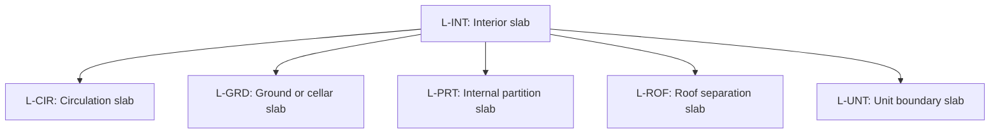

# Separator slab role classification

Source: [`separator-slab-role-classification-en.skos.ttl`](sources/separator-slab-role.ttl)

## Scheme

- **definition (de):** Topologische Rollenklassifikation fuer deckenbasierte Trennelemente (SeparatorSlab), abgeleitet aus angrenzenden Raum- und Geschossbeziehungen.
- **definition (en):** Topological role classification for slab-based separating elements (SeparatorSlab), derived from adjacent space and level relationships.
- **prefLabel (de):** Klassifikation der Trenndeckenrollen
- **prefLabel (en):** Building Separator Slab Role Classification
- **title (en):** Building Separator Slab Role Classification

## Hierarchy

## Concepts

| Notation | Broader | Label (de) | Label (en) | Definition (de) | Definition (en) | Scope note (de) | Scope note (en) |
| --- | --- | --- | --- | --- | --- | --- | --- |
| L-CIR | L-INT | Erschliessungsdecke | Circulation slab | Decke mit primaerem Bezug zu Erschliessungsraeumen. | Slab associated primarily with circulation spaces. |  |  |
| L-EXT |  | Aussendeckung | Exterior slab | Decke, die genutzten oder konditionierten Raum von der Aussenumgebung trennt. | Slab separating occupied or conditioned space from the exterior environment. |  |  |
| L-GRD | L-INT | Boden- oder Kellerdecke | Ground or cellar slab | Decke auf Erdgeschossniveau oder unterhalb, die Innenraum von Erdreich oder aussenseitigen Untergeschossbedingungen trennt. | Slab at ground level or below grade separating interior from earth or exterior below-grade conditions. |  |  |
| L-INT |  | Innendeckung | Interior slab | Innendeckung, deren primaere Rolle durch die topologische Lage zu angrenzenden Raeumen oder Geschossen bestimmt wird. | Interior slab whose primary role is defined by adjacent space or level topology. |  |  |
| L-PRT | L-INT | Innere Trennplatte | Internal partition slab | Decke, die Raeume innerhalb derselben Nutzungseinheit ohne besondere Grenzrollenfunktion trennt. | Slab separating spaces within the same occupancy unit without a special boundary role. |  |  |
| L-ROF | L-INT | Dachabgrenzungsdecke | Roof separation slab | Decke als primaere Abgrenzung auf Dachniveau zwischen konditionierten und unkonditionierten Zonen. | Slab forming the primary separation at roof level between conditioned and unconditioned zones. |  |  |
| L-UNT | L-INT | Geschossdecke zwischen Nutzungseinheiten | Unit boundary slab | Decke, die selbstaendige Nutzungs- oder Brandabschnittseinheiten vertikal voneinander trennt. | Slab separating independent occupancy or fire-compartment units vertically. |  |  |
