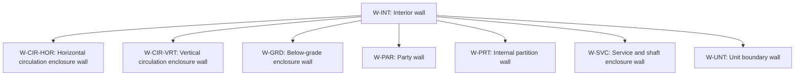

# Separator wall role classification

Source: [`separator-wall-role-classification-en.skos.ttl`](sources/separator-wall-role.ttl)

## Scheme

- **definition (de):** Topologische Rollenklassifikation fuer wandbasierte Trennelemente (SeparatorWall), abgeleitet aus den angrenzenden Raumbeziehungen.
- **definition (en):** Topological role classification for wall-based separating elements (SeparatorWall), derived from adjacent space relationships.
- **prefLabel (de):** Klassifikation der Trennwandrollen
- **prefLabel (en):** Building Separator Wall Role Classification
- **title (en):** Building Separator Wall Role Classification

## Hierarchy

## Concepts

| Notation | Broader | Label (de) | Label (en) | Definition (de) | Definition (en) | Scope note (de) | Scope note (en) |
| --- | --- | --- | --- | --- | --- | --- | --- |
| W-CIR-HOR | W-INT | Wand an horizontaler Erschliessung | Horizontal circulation enclosure wall | Wand, die einen horizontalen Erschliessungsraum begrenzt. | Wall bounding a horizontal circulation space. |  |  |
| W-CIR-VRT | W-INT | Treppenhauswand / Aufzugwand | Vertical circulation enclosure wall | Wand, die einen vertikalen Erschliessungsraum begrenzt. | Wall bounding a vertical circulation space. |  |  |
| W-EXT |  | Aussenwand | Exterior wall | Wand, die konditionierten oder nutzbaren Raum von der Aussenumgebung trennt. | Wall separating conditioned or occupied space from the exterior environment. |  |  |
| W-GRD | W-INT | Keller-Umfassungswand | Below-grade enclosure wall | Innenwand mit Bezug zu Keller- oder unterirdischen Randbedingungen. | Interior wall associated with below-grade or cellar perimeter conditions. |  |  |
| W-INT |  | Innenwand | Interior wall | Innenwand, deren primaere Rolle durch die topologische Lage zu angrenzenden Raeumen bestimmt wird. | Interior wall whose primary role is defined by adjacent space topology. |  |  |
| W-PAR | W-INT | Brandwand / Grenzwand | Party wall | Wand, die dieses Gebaeude von einem Nachbargebaeude oder einer rechtlichen Grundstuecksgrenze trennt. | Wall separating this building from an adjacent building or legal plot boundary. |  |  |
| W-PRT | W-INT | Innere Trennwand | Internal partition wall | Wand, die Raeume innerhalb derselben Nutzungseinheit voneinander trennt. | Wall separating spaces within the same occupancy unit. |  |  |
| W-SVC | W-INT | Technik- und Schachtwand | Service and shaft enclosure wall | Wand, die Technik-, Versorgungs- oder Hohlraeume begrenzt. | Wall bounding technical, utility, or void spaces. |  |  |
| W-UNT | W-INT | Wohnungstrennwand | Unit boundary wall | Wand, die selbstaendige Nutzungs- oder Brandabschnittseinheiten voneinander trennt. | Wall separating independent occupancy or fire-compartment units. |  |  |
