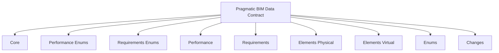
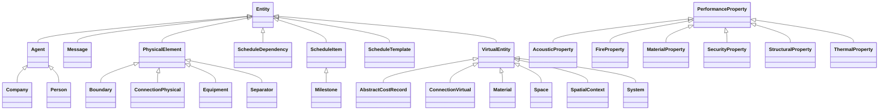
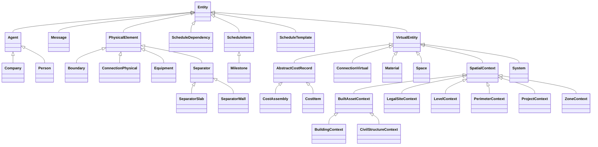
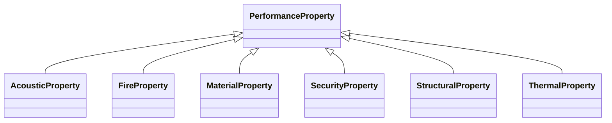

<!-- schema-diagrams-preamble -->

## Schema diagrams

Generated from `schema/*.yaml`. See the [schema documentation](https://schema.pragmaticbim.ch/schema/pragmatic-bim.docs.html) for interactive class pages.

### Module map

### Entity hierarchy (overview)

### Entity model

### Performance properties

