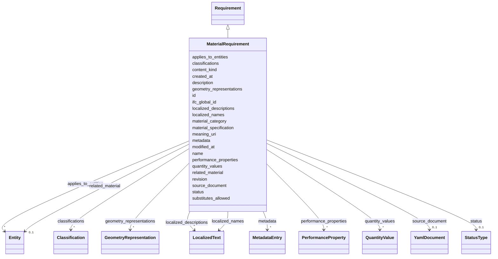

---
search:
  boost: 10.0
---

# Class: MaterialRequirement 


_Material or product specification requirement for matching against assigned materials._


<div data-search-exclude markdown="1">


URI: [pbs:MaterialRequirement](https://schema.pragmaticbim.ch/MaterialRequirement)





## Inheritance
* [Entity](Entity.md)
    * [Requirement](Requirement.md)
        * **MaterialRequirement**


## Class Properties

| Property | Value |
| --- | --- |
| Class URI | [pbs:MaterialRequirement](https://schema.pragmaticbim.ch/MaterialRequirement) |


## Slots

| Name | Cardinality and Range | Description | Inheritance |
| ---  | --- | --- | --- |
| [material_category](material_category.md) | 0..1 <br/> [String](String.md) | Material category label kept intentionally open pending classification-backed modeling. | direct |
| [material_specification](material_specification.md) | 0..1 <br/> [String](String.md) | Material grade, specification, or product description. | direct |
| [related_material](related_material.md) | 0..1 <br/> [Entity](Entity.md) | Optional Material entity template this requirement must match or satisfy. | direct |
| [substitutes_allowed](substitutes_allowed.md) | 0..1 <br/> [Boolean](Boolean.md) | Whether equivalent or substitute materials are permitted. | direct |
| [source_document](source_document.md) | 0..1 <br/> [YamlDocument](YamlDocument.md) | Optional source document entity backing this requirement. | [Requirement](Requirement.md) |
| [id](id.md) | 1 <br/> [String](String.md) | Unique local identifier. | [Entity](Entity.md) |
| [content_kind](content_kind.md) | 1 <br/> [String](String.md) | Entity type discriminator for adapter projection and querying. Must be a ContentKind value. | [Entity](Entity.md) |
| [name](name.md) | 1 <br/> [String](String.md) | Default display name. | [Entity](Entity.md) |
| [localized_names](localized_names.md) | * <br/> [LocalizedText](LocalizedText.md) | Localized variants of name. | [Entity](Entity.md) |
| [description](description.md) | 0..1 <br/> [String](String.md) | Default description text. | [Entity](Entity.md) |
| [meaning_uri](meaning_uri.md) | 0..1 <br/> [Uriorcurie](Uriorcurie.md) | Optional semantic URI for linking the entity instance to an external ontology concept. | [Entity](Entity.md) |
| [localized_descriptions](localized_descriptions.md) | * <br/> [LocalizedText](LocalizedText.md) | Localized variants of description. | [Entity](Entity.md) |
| [ifc_global_id](ifc_global_id.md) | 0..1 <br/> [String](String.md) | IFC GlobalId of the mapped entity. | [Entity](Entity.md) |
| [classifications](classifications.md) | * <br/> [Classification](Classification.md) | Classification entries from IFC and other schemes. | [Entity](Entity.md) |
| [geometry_representations](geometry_representations.md) | * <br/> [GeometryRepresentation](GeometryRepresentation.md) | Geometry references associated with the entity. A single element may link to multiple geometry representations to serve different intents (authoring, coordination, analysis, visualization) without duplicating the element itself. | [Entity](Entity.md) |
| [quantity_values](quantity_values.md) | * <br/> [QuantityValue](QuantityValue.md) | Quantities associated with the entity. | [Entity](Entity.md) |
| [metadata](metadata.md) | * <br/> [MetadataEntry](MetadataEntry.md) | Generic metadata container for IFC attributes/properties and project-specific extensions. | [Entity](Entity.md) |
| [performance_properties](performance_properties.md) | * <br/> [PerformanceProperty](PerformanceProperty.md) | Normalized, strongly typed domain properties (fire/acoustic/thermal/structural/ security/material) extracted from raw IFC PropertySet values. | [Entity](Entity.md) |
| [applies_to_entities](applies_to_entities.md) | * <br/> [Entity](Entity.md) | Model entities this record applies to (requirements, cost items, schedule items, etc.). | [Entity](Entity.md) |
| [created_at](created_at.md) | 0..1 <br/> [Datetime](Datetime.md) | Creation timestamp for this entity record. | [Entity](Entity.md) |
| [modified_at](modified_at.md) | 0..1 <br/> [Datetime](Datetime.md) | Last modification timestamp for this entity record. | [Entity](Entity.md) |
| [revision](revision.md) | 0..1 <br/> [Integer](Integer.md) | Integer revision counter for change tracking. | [Entity](Entity.md) |
| [status](status.md) | 0..1 <br/> [StatusType](StatusType.md) | Lifecycle or QA status. | [Entity](Entity.md) |


## Identifier and Mapping Information


### Schema Source


* from schema: https://schema.pragmaticbim.ch


## Mappings

| Mapping Type | Mapped Value |
| ---  | ---  |
| self | pbs:MaterialRequirement |
| native | pbs:MaterialRequirement |


## LinkML Source

<!-- TODO: investigate https://stackoverflow.com/questions/37606292/how-to-create-tabbed-code-blocks-in-mkdocs-or-sphinx -->

### Direct

<details>
```yaml
name: MaterialRequirement
description: Material or product specification requirement for matching against assigned
  materials.
from_schema: https://schema.pragmaticbim.ch
is_a: Requirement
slots:
- material_category
- material_specification
- related_material
- substitutes_allowed
class_uri: pbs:MaterialRequirement

```
</details>

### Induced

<details>
```yaml
name: MaterialRequirement
description: Material or product specification requirement for matching against assigned
  materials.
from_schema: https://schema.pragmaticbim.ch
is_a: Requirement
attributes:
  material_category:
    name: material_category
    description: Material category label kept intentionally open pending classification-backed
      modeling.
    from_schema: https://schema.pragmaticbim.ch
    rank: 1000
    owner: MaterialRequirement
    domain_of:
    - MaterialRequirement
    - Material
    range: string
  material_specification:
    name: material_specification
    description: Material grade, specification, or product description.
    from_schema: https://schema.pragmaticbim.ch
    rank: 1000
    owner: MaterialRequirement
    domain_of:
    - MaterialRequirement
    - Material
    range: string
  related_material:
    name: related_material
    description: Optional Material entity template this requirement must match or
      satisfy.
    from_schema: https://schema.pragmaticbim.ch
    rank: 1000
    owner: MaterialRequirement
    domain_of:
    - MaterialRequirement
    range: Entity
    inlined: false
  substitutes_allowed:
    name: substitutes_allowed
    description: Whether equivalent or substitute materials are permitted.
    from_schema: https://schema.pragmaticbim.ch
    rank: 1000
    owner: MaterialRequirement
    domain_of:
    - MaterialRequirement
    range: boolean
  source_document:
    name: source_document
    description: Optional source document entity backing this requirement.
    from_schema: https://schema.pragmaticbim.ch
    rank: 1000
    owner: MaterialRequirement
    domain_of:
    - Requirement
    range: yamlDocument
    inlined: false
  id:
    name: id
    description: Unique local identifier.
    from_schema: https://schema.pragmaticbim.ch
    rank: 1000
    identifier: true
    owner: MaterialRequirement
    domain_of:
    - Entity
    - Change
    range: string
    required: true
  content_kind:
    name: content_kind
    description: Entity type discriminator for adapter projection and querying. Must
      be a ContentKind value.
    from_schema: https://schema.pragmaticbim.ch
    rank: 1000
    owner: MaterialRequirement
    domain_of:
    - Entity
    range: string
    required: true
    equals_string: requirement
  name:
    name: name
    description: Default display name.
    from_schema: https://schema.pragmaticbim.ch
    rank: 1000
    owner: MaterialRequirement
    domain_of:
    - Entity
    range: string
    required: true
  localized_names:
    name: localized_names
    description: Localized variants of name.
    from_schema: https://schema.pragmaticbim.ch
    rank: 1000
    owner: MaterialRequirement
    domain_of:
    - Entity
    range: LocalizedText
    multivalued: true
    inlined: true
  description:
    name: description
    description: Default description text.
    from_schema: https://schema.pragmaticbim.ch
    rank: 1000
    owner: MaterialRequirement
    domain_of:
    - Entity
    range: string
  meaning_uri:
    name: meaning_uri
    description: Optional semantic URI for linking the entity instance to an external
      ontology concept.
    from_schema: https://schema.pragmaticbim.ch
    rank: 1000
    owner: MaterialRequirement
    domain_of:
    - Entity
    range: uriorcurie
  localized_descriptions:
    name: localized_descriptions
    description: Localized variants of description.
    from_schema: https://schema.pragmaticbim.ch
    rank: 1000
    owner: MaterialRequirement
    domain_of:
    - Entity
    range: LocalizedText
    multivalued: true
    inlined: true
  ifc_global_id:
    name: ifc_global_id
    description: IFC GlobalId of the mapped entity.
    from_schema: https://schema.pragmaticbim.ch
    rank: 1000
    owner: MaterialRequirement
    domain_of:
    - Entity
    - Change
    range: string
    pattern: ^[0-3][0-9A-Za-z_$]{21}$
  classifications:
    name: classifications
    description: Classification entries from IFC and other schemes.
    from_schema: https://schema.pragmaticbim.ch
    rank: 1000
    owner: MaterialRequirement
    domain_of:
    - Entity
    - yamlDocument
    range: Classification
    multivalued: true
    inlined: true
  geometry_representations:
    name: geometry_representations
    description: 'Geometry references associated with the entity. A single element
      may link to multiple geometry representations to serve different intents (authoring,
      coordination, analysis, visualization) without duplicating the element itself.

      '
    from_schema: https://schema.pragmaticbim.ch
    rank: 1000
    owner: MaterialRequirement
    domain_of:
    - Entity
    range: GeometryRepresentation
    multivalued: true
    inlined: true
  quantity_values:
    name: quantity_values
    description: Quantities associated with the entity.
    from_schema: https://schema.pragmaticbim.ch
    rank: 1000
    owner: MaterialRequirement
    domain_of:
    - Entity
    range: QuantityValue
    multivalued: true
    inlined: true
  metadata:
    name: metadata
    description: Generic metadata container for IFC attributes/properties and project-specific
      extensions.
    from_schema: https://schema.pragmaticbim.ch
    rank: 1000
    owner: MaterialRequirement
    domain_of:
    - Entity
    range: MetadataEntry
    multivalued: true
    inlined: true
  performance_properties:
    name: performance_properties
    description: 'Normalized, strongly typed domain properties (fire/acoustic/thermal/structural/
      security/material) extracted from raw IFC PropertySet values.

      '
    from_schema: https://schema.pragmaticbim.ch
    rank: 1000
    owner: MaterialRequirement
    domain_of:
    - Entity
    range: PerformanceProperty
    multivalued: true
    inlined: true
  applies_to_entities:
    name: applies_to_entities
    description: Model entities this record applies to (requirements, cost items,
      schedule items, etc.).
    from_schema: https://schema.pragmaticbim.ch
    rank: 1000
    owner: MaterialRequirement
    domain_of:
    - Entity
    - TimeRecord
    - CostRecord
    range: Entity
    multivalued: true
    inlined: false
  created_at:
    name: created_at
    description: Creation timestamp for this entity record.
    from_schema: https://schema.pragmaticbim.ch
    rank: 1000
    owner: MaterialRequirement
    domain_of:
    - Entity
    range: datetime
  modified_at:
    name: modified_at
    description: Last modification timestamp for this entity record.
    from_schema: https://schema.pragmaticbim.ch
    rank: 1000
    owner: MaterialRequirement
    domain_of:
    - Entity
    range: datetime
  revision:
    name: revision
    description: Integer revision counter for change tracking.
    from_schema: https://schema.pragmaticbim.ch
    rank: 1000
    owner: MaterialRequirement
    domain_of:
    - Entity
    range: integer
    minimum_value: 0
  status:
    name: status
    description: Lifecycle or QA status.
    from_schema: https://schema.pragmaticbim.ch
    rank: 1000
    owner: MaterialRequirement
    domain_of:
    - Entity
    range: StatusType
class_uri: pbs:MaterialRequirement

```
</details></div>