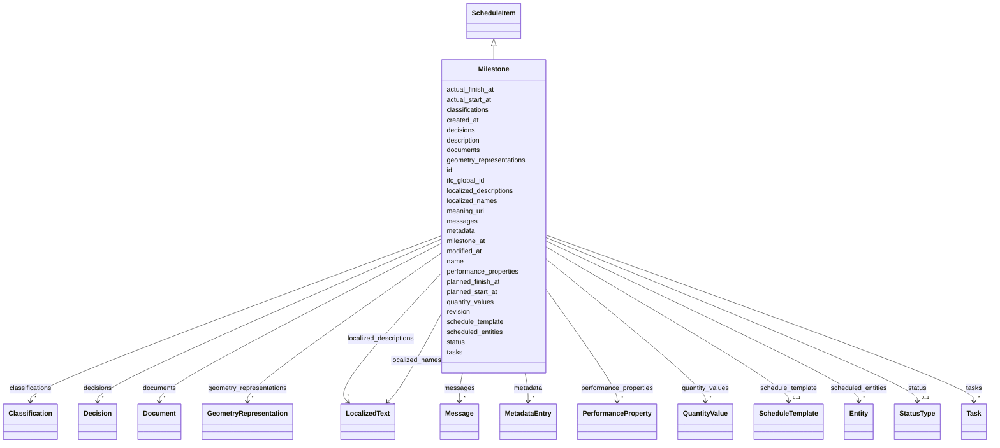

---
search:
  boost: 10.0
---

# Class: Milestone 


_Zero-duration checkpoint or delivery target within a schedule._


<div data-search-exclude markdown="1">


URI: [pbs:Milestone](https://schema.pragmaticbim.ch/Milestone)





## Inheritance
* [Entity](Entity.md)
    * [ScheduleItem](ScheduleItem.md)
        * **Milestone**


## Class Properties

| Property | Value |
| --- | --- |
| Class URI | [pbs:Milestone](https://schema.pragmaticbim.ch/Milestone) |


## Slots

| Name | Cardinality and Range | Description | Inheritance |
| ---  | --- | --- | --- |
| [milestone_at](milestone_at.md) | 0..1 <br/> [Datetime](Datetime.md) | Target timestamp for the milestone checkpoint | direct |
| [schedule_template](schedule_template.md) | 0..1 <br/> [ScheduleTemplate](ScheduleTemplate.md) | Parent schedule template this item or dependency belongs to | [ScheduleItem](ScheduleItem.md) |
| [scheduled_entities](scheduled_entities.md) | * <br/> [Entity](Entity.md) | Model entities that this schedule template or schedule item applies to | [ScheduleItem](ScheduleItem.md) |
| [planned_start_at](planned_start_at.md) | 0..1 <br/> [Datetime](Datetime.md) | Planned start timestamp for the schedule item | [ScheduleItem](ScheduleItem.md) |
| [planned_finish_at](planned_finish_at.md) | 0..1 <br/> [Datetime](Datetime.md) | Planned finish timestamp for the schedule item | [ScheduleItem](ScheduleItem.md) |
| [actual_start_at](actual_start_at.md) | 0..1 <br/> [Datetime](Datetime.md) | Actual start timestamp for the schedule item where known | [ScheduleItem](ScheduleItem.md) |
| [actual_finish_at](actual_finish_at.md) | 0..1 <br/> [Datetime](Datetime.md) | Actual finish timestamp for the schedule item where known | [ScheduleItem](ScheduleItem.md) |
| [id](id.md) | 1 <br/> [String](String.md) | Unique local identifier | [Entity](Entity.md) |
| [name](name.md) | 1 <br/> [String](String.md) | Default display name | [Entity](Entity.md) |
| [localized_names](localized_names.md) | * <br/> [LocalizedText](LocalizedText.md) | Localized variants of name | [Entity](Entity.md) |
| [description](description.md) | 0..1 <br/> [String](String.md) | Default description text | [Entity](Entity.md) |
| [meaning_uri](meaning_uri.md) | 0..1 <br/> [Uriorcurie](Uriorcurie.md) | Optional semantic URI for linking the entity instance to an external ontology... | [Entity](Entity.md) |
| [localized_descriptions](localized_descriptions.md) | * <br/> [LocalizedText](LocalizedText.md) | Localized variants of description | [Entity](Entity.md) |
| [ifc_global_id](ifc_global_id.md) | 0..1 <br/> [String](String.md) | IFC GlobalId of the mapped entity | [Entity](Entity.md) |
| [classifications](classifications.md) | * <br/> [Classification](Classification.md) | Classification entries from IFC and other schemes | [Entity](Entity.md) |
| [geometry_representations](geometry_representations.md) | * <br/> [GeometryRepresentation](GeometryRepresentation.md) | Geometry references associated with the entity | [Entity](Entity.md) |
| [quantity_values](quantity_values.md) | * <br/> [QuantityValue](QuantityValue.md) | Quantities associated with the entity | [Entity](Entity.md) |
| [documents](documents.md) | * <br/> [Document](Document.md) | Linked documents associated with this entity | [Entity](Entity.md) |
| [metadata](metadata.md) | * <br/> [MetadataEntry](MetadataEntry.md) | Generic metadata container for IFC attributes/properties and project-specific... | [Entity](Entity.md) |
| [performance_properties](performance_properties.md) | * <br/> [PerformanceProperty](PerformanceProperty.md) | Normalized, strongly typed domain properties (fire/acoustic/thermal/structura... | [Entity](Entity.md) |
| [decisions](decisions.md) | * <br/> [Decision](Decision.md) | Decision records associated with this entity | [Entity](Entity.md) |
| [tasks](tasks.md) | * <br/> [Task](Task.md) | Tasks associated with this entity | [Entity](Entity.md) |
| [messages](messages.md) | * <br/> [Message](Message.md) | Messages associated with this entity | [Entity](Entity.md) |
| [created_at](created_at.md) | 0..1 <br/> [Datetime](Datetime.md) | Creation timestamp for this entity record | [Entity](Entity.md) |
| [modified_at](modified_at.md) | 0..1 <br/> [Datetime](Datetime.md) | Last modification timestamp for this entity record | [Entity](Entity.md) |
| [revision](revision.md) | 0..1 <br/> [Integer](Integer.md) | Integer revision counter for change tracking | [Entity](Entity.md) |
| [status](status.md) | 0..1 <br/> [StatusType](StatusType.md) | Lifecycle or QA status | [Entity](Entity.md) |


## Identifier and Mapping Information


### Schema Source


* from schema: https://schema.pragmaticbim.ch


## Mappings

| Mapping Type | Mapped Value |
| ---  | ---  |
| self | pbs:Milestone |
| native | pbs:Milestone |


## LinkML Source

<!-- TODO: investigate https://stackoverflow.com/questions/37606292/how-to-create-tabbed-code-blocks-in-mkdocs-or-sphinx -->

### Direct

<details>
```yaml
name: Milestone
description: Zero-duration checkpoint or delivery target within a schedule.
from_schema: https://schema.pragmaticbim.ch
is_a: ScheduleItem
slots:
- milestone_at
class_uri: pbs:Milestone

```
</details>

### Induced

<details>
```yaml
name: Milestone
description: Zero-duration checkpoint or delivery target within a schedule.
from_schema: https://schema.pragmaticbim.ch
is_a: ScheduleItem
attributes:
  milestone_at:
    name: milestone_at
    description: Target timestamp for the milestone checkpoint.
    from_schema: https://schema.pragmaticbim.ch
    rank: 1000
    owner: Milestone
    domain_of:
    - Milestone
    range: datetime
  schedule_template:
    name: schedule_template
    description: Parent schedule template this item or dependency belongs to.
    from_schema: https://schema.pragmaticbim.ch
    rank: 1000
    owner: Milestone
    domain_of:
    - ScheduleItem
    - ScheduleDependency
    range: ScheduleTemplate
    inlined: false
  scheduled_entities:
    name: scheduled_entities
    description: Model entities that this schedule template or schedule item applies
      to.
    from_schema: https://schema.pragmaticbim.ch
    rank: 1000
    owner: Milestone
    domain_of:
    - ScheduleTemplate
    - ScheduleItem
    range: Entity
    multivalued: true
    inlined: false
  planned_start_at:
    name: planned_start_at
    description: Planned start timestamp for the schedule item.
    from_schema: https://schema.pragmaticbim.ch
    rank: 1000
    owner: Milestone
    domain_of:
    - ScheduleItem
    range: datetime
  planned_finish_at:
    name: planned_finish_at
    description: Planned finish timestamp for the schedule item.
    from_schema: https://schema.pragmaticbim.ch
    rank: 1000
    owner: Milestone
    domain_of:
    - ScheduleItem
    range: datetime
  actual_start_at:
    name: actual_start_at
    description: Actual start timestamp for the schedule item where known.
    from_schema: https://schema.pragmaticbim.ch
    rank: 1000
    owner: Milestone
    domain_of:
    - ScheduleItem
    range: datetime
  actual_finish_at:
    name: actual_finish_at
    description: Actual finish timestamp for the schedule item where known.
    from_schema: https://schema.pragmaticbim.ch
    rank: 1000
    owner: Milestone
    domain_of:
    - ScheduleItem
    range: datetime
  id:
    name: id
    description: Unique local identifier.
    from_schema: https://schema.pragmaticbim.ch
    rank: 1000
    identifier: true
    owner: Milestone
    domain_of:
    - Entity
    - Task
    - Document
    - Change
    - ChangeSet
    range: string
    required: true
  name:
    name: name
    description: Default display name.
    from_schema: https://schema.pragmaticbim.ch
    rank: 1000
    owner: Milestone
    domain_of:
    - Entity
    range: string
    required: true
  localized_names:
    name: localized_names
    description: Localized variants of name.
    from_schema: https://schema.pragmaticbim.ch
    rank: 1000
    owner: Milestone
    domain_of:
    - Entity
    range: LocalizedText
    multivalued: true
    inlined: true
  description:
    name: description
    description: Default description text.
    from_schema: https://schema.pragmaticbim.ch
    rank: 1000
    owner: Milestone
    domain_of:
    - Entity
    range: string
  meaning_uri:
    name: meaning_uri
    description: Optional semantic URI for linking the entity instance to an external
      ontology concept.
    from_schema: https://schema.pragmaticbim.ch
    rank: 1000
    owner: Milestone
    domain_of:
    - Entity
    range: uriorcurie
  localized_descriptions:
    name: localized_descriptions
    description: Localized variants of description.
    from_schema: https://schema.pragmaticbim.ch
    rank: 1000
    owner: Milestone
    domain_of:
    - Entity
    range: LocalizedText
    multivalued: true
    inlined: true
  ifc_global_id:
    name: ifc_global_id
    description: IFC GlobalId of the mapped entity.
    from_schema: https://schema.pragmaticbim.ch
    rank: 1000
    owner: Milestone
    domain_of:
    - Entity
    - Change
    range: string
    pattern: ^[0-3][0-9A-Za-z_$]{21}$
  classifications:
    name: classifications
    description: Classification entries from IFC and other schemes.
    from_schema: https://schema.pragmaticbim.ch
    rank: 1000
    owner: Milestone
    domain_of:
    - Entity
    - Document
    range: Classification
    multivalued: true
    inlined: true
  geometry_representations:
    name: geometry_representations
    description: 'Geometry references associated with the entity. A single element
      may link to multiple geometry representations to serve different intents (authoring,
      coordination, analysis, visualization) without duplicating the element itself.

      '
    from_schema: https://schema.pragmaticbim.ch
    rank: 1000
    owner: Milestone
    domain_of:
    - Entity
    range: GeometryRepresentation
    multivalued: true
    inlined: true
  quantity_values:
    name: quantity_values
    description: Quantities associated with the entity.
    from_schema: https://schema.pragmaticbim.ch
    rank: 1000
    owner: Milestone
    domain_of:
    - Entity
    range: QuantityValue
    multivalued: true
    inlined: true
  documents:
    name: documents
    description: Linked documents associated with this entity.
    from_schema: https://schema.pragmaticbim.ch
    rank: 1000
    owner: Milestone
    domain_of:
    - Entity
    range: Document
    multivalued: true
    inlined: true
  metadata:
    name: metadata
    description: Generic metadata container for IFC attributes/properties and project-specific
      extensions.
    from_schema: https://schema.pragmaticbim.ch
    rank: 1000
    owner: Milestone
    domain_of:
    - Entity
    range: MetadataEntry
    multivalued: true
    inlined: true
  performance_properties:
    name: performance_properties
    description: 'Normalized, strongly typed domain properties (fire/acoustic/thermal/structural/
      security/material) extracted from raw IFC PropertySet values.

      '
    from_schema: https://schema.pragmaticbim.ch
    rank: 1000
    owner: Milestone
    domain_of:
    - Entity
    range: PerformanceProperty
    multivalued: true
    inlined: true
  decisions:
    name: decisions
    description: Decision records associated with this entity.
    from_schema: https://schema.pragmaticbim.ch
    rank: 1000
    owner: Milestone
    domain_of:
    - Entity
    range: Decision
    multivalued: true
    inlined: true
  tasks:
    name: tasks
    description: Tasks associated with this entity.
    from_schema: https://schema.pragmaticbim.ch
    rank: 1000
    owner: Milestone
    domain_of:
    - Entity
    range: Task
    multivalued: true
    inlined: true
  messages:
    name: messages
    description: Messages associated with this entity.
    from_schema: https://schema.pragmaticbim.ch
    rank: 1000
    owner: Milestone
    domain_of:
    - Entity
    range: Message
    multivalued: true
    inlined: true
  created_at:
    name: created_at
    description: Creation timestamp for this entity record.
    from_schema: https://schema.pragmaticbim.ch
    rank: 1000
    owner: Milestone
    domain_of:
    - Entity
    range: datetime
  modified_at:
    name: modified_at
    description: Last modification timestamp for this entity record.
    from_schema: https://schema.pragmaticbim.ch
    rank: 1000
    owner: Milestone
    domain_of:
    - Entity
    range: datetime
  revision:
    name: revision
    description: Integer revision counter for change tracking.
    from_schema: https://schema.pragmaticbim.ch
    rank: 1000
    owner: Milestone
    domain_of:
    - Entity
    range: integer
    minimum_value: 0
  status:
    name: status
    description: Lifecycle or QA status.
    from_schema: https://schema.pragmaticbim.ch
    rank: 1000
    owner: Milestone
    domain_of:
    - Entity
    range: StatusType
class_uri: pbs:Milestone

```
</details></div>