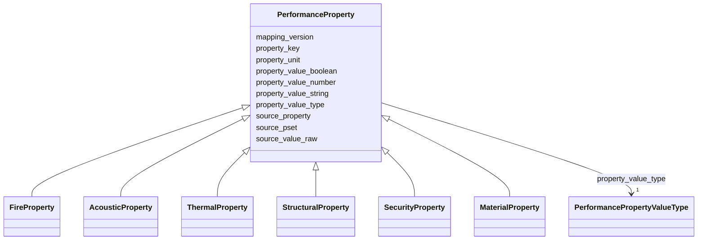

# Class: PerformanceProperty 


_Normalized performance/property record derived from raw IFC PropertySet values with source traceability and strong typing through domain-specific subclasses._

__


* __NOTE__: this is an abstract class and should not be instantiated directly


URI: [pbs:PerformanceProperty](https://example.org/pragmatic-bim-data-contract/PerformanceProperty)





## Inheritance
* **PerformanceProperty**
    * [FireProperty](FireProperty.md)
    * [AcousticProperty](AcousticProperty.md)
    * [ThermalProperty](ThermalProperty.md)
    * [StructuralProperty](StructuralProperty.md)
    * [SecurityProperty](SecurityProperty.md)
    * [MaterialProperty](MaterialProperty.md)


## Class Properties

| Property | Value |
| --- | --- |
| Class URI | [pbs:PerformanceProperty](https://example.org/pragmatic-bim-data-contract/PerformanceProperty) |


## Slots

| Name | Cardinality and Range | Description | Inheritance |
| ---  | --- | --- | --- |
| [property_key](property_key.md) | 1 <br/> [String](String.md) | Canonical key inside the domain; constrained via subclass slot_usage to a dom... | direct |
| [property_value_type](property_value_type.md) | 1 <br/> [PerformancePropertyValueType](PerformancePropertyValueType.md) | Value type discriminator for normalized storage (for example string, number, ... | direct |
| [property_value_string](property_value_string.md) | 0..1 <br/> [String](String.md) | String value when property_value_type is string | direct |
| [property_value_number](property_value_number.md) | 0..1 <br/> [Double](Double.md) | Numeric value when property_value_type is number | direct |
| [property_value_boolean](property_value_boolean.md) | 0..1 <br/> [Boolean](Boolean.md) | Boolean value when property_value_type is boolean | direct |
| [property_unit](property_unit.md) | 0..1 <br/> [String](String.md) | Normalized unit where applicable (for example min, dB, W/m2K) | direct |
| [source_pset](source_pset.md) | 0..1 <br/> [String](String.md) | Original IFC PropertySet name (for example Pset_WallCommon) | direct |
| [source_property](source_property.md) | 0..1 <br/> [String](String.md) | Original property name inside the source PropertySet (for example FireRating) | direct |
| [source_value_raw](source_value_raw.md) | 0..1 <br/> [String](String.md) | Raw source value before normalization | direct |
| [mapping_version](mapping_version.md) | 0..1 <br/> [String](String.md) | Mapping specification version used to derive the normalized property | direct |


## Usages

| used by | used in | type | used |
| ---  | --- | --- | --- |
| [Entity](Entity.md) | [performance_properties](performance_properties.md) | range | [PerformanceProperty](PerformanceProperty.md) |
| [Agent](Agent.md) | [performance_properties](performance_properties.md) | range | [PerformanceProperty](PerformanceProperty.md) |
| [Person](Person.md) | [performance_properties](performance_properties.md) | range | [PerformanceProperty](PerformanceProperty.md) |
| [Company](Company.md) | [performance_properties](performance_properties.md) | range | [PerformanceProperty](PerformanceProperty.md) |
| [Message](Message.md) | [performance_properties](performance_properties.md) | range | [PerformanceProperty](PerformanceProperty.md) |
| [PhysicalElement](PhysicalElement.md) | [performance_properties](performance_properties.md) | range | [PerformanceProperty](PerformanceProperty.md) |
| [Separator](Separator.md) | [performance_properties](performance_properties.md) | range | [PerformanceProperty](PerformanceProperty.md) |
| [SeparatorWall](SeparatorWall.md) | [performance_properties](performance_properties.md) | range | [PerformanceProperty](PerformanceProperty.md) |
| [SeparatorSlab](SeparatorSlab.md) | [performance_properties](performance_properties.md) | range | [PerformanceProperty](PerformanceProperty.md) |
| [ConnectionPhysical](ConnectionPhysical.md) | [performance_properties](performance_properties.md) | range | [PerformanceProperty](PerformanceProperty.md) |
| [Boundary](Boundary.md) | [performance_properties](performance_properties.md) | range | [PerformanceProperty](PerformanceProperty.md) |
| [Equipment](Equipment.md) | [performance_properties](performance_properties.md) | range | [PerformanceProperty](PerformanceProperty.md) |
| [VirtualEntity](VirtualEntity.md) | [performance_properties](performance_properties.md) | range | [PerformanceProperty](PerformanceProperty.md) |
| [SpatialContext](SpatialContext.md) | [performance_properties](performance_properties.md) | range | [PerformanceProperty](PerformanceProperty.md) |
| [ProjectContext](ProjectContext.md) | [performance_properties](performance_properties.md) | range | [PerformanceProperty](PerformanceProperty.md) |
| [PerimeterContext](PerimeterContext.md) | [performance_properties](performance_properties.md) | range | [PerformanceProperty](PerformanceProperty.md) |
| [LegalSiteContext](LegalSiteContext.md) | [performance_properties](performance_properties.md) | range | [PerformanceProperty](PerformanceProperty.md) |
| [BuiltAssetContext](BuiltAssetContext.md) | [performance_properties](performance_properties.md) | range | [PerformanceProperty](PerformanceProperty.md) |
| [BuildingContext](BuildingContext.md) | [performance_properties](performance_properties.md) | range | [PerformanceProperty](PerformanceProperty.md) |
| [CivilStructureContext](CivilStructureContext.md) | [performance_properties](performance_properties.md) | range | [PerformanceProperty](PerformanceProperty.md) |
| [LevelContext](LevelContext.md) | [performance_properties](performance_properties.md) | range | [PerformanceProperty](PerformanceProperty.md) |
| [ZoneContext](ZoneContext.md) | [performance_properties](performance_properties.md) | range | [PerformanceProperty](PerformanceProperty.md) |
| [Space](Space.md) | [performance_properties](performance_properties.md) | range | [PerformanceProperty](PerformanceProperty.md) |
| [System](System.md) | [performance_properties](performance_properties.md) | range | [PerformanceProperty](PerformanceProperty.md) |
| [ConnectionVirtual](ConnectionVirtual.md) | [performance_properties](performance_properties.md) | range | [PerformanceProperty](PerformanceProperty.md) |
| [AbstractCostRecord](AbstractCostRecord.md) | [performance_properties](performance_properties.md) | range | [PerformanceProperty](PerformanceProperty.md) |
| [CostItem](CostItem.md) | [performance_properties](performance_properties.md) | range | [PerformanceProperty](PerformanceProperty.md) |
| [CostAssembly](CostAssembly.md) | [performance_properties](performance_properties.md) | range | [PerformanceProperty](PerformanceProperty.md) |
| [Material](Material.md) | [performance_properties](performance_properties.md) | range | [PerformanceProperty](PerformanceProperty.md) |


## Identifier and Mapping Information


### Schema Source


* from schema: https://example.org/pragmatic-bim-data-contract


## Mappings

| Mapping Type | Mapped Value |
| ---  | ---  |
| self | pbs:PerformanceProperty |
| native | pbs:PerformanceProperty |


## LinkML Source

<!-- TODO: investigate https://stackoverflow.com/questions/37606292/how-to-create-tabbed-code-blocks-in-mkdocs-or-sphinx -->

### Direct

<details>
```yaml
name: PerformanceProperty
description: 'Normalized performance/property record derived from raw IFC PropertySet
  values with source traceability and strong typing through domain-specific subclasses.

  '
from_schema: https://example.org/pragmatic-bim-data-contract
abstract: true
slots:
- property_key
- property_value_type
- property_value_string
- property_value_number
- property_value_boolean
- property_unit
- source_pset
- source_property
- source_value_raw
- mapping_version
class_uri: pbs:PerformanceProperty

```
</details>

### Induced

<details>
```yaml
name: PerformanceProperty
description: 'Normalized performance/property record derived from raw IFC PropertySet
  values with source traceability and strong typing through domain-specific subclasses.

  '
from_schema: https://example.org/pragmatic-bim-data-contract
abstract: true
attributes:
  property_key:
    name: property_key
    description: Canonical key inside the domain; constrained via subclass slot_usage
      to a domain-specific enum.
    from_schema: https://example.org/pragmatic-bim-data-contract
    rank: 1000
    alias: property_key
    owner: PerformanceProperty
    domain_of:
    - PerformanceProperty
    range: string
    required: true
  property_value_type:
    name: property_value_type
    description: Value type discriminator for normalized storage (for example string,
      number, boolean).
    from_schema: https://example.org/pragmatic-bim-data-contract
    rank: 1000
    alias: property_value_type
    owner: PerformanceProperty
    domain_of:
    - PerformanceProperty
    range: PerformancePropertyValueType
    required: true
  property_value_string:
    name: property_value_string
    description: String value when property_value_type is string.
    from_schema: https://example.org/pragmatic-bim-data-contract
    rank: 1000
    alias: property_value_string
    owner: PerformanceProperty
    domain_of:
    - PerformanceProperty
    range: string
  property_value_number:
    name: property_value_number
    description: Numeric value when property_value_type is number.
    from_schema: https://example.org/pragmatic-bim-data-contract
    rank: 1000
    alias: property_value_number
    owner: PerformanceProperty
    domain_of:
    - PerformanceProperty
    range: double
  property_value_boolean:
    name: property_value_boolean
    description: Boolean value when property_value_type is boolean.
    from_schema: https://example.org/pragmatic-bim-data-contract
    rank: 1000
    alias: property_value_boolean
    owner: PerformanceProperty
    domain_of:
    - PerformanceProperty
    range: boolean
  property_unit:
    name: property_unit
    description: Normalized unit where applicable (for example min, dB, W/m2K).
    from_schema: https://example.org/pragmatic-bim-data-contract
    rank: 1000
    alias: property_unit
    owner: PerformanceProperty
    domain_of:
    - PerformanceProperty
    range: string
  source_pset:
    name: source_pset
    description: Original IFC PropertySet name (for example Pset_WallCommon).
    from_schema: https://example.org/pragmatic-bim-data-contract
    rank: 1000
    alias: source_pset
    owner: PerformanceProperty
    domain_of:
    - PerformanceProperty
    range: string
  source_property:
    name: source_property
    description: Original property name inside the source PropertySet (for example
      FireRating).
    from_schema: https://example.org/pragmatic-bim-data-contract
    rank: 1000
    alias: source_property
    owner: PerformanceProperty
    domain_of:
    - PerformanceProperty
    range: string
  source_value_raw:
    name: source_value_raw
    description: Raw source value before normalization.
    from_schema: https://example.org/pragmatic-bim-data-contract
    rank: 1000
    alias: source_value_raw
    owner: PerformanceProperty
    domain_of:
    - PerformanceProperty
    range: string
  mapping_version:
    name: mapping_version
    description: Mapping specification version used to derive the normalized property.
    from_schema: https://example.org/pragmatic-bim-data-contract
    rank: 1000
    alias: mapping_version
    owner: PerformanceProperty
    domain_of:
    - PerformanceProperty
    range: string
class_uri: pbs:PerformanceProperty

```
</details>