---
search:
  boost: 10.0
---

# Class: ScheduleDependency 


_Precedence relationship between two schedule items, optionally with lag._


<div data-search-exclude markdown="1">


URI: [pbs:ScheduleDependency](https://schema.pragmaticbim.ch/ScheduleDependency)

```mermaid
 classDiagram
    class ScheduleDependency
    click ScheduleDependency href "../ScheduleDependency/"
      Entity <|-- ScheduleDependency
        click Entity href "../Entity/"
      
      ScheduleDependency : classifications
        
          
    
        
        
        ScheduleDependency --> "*" Classification : classifications
        click Classification href "../Classification/"
    

        
      ScheduleDependency : created_at
        
      ScheduleDependency : decisions
        
          
    
        
        
        ScheduleDependency --> "*" Decision : decisions
        click Decision href "../Decision/"
    

        
      ScheduleDependency : dependency_type
        
          
    
        
        
        ScheduleDependency --> "1" ScheduleDependencyType : dependency_type
        click ScheduleDependencyType href "../ScheduleDependencyType/"
    

        
      ScheduleDependency : description
        
      ScheduleDependency : documents
        
          
    
        
        
        ScheduleDependency --> "*" Document : documents
        click Document href "../Document/"
    

        
      ScheduleDependency : geometry_representations
        
          
    
        
        
        ScheduleDependency --> "*" GeometryRepresentation : geometry_representations
        click GeometryRepresentation href "../GeometryRepresentation/"
    

        
      ScheduleDependency : id
        
      ScheduleDependency : ifc_global_id
        
      ScheduleDependency : lag_days
        
      ScheduleDependency : localized_descriptions
        
          
    
        
        
        ScheduleDependency --> "*" LocalizedText : localized_descriptions
        click LocalizedText href "../LocalizedText/"
    

        
      ScheduleDependency : localized_names
        
          
    
        
        
        ScheduleDependency --> "*" LocalizedText : localized_names
        click LocalizedText href "../LocalizedText/"
    

        
      ScheduleDependency : meaning_uri
        
      ScheduleDependency : messages
        
          
    
        
        
        ScheduleDependency --> "*" Message : messages
        click Message href "../Message/"
    

        
      ScheduleDependency : metadata
        
          
    
        
        
        ScheduleDependency --> "*" MetadataEntry : metadata
        click MetadataEntry href "../MetadataEntry/"
    

        
      ScheduleDependency : modified_at
        
      ScheduleDependency : name
        
      ScheduleDependency : performance_properties
        
          
    
        
        
        ScheduleDependency --> "*" PerformanceProperty : performance_properties
        click PerformanceProperty href "../PerformanceProperty/"
    

        
      ScheduleDependency : predecessor_item
        
          
    
        
        
        ScheduleDependency --> "0..1" ScheduleItem : predecessor_item
        click ScheduleItem href "../ScheduleItem/"
    

        
      ScheduleDependency : quantity_values
        
          
    
        
        
        ScheduleDependency --> "*" QuantityValue : quantity_values
        click QuantityValue href "../QuantityValue/"
    

        
      ScheduleDependency : revision
        
      ScheduleDependency : schedule_template
        
          
    
        
        
        ScheduleDependency --> "0..1" ScheduleTemplate : schedule_template
        click ScheduleTemplate href "../ScheduleTemplate/"
    

        
      ScheduleDependency : status
        
          
    
        
        
        ScheduleDependency --> "0..1" StatusType : status
        click StatusType href "../StatusType/"
    

        
      ScheduleDependency : successor_item
        
          
    
        
        
        ScheduleDependency --> "0..1" ScheduleItem : successor_item
        click ScheduleItem href "../ScheduleItem/"
    

        
      ScheduleDependency : tasks
        
          
    
        
        
        ScheduleDependency --> "*" Task : tasks
        click Task href "../Task/"
    

        
      
```





## Inheritance
* [Entity](Entity.md)
    * **ScheduleDependency**


## Class Properties

| Property | Value |
| --- | --- |
| Class URI | [pbs:ScheduleDependency](https://schema.pragmaticbim.ch/ScheduleDependency) |


## Slots

| Name | Cardinality and Range | Description | Inheritance |
| ---  | --- | --- | --- |
| [schedule_template](schedule_template.md) | 0..1 <br/> [ScheduleTemplate](ScheduleTemplate.md) | Parent schedule template this item or dependency belongs to | direct |
| [predecessor_item](predecessor_item.md) | 0..1 <br/> [ScheduleItem](ScheduleItem.md) | Schedule item that must occur before the successor item | direct |
| [successor_item](successor_item.md) | 0..1 <br/> [ScheduleItem](ScheduleItem.md) | Schedule item whose timing is constrained by the predecessor item | direct |
| [dependency_type](dependency_type.md) | 1 <br/> [ScheduleDependencyType](ScheduleDependencyType.md) | Precedence logic used between the predecessor and successor items | direct |
| [lag_days](lag_days.md) | 0..1 <br/> [Double](Double.md) | Optional lag or lead offset in days applied to the dependency relation | direct |
| [id](id.md) | 1 <br/> [String](String.md) | Unique local identifier | [Entity](Entity.md) |
| [name](name.md) | 1 <br/> [String](String.md) | Default display name | [Entity](Entity.md) |
| [localized_names](localized_names.md) | * <br/> [LocalizedText](LocalizedText.md) | Localized variants of name | [Entity](Entity.md) |
| [description](description.md) | 0..1 <br/> [String](String.md) | Default description text | [Entity](Entity.md) |
| [meaning_uri](meaning_uri.md) | 0..1 <br/> [Uriorcurie](Uriorcurie.md) | Optional semantic URI for linking the entity instance to an external ontology... | [Entity](Entity.md) |
| [localized_descriptions](localized_descriptions.md) | * <br/> [LocalizedText](LocalizedText.md) | Localized variants of description | [Entity](Entity.md) |
| [ifc_global_id](ifc_global_id.md) | 0..1 <br/> [String](String.md) | IFC GlobalId of the mapped entity | [Entity](Entity.md) |
| [classifications](classifications.md) | * <br/> [Classification](Classification.md) | Classification entries from IFC and other schemes | [Entity](Entity.md) |
| [geometry_representations](geometry_representations.md) | * <br/> [GeometryRepresentation](GeometryRepresentation.md) | Geometry references associated with the entity | [Entity](Entity.md) |
| [quantity_values](quantity_values.md) | * <br/> [QuantityValue](QuantityValue.md) | Quantities associated with the entity | [Entity](Entity.md) |
| [documents](documents.md) | * <br/> [Document](Document.md) | Linked documents associated with this entity | [Entity](Entity.md) |
| [metadata](metadata.md) | * <br/> [MetadataEntry](MetadataEntry.md) | Generic metadata container for IFC attributes/properties and project-specific... | [Entity](Entity.md) |
| [performance_properties](performance_properties.md) | * <br/> [PerformanceProperty](PerformanceProperty.md) | Normalized, strongly typed domain properties (fire/acoustic/thermal/structura... | [Entity](Entity.md) |
| [decisions](decisions.md) | * <br/> [Decision](Decision.md) | Decision records associated with this entity | [Entity](Entity.md) |
| [tasks](tasks.md) | * <br/> [Task](Task.md) | Tasks associated with this entity | [Entity](Entity.md) |
| [messages](messages.md) | * <br/> [Message](Message.md) | Messages associated with this entity | [Entity](Entity.md) |
| [created_at](created_at.md) | 0..1 <br/> [Datetime](Datetime.md) | Creation timestamp for this entity record | [Entity](Entity.md) |
| [modified_at](modified_at.md) | 0..1 <br/> [Datetime](Datetime.md) | Last modification timestamp for this entity record | [Entity](Entity.md) |
| [revision](revision.md) | 0..1 <br/> [Integer](Integer.md) | Integer revision counter for change tracking | [Entity](Entity.md) |
| [status](status.md) | 0..1 <br/> [StatusType](StatusType.md) | Lifecycle or QA status | [Entity](Entity.md) |


## Usages

| used by | used in | type | used |
| ---  | --- | --- | --- |
| [ScheduleTemplate](ScheduleTemplate.md) | [schedule_dependencies](schedule_dependencies.md) | range | [ScheduleDependency](ScheduleDependency.md) |


## Identifier and Mapping Information


### Schema Source


* from schema: https://schema.pragmaticbim.ch


## Mappings

| Mapping Type | Mapped Value |
| ---  | ---  |
| self | pbs:ScheduleDependency |
| native | pbs:ScheduleDependency |


## LinkML Source

<!-- TODO: investigate https://stackoverflow.com/questions/37606292/how-to-create-tabbed-code-blocks-in-mkdocs-or-sphinx -->

### Direct

<details>
```yaml
name: ScheduleDependency
description: Precedence relationship between two schedule items, optionally with lag.
from_schema: https://schema.pragmaticbim.ch
is_a: Entity
slots:
- schedule_template
- predecessor_item
- successor_item
- dependency_type
- lag_days
class_uri: pbs:ScheduleDependency

```
</details>

### Induced

<details>
```yaml
name: ScheduleDependency
description: Precedence relationship between two schedule items, optionally with lag.
from_schema: https://schema.pragmaticbim.ch
is_a: Entity
attributes:
  schedule_template:
    name: schedule_template
    description: Parent schedule template this item or dependency belongs to.
    from_schema: https://schema.pragmaticbim.ch
    rank: 1000
    owner: ScheduleDependency
    domain_of:
    - ScheduleItem
    - ScheduleDependency
    range: ScheduleTemplate
    inlined: false
  predecessor_item:
    name: predecessor_item
    description: Schedule item that must occur before the successor item.
    from_schema: https://schema.pragmaticbim.ch
    rank: 1000
    owner: ScheduleDependency
    domain_of:
    - ScheduleDependency
    range: ScheduleItem
    inlined: false
  successor_item:
    name: successor_item
    description: Schedule item whose timing is constrained by the predecessor item.
    from_schema: https://schema.pragmaticbim.ch
    rank: 1000
    owner: ScheduleDependency
    domain_of:
    - ScheduleDependency
    range: ScheduleItem
    inlined: false
  dependency_type:
    name: dependency_type
    description: Precedence logic used between the predecessor and successor items.
    from_schema: https://schema.pragmaticbim.ch
    rank: 1000
    owner: ScheduleDependency
    domain_of:
    - ScheduleDependency
    range: ScheduleDependencyType
    required: true
  lag_days:
    name: lag_days
    description: Optional lag or lead offset in days applied to the dependency relation.
    from_schema: https://schema.pragmaticbim.ch
    rank: 1000
    owner: ScheduleDependency
    domain_of:
    - ScheduleDependency
    range: double
  id:
    name: id
    description: Unique local identifier.
    from_schema: https://schema.pragmaticbim.ch
    rank: 1000
    identifier: true
    owner: ScheduleDependency
    domain_of:
    - Entity
    - Task
    - Document
    - Change
    - ChangeSet
    range: string
    required: true
  name:
    name: name
    description: Default display name.
    from_schema: https://schema.pragmaticbim.ch
    rank: 1000
    owner: ScheduleDependency
    domain_of:
    - Entity
    range: string
    required: true
  localized_names:
    name: localized_names
    description: Localized variants of name.
    from_schema: https://schema.pragmaticbim.ch
    rank: 1000
    owner: ScheduleDependency
    domain_of:
    - Entity
    range: LocalizedText
    multivalued: true
    inlined: true
  description:
    name: description
    description: Default description text.
    from_schema: https://schema.pragmaticbim.ch
    rank: 1000
    owner: ScheduleDependency
    domain_of:
    - Entity
    range: string
  meaning_uri:
    name: meaning_uri
    description: Optional semantic URI for linking the entity instance to an external
      ontology concept.
    from_schema: https://schema.pragmaticbim.ch
    rank: 1000
    owner: ScheduleDependency
    domain_of:
    - Entity
    range: uriorcurie
  localized_descriptions:
    name: localized_descriptions
    description: Localized variants of description.
    from_schema: https://schema.pragmaticbim.ch
    rank: 1000
    owner: ScheduleDependency
    domain_of:
    - Entity
    range: LocalizedText
    multivalued: true
    inlined: true
  ifc_global_id:
    name: ifc_global_id
    description: IFC GlobalId of the mapped entity.
    from_schema: https://schema.pragmaticbim.ch
    rank: 1000
    owner: ScheduleDependency
    domain_of:
    - Entity
    - Change
    range: string
    pattern: ^[0-3][0-9A-Za-z_$]{21}$
  classifications:
    name: classifications
    description: Classification entries from IFC and other schemes.
    from_schema: https://schema.pragmaticbim.ch
    rank: 1000
    owner: ScheduleDependency
    domain_of:
    - Entity
    - Document
    range: Classification
    multivalued: true
    inlined: true
  geometry_representations:
    name: geometry_representations
    description: 'Geometry references associated with the entity. A single element
      may link to multiple geometry representations to serve different intents (authoring,
      coordination, analysis, visualization) without duplicating the element itself.

      '
    from_schema: https://schema.pragmaticbim.ch
    rank: 1000
    owner: ScheduleDependency
    domain_of:
    - Entity
    range: GeometryRepresentation
    multivalued: true
    inlined: true
  quantity_values:
    name: quantity_values
    description: Quantities associated with the entity.
    from_schema: https://schema.pragmaticbim.ch
    rank: 1000
    owner: ScheduleDependency
    domain_of:
    - Entity
    range: QuantityValue
    multivalued: true
    inlined: true
  documents:
    name: documents
    description: Linked documents associated with this entity.
    from_schema: https://schema.pragmaticbim.ch
    rank: 1000
    owner: ScheduleDependency
    domain_of:
    - Entity
    range: Document
    multivalued: true
    inlined: true
  metadata:
    name: metadata
    description: Generic metadata container for IFC attributes/properties and project-specific
      extensions.
    from_schema: https://schema.pragmaticbim.ch
    rank: 1000
    owner: ScheduleDependency
    domain_of:
    - Entity
    range: MetadataEntry
    multivalued: true
    inlined: true
  performance_properties:
    name: performance_properties
    description: 'Normalized, strongly typed domain properties (fire/acoustic/thermal/structural/
      security/material) extracted from raw IFC PropertySet values.

      '
    from_schema: https://schema.pragmaticbim.ch
    rank: 1000
    owner: ScheduleDependency
    domain_of:
    - Entity
    range: PerformanceProperty
    multivalued: true
    inlined: true
  decisions:
    name: decisions
    description: Decision records associated with this entity.
    from_schema: https://schema.pragmaticbim.ch
    rank: 1000
    owner: ScheduleDependency
    domain_of:
    - Entity
    range: Decision
    multivalued: true
    inlined: true
  tasks:
    name: tasks
    description: Tasks associated with this entity.
    from_schema: https://schema.pragmaticbim.ch
    rank: 1000
    owner: ScheduleDependency
    domain_of:
    - Entity
    range: Task
    multivalued: true
    inlined: true
  messages:
    name: messages
    description: Messages associated with this entity.
    from_schema: https://schema.pragmaticbim.ch
    rank: 1000
    owner: ScheduleDependency
    domain_of:
    - Entity
    range: Message
    multivalued: true
    inlined: true
  created_at:
    name: created_at
    description: Creation timestamp for this entity record.
    from_schema: https://schema.pragmaticbim.ch
    rank: 1000
    owner: ScheduleDependency
    domain_of:
    - Entity
    range: datetime
  modified_at:
    name: modified_at
    description: Last modification timestamp for this entity record.
    from_schema: https://schema.pragmaticbim.ch
    rank: 1000
    owner: ScheduleDependency
    domain_of:
    - Entity
    range: datetime
  revision:
    name: revision
    description: Integer revision counter for change tracking.
    from_schema: https://schema.pragmaticbim.ch
    rank: 1000
    owner: ScheduleDependency
    domain_of:
    - Entity
    range: integer
    minimum_value: 0
  status:
    name: status
    description: Lifecycle or QA status.
    from_schema: https://schema.pragmaticbim.ch
    rank: 1000
    owner: ScheduleDependency
    domain_of:
    - Entity
    range: StatusType
class_uri: pbs:ScheduleDependency

```
</details></div>