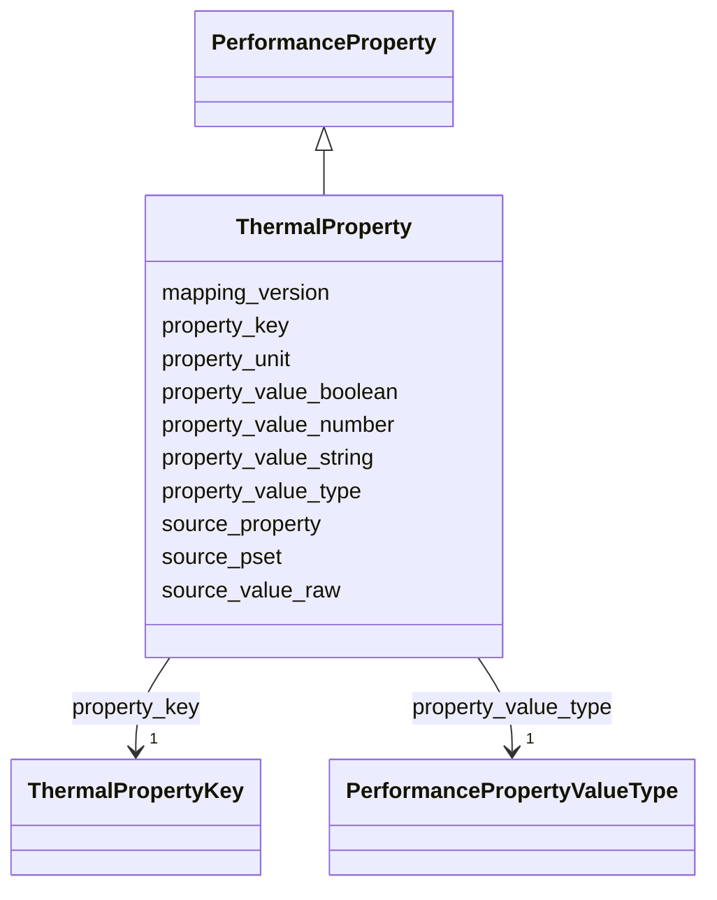

# Class: ThermalProperty 


_Normalized thermal-related property._


URI: [pbs:ThermalProperty](https://example.org/pragmatic-bim-data-contract/ThermalProperty)





## Inheritance
* [PerformanceProperty](PerformanceProperty.md)
    * **ThermalProperty**


## Class Properties

| Property | Value |
| --- | --- |
| Class URI | [pbs:ThermalProperty](https://example.org/pragmatic-bim-data-contract/ThermalProperty) |


## Slots

| Name | Cardinality and Range | Description | Inheritance |
| ---  | --- | --- | --- |
| [property_key](property_key.md) | 1 <br/> [ThermalPropertyKey](ThermalPropertyKey.md) | Canonical key inside the domain; constrained via subclass slot_usage to a dom... | [PerformanceProperty](PerformanceProperty.md) |
| [property_value_type](property_value_type.md) | 1 <br/> [PerformancePropertyValueType](PerformancePropertyValueType.md) | Value type discriminator for normalized storage (for example string, number, ... | [PerformanceProperty](PerformanceProperty.md) |
| [property_value_string](property_value_string.md) | 0..1 <br/> [String](String.md) | String value when property_value_type is string | [PerformanceProperty](PerformanceProperty.md) |
| [property_value_number](property_value_number.md) | 0..1 <br/> [Double](Double.md) | Numeric value when property_value_type is number | [PerformanceProperty](PerformanceProperty.md) |
| [property_value_boolean](property_value_boolean.md) | 0..1 <br/> [Boolean](Boolean.md) | Boolean value when property_value_type is boolean | [PerformanceProperty](PerformanceProperty.md) |
| [property_unit](property_unit.md) | 0..1 <br/> [String](String.md) | Normalized unit where applicable (for example min, dB, W/m2K) | [PerformanceProperty](PerformanceProperty.md) |
| [source_pset](source_pset.md) | 0..1 <br/> [String](String.md) | Original IFC PropertySet name (for example Pset_WallCommon) | [PerformanceProperty](PerformanceProperty.md) |
| [source_property](source_property.md) | 0..1 <br/> [String](String.md) | Original property name inside the source PropertySet (for example FireRating) | [PerformanceProperty](PerformanceProperty.md) |
| [source_value_raw](source_value_raw.md) | 0..1 <br/> [String](String.md) | Raw source value before normalization | [PerformanceProperty](PerformanceProperty.md) |
| [mapping_version](mapping_version.md) | 0..1 <br/> [String](String.md) | Mapping specification version used to derive the normalized property | [PerformanceProperty](PerformanceProperty.md) |


## Identifier and Mapping Information


### Schema Source


* from schema: https://example.org/pragmatic-bim-data-contract


## Mappings

| Mapping Type | Mapped Value |
| ---  | ---  |
| self | pbs:ThermalProperty |
| native | pbs:ThermalProperty |


## LinkML Source

<!-- TODO: investigate https://stackoverflow.com/questions/37606292/how-to-create-tabbed-code-blocks-in-mkdocs-or-sphinx -->

### Direct

<details>
```yaml
name: ThermalProperty
description: Normalized thermal-related property.
from_schema: https://example.org/pragmatic-bim-data-contract
is_a: PerformanceProperty
slot_usage:
  property_key:
    name: property_key
    range: ThermalPropertyKey
class_uri: pbs:ThermalProperty

```
</details>

### Induced

<details>
```yaml
name: ThermalProperty
description: Normalized thermal-related property.
from_schema: https://example.org/pragmatic-bim-data-contract
is_a: PerformanceProperty
slot_usage:
  property_key:
    name: property_key
    range: ThermalPropertyKey
attributes:
  property_key:
    name: property_key
    description: Canonical key inside the domain; constrained via subclass slot_usage
      to a domain-specific enum.
    from_schema: https://example.org/pragmatic-bim-data-contract
    rank: 1000
    alias: property_key
    owner: ThermalProperty
    domain_of:
    - PerformanceProperty
    range: ThermalPropertyKey
    required: true
  property_value_type:
    name: property_value_type
    description: Value type discriminator for normalized storage (for example string,
      number, boolean).
    from_schema: https://example.org/pragmatic-bim-data-contract
    rank: 1000
    alias: property_value_type
    owner: ThermalProperty
    domain_of:
    - PerformanceProperty
    range: PerformancePropertyValueType
    required: true
  property_value_string:
    name: property_value_string
    description: String value when property_value_type is string.
    from_schema: https://example.org/pragmatic-bim-data-contract
    rank: 1000
    alias: property_value_string
    owner: ThermalProperty
    domain_of:
    - PerformanceProperty
    range: string
  property_value_number:
    name: property_value_number
    description: Numeric value when property_value_type is number.
    from_schema: https://example.org/pragmatic-bim-data-contract
    rank: 1000
    alias: property_value_number
    owner: ThermalProperty
    domain_of:
    - PerformanceProperty
    range: double
  property_value_boolean:
    name: property_value_boolean
    description: Boolean value when property_value_type is boolean.
    from_schema: https://example.org/pragmatic-bim-data-contract
    rank: 1000
    alias: property_value_boolean
    owner: ThermalProperty
    domain_of:
    - PerformanceProperty
    range: boolean
  property_unit:
    name: property_unit
    description: Normalized unit where applicable (for example min, dB, W/m2K).
    from_schema: https://example.org/pragmatic-bim-data-contract
    rank: 1000
    alias: property_unit
    owner: ThermalProperty
    domain_of:
    - PerformanceProperty
    range: string
  source_pset:
    name: source_pset
    description: Original IFC PropertySet name (for example Pset_WallCommon).
    from_schema: https://example.org/pragmatic-bim-data-contract
    rank: 1000
    alias: source_pset
    owner: ThermalProperty
    domain_of:
    - PerformanceProperty
    range: string
  source_property:
    name: source_property
    description: Original property name inside the source PropertySet (for example
      FireRating).
    from_schema: https://example.org/pragmatic-bim-data-contract
    rank: 1000
    alias: source_property
    owner: ThermalProperty
    domain_of:
    - PerformanceProperty
    range: string
  source_value_raw:
    name: source_value_raw
    description: Raw source value before normalization.
    from_schema: https://example.org/pragmatic-bim-data-contract
    rank: 1000
    alias: source_value_raw
    owner: ThermalProperty
    domain_of:
    - PerformanceProperty
    range: string
  mapping_version:
    name: mapping_version
    description: Mapping specification version used to derive the normalized property.
    from_schema: https://example.org/pragmatic-bim-data-contract
    rank: 1000
    alias: mapping_version
    owner: ThermalProperty
    domain_of:
    - PerformanceProperty
    range: string
class_uri: pbs:ThermalProperty

```
</details>