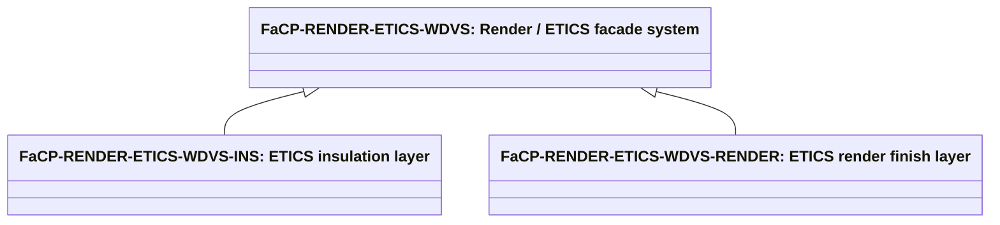

# Abstract facade covering products

Source: [`facade-covering-products.skos.ttl`](sources/facade-covering-product.ttl)

## Scheme

- **definition (de):** Produkttyp-Klassifikation für Außenfassadenbekleidungen, vorgehängte Fassadensysteme und Sanierungslösungen. Konzipiert für europäische Bauprozesse mit Brandschutz (A1/A2-s1,d0-Konformität), Wärmeleistung (EN ISO 6946, EN ISO 10077), Energiesanierung, Kreislaufwirtschaft und BIM-gestützte digitale Prozesse. Für Katalog-, Spezifikations-, Kosten- und Sanierungsplanung; mit abstrakter Materialklassifikation für dominante Substanz und regionale Bauvorschriften kombinieren.
- **definition (en):** Product-type classification for exterior facade claddings, ventilated facade systems, and retrofit solutions. Designed for European construction workflows incorporating fire performance (A1/A2-s1,d0 compliance), thermal insulation (EN ISO 6946, EN ISO 10077), energy retrofit, circular economy, and digital BIM-enabled processes. For catalog, specification, cost, and retrofit planning; pair with abstract material classification for dominant substance and regional building codes.
- **description (de):** Version 2.0: Europäisch-fokussierte Verbesserung, die Post-Grenfell-Brandschutzerfordernisse (EN 13501-1), EU-Energieleistungsstandards (EPBD 2024), Sanierungs-/Renovierungs-Workflows (Fit-for-55, Energiesprong), vorgefertigte modulare Systeme (BPR 2024) und neuartige Technologien (BIPV, holzbasierte multifunktionale Fassaden) einbeziehen. Unterstützt BIM-Klassifizierung (IfcCovering), Kostenschätzung und digitale Sanierungsketten (DigiFab, 4RinEU-Projekte).
- **description (en):** Market data sourced from: Mordor Intelligence (2025), Grand View Research (2023-2025), Market Data Forecast (2024-2026), Research & Markets (2024), European Commission BUILD UP initiative, International Sustainable Energy Conference (2025). Fire classification references: EN 13501-1, BS 8414, Approved Document B. Thermal standards: EN ISO 6946, EN ISO 10077, EN ISO 7345. Energy directives: EPBD 2024/1275, Directive 2024/1275/EU, Construction Products Regulation (CPR) 2024. Retrofit programs: Energiesprong, 4RinEU, INFINITE project, Life Giga Regio Factory, DigiFab (Horizon Europe).
- **prefLabel (de):** Europäische Fassadenbekleidungsprodukte
- **prefLabel (en):** European facade covering products
- **title (de):** Europäische Fassadenbekleidungsprodukte
- **title (en):** European facade covering products

## Hierarchy

## Concepts

<button type="button" class="pbs-lang-btn" data-lang="de">DE</button>
<button type="button" class="pbs-lang-btn" data-lang="en">EN</button>

<table>
<thead>
<tr>
<th>Notation</th>
<th>Broader</th>
<th class="pbs-lang-col" data-lang="de" data-field="label">Label</th>
<th class="pbs-lang-col" data-lang="de" data-field="definition">Definition</th>
<th class="pbs-lang-col" data-lang="de" data-field="scope_note">Scope note</th>
<th class="pbs-lang-col" data-lang="en" data-field="label">Label</th>
<th class="pbs-lang-col" data-lang="en" data-field="definition">Definition</th>
<th class="pbs-lang-col" data-lang="en" data-field="scope_note">Scope note</th>
</tr>
</thead>
<tbody>
<tr>
<td>FaCP-BIPV-INTEGRATED</td>
<td></td>
<td class="pbs-lang-col" data-lang="de" data-field="label">Gebäudeintegrierte Photovoltaik-Fassade</td>
<td class="pbs-lang-col" data-lang="de" data-field="definition">Fassadenbekleidungssystem mit integrierten kristallinen Silizium-, Dünnschicht- oder Perowskit-Photovoltaikzellen. Kann auf Metall-, Keramik- oder Glasunterlagen für ästhetische und energieerzetgende Dualfunktion angewendet werden.</td>
<td class="pbs-lang-col" data-lang="de" data-field="scope_note"></td>
<td class="pbs-lang-col" data-lang="en" data-field="label">Building-integrated photovoltaic facade</td>
<td class="pbs-lang-col" data-lang="en" data-field="definition">Facade cladding system with integrated crystalline silicon, thin-film, or perovskite photovoltaic cells. Can be applied to metal, ceramic, or glass substrates for aesthetic and energy-generating dual function.</td>
<td class="pbs-lang-col" data-lang="en" data-field="scope_note">Emerging technology; market penetration &lt;5% (2025). Fire rating: substrate-dependent (typically A2-s1,d0 capable). Thermal: varies; integration with ventilated cavity improves performance. Regulatory support: EU directive incentivizes BIPV on new construction and major renovations (EPBD 2024). Cost premium: 20-40% over conventional facade (decreasing). Electrical performance: 150-200 W/m² output typical. Integration challenges: cell temperature management, maintenance access, wiring concealment. Regional drivers: Southern EU (higher insolation), new commercial buildings, flagship retrofits.</td>
</tr>
<tr>
<td>FaCP-CERAMIC-VENTILATED</td>
<td></td>
<td class="pbs-lang-col" data-lang="de" data-field="label">Vorgehängte Keramikfliesenfassade</td>
<td class="pbs-lang-col" data-lang="de" data-field="definition">Keramik-, Feinsteinzeug- oder Steingut-Fliesensystem für vorgehängte Fassaden mit Belüftungshohlraum. Dominierender Produkttyp im europäischen Markt (33,9% Wertanteil, 2023). Integriert Isolationsschicht, Belüftungshohlraum und mechanische Befestigungen.</td>
<td class="pbs-lang-col" data-lang="de" data-field="scope_note">Brandschutz: typischerweise A1 oder A2-s1,d0 (EN 13501-1). Wärmeleistung: kompatibel mit U-Werten 0,24-0,15 W/m²K in vorgehängter Konfiguration. Regionale Dominanz: Italien, Spanien, Portugal, Mitteleuropa. Geeignet für Sanierungsanwendungen (nicht-tragende Überlagerung auf bestehender Fassade). Wachsender Markt CAGR 6,1% 2024-2030.</td>
<td class="pbs-lang-col" data-lang="en" data-field="label">Ventilated ceramic tile system</td>
<td class="pbs-lang-col" data-lang="en" data-field="definition">Ceramic, porcelain, or stoneware ventilated facade tile or panel system with rear-ventilated cavity. Dominant product type in European market (33.9% by value, 2023). Integrates insulation layer, air cavity, and mechanical fixings.</td>
<td class="pbs-lang-col" data-lang="en" data-field="scope_note">Fire rating: typically A1 or A2-s1,d0 (EN 13501-1). Thermal performance: compatible with U-values 0.24-0.15 W/m²K in ventilated configuration. Regional dominance: Italy, Spain, Portugal, Central Europe. Suitable for retrofit applications (non-structural overlay on existing facade). Growing market CAGR 6.1% 2024-2030.</td>
</tr>
<tr>
<td>FaCP-EXTERIOR-PAINT-COATING</td>
<td></td>
<td class="pbs-lang-col" data-lang="de" data-field="label">Aussenanstrich / Schutzanstrichsystem</td>
<td class="pbs-lang-col" data-lang="de" data-field="definition">Aufgetragener Aussenanstrich, Beschichtung oder Oberflächenschicht auf Fassadenflaechen (Minerallack, Silikatfarbe, Acryl, Polyurethan oder Epoxid). Kann primäre Fertigungsschicht oder sekundäre Schutzschicht über Untergrund sein.</td>
<td class="pbs-lang-col" data-lang="de" data-field="scope_note"></td>
<td class="pbs-lang-col" data-lang="en" data-field="label">Exterior paint / protective coating finish</td>
<td class="pbs-lang-col" data-lang="en" data-field="definition">Applied exterior paint, coating, or finish layer on facade surfaces (mineral paint, silicate paint, acrylic, polyurethane, or epoxy). Can be primary finish or secondary protective layer over substrate.</td>
<td class="pbs-lang-col" data-lang="en" data-field="scope_note">Fire rating: typically D-s2,d0 or E (thin organic layer). Thermal: minimal direct contribution (surface emissivity property). Maintenance: critical for long-term facade durability; repainting cycle 10-15 years typical. Regional: used universally; quality/formulation varies (climate adaptation). Sustainability: organic solvent content (VOC) regulated by EU Directive 2004/42/EC. Innovation: self-cleaning coatings (TiO₂), phase-change materials (PCM) for thermal regulation emerging.</td>
</tr>
<tr>
<td>FaCP-FIBER-CEMENT-BOARD</td>
<td></td>
<td class="pbs-lang-col" data-lang="de" data-field="label">Faserzement-Fassadensystem</td>
<td class="pbs-lang-col" data-lang="de" data-field="definition">Faserzement-, verstärktes Zementbrett oder Kunststein-Fassadenbrett/-Paneelsystem. Einschliesslich flacher Bretter, profilierter Bretter und konstruierter faserverstärkter Paneele.</td>
<td class="pbs-lang-col" data-lang="de" data-field="scope_note"></td>
<td class="pbs-lang-col" data-lang="en" data-field="label">Fibre-cement board facade</td>
<td class="pbs-lang-col" data-lang="en" data-field="definition">Fibre-cement, reinforced cement board, or artificial stone facade board/panel system. Includes flat boards, profiled boards, and engineered fiber-reinforced panels.</td>
<td class="pbs-lang-col" data-lang="en" data-field="scope_note">Fire rating: A1 or A2-s1,d0 (mineral-based, non-combustible). Thermal: moderate; requires integrated insulation layer for U &lt;0.20. Regional: common in Central Europe (Germany, Austria, Poland), France. Advantages: durability (30-50 years), low maintenance, weather-resistant. Disadvantages: brittleness, weight, installation skill sensitivity. Retrofit: moderate suitability (weight consideration on support structure). Market share: declining slightly as ceramic and wood options grow.</td>
</tr>
<tr>
<td>FaCP-METAL-COMPOSITE-PANEL</td>
<td></td>
<td class="pbs-lang-col" data-lang="de" data-field="label">Metallverbund-Fassadenpaneel (AVP)</td>
<td class="pbs-lang-col" data-lang="de" data-field="definition">Aluminium-Verbundplatte (AVP), Metallkassette oder anderes metallkaschiertes Verbundpaneelsystem. Vorgefertigte Sandwichpaneele mit Aluminium-Deckschichten und Kern (Polyethylen, Mineralwolle oder brandgeschützter Kern).</td>
<td class="pbs-lang-col" data-lang="de" data-field="scope_note">WARNUNG: Brandschutzklasse hängt stark vom Kernmaterial ab. PE-Kern-Paneele: Klasse E oder D (in vielen EU-Ländern nach Grenfell eingeschränkt/verboten). Mineralwolle-Kern-Paneele: A2-s1,d0-konform (bevorzugt für Hochhäuser). Modularität: hoch; schnelle Montage (1-2 m²/Stunde vor Ort). Wärmeleistung: gute Integration mit Isolationsschicht; erreicht U-Werte 0,15 W/m²K. Sanierungsanwendung: ausgezeichnet; nicht-tragende Überlagerung. Verbotsstatus: UK, Frankreich, Deutschland, Niederlande beschränken brennbare Kerne auf Gebäuden &gt;11-18m.</td>
<td class="pbs-lang-col" data-lang="en" data-field="label">Metal composite facade panel (ACP)</td>
<td class="pbs-lang-col" data-lang="en" data-field="definition">Aluminium composite panel (ACP), metal cassette, or other metal-faced composite panel system. Pre-fabricated sandwich panels with aluminium faces and core (polyethylene, mineral wool, or fire-rated core).</td>
<td class="pbs-lang-col" data-lang="en" data-field="scope_note">CRITICAL: Fire rating heavily depends on core material. PE-core panels: Class E or D (restricted/banned in many EU countries post-Grenfell). Mineral-wool-core panels: A2-s1,d0 compliant (preferred for high-rise). Modularity: high; fast assembly (1-2m²/hour on-site). Thermal performance: good integration with insulation layer; achieves U-values 0.15 W/m²K. Retrofit application: excellent; non-structural overlay. Ban status: UK, France, Germany, Netherlands restrict combustible cores on buildings &gt;11-18m.</td>
</tr>
<tr>
<td>FaCP-METAL-SHEET-STANDING-SEAM</td>
<td></td>
<td class="pbs-lang-col" data-lang="de" data-field="label">Stehfalz-Metallblechfassade</td>
<td class="pbs-lang-col" data-lang="de" data-field="definition">Profiliertes Metallblech (Aluminium, Stahl, Kupfer, Zink) oder Stehfalz-Fassadenbekleidung mit verschlossenen/verschränkten Nähten. Einschliesslich dichter Metallkassettensysteme.</td>
<td class="pbs-lang-col" data-lang="de" data-field="scope_note"></td>
<td class="pbs-lang-col" data-lang="en" data-field="label">Metal sheet standing-seam facade</td>
<td class="pbs-lang-col" data-lang="en" data-field="definition">Profiled metal sheet (aluminium, steel, copper, zinc) or standing-seam facade cladding with locked/interlocking seams. Includes weathertight metal cassette systems.</td>
<td class="pbs-lang-col" data-lang="en" data-field="scope_note">Fire rating: A2-s1,d0 (aluminium composite core requires verification; pure metal A1). Thermal break requirement: integrated in frame to achieve U &lt;0.20 W/m²K. Market growth: 6.4% CAGR 2024-2030 (fastest growing segment). Regional strength: Scandinavia, Germany, Alpine region. Advantages: watertightness, long spans, architectural expression. Retrofit: excellent for non-structural overlay, minimal weight.</td>
</tr>
<tr>
<td>FaCP-NATURAL-STONE-VENTILATED</td>
<td></td>
<td class="pbs-lang-col" data-lang="de" data-field="label">Vorgehängte Natursteinfassade</td>
<td class="pbs-lang-col" data-lang="de" data-field="definition">Natursteinplatten-, -fliesen- oder Paneelsystem für vorgehängte Fassaden (Granit, Kalkstein, Schiefer, Marmor). Einschliesslich steinkaschierter Metallkassetten und Unterkonstruktionssysteme mit Wärmebrechern.</td>
<td class="pbs-lang-col" data-lang="de" data-field="scope_note"></td>
<td class="pbs-lang-col" data-lang="en" data-field="label">Ventilated natural stone cladding</td>
<td class="pbs-lang-col" data-lang="en" data-field="definition">Natural stone slab, tile, or panel ventilated facade system (granite, limestone, slate, marble). Includes stone-faced metal cassettes and sub-frame support systems with thermal breaks.</td>
<td class="pbs-lang-col" data-lang="en" data-field="scope_note">Fire rating: A1 (natural stone inherently non-combustible). Thermal performance: requires integrated insulation layer; U-values 0.20-0.12 W/m²K achievable. Weight consideration: structural frame design critical. Regional: Northern Europe (Nordic stone), Mediterranean (limestone/marble), Central Europe (slate). High durability (&gt;60 years). Retrofit suitability: good for facade replacement on load-bearing walls.</td>
</tr>
<tr>
<td>FaCP-OTH</td>
<td></td>
<td class="pbs-lang-col" data-lang="de" data-field="label">Sonstige / unbekannte Fassadenbekleidung</td>
<td class="pbs-lang-col" data-lang="de" data-field="definition">Fassadenbekleidungsprodukt nicht klassifiziert oder noch unbekannt; neuartige Materialien oder Versuchssysteme nicht in primärer Taxonomie aufgeführt.</td>
<td class="pbs-lang-col" data-lang="de" data-field="scope_note">Fallback für frühe Entwurfsstufen, fehlende Daten oder neuartige Fassadensysteme (z.B. intelligente Beschichtungen, biobasierte Verbundstoffe, graphen-verstärkte Materialien). Sollte vor detaillierter Spezifikation auf spezifischen Typ aufgelöst werden.</td>
<td class="pbs-lang-col" data-lang="en" data-field="label">Other / unknown facade covering</td>
<td class="pbs-lang-col" data-lang="en" data-field="definition">Facade covering product not classified or not yet known; emerging materials or experimental systems not listed in primary taxonomy.</td>
<td class="pbs-lang-col" data-lang="en" data-field="scope_note">Fallback for early design stages, missing data, or novel facade systems (e.g., smart coatings, bio-based composites, graphene-enhanced materials). Should be resolved to specific type before detailed specification.</td>
</tr>
<tr>
<td>FaCP-PREFAB-MODULAR-METAL</td>
<td></td>
<td class="pbs-lang-col" data-lang="de" data-field="label">Vorgefertigtes modulares Metallfassaden-System</td>
<td class="pbs-lang-col" data-lang="de" data-field="definition">Werkseitig montiertes modulares Fassadensystem mit Aluminium-, Stahl- oder Verbundmetallrahmen, integrierten Isolationsschichten, Verkleidungspaneelen (Metallverbund, Natursteinfurnier oder Keramikoberfläche) und mechanisch befestigter Unterkonstruktion.</td>
<td class="pbs-lang-col" data-lang="de" data-field="scope_note"></td>
<td class="pbs-lang-col" data-lang="en" data-field="label">Prefabricated modular metal facade system</td>
<td class="pbs-lang-col" data-lang="en" data-field="definition">Factory-assembled modular facade system using aluminium, steel, or composite metal frames with integrated insulation layers, cladding panels (metal composite, natural stone veneer, or ceramic facing), and mechanically-fixed sub-structure.</td>
<td class="pbs-lang-col" data-lang="en" data-field="scope_note">Applications: high-rise commercial, data centers, industrial facilities. Fire rating: A2-s1,d0 (metal frame + non-combustible insulation core). Thermal break: mandatory; achieved via composite frame or inserted strips. Modularity: dimensions typically 1.5m x 5-7m height. Assembly: fast; anchored to building structure at discrete points. Quality control: factory-built precision reduces site defects. Thermal performance: U-values 0.12-0.15 W/m²K achievable. Regional strength: Germany, Switzerland, Nordic countries (commercial sector). Sustainability: modular design allows future upgrade/replacement without full facade demolition.</td>
</tr>
<tr>
<td>FaCP-PREFAB-MODULAR-TIMBER</td>
<td></td>
<td class="pbs-lang-col" data-lang="de" data-field="label">Vorgefertigtes modulares Holzfassaden-System</td>
<td class="pbs-lang-col" data-lang="de" data-field="definition">Fabrikmässig gefertigtes modulares holzbasiertes Fassadensystem oder Umhüllung. Typischerweise mit Holztragrahmen, integrierter Isolation, Belüftungshohlraum, Fertigungsschicht (Holz, Putz oder Verbundstoff) und vorintegrierten TGA-Rohbauten (Fenster, Lüftung, Solaranlagen).</td>
<td class="pbs-lang-col" data-lang="de" data-field="scope_note">Innovationsschwerpunkt: Multifunktionale Fassade mit thermischen, akustischen und TGA-Funktionen werkseitig. Sanierungsanwendung (4RinEU-, Energiesprong-Projekte): schnelle Einsatzbarkeit auf bestehendem Tragwerk; Vor-Ort-Montagezeit 1-2 Wochen für Wohngebäude. Brandschutz: A2-s1,d0 erreichbar mit Mineralwollintegration. Montage-Vorteil: reduziert Vor-Ort-Arbeit um 70%, verbessert Präzision, minimiert Bewohnerstörung. Regionale Piloten: Niederlande, Norwegen, Spanien, Italien (sozialer Wohnungsbau-Sanierungen). Regulatorische Unterstützung: BPR 2024 erleichtert Fertigteilmodul-Handel über EU-Grenzen. Kosten: 10-15% Prämie durch Energieeinsparungen und reduzierte Arbeit amortisiert. Lieferkette: wachsende Kapazität (Blokable, Fertigungskonsortien).</td>
<td class="pbs-lang-col" data-lang="en" data-field="label">Prefabricated modular timber facade system</td>
<td class="pbs-lang-col" data-lang="en" data-field="definition">Factory-manufactured modular timber-based facade exoskeleton or wrapper system. Typically includes structural timber frame, integrated insulation, ventilated cavity, finishing layer (wood, plaster, or composite), and pre-integrated MEP rough-ins (windows, ventilation, solar fittings).</td>
<td class="pbs-lang-col" data-lang="en" data-field="scope_note">Innovation focus: multifunctional facade integrating thermal, acoustic, and MEP functions off-site. Retrofit application (4RinEU, Energiesprong projects): rapid deployment on existing load-bearing structure; on-site assembly time 1-2 weeks for residential. Fire rating: A2-s1,d0 achievable with mineral wool integration. Assembly advantage: reduces on-site labor by 70%, improves precision, minimizes occupant disruption. Regional pilots: Netherlands, Norway, Spain, Italy (social housing retrofits). Regulatory support: CPR 2024 facilitates prefab module trading across EU borders. Cost: 10-15% premium amortized over energy savings and reduced labor. Supply chain: growing capacity (Blokable, prefabrication consortia).</td>
</tr>
<tr>
<td>FaCP-RENDER-ETICS-WDVS</td>
<td></td>
<td class="pbs-lang-col" data-lang="de" data-field="label">Putzsystem / WDVS-Fassade</td>
<td class="pbs-lang-col" data-lang="de" data-field="definition">Mineralputz, Aussenputz, Waermedaemmverbundsystem (WDVS/ETICS, EPS, Mineralwolle, PIR) oder Zement-/Kunstharzfassadenoberfläche. Mit Klebstoff und mechanischer Verankerung am Untergrund befestigt.</td>
<td class="pbs-lang-col" data-lang="de" data-field="scope_note">Brandschutz: hängt vom Isolierungskern ab. EPS (traditionell): typischerweise D-s2,d0 oder E (Hochhaus verboten). Mineralwolle/PIR-Kern: A2-s1,d0-konform. Wärmeleistung: ausgezeichnet (U-Werte 0,12-0,08 W/m²K erreichbar). Sanierungsdominanz: 60-70% der EU-Tiefenenergetischen Sanierungen verwenden ETICS (Fit-for-55-Treiber). Nachhaltigkeitsbedenken: EPS-Abfall; Mineralwollealternativen wachsen. Montage: gemässigte Fachkompetenz; wetterabhängig. Regional: universelle Anwendung über alle EU-Klimazonen. Lebenszyklus: 20-40 Jahre (Deckschicht-Erneuerung erforderlich).</td>
<td class="pbs-lang-col" data-lang="en" data-field="label">Render / ETICS facade system</td>
<td class="pbs-lang-col" data-lang="en" data-field="definition">Mineral render, plaster, external thermal insulation composite system (ETICS / WDVS, EPS, mineral wool, PIR), or cement/acrylic facade finish. Bonded to substrate with adhesive and mechanical fixing.</td>
<td class="pbs-lang-col" data-lang="en" data-field="scope_note">Fire rating: depends on insulation core. EPS (traditional): typically D-s2,d0 or E (banned high-rise). Mineral wool / PIR core: A2-s1,d0 compliant. Thermal performance: excellent (U-values 0.12-0.08 W/m²K achievable). Retrofit dominance: 60-70% of EU deep energy retrofits use ETICS (Fit-for-55 policy driver). Sustainability concern: EPS waste; mineral wool alternatives growing. Installation: moderate skill; weather-dependent. Regional: universal application across all EU climates. Lifecycle: 20-40 years (finishing coat renewal needed).</td>
</tr>
<tr>
<td>FaCP-RENDER-ETICS-WDVS-INS</td>
<td>FaCP-RENDER-ETICS-WDVS</td>
<td class="pbs-lang-col" data-lang="de" data-field="label">WDVS Daemm-Schicht</td>
<td class="pbs-lang-col" data-lang="de" data-field="definition">Daemmplatten-Schicht eines WDVS/ETICS-Fassadensystems (EPS, Mineralwolle oder PIR).</td>
<td class="pbs-lang-col" data-lang="de" data-field="scope_note">LCA-Schichtkomponente von FaCP-RENDER-ETICS-WDVS. Fuer Oekobilanz-Zerlegung und CO2-Berechnung; keine eigenstaendige Fassadenprodukt-Klassifikation.</td>
<td class="pbs-lang-col" data-lang="en" data-field="label">ETICS insulation layer</td>
<td class="pbs-lang-col" data-lang="en" data-field="definition">Insulation board layer of an ETICS / WDVS facade system (EPS, mineral wool, or PIR).</td>
<td class="pbs-lang-col" data-lang="en" data-field="scope_note">LCA layer component of FaCP-RENDER-ETICS-WDVS. Used for ecobilans decomposition and carbon calculation; not a standalone facade product classification.</td>
</tr>
<tr>
<td>FaCP-RENDER-ETICS-WDVS-RENDER</td>
<td>FaCP-RENDER-ETICS-WDVS</td>
<td class="pbs-lang-col" data-lang="de" data-field="label">WDVS Putz-Schicht</td>
<td class="pbs-lang-col" data-lang="de" data-field="definition">Putz- oder Oberputz-Schicht eines WDVS/ETICS-Fassadensystems.</td>
<td class="pbs-lang-col" data-lang="de" data-field="scope_note">LCA-Schichtkomponente von FaCP-RENDER-ETICS-WDVS. Fuer Oekobilanz-Zerlegung und CO2-Berechnung; keine eigenstaendige Fassadenprodukt-Klassifikation.</td>
<td class="pbs-lang-col" data-lang="en" data-field="label">ETICS render finish layer</td>
<td class="pbs-lang-col" data-lang="en" data-field="definition">Render or plaster finish layer of an ETICS / WDVS facade system.</td>
<td class="pbs-lang-col" data-lang="en" data-field="scope_note">LCA layer component of FaCP-RENDER-ETICS-WDVS. Used for ecobilans decomposition and carbon calculation; not a standalone facade product classification.</td>
</tr>
<tr>
<td>FaCP-RETROFIT-OVERCLADDING</td>
<td></td>
<td class="pbs-lang-col" data-lang="de" data-field="label">Sanierungsüberkleidungssystem (Verbund)</td>
<td class="pbs-lang-col" data-lang="de" data-field="definition">Nicht-tragende Fassadenüberlagerung oder Umhüllung über bestehende Fassade bei Sanierungs-/Renovierungsprojekten. Kombiniert Verkleidungsschicht (typischerweise ETICS, Lüftungspaneel oder Fertigmodul) mit mechanischen Befestigungen und/oder Klebstoff auf bestehendem Untergrund. Primäre Anwendung: EU Fit-for-55-Tiefensanierungen im Wohn-/Gewerbebebestand.</td>
<td class="pbs-lang-col" data-lang="de" data-field="scope_note">Schlüsselvorteil: nicht-destruktiv; vermeidet Fassadenabriss/Entsorgungsabfall. Wärmeverbesserung: typische Sanierung fügt 80-120mm Isolation hinzu, reduziert U-Wert von &gt;0,5 W/m²K (vor 1980ern) auf &lt;0,15 W/m²K (nZEB-Standard). Montage: erfordert anfängliche Fassadenprüfung, Feuchte-Bewertung, Stützkonstruktionsplanung. Arbeitsintensiv aber geringere Vor-Ort-Störung vs. traditioneller Fassadenaustausch. Regulative Treiber: EPBD 2024 verlangt Gebäudesanierung bis 2050; EU-Mittel (REPowerEU) unterstützen Sanierungsprojekte. Marktvolumen: 60-70% europäischer Fassadenarbeit (2024-2030). Regionale Variation: Sanierungsintensität höchste in Nord-/Mitteleuropa (älterer Gebäudebestand, Klimatreiber).</td>
<td class="pbs-lang-col" data-lang="en" data-field="label">Retrofit overcladding system (composite)</td>
<td class="pbs-lang-col" data-lang="en" data-field="definition">Non-structural facade overlay or wrapper applied over existing facade on retrofit/renovation projects. Combines cladding layer (typically ETICS, ventilated panel, or prefab module) anchored to existing substrate with mechanical fixings and/or adhesive. Primary application: EU Fit-for-55 deep energy retrofits on residential/commercial stock.</td>
<td class="pbs-lang-col" data-lang="en" data-field="scope_note">Key advantage: non-destructive; avoids facade demolition/disposal waste. Thermal improvement: typical retrofit adds 80-120mm insulation, achieving U-value reduction from &gt;0.5 W/m²K (pre-1980s) to &lt;0.15 W/m²K (nZEB standard). Installation: requires initial facade inspection, moisture assessment, support frame design. Labor intensive but lower on-site disruption vs. traditional facade replacement. Regulatory drivers: EPBD 2024 requires building renovation within 2050 timeline; EU funds (REPowerEU) support retrofit projects. Market volume: 60-70% of European facade work (2024-2030). Regional variation: retrofit intensity highest in Northern/Central Europe (older building stock, climate drivers).</td>
</tr>
<tr>
<td>FaCP-SYNTHETIC-VENTILATED</td>
<td></td>
<td class="pbs-lang-col" data-lang="de" data-field="label">Kunststoff-Vorgehängte Fassade</td>
<td class="pbs-lang-col" data-lang="de" data-field="definition">HPL (Hochdrucklaminat), Kunststoff-, Acryl-, Verbundlaminat oder andere synthetische vorgehängte Fassadenpaneele. Einschliesslich glasfaserverstärkter Kunststoff (GFK) und Polykarbonat-Systemen.</td>
<td class="pbs-lang-col" data-lang="de" data-field="scope_note"></td>
<td class="pbs-lang-col" data-lang="en" data-field="label">Synthetic ventilated facade panel</td>
<td class="pbs-lang-col" data-lang="en" data-field="definition">HPL (high-pressure laminate), plastic, acrylic, composite laminate, or other synthetic ventilated facade panel cladding. Includes fibre-reinforced plastic (FRP) and polycarbonate systems.</td>
<td class="pbs-lang-col" data-lang="en" data-field="scope_note">Fire rating: typically D-s2,d0 or E (combustibility concern; restricted on high-rise residential). Thermal: insulation layer required; moderate U-values 0.15-0.20 W/m²K. Maintenance: low; weather resistant. Durability: 20-30 years (UV degradation concern). Regional: niche market; used for industrial, commercial, or low-rise applications. Circular economy: limited end-of-life recycling. Growth: slower than other systems (environmental concerns, regulatory tightening).</td>
</tr>
<tr>
<td>FaCP-TIMBER-VENTILATED</td>
<td></td>
<td class="pbs-lang-col" data-lang="de" data-field="label">Holz-Vorgehängte Fassade</td>
<td class="pbs-lang-col" data-lang="de" data-field="definition">Holz-, Massivholz-, Konstruktionsholz- oder Holzwerkstoff-Fassadensystem mit Belüftung, Lamellen, Bretter oder Paneelsystem. Einschliesslich Massivholzbretter, Lärche, Zeder, thermisch modifiziertes Holz (TMH) und Kreuzschichtholz (KVH) -Verkleidungen.</td>
<td class="pbs-lang-col" data-lang="de" data-field="scope_note">Brandschutz: typischerweise D-s2,d0 oder Klasse E (Flammschutzbehandlung erforderlich für mehrgeschossige Wohngebäude; A2-s1,d0 erreichbar mit Verkoolungsschicht-Design). Holzbasierte multifunktionale Fertigsysteme entstehend (4RinEU-, Energiesprong-Projekte). Regionale Stärke: Skandinavien (nordische Tradition), Österreich, Bayern. Nachhaltigkeitsvorteil: erneuerbarer Werkstoff, Kreislaufwirtschaft-ausgerichtet, graue Energie geringer als mineralische Alternativen. Sanierungsanwendung: ausgezeichnet für modulare Fertigsysteme; schnelle Vor-Ort-Montage (reduziert Arbeitsstörungen). EU-Politische Unterstützung: Holzbauten unter der 2024-Grünen-Gebäude-Richtlinie angeregt.</td>
<td class="pbs-lang-col" data-lang="en" data-field="label">Timber ventilated facade system</td>
<td class="pbs-lang-col" data-lang="en" data-field="definition">Wood, solid timber, engineered wood, or wood-composite ventilated facade cladding, slats, boards, or panel system. Includes solid timber boards, larch, cedar, thermally-modified wood (TMW), and cross-laminated timber (CLT) facings.</td>
<td class="pbs-lang-col" data-lang="en" data-field="scope_note">Fire rating: typically D-s2,d0 or E class (flame-retardant treatment required for multi-story residential, A2-s1,d0 achievable with charring layer design). Timber-based multifunctional prefab systems emerging (4RinEU, Energiesprong projects). Regional strength: Scandinavia (Nordic tradition), Austria, Bavaria. Sustainability advantage: renewable material, circular economy aligned, embodied carbon lower than mineral alternatives. Retrofit application: excellent for modular prefab systems; quick on-site installation (reduces labor disruption). EU policy support: timber construction incentivized under 2024 Green Building Directive.</td>
</tr>
<tr>
<td>applicationContext</td>
<td></td>
<td class="pbs-lang-col" data-lang="de" data-field="label"></td>
<td class="pbs-lang-col" data-lang="de" data-field="definition"></td>
<td class="pbs-lang-col" data-lang="de" data-field="scope_note"></td>
<td class="pbs-lang-col" data-lang="en" data-field="label">Application context</td>
<td class="pbs-lang-col" data-lang="en" data-field="definition">Primary use case (New construction, Deep energy retrofit, Prestige renovation, Commercial, Industrial, etc.)</td>
<td class="pbs-lang-col" data-lang="en" data-field="scope_note"></td>
</tr>
<tr>
<td>durability</td>
<td></td>
<td class="pbs-lang-col" data-lang="de" data-field="label"></td>
<td class="pbs-lang-col" data-lang="de" data-field="definition"></td>
<td class="pbs-lang-col" data-lang="de" data-field="scope_note"></td>
<td class="pbs-lang-col" data-lang="en" data-field="label">Expected service life</td>
<td class="pbs-lang-col" data-lang="en" data-field="definition">Typical lifecycle duration before major maintenance or replacement</td>
<td class="pbs-lang-col" data-lang="en" data-field="scope_note"></td>
</tr>
<tr>
<td>energyGeneration</td>
<td></td>
<td class="pbs-lang-col" data-lang="de" data-field="label"></td>
<td class="pbs-lang-col" data-lang="de" data-field="definition"></td>
<td class="pbs-lang-col" data-lang="de" data-field="scope_note"></td>
<td class="pbs-lang-col" data-lang="en" data-field="label">Energy output</td>
<td class="pbs-lang-col" data-lang="en" data-field="definition">Typical electrical power generation per unit area (for active facades like BIPV)</td>
<td class="pbs-lang-col" data-lang="en" data-field="scope_note"></td>
</tr>
<tr>
<td>fireRating</td>
<td></td>
<td class="pbs-lang-col" data-lang="de" data-field="label"></td>
<td class="pbs-lang-col" data-lang="de" data-field="definition"></td>
<td class="pbs-lang-col" data-lang="de" data-field="scope_note"></td>
<td class="pbs-lang-col" data-lang="en" data-field="label">Fire classification rating</td>
<td class="pbs-lang-col" data-lang="en" data-field="definition">European fire performance classification per EN 13501-1 (A1, A2-s1,d0, B-s1,d0, C-s2,d1, D-s2,d0, E, F)</td>
<td class="pbs-lang-col" data-lang="en" data-field="scope_note"></td>
</tr>
<tr>
<td>laborReduction</td>
<td></td>
<td class="pbs-lang-col" data-lang="de" data-field="label"></td>
<td class="pbs-lang-col" data-lang="de" data-field="definition"></td>
<td class="pbs-lang-col" data-lang="de" data-field="scope_note"></td>
<td class="pbs-lang-col" data-lang="en" data-field="label">Labor hour reduction</td>
<td class="pbs-lang-col" data-lang="en" data-field="definition">Estimated reduction in on-site labor hours vs. conventional methods</td>
<td class="pbs-lang-col" data-lang="en" data-field="scope_note"></td>
</tr>
<tr>
<td>marketGrowth</td>
<td></td>
<td class="pbs-lang-col" data-lang="de" data-field="label"></td>
<td class="pbs-lang-col" data-lang="de" data-field="definition"></td>
<td class="pbs-lang-col" data-lang="de" data-field="scope_note"></td>
<td class="pbs-lang-col" data-lang="en" data-field="label">Market growth rate</td>
<td class="pbs-lang-col" data-lang="en" data-field="definition">Compound annual growth rate (CAGR) forecast for European market segment</td>
<td class="pbs-lang-col" data-lang="en" data-field="scope_note"></td>
</tr>
<tr>
<td>modularity</td>
<td></td>
<td class="pbs-lang-col" data-lang="de" data-field="label"></td>
<td class="pbs-lang-col" data-lang="de" data-field="definition"></td>
<td class="pbs-lang-col" data-lang="de" data-field="scope_note"></td>
<td class="pbs-lang-col" data-lang="en" data-field="label">Modularity level</td>
<td class="pbs-lang-col" data-lang="en" data-field="definition">Degree of prefabrication and on-site assembly standardization (Very High, High, Medium, Low)</td>
<td class="pbs-lang-col" data-lang="en" data-field="scope_note"></td>
</tr>
<tr>
<td>prefabrication</td>
<td></td>
<td class="pbs-lang-col" data-lang="de" data-field="label"></td>
<td class="pbs-lang-col" data-lang="de" data-field="definition"></td>
<td class="pbs-lang-col" data-lang="de" data-field="scope_note"></td>
<td class="pbs-lang-col" data-lang="en" data-field="label">Prefabrication level</td>
<td class="pbs-lang-col" data-lang="en" data-field="definition">Factory manufacturing extent (Very High: &gt;90% pre-assembly, High: 70-90%, Medium: 40-70%, Low: &lt;40%)</td>
<td class="pbs-lang-col" data-lang="en" data-field="scope_note"></td>
</tr>
<tr>
<td>regulatorySupport</td>
<td></td>
<td class="pbs-lang-col" data-lang="de" data-field="label"></td>
<td class="pbs-lang-col" data-lang="de" data-field="definition"></td>
<td class="pbs-lang-col" data-lang="de" data-field="scope_note"></td>
<td class="pbs-lang-col" data-lang="en" data-field="label">Regulatory support</td>
<td class="pbs-lang-col" data-lang="en" data-field="definition">EU/national policy drivers or incentives (EPBD 2024, Fit-for-55, Green Building Directive, CPR 2024, etc.)</td>
<td class="pbs-lang-col" data-lang="en" data-field="scope_note"></td>
</tr>
<tr>
<td>retrofitInnovation</td>
<td></td>
<td class="pbs-lang-col" data-lang="de" data-field="label"></td>
<td class="pbs-lang-col" data-lang="de" data-field="definition"></td>
<td class="pbs-lang-col" data-lang="de" data-field="scope_note"></td>
<td class="pbs-lang-col" data-lang="en" data-field="label">Retrofit innovation category</td>
<td class="pbs-lang-col" data-lang="en" data-field="definition">Emerging retrofit technologies or approaches (Multifunctional exoskeleton, Modular retrofit wrapper, Adaptive systems, etc.)</td>
<td class="pbs-lang-col" data-lang="en" data-field="scope_note"></td>
</tr>
<tr>
<td>retrofitMarketShare</td>
<td></td>
<td class="pbs-lang-col" data-lang="de" data-field="label"></td>
<td class="pbs-lang-col" data-lang="de" data-field="definition"></td>
<td class="pbs-lang-col" data-lang="de" data-field="scope_note"></td>
<td class="pbs-lang-col" data-lang="en" data-field="label">Retrofit market share</td>
<td class="pbs-lang-col" data-lang="en" data-field="definition">Estimated percentage of retrofit/renovation facade applications in European market</td>
<td class="pbs-lang-col" data-lang="en" data-field="scope_note"></td>
</tr>
<tr>
<td>sustainability</td>
<td></td>
<td class="pbs-lang-col" data-lang="de" data-field="label"></td>
<td class="pbs-lang-col" data-lang="de" data-field="definition"></td>
<td class="pbs-lang-col" data-lang="de" data-field="scope_note"></td>
<td class="pbs-lang-col" data-lang="en" data-field="label">Sustainability profile</td>
<td class="pbs-lang-col" data-lang="en" data-field="definition">Environmental and circular economy alignment (renewable materials, recyclability, embodied carbon, REACH compliance, lifecycle)</td>
<td class="pbs-lang-col" data-lang="en" data-field="scope_note"></td>
</tr>
<tr>
<td>systemType</td>
<td></td>
<td class="pbs-lang-col" data-lang="de" data-field="label"></td>
<td class="pbs-lang-col" data-lang="de" data-field="definition"></td>
<td class="pbs-lang-col" data-lang="de" data-field="scope_note"></td>
<td class="pbs-lang-col" data-lang="en" data-field="label">Facade system type</td>
<td class="pbs-lang-col" data-lang="en" data-field="definition">Structural/functional classification (Ventilated Rainscreen, Bonded Composite, Prefabricated Modular, Active Energy-Generating, etc.)</td>
<td class="pbs-lang-col" data-lang="en" data-field="scope_note"></td>
</tr>
<tr>
<td>thermalBridge</td>
<td></td>
<td class="pbs-lang-col" data-lang="de" data-field="label"></td>
<td class="pbs-lang-col" data-lang="de" data-field="definition"></td>
<td class="pbs-lang-col" data-lang="de" data-field="scope_note"></td>
<td class="pbs-lang-col" data-lang="en" data-field="label">Thermal bridging mitigation</td>
<td class="pbs-lang-col" data-lang="en" data-field="definition">Effectiveness at reducing thermal bridge heat loss (Excellent: &lt;0.04 W/mK, Good: 0.04-0.08, Moderate: 0.08-0.15, Poor: &gt;0.15)</td>
<td class="pbs-lang-col" data-lang="en" data-field="scope_note"></td>
</tr>
<tr>
<td>thermalClass</td>
<td></td>
<td class="pbs-lang-col" data-lang="de" data-field="label"></td>
<td class="pbs-lang-col" data-lang="de" data-field="definition"></td>
<td class="pbs-lang-col" data-lang="de" data-field="scope_note"></td>
<td class="pbs-lang-col" data-lang="en" data-field="label">Thermal performance class</td>
<td class="pbs-lang-col" data-lang="en" data-field="definition">Qualitative thermal insulation capability (Very High: &lt;0.12 W/m²K, High: 0.12-0.15, Medium-High: 0.15-0.20, Medium: 0.20-0.30, Low: &gt;0.30)</td>
<td class="pbs-lang-col" data-lang="en" data-field="scope_note"></td>
</tr>
</tbody>
</table>

