# Abstract slab separator products

Source: [`slab-separator-products.skos.ttl`](sources/slab-separator-product.ttl)

## Scheme

- **definition (de):** Produkttyp-Klassifikation fuer deckenplattenbasierte Trennelemente einschliesslich Geschossdecken, Bodenplatten und Dachdecken. Fuer Katalog-, Spezifikations- und Kostenworkflows; mit abstrakter Materialklassifikation fuer dominante Substanz und Trenndeckenrollen-Klassifikation fuer topologische Rolle kombinieren.
- **definition (en):** Product-type classification for slab-based separating elements including floor slabs, base slabs, and roof slabs. For catalog, specification, and cost workflows; pair with abstract material classification for dominant substance and separator slab role classification for topological role.
- **prefLabel (de):** Abstrakte Deckenplatten-Trennelementprodukte
- **prefLabel (en):** Abstract slab separator products
- **title (en):** Abstract slab separator products

## Hierarchy

```mermaid
classDiagram
direction TB
class n_SSP_HBV["SSP-HBV: Timber–concrete composite slab (HBV)"]
class n_SSP_HBV_CONC["SSP-HBV-CONC: HBV concrete topping layer"]
class n_SSP_HBV_WOD["SSP-HBV-WOD: HBV timber base layer"]
class n_SSP_HOLZ_LEHM["SSP-HOLZ-LEHM: Timber–clay slab / deck"]
class n_SSP_HOLZ_LEHM_MSN["SSP-HOLZ-LEHM-MSN: Timber–clay slab clay infill layer"]
class n_SSP_HOLZ_LEHM_WOD["SSP-HOLZ-LEHM-WOD: Timber–clay slab timber layer"]
class n_SSP_STEEL_COMPOSITE["SSP-STEEL-COMPOSITE: Steel deck / composite slab"]
class n_SSP_STEEL_COMPOSITE_CONC["SSP-STEEL-COMPOSITE-CONC: Composite slab concrete topping layer"]
class n_SSP_STEEL_COMPOSITE_STL["SSP-STEEL-COMPOSITE-STL: Steel deck layer"]
n_SSP_HBV <|-- n_SSP_HBV_CONC
n_SSP_HBV <|-- n_SSP_HBV_WOD
n_SSP_HOLZ_LEHM <|-- n_SSP_HOLZ_LEHM_MSN
n_SSP_HOLZ_LEHM <|-- n_SSP_HOLZ_LEHM_WOD
n_SSP_STEEL_COMPOSITE <|-- n_SSP_STEEL_COMPOSITE_CONC
n_SSP_STEEL_COMPOSITE <|-- n_SSP_STEEL_COMPOSITE_STL
```

## Concepts

<button type="button" class="pbs-lang-btn" data-lang="de">DE</button>
<button type="button" class="pbs-lang-btn" data-lang="en">EN</button>

<table>
<thead>
<tr>
<th>Notation</th>
<th>Broader</th>
<th class="pbs-lang-col" data-lang="de" data-field="label">Label</th>
<th class="pbs-lang-col" data-lang="de" data-field="definition">Definition</th>
<th class="pbs-lang-col" data-lang="de" data-field="scope_note">Scope note</th>
<th class="pbs-lang-col" data-lang="en" data-field="label">Label</th>
<th class="pbs-lang-col" data-lang="en" data-field="definition">Definition</th>
<th class="pbs-lang-col" data-lang="en" data-field="scope_note">Scope note</th>
</tr>
</thead>
<tbody>
<tr>
<td>SSP-HBV</td>
<td></td>
<td class="pbs-lang-col" data-lang="de" data-field="label">Holz-Beton-Verbunddecke (HBV)</td>
<td class="pbs-lang-col" data-lang="de" data-field="definition">Hybride Decke mit Holztragwerk (z. B. Blockholzplatte, Brettsperrholz oder Rippendecke) und schubfest verbundener Ortbeton- oder Fertigbetonauflage.</td>
<td class="pbs-lang-col" data-lang="de" data-field="scope_note"></td>
<td class="pbs-lang-col" data-lang="en" data-field="label">Timber–concrete composite slab (HBV)</td>
<td class="pbs-lang-col" data-lang="en" data-field="definition">Hybrid slab with timber base (for example block timber, CLT, or rib deck) and a shear-connected concrete topping cast on site or prefabricated as a composite element.</td>
<td class="pbs-lang-col" data-lang="en" data-field="scope_note"></td>
</tr>
<tr>
<td>SSP-HBV-CONC</td>
<td>SSP-HBV</td>
<td class="pbs-lang-col" data-lang="de" data-field="label">HBV Betonauflage-Schicht</td>
<td class="pbs-lang-col" data-lang="de" data-field="definition">Betonauflage-Schicht einer HBV-Decke, in Ortbeton oder als Fertigteil, schubfest mit dem Holztragwerk verbunden.</td>
<td class="pbs-lang-col" data-lang="de" data-field="scope_note">LCA-Schichtkomponente von SSP-HBV. Fuer Oekobilanz-Zerlegung und CO2-Berechnung; keine eigenstaendige Deckenprodukt-Klassifikation.</td>
<td class="pbs-lang-col" data-lang="en" data-field="label">HBV concrete topping layer</td>
<td class="pbs-lang-col" data-lang="en" data-field="definition">Concrete topping layer of an HBV slab, cast in situ or prefabricated, shear-connected to the timber base.</td>
<td class="pbs-lang-col" data-lang="en" data-field="scope_note">LCA layer component of SSP-HBV. Used for ecobilans decomposition and carbon calculation; not a standalone slab product classification.</td>
</tr>
<tr>
<td>SSP-HBV-WOD</td>
<td>SSP-HBV</td>
<td class="pbs-lang-col" data-lang="de" data-field="label">HBV Holztragwerk-Schicht</td>
<td class="pbs-lang-col" data-lang="de" data-field="definition">Holztragwerk-Schicht einer HBV-Decke (Blockholz, Brettsperrholz, Rippendecke oder aehnliche Holzwerkstoff-Konstruktion).</td>
<td class="pbs-lang-col" data-lang="de" data-field="scope_note">LCA-Schichtkomponente von SSP-HBV. Fuer Oekobilanz-Zerlegung und CO2-Berechnung; keine eigenstaendige Deckenprodukt-Klassifikation.</td>
<td class="pbs-lang-col" data-lang="en" data-field="label">HBV timber base layer</td>
<td class="pbs-lang-col" data-lang="en" data-field="definition">Timber base layer of an HBV slab (block timber, CLT, rib deck, or similar engineered-wood structure).</td>
<td class="pbs-lang-col" data-lang="en" data-field="scope_note">LCA layer component of SSP-HBV. Used for ecobilans decomposition and carbon calculation; not a standalone slab product classification.</td>
</tr>
<tr>
<td>SSP-HOLZ-LEHM</td>
<td></td>
<td class="pbs-lang-col" data-lang="de" data-field="label">Holz-Lehm-Decke</td>
<td class="pbs-lang-col" data-lang="de" data-field="definition">Decke mit Holztraegern oder -rahmen und Stampflehm-Ausfachung oder -auflage, einschliesslich vorgefertigter Holz-Lehm-Deckenelemente.</td>
<td class="pbs-lang-col" data-lang="de" data-field="scope_note"></td>
<td class="pbs-lang-col" data-lang="en" data-field="label">Timber–clay slab / deck</td>
<td class="pbs-lang-col" data-lang="en" data-field="definition">Slab or deck with timber joists or frame and rammed-clay (Stampflehm) infill or topping, including prefabricated timber–clay panel systems.</td>
<td class="pbs-lang-col" data-lang="en" data-field="scope_note"></td>
</tr>
<tr>
<td>SSP-HOLZ-LEHM-MSN</td>
<td>SSP-HOLZ-LEHM</td>
<td class="pbs-lang-col" data-lang="de" data-field="label">Holz-Lehm-Decke Lehmschicht</td>
<td class="pbs-lang-col" data-lang="de" data-field="definition">Stampflehm-Ausfachungs- oder -auflage-Schicht einer Holz-Lehm-Decke.</td>
<td class="pbs-lang-col" data-lang="de" data-field="scope_note">LCA-Schichtkomponente von SSP-HOLZ-LEHM. Fuer Oekobilanz-Zerlegung und CO2-Berechnung; keine eigenstaendige Deckenprodukt-Klassifikation.</td>
<td class="pbs-lang-col" data-lang="en" data-field="label">Timber–clay slab clay infill layer</td>
<td class="pbs-lang-col" data-lang="en" data-field="definition">Rammed-clay (Stampflehm) infill or topping layer of a timber–clay slab.</td>
<td class="pbs-lang-col" data-lang="en" data-field="scope_note">LCA layer component of SSP-HOLZ-LEHM. Used for ecobilans decomposition and carbon calculation; not a standalone slab product classification.</td>
</tr>
<tr>
<td>SSP-HOLZ-LEHM-WOD</td>
<td>SSP-HOLZ-LEHM</td>
<td class="pbs-lang-col" data-lang="de" data-field="label">Holz-Lehm-Decke Holzschicht</td>
<td class="pbs-lang-col" data-lang="de" data-field="definition">Holztraeger- oder -rahmen-Schicht einer Holz-Lehm-Decke.</td>
<td class="pbs-lang-col" data-lang="de" data-field="scope_note">LCA-Schichtkomponente von SSP-HOLZ-LEHM. Fuer Oekobilanz-Zerlegung und CO2-Berechnung; keine eigenstaendige Deckenprodukt-Klassifikation.</td>
<td class="pbs-lang-col" data-lang="en" data-field="label">Timber–clay slab timber layer</td>
<td class="pbs-lang-col" data-lang="en" data-field="definition">Timber joist or frame layer of a timber–clay slab.</td>
<td class="pbs-lang-col" data-lang="en" data-field="scope_note">LCA layer component of SSP-HOLZ-LEHM. Used for ecobilans decomposition and carbon calculation; not a standalone slab product classification.</td>
</tr>
<tr>
<td>SSP-INSITU</td>
<td></td>
<td class="pbs-lang-col" data-lang="de" data-field="label">Ortbeton-Decke / -Platte</td>
<td class="pbs-lang-col" data-lang="de" data-field="definition">Decke oder Platte in Ortbeton oder Stahlbeton ausgefuehrt.</td>
<td class="pbs-lang-col" data-lang="de" data-field="scope_note"></td>
<td class="pbs-lang-col" data-lang="en" data-field="label">In-situ concrete slab</td>
<td class="pbs-lang-col" data-lang="en" data-field="definition">Slab cast in place from reinforced or plain concrete.</td>
<td class="pbs-lang-col" data-lang="en" data-field="scope_note"></td>
</tr>
<tr>
<td>SSP-LIGHTWEIGHT</td>
<td></td>
<td class="pbs-lang-col" data-lang="de" data-field="label">Leichtbau-Decke / -Platte</td>
<td class="pbs-lang-col" data-lang="de" data-field="definition">Leichtbau-Decken- oder Plattensystem mit nicht-monolithischer Primaerkonstruktion.</td>
<td class="pbs-lang-col" data-lang="de" data-field="scope_note"></td>
<td class="pbs-lang-col" data-lang="en" data-field="label">Lightweight slab system</td>
<td class="pbs-lang-col" data-lang="en" data-field="definition">Lightweight slab system with non-monolithic primary structure.</td>
<td class="pbs-lang-col" data-lang="en" data-field="scope_note"></td>
</tr>
<tr>
<td>SSP-OTH</td>
<td></td>
<td class="pbs-lang-col" data-lang="de" data-field="label">Sonstige / unbekannte Decke / Platte</td>
<td class="pbs-lang-col" data-lang="de" data-field="definition">Deckenplatten-Trennelementprodukt nicht klassifiziert oder noch unbekannt.</td>
<td class="pbs-lang-col" data-lang="de" data-field="scope_note">Fallback fuer fruehe Entwurfsstufen oder fehlende Daten.</td>
<td class="pbs-lang-col" data-lang="en" data-field="label">Other / unknown slab separator</td>
<td class="pbs-lang-col" data-lang="en" data-field="definition">Slab separator product not classified or not yet known.</td>
<td class="pbs-lang-col" data-lang="en" data-field="scope_note">Fallback for early design stages or missing data.</td>
</tr>
<tr>
<td>SSP-PREFAB-CONC</td>
<td></td>
<td class="pbs-lang-col" data-lang="de" data-field="label">Elementdecke / -platte Beton</td>
<td class="pbs-lang-col" data-lang="de" data-field="definition">Decke oder Platte aus vorgefertigten Betonelementen wie Hohldiele, Doppel-T-Traeger oder Flachdeckelementen.</td>
<td class="pbs-lang-col" data-lang="de" data-field="scope_note"></td>
<td class="pbs-lang-col" data-lang="en" data-field="label">Prefabricated concrete slab</td>
<td class="pbs-lang-col" data-lang="en" data-field="definition">Slab from prefabricated concrete elements such as hollow-core, double-tee, or flat slabs.</td>
<td class="pbs-lang-col" data-lang="en" data-field="scope_note"></td>
</tr>
<tr>
<td>SSP-STEEL-COMPOSITE</td>
<td></td>
<td class="pbs-lang-col" data-lang="de" data-field="label">Stahlverbunddecke</td>
<td class="pbs-lang-col" data-lang="de" data-field="definition">Decke mit primaerer Stahltrapezprofil-, Traeger- oder Stahl-Beton-Verbundkonstruktion.</td>
<td class="pbs-lang-col" data-lang="de" data-field="scope_note"></td>
<td class="pbs-lang-col" data-lang="en" data-field="label">Steel deck / composite slab</td>
<td class="pbs-lang-col" data-lang="en" data-field="definition">Slab with primary steel deck, beams, or composite steel-concrete system.</td>
<td class="pbs-lang-col" data-lang="en" data-field="scope_note"></td>
</tr>
<tr>
<td>SSP-STEEL-COMPOSITE-CONC</td>
<td>SSP-STEEL-COMPOSITE</td>
<td class="pbs-lang-col" data-lang="de" data-field="label">Stahlverbunddecke Betonauflage-Schicht</td>
<td class="pbs-lang-col" data-lang="de" data-field="definition">Betonauflage-Schicht einer Stahlverbunddecke.</td>
<td class="pbs-lang-col" data-lang="de" data-field="scope_note">LCA-Schichtkomponente von SSP-STEEL-COMPOSITE. Fuer Oekobilanz-Zerlegung und CO2-Berechnung; keine eigenstaendige Deckenprodukt-Klassifikation.</td>
<td class="pbs-lang-col" data-lang="en" data-field="label">Composite slab concrete topping layer</td>
<td class="pbs-lang-col" data-lang="en" data-field="definition">Concrete topping layer of a steel-composite slab.</td>
<td class="pbs-lang-col" data-lang="en" data-field="scope_note">LCA layer component of SSP-STEEL-COMPOSITE. Used for ecobilans decomposition and carbon calculation; not a standalone slab product classification.</td>
</tr>
<tr>
<td>SSP-STEEL-COMPOSITE-STL</td>
<td>SSP-STEEL-COMPOSITE</td>
<td class="pbs-lang-col" data-lang="de" data-field="label">Stahltrapezprofil-Schicht</td>
<td class="pbs-lang-col" data-lang="de" data-field="definition">Stahltrapezprofil- oder Traeger-Schicht einer Stahlverbunddecke.</td>
<td class="pbs-lang-col" data-lang="de" data-field="scope_note">LCA-Schichtkomponente von SSP-STEEL-COMPOSITE. Fuer Oekobilanz-Zerlegung und CO2-Berechnung; keine eigenstaendige Deckenprodukt-Klassifikation.</td>
<td class="pbs-lang-col" data-lang="en" data-field="label">Steel deck layer</td>
<td class="pbs-lang-col" data-lang="en" data-field="definition">Steel deck or profile layer of a steel-composite slab.</td>
<td class="pbs-lang-col" data-lang="en" data-field="scope_note">LCA layer component of SSP-STEEL-COMPOSITE. Used for ecobilans decomposition and carbon calculation; not a standalone slab product classification.</td>
</tr>
<tr>
<td>SSP-TIMBER</td>
<td></td>
<td class="pbs-lang-col" data-lang="de" data-field="label">Holzdecke / -platte</td>
<td class="pbs-lang-col" data-lang="de" data-field="definition">Decke oder Platte mit primaerer Holz- oder Holzwerkstoff-Konstruktion.</td>
<td class="pbs-lang-col" data-lang="de" data-field="scope_note"></td>
<td class="pbs-lang-col" data-lang="en" data-field="label">Timber slab / deck</td>
<td class="pbs-lang-col" data-lang="en" data-field="definition">Slab or deck with primary timber joists, panels, or engineered-wood structure.</td>
<td class="pbs-lang-col" data-lang="en" data-field="scope_note"></td>
</tr>
</tbody>
</table>

