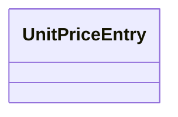

---
search:
  boost: 10.0
---

# Class: UnitPriceEntry 


_One baseline unit price for one abstract SKOS product concept. All monetary amounts are net (VAT excluded)._


<div data-search-exclude markdown="1">


URI: [cost:UnitPriceEntry](https://schema.pragmaticbim.ch/cost/UnitPriceEntry)





<!-- no inheritance hierarchy -->

## Class Properties

| Property | Value |
| --- | --- |
| Class URI | [cost:UnitPriceEntry](https://schema.pragmaticbim.ch/cost/UnitPriceEntry) |


## Slots

| Name | Cardinality and Range | Description | Inheritance |
| ---  | --- | --- | --- |
| [product](product.md) | 1 <br/> [ConceptNotation](ConceptNotation.md) | Abstract product SKOS notation (for example WICP-WOOD). Foreign key into classification vocabularies. | direct |
| [product_uri](product_uri.md) | 0..1 <br/> [Uriorcurie](Uriorcurie.md) | Derived SKOS concept IRI for the product notation. | direct |
| [material_cost](material_cost.md) | 1 <br/> [Decimal](Decimal.md) | Ex-works material cost per price_unit in EUR (net, VAT excluded). | direct |
| [price_unit](price_unit.md) | 1 <br/> [PriceUnitEnum](PriceUnitEnum.md) | Quantity unit the material cost refers to. | direct |
| [waste_pct](waste_pct.md) | 1 <br/> [Float](Float.md) | Waste allowance as a fraction of material cost (0–1). | direct |
| [transport_pct](transport_pct.md) | 1 <br/> [Float](Float.md) | Transport-to-site (A4) allowance as a fraction of material cost (0–1). | direct |
| [delivered_material_cost](delivered_material_cost.md) | 0..1 <br/> [Decimal](Decimal.md) | Derived delivered material cost in EUR (material_cost × (1 + waste_pct) × (1 + transport_pct)). Net, VAT excluded. Optional in authored input. | direct |
| [onsite_labor_hours_per_unit](onsite_labor_hours_per_unit.md) | 1 <br/> [Float](Float.md) | Onsite installation labor in person-hours per price_unit. | direct |
| [offsite_labor_hours_per_unit](offsite_labor_hours_per_unit.md) | 0..1 <br/> [Float](Float.md) | Factory/offsite labor in person-hours per price_unit. | direct |
| [demolition](demolition.md) | 0..1 <br/> [DemolitionCost](DemolitionCost.md) | Disassembly/demolition benchmark for this product. | direct |
| [kbob](kbob.md) | 0..1 <br/> [KbobCarbonReference](KbobCarbonReference.md) | KBOB ecobilans carbon reference for this product. | direct |
| [carbon_per_price_unit](carbon_per_price_unit.md) | 0..1 <br/> [CarbonEstimate](CarbonEstimate.md) | Generated embodied-carbon estimate; not authored. | direct |
| [uncertainty](uncertainty.md) | 0..1 <br/> [PriceUncertainty](PriceUncertainty.md) | Relative uncertainty band for material cost and labor hours. Derived low/high amounts are computed from point estimates at generation time. | direct |
| [provenance_status](provenance_status.md) | 0..1 <br/> [ProvenanceStatusEnum](ProvenanceStatusEnum.md) | How the unit-price point estimate was sourced and validated. | direct |


## Usages

| used by | used in | type | used |
| ---  | --- | --- | --- |
| [BaselinePriceBook](BaselinePriceBook.md) | [entries](entries.md) | range | [UnitPriceEntry](UnitPriceEntry.md) |


## Identifier and Mapping Information


### Schema Source


* from schema: https://schema.pragmaticbim.ch/cost/baseline-cost


## Mappings

| Mapping Type | Mapped Value |
| ---  | ---  |
| self | cost:UnitPriceEntry |
| native | cost:UnitPriceEntry |


## LinkML Source

<!-- TODO: investigate https://stackoverflow.com/questions/37606292/how-to-create-tabbed-code-blocks-in-mkdocs-or-sphinx -->

### Direct

<details>
```yaml
name: UnitPriceEntry
description: One baseline unit price for one abstract SKOS product concept. All monetary
  amounts are net (VAT excluded).
from_schema: https://schema.pragmaticbim.ch/cost/baseline-cost
slots:
- product
- product_uri
- material_cost
- price_unit
- waste_pct
- transport_pct
- delivered_material_cost
- onsite_labor_hours_per_unit
- offsite_labor_hours_per_unit
- demolition
- kbob
- carbon_per_price_unit
- uncertainty
- provenance_status
slot_usage:
  product:
    name: product
    identifier: true
    range: ConceptNotation
    required: true
  material_cost:
    name: material_cost
    range: decimal
    required: true
  price_unit:
    name: price_unit
    range: PriceUnitEnum
    required: true
  waste_pct:
    name: waste_pct
    range: float
    required: true
    minimum_value: 0
  transport_pct:
    name: transport_pct
    range: float
    required: true
    minimum_value: 0
  onsite_labor_hours_per_unit:
    name: onsite_labor_hours_per_unit
    range: float
    required: true
    minimum_value: 0
  offsite_labor_hours_per_unit:
    name: offsite_labor_hours_per_unit
    ifabsent: '0.0'
    range: float
    minimum_value: 0
  provenance_status:
    name: provenance_status
    ifabsent: estimated
    range: ProvenanceStatusEnum
class_uri: cost:UnitPriceEntry

```
</details>

### Induced

<details>
```yaml
name: UnitPriceEntry
description: One baseline unit price for one abstract SKOS product concept. All monetary
  amounts are net (VAT excluded).
from_schema: https://schema.pragmaticbim.ch/cost/baseline-cost
slot_usage:
  product:
    name: product
    identifier: true
    range: ConceptNotation
    required: true
  material_cost:
    name: material_cost
    range: decimal
    required: true
  price_unit:
    name: price_unit
    range: PriceUnitEnum
    required: true
  waste_pct:
    name: waste_pct
    range: float
    required: true
    minimum_value: 0
  transport_pct:
    name: transport_pct
    range: float
    required: true
    minimum_value: 0
  onsite_labor_hours_per_unit:
    name: onsite_labor_hours_per_unit
    range: float
    required: true
    minimum_value: 0
  offsite_labor_hours_per_unit:
    name: offsite_labor_hours_per_unit
    ifabsent: '0.0'
    range: float
    minimum_value: 0
  provenance_status:
    name: provenance_status
    ifabsent: estimated
    range: ProvenanceStatusEnum
attributes:
  product:
    name: product
    description: Abstract product SKOS notation (for example WICP-WOOD). Foreign key
      into classification vocabularies.
    from_schema: https://schema.pragmaticbim.ch/cost/baseline-cost
    rank: 1000
    identifier: true
    owner: UnitPriceEntry
    domain_of:
    - UnitPriceEntry
    range: ConceptNotation
    required: true
  product_uri:
    name: product_uri
    description: Derived SKOS concept IRI for the product notation.
    from_schema: https://schema.pragmaticbim.ch/cost/baseline-cost
    rank: 1000
    owner: UnitPriceEntry
    domain_of:
    - UnitPriceEntry
    range: uriorcurie
  material_cost:
    name: material_cost
    description: Ex-works material cost per price_unit in EUR (net, VAT excluded).
    from_schema: https://schema.pragmaticbim.ch/cost/baseline-cost
    rank: 1000
    owner: UnitPriceEntry
    domain_of:
    - UnitPriceEntry
    range: decimal
    required: true
  price_unit:
    name: price_unit
    description: Quantity unit the material cost refers to.
    from_schema: https://schema.pragmaticbim.ch/cost/baseline-cost
    rank: 1000
    owner: UnitPriceEntry
    domain_of:
    - UnitPriceEntry
    range: PriceUnitEnum
    required: true
  waste_pct:
    name: waste_pct
    description: Waste allowance as a fraction of material cost (0–1).
    from_schema: https://schema.pragmaticbim.ch/cost/baseline-cost
    rank: 1000
    owner: UnitPriceEntry
    domain_of:
    - UnitPriceEntry
    range: float
    required: true
    minimum_value: 0
  transport_pct:
    name: transport_pct
    description: Transport-to-site (A4) allowance as a fraction of material cost (0–1).
    from_schema: https://schema.pragmaticbim.ch/cost/baseline-cost
    rank: 1000
    owner: UnitPriceEntry
    domain_of:
    - UnitPriceEntry
    range: float
    required: true
    minimum_value: 0
  delivered_material_cost:
    name: delivered_material_cost
    description: Derived delivered material cost in EUR (material_cost × (1 + waste_pct)
      × (1 + transport_pct)). Net, VAT excluded. Optional in authored input.
    from_schema: https://schema.pragmaticbim.ch/cost/baseline-cost
    rank: 1000
    owner: UnitPriceEntry
    domain_of:
    - UnitPriceEntry
    range: decimal
  onsite_labor_hours_per_unit:
    name: onsite_labor_hours_per_unit
    description: Onsite installation labor in person-hours per price_unit.
    from_schema: https://schema.pragmaticbim.ch/cost/baseline-cost
    rank: 1000
    owner: UnitPriceEntry
    domain_of:
    - UnitPriceEntry
    range: float
    required: true
    minimum_value: 0
  offsite_labor_hours_per_unit:
    name: offsite_labor_hours_per_unit
    description: Factory/offsite labor in person-hours per price_unit.
    from_schema: https://schema.pragmaticbim.ch/cost/baseline-cost
    rank: 1000
    ifabsent: '0.0'
    owner: UnitPriceEntry
    domain_of:
    - UnitPriceEntry
    range: float
    minimum_value: 0
  demolition:
    name: demolition
    description: Disassembly/demolition benchmark for this product.
    from_schema: https://schema.pragmaticbim.ch/cost/baseline-cost
    rank: 1000
    owner: UnitPriceEntry
    domain_of:
    - UnitPriceEntry
    range: DemolitionCost
    inlined: true
  kbob:
    name: kbob
    description: KBOB ecobilans carbon reference for this product.
    from_schema: https://schema.pragmaticbim.ch/cost/baseline-cost
    rank: 1000
    owner: UnitPriceEntry
    domain_of:
    - UnitPriceEntry
    range: KbobCarbonReference
    inlined: true
  carbon_per_price_unit:
    name: carbon_per_price_unit
    description: Generated embodied-carbon estimate; not authored.
    from_schema: https://schema.pragmaticbim.ch/cost/baseline-cost
    rank: 1000
    owner: UnitPriceEntry
    domain_of:
    - UnitPriceEntry
    range: CarbonEstimate
    inlined: true
  uncertainty:
    name: uncertainty
    description: Relative uncertainty band for material cost and labor hours. Derived
      low/high amounts are computed from point estimates at generation time.
    from_schema: https://schema.pragmaticbim.ch/cost/baseline-cost
    rank: 1000
    owner: UnitPriceEntry
    domain_of:
    - UnitPriceEntry
    range: PriceUncertainty
    inlined: true
  provenance_status:
    name: provenance_status
    description: How the unit-price point estimate was sourced and validated.
    from_schema: https://schema.pragmaticbim.ch/cost/baseline-cost
    rank: 1000
    ifabsent: estimated
    owner: UnitPriceEntry
    domain_of:
    - UnitPriceEntry
    range: ProvenanceStatusEnum
class_uri: cost:UnitPriceEntry

```
</details></div>